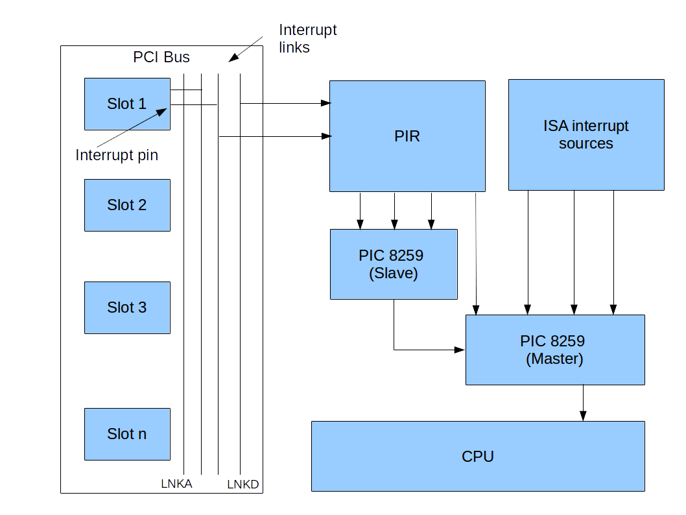
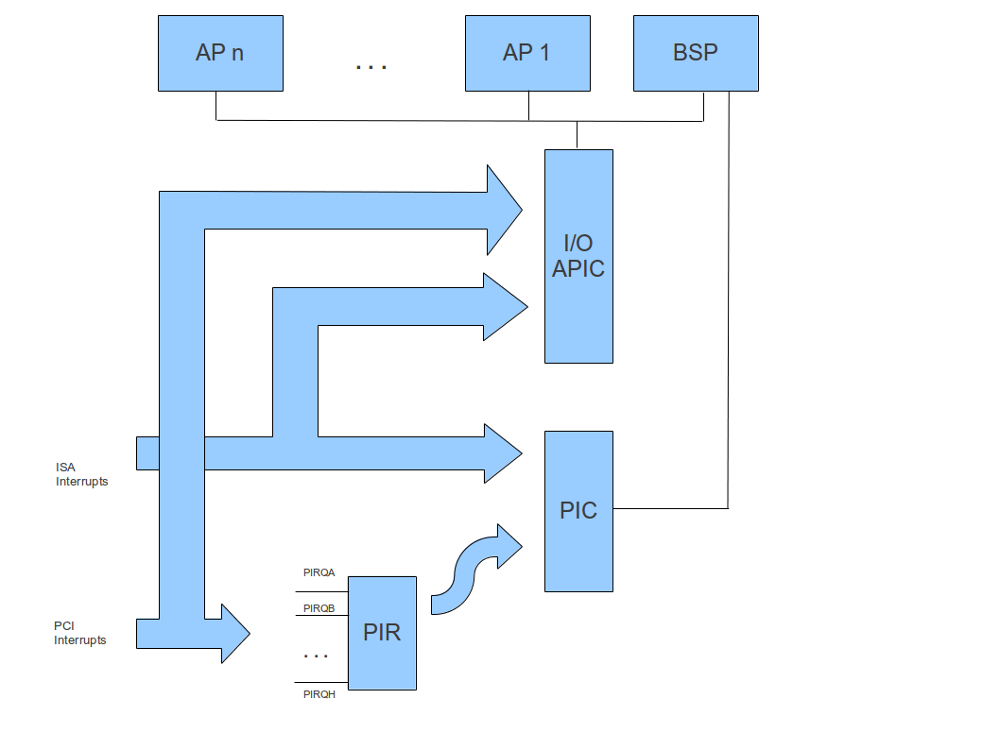
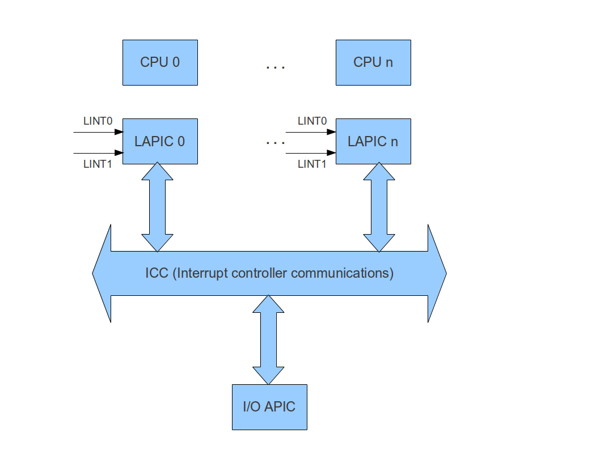

# Interrupt handling in PCI systems


When I wrote my first boot loader code almost eights years ago, one of the main obstacles I was facing was the handling of interrupts. At this time, I was the proud owner of a machine which had been built around 2001 with only one CPU in it. I soon discovered that interrupt handling was controlled by a chip called 8259 PIC and found plenty of information on this in various newsgroups and websites - enough to setup basic interrupt handling and make my code work. I therefore assumed that I had a basic understanding of how interrupts work.

A couple of weeks ago, the time had come when I finally decided to get a new PC. The machine I got has been manufactured 2011, and it occurred to me soon that from a hardware point of view, it had not much in common with the old machine I had been using. When I did the first cat /proc/interrupts on this machine, I found its output extremely confusing. There were lines like

```
           CPU0       CPU1       CPU2       CPU3       CPU4       CPU5       CPU6       CPU7       
  0:    4584959          0          0          0          0          0          0          0   IO-APIC   2-edge      timer
  1:         10      27817          0          0          0          0          0          0   IO-APIC   1-edge      i8042
  8:          1          0          0          0          0          0          0          0   IO-APIC   8-edge      rtc0
  9:          0          0          0          0          0          0          0          0   IO-APIC   9-fasteoi   acpi
 16:          0          0          0          0          0          0          0          0   IO-APIC  16-fasteoi   uhci_hcd:usb3
 17:        205       1574          0          0          0          0          0          0   IO-APIC  17-fasteoi   snd_hda_intel
 18:          2          0          0          0          0          0          0          0   IO-APIC  18-fasteoi   ehci_hcd:usb1, uhci_hcd:usb5, uhci_hcd:usb8, firewire_ohci
 19:          0          0          0          0          0          0          0          0   IO-APIC  19-fasteoi   uhci_hcd:usb7
 21:          0          0          0          0          0          0          0          0   IO-APIC  21-fasteoi   uhci_hcd:usb4
 23:          0          0          0          0          0          0          0          0   IO-APIC  23-fasteoi   ehci_hcd:usb2, uhci_hcd:usb6

```

Suddenly all I had learned seemed to be wrong. Why do we have interrupt numbers greater than 15? What is an APIC? What is MSI? Should my drive not use IRQ 14? What is a local timer interrupt? So I started to collect information on interrupt handling on recent PCI based systems and wrote a few programs to try out a couple of things.

This document is a brief summary of what I found out on this journey through the brave new world of PCI based interrupts.  It is by no means complete, but is supposed to give people who ask themselves the same questions a good starting point for own research and coding.

## Reminder: interrupt handling on legacy AT systems

Recall that an x86 CPU handles interrupts by executing code at a location that is defined by an entry in the so called IDT (interrupt descriptor table). This table is indexed by a number between 0 and 255 called the **interrupt vector**. On the other hand, interrupts are created by some devices wired up to the PC mainboard. Essentially, interrupt routing is the process of translating these signals into a vector that can than be handed over to a CPU for processing.

On a PC-AT, all interrupt routing is done via two cascaded 8259 compatible **programmable interrupt controllers (PIC)**. A PIC is a piece of hardware which has a given number of ingoing interrupt lines (IRQs) which an external device can assert to signal an interrupt. The 8259 has eight interrupt lines, numbered IRQ0 to IRQ7. In addition, it has an outgoing INTR line which is used to signal to the processor that an interrupt needs to be processed.

When forwarding interrupts to the CPU, the PIC will translate the number of the interrupt line which has been asserted into the interrupt vector which is the number of the interrupt which the CPU sees. During a handshake process which is initiated by the PIC every time an interrupt needs to be forwarded to the CPU, the PIC will drive that vector number onto the data bus so that the CPU can read it from there. The translation mechanism is programmable, so - to some extent - an OS or the BIOS can determine the mapping of IRQ assertions onto logical interrupt vector numbers as seen by the CPU.

To be able to process more than 8 interrupts, a PC-AT contains two PICs (called master and slave) which are cascaded. Usually, the INTR signal of the slave PIC is connected to the IRQ2 input line of the master PIC. Accepting a slight abuse of notation, IRQ<x> of the slave is usually denoted as IRQ<x+8> when talking about the combined master-slave system, so IRQ15 is used as notation for interrupt line 7 of the slave PIC.

We will not go into details on how to program the classical PIC in this document, as this is widely known and lots of good tutorials are available on the web. For details, the datasheet of the 8259 is quite readable and comprehensive, a rough sketch is also provided in the datasheet of the ICH10 chipset.

Historically, the mapping of devices to IRQs is fixed. The keyboard, for instance, will be connected to IRQ1 of the master, the floppy drive is connected to IRQ 6 and so forth. The following table lists all these common ISA interrupts.


| IRQ | Usage |
|:---|:---|
|0	| System timer |
|1 |	Keyboard controller |
|2 |Cascaded input from slave |
|3 | COM2 if present |
|4 | COM1 if present |
|5 | LPT2 or sound card |
|6 |Floppy disk controller |
|7 |	LPT1 or sound card|
|8|	RTC|
|12|	Mouse|
|13|	Co-Processor|
|14 |	Primary ATA|
|15 |	Secondary ATA |

## Programmable Interrupt Routers (PCI Link Devices) 

The world become a bit more complicated, though, when PCI was introduced and replacing the old ISA bus. In a PCI system, devices are connected to the bus via **slots**. Each slot has four **interrupt pins**, called INTA#, INTB#, INTC# and INTD#, which are really physical pins in the PCI slot. On the bus, these interrupt pins are connected to **interrupt links** which wire interrupts from different cards together. Effectively, this is a mapping from the combination slot / interrupt pin to the interrupt link (in fact, cards that only offer one function all use INT#A, which might be connected to the link LNKA for slot 1, to LNKB for slot 2 and so forth. The number of links can actually vary, the Intel ICH10 chipset, for instance, does seem to have eight links called PIRQA#, PIRQB#, .. to PIRQH#.

The connection between these links and the PIC is then established by the **Programmable interrupt router (PIR)**. This component maps PCI interrupt links to input lines of the PIC. Thus there are actually two routings taking place - first a PCI interrupt pin at a specific device is routed to a PCI interrupt link, and then the link is routed to the 8259 PIC, as displayed below.



How can an operating system discover this routing? The first part is actually discovered by the BIOS and added to a table stored in system memory called the **PIR table**. That table is easy to locate and to parse, see `irq_print_pir_table()` in irq.c. FreeBDS comes with a tool to print the PIR table from userspace, the [pirtool][1]. If I run this on my machine, I get an output like this one (I have included only a few lines here).
```
Entry  Location  Bus Device Pin  Link  IRQs
  0    slot 1      5    0    A   0x60  3 4 5 6 7 9 10 11 12 14 15
  0    slot 1      5    0    B   0x61  3 4 5 6 7 9 10 11 12 14 15
  0    slot 1      5    0    C   0x62  3 4 5 6 7 9 10 11 12 14 15
  0    slot 1      5    0    D   0x63  3 4 5 6 7 9 10 11 12 14 15
  1    slot 2      5    6    A   0x62  3 4 5 6 7 9 10 11 12 14 15
  1    slot 2      5    6    B   0x62  3 4 5 6 7 9 10 11 12 14 15
  1    slot 2      5    6    C   0x62  3 4 5 6 7 9 10 11 12 14 15
  1    slot 2      5    6    D   0x62  3 4 5 6 7 9 10 11 12 14 15
  4    slot 5    255    0    A   0x62  3 4 5 6 7 9 10 11 12 14 15
  4    slot 5    255    0    B   0x63  3 4 5 6 7 9 10 11 12 14 15
  4    slot 5    255    0    C   0x61  3 4 5 6 7 9 10 11 12 14 15
  4    slot 5    255    0    D   0x60  3 4 5 6 7 9 10 11 12 14 15  
 13    embedded    0   26    A   0x60  3 4 5 6 7 9 10 11 12 14 15
 13    embedded    0   26    B   0x69  3 4 5 6 7 9 10 11 12 14 15
 13    embedded    0   26    C   0x62  3 4 5 6 7 9 10 11 12 14 15
 13    embedded    0   26    D   0x62  3 4 5 6 7 9 10 11 12 14 15
  
```

So we see that for instance that Pin A of the device placed in slot 2 (device 6) on bus 5 is connected to the link with the identifier 0x62. Using `lspci`, we can identify this device as the integrated Firewire controller of my motherboard.

But how can we tell to which input line of the PIC this device is connected? The PIR is programmable, so that information is now hardwired into the motherboard. Instead, the BIOS will set up the PIR and store the information that we need in the PCI configuration space, more precisely in the field "Interrupt line" at offset 0x3c into the configuration space. This information can be obtained using `lspci -b -v` from the command line.
```
lspci -v -b -s 5:6
05:06.0 FireWire (IEEE 1394): Texas Instruments TSB43AB23 IEEE-1394a-2000 Controller (PHY/Link) (prog-if 10 [OHCI])
	Subsystem: Gigabyte Technology Co., Ltd Motherboard
	Flags: bus master, medium devsel, latency 32, IRQ 5
	Memory at fbeff000 (32-bit, non-prefetchable)
	Memory at fbef8000 (32-bit, non-prefetchable)
	Capabilities: <access denied>
	Kernel driver in use: firewire_ohci
	Kernel modules: firewire_ohci
```
So in this case, this device is connected so IRQ 5. The same is then true for every other device routed to link 0x62, for instance

```
lspci -v -b  -s 00:1a.2
00:1a.2 USB controller: Intel Corporation 82801JI (ICH10 Family) USB UHCI Controller #6 (prog-if 00 [UHCI])
	Subsystem: Gigabyte Technology Co., Ltd Motherboard
	Flags: bus master, medium devsel, latency 0, IRQ 5
	I/O ports at fd00
	Capabilities: <access denied>
	Kernel driver in use: uhci_hcd
```

## The APIC architecture

An additional complexity came into play when the first PC motherboards with more than one CPU appeared in the nineties. The PIC is connected to only one CPU, namely the so-called BSU (the first CPU brought up at boot time). However, for performance reasons, we want to balance interrupts between all available CPUs, and we also want to use interrupts to allow the different CPUs to talk to each other. For this purpose, the APIC architecture was developed by Intel.

The APIC architecture adds to additional components, the **IO APIC** and the **local APIC**. The IO APIC is in fact quite similar to an 8259 PIC - it is an interrupt controller that accepts interrupts from peripheral components and forwards them to the CPU. The local APIC is attached to a CPU (there is excactly one local APIC for every CPU). The IO APIC talks to the local APIC to deliver interrupts to a CPU, and different local APICs can talk to each other to deliver so called **Inter processor interrupts (IPI)**. 

With this architecture, an interrupt can reach a CPU via different channels. First, it can be forwarded to a PIC, again via a programmable interrupt controller or directly. Second, it can use the IO APIC. This is indicated in the following diagram.



Thus an ISA interrupt line can be connected to either e PIC or an IO APIC, and the same holds for an interrupt coming from a PCI device (or more precisely from a PCI interrupt link, as again interrupt pins of different devices are wired together). In fact, the situation can even be more complicated, as an additional programmable router can sit between the IO APIC and the PCI interrupt source, and there can be more than one IO APIC.

To discover this additional mapping, an operating system has several options. The easiest one is to use the **MP configuration tables**. These are BIOS tables that a BIOS that conforms with [Intels Multiprocessor specification][3] will create. Similar to the PIR, this table can be located by scanning a dedicated area in memory for a signature. It contains entries that describe the CPUs, busses and APICs in the system and how they are wired together. The structure and its usage are described in `irq.h` and `irq.c`. 

By mapping `/dev/mem` into memory, the MP tables can also be read from userspace under Linux, using essentially the same code as in `irq.c`. Here is the result of doing this for my PC.

```
Source                   Destination
       ISA   PCI
Bus    IRQ   Device/PIN  IRQ      Flags
---------------------------------------
0x0          0x1f:C      0x12     f
0x0          0x1a:A      0x10     f
0x0          0x1a:B      0x15     f
0x0          0x1a:C      0x12     f
0x0          0x1a:C      0x12     f
0x0          0x1d:A      0x17     f
0x0          0x1d:B      0x13     f
0x0          0x1d:C      0x12     f
0x0          0x1d:A      0x17     f
0x1          0x00:A      0x10     f
0x5          0x06:A      0x12     f
```

We see that the interrupt pin that we looked at earlier - PIN A of device 6 on PCI bus 5 - is routed to input line 0x12 of the IO APIC (in this case there is only one IO APIC, but the table also contains the information to which IO APIC the interrupt is connected). So we see that in fact, this pin is connected to the CPU via the programmable interrupt router **and** via the IO APIC. At startup, an operating system needs to decide whether it wants to use the APIC or the PIC and disable one of them to avoid that interrupts are delivered twice.

The MP configuration tables are easy to parse, but unfortunately a matter of the past. Instead, more and more motherboards move to the **ACPI** standard. ACPI is an interface for the communication between an operating system and firmware that can do much more than a pure table could do. Instead, ACPI provides a mixture of tables and executable code, written in a bytecode called **AML** and executed by a virtual machine. To discover interrupt routings, an operating system does no longer detect and parse a table, but detect a piece of AML code in memory and then run that code in an AML interpreter. This code then contains a method which, if invoked, returns and interrupt mapping. This is very flexible and very powerful, but requires a lot of infrastructural code, in particular a full fledged ACPI interpreter. At the time being, ctOS only parses and evaluates the static part of the ACPI tables. This is sufficient to detect the correct routing for ISA interrupts using the **FADT** ACPI tables but not to fully parse the **DSDT** which contains the interrupt routing information for PCI devices. Instead, ctOS tries to use MSI as far as possible where no wired interrupt routing is needed anymore as the device will directly send the interrupt vector (i.e. offset into the IDT) to the local APIC.


## Programming the I/O APIC

So inspecting the PIR table and the MP table, we are able to figure out how the interrupt pins of the PCI devices, the ISA interrupts, the PIC and the I/O APIC are wired together. In this section, we explain how this information can be used to actually set up the I/O APIC as a replacement for the PI and to program the final translation that we need to consider - the translation from IO APIC input pins to interrupt vectors delivered to the CPU.

The I/O APIC is a memory mapped device. However, most of its registers are not directly mapped into memory space, but rather are addressed via an indirection layer via the so called **index register**. The index register is a 32 bit register located at the beginning of the memory mapped configuration space of the I/O APIC, the data register is a 32 bit register located at offset 0x10.

Any of the remaining registers of the I/O APIC has a unique index and is addressed as follows. To read from a register with index x, first write x into the index register. A subsequent read from the data register will then yield the value of register x. To write to the register, we also write x into the index register and then write to the data register. So using the index register, the data register is made to point to the selected register of the I/O APIC. When using that mechanism, it is important to perform write and reads as 32 bit doublewords.

How can the base address of the I/O APIC be determined? As a motherboard can potentially contain more than one I/O APIC, this address is not fixed. Instead, you should use the entries of type 2 in the MP table to determine the base address of each I/O APIC. If the table is not present, the APIC is located at the default address 0xfec00000.

The following table lists the registers of the I/O APIC.

| Index |	Description
|---|---|
|0 |	Bits 24-27 of this register are the ID of the I/O APIC, the other bits are reserved
|1 |	A version number
|0x10| 	Redirection entry 0 bits 0-31
|0x11 |	Redirection entry 0 bits 32-63
|0x10 + 2*n |	Redirection entry n bits 0-31
|0x10 + 2*n+1| 	Redirection entry n bits 32-63 

The register with index zero contains (in bit 24-27) the ID of the I/O APIC which matches the ID by which the I/O APIC is referenced in the MP table entries and which uniquely identifies the APIC within the system. Note that this ID is set to 0 upon reset and needs to be set by software before the APIC can be used, the BIOS does not do this (I have, however, been able to successfully run the APIC without setting the ID, but just to be on the safe side do it...). The second register, accessible via index one, is a version number. Index 2 through 0xf is not used

Starting at index 0x10, the redirection entries can be accessed. A redirection entry specifies the routing of an interrupt received at an interrupt line of the I/O APIC to the local APICs. Each redirection entry is a 64-bit structure which is stored in two consecutive registers of the I/O APIC. The register with index 0x10 contains the lower 32 bits of the first entry, the higher 32 bits are stored in register 0x11. This entry describes the routing of interrupts received at pin 0. The next entry, spread over register 0x12 and 0x13, describes the routing for interrupt line 1 and so forth.

A large part of the 64 bit redirection entry structure is reserved for future use. The following table describes those fields which are relevant for the purpose of this document.

|Bits     |	Description
|:-------:|---
|56-59 | This specifies the ID of the local APIC to which the interrupt is routed
| 16 |If this bit is 1, the interrupt is masked
|15 | Trigger mode, i.e. edge triggered (0) or level triggered (1)
|13 | Polarity, i.e. active high (0) or active low (1)
|11 | Destination mode. Most of the time, 0 to indicate physical destination is a good choice. Setting this bit to 1 indicates destination to a group of CPU instead one dedicated CPUs which requires some other bits in the structure to be set and is not described here
|8-10 |	Delivery mode. This is 0 most of the time to indicate normal delivery as interrupt vector ("fixed").
| 0-7 |	Vector. This is the interrupt vector sent to the CPU and is the offset into the IDT table which the CPU will use to locate the interrupt handler

At bootup time, all redirection entries are 0x0000:0000:0001:0000 on my machine. So the mask bit is set to block this interrupt, all other bits are set to zero. This means that effectively, the APIC is disabled and corresponds to the fact that according to the multiboot specification, the BIOS is assumed to bring up the system in either PIC mode or virtual wire mode.

Now suppose we wanted to set up the APIC to route incoming interrupts from line 1 of the I/O APIC (which is usually connected to the keyboard interrupt line) to the bootstrap CPU, using IDT offset 0x41. Then we would have to construct the redirection table entry at index 0x12 and 0x13 as follows, assuming that the ID of the bootstrap CPU is 0.

* Bits 56-59 are 0x0
* Bit 16 is set to 0 to enable the interrupt
* Bit 15 is set to 0, as legacy ISA interrupts are edge triggered
* Bit 13 is set to 0, as legacy ISA interrupts are level triggered
* Bit 11 is set to 0
* Bits 8-10 are set to zero
* Bits 0-7 are set to 0x41

So the redirection entry is 0x0000:0000:0000:0041. Note that it is a good idea to program the higher double word of the entry first, as programming the lower part of the structure will remove the mask and an interrupt might be retrieved while the higher part is not yet set up.

In general, the polarity and trigger mode to be used can be determined from the MP table routing entry for the respective interrupt as follows. The polarity can be derived from bits 0 and 1 of the IRQ flags stored in the IRQ routing entry. 0x1 means active high, 0x3 means active low. 0x0 means that the device follows the conventions in place for the respective bus, i.e. active low for PCI and active high for ISA.

The trigger mode is stored in bits 2-3 of the IRQ flags field. Again, 0x0 means that the trigger mode follows the bus specific conventions. PCI interrupts are level triggered, ISA interrupts are edge triggered. 0x1 means edge triggered, 0x3 means level triggered.

After programming the I/O APIC, it is a good idea to disable the PIC by settings its mask register to 0xff for master and slave. Not doing so will actually lead in duplicate delivery of interrupts, as each interrupt is then forwarded to the CPU by both the PIC and the APIC. Note, however, that it is perfectly possible to run the system in a mixed mode where both PIC and I/O APIC are used as long as you make sure that each individual interrupt is only processed by either PIC or I/O APIC.

Note that when using the I/O APIC, your interrupt handler must acknowledge an interrupt once it has been processed and before the IRET is executed. To acknowledge an interrupt, the handler needs to write 0x0 to the EOI register of the local APIC. We will learn more about the local APIC and how to access its register in the following section.


## Writing interrupt handler for level triggered interrupts

When programming interrupt handler, it is important to keep in mind that the interrupt handler must signal the device to deassert the interrupt line again before acknowledging the interrupt.

Suppose for instance that you write an interrupt handler for an IDE device controller operating in native mode and interrupts are delivered via the I/O APIC. As common for PCI interrupts, the interrupts delivered by the controller will be level triggered. Consequently, when the controller delivers an interrupt, it will assert the interrupt input line of the I/O APIC and **keep it asserted**. The I/O APIC will deliver an interrupt message to the local APIC which in turn will raise an interrupt signal for the CPU core. When the interrupt handler now issues an EOI before reading from the IDE device, the interrupt handler will be invoked a second time immediately after the IRET because the interrupt line is still asserted. This leads to a flood of interrupts.

So the handler must communicate to the device that the interrupt has been served so that the device deasserts the interrupt line again. In the case of the IDE controller, this would for instance involving a read from the status register and a write to the bus master status register.

Another point to keep in mind is that devices might share interrupts. So an interrupt handler will have to read some status information from the device to find out which device has issued the interrupt. This can for instance be done by reading the PCI status register from the devices PCI configuration space. Bit 3 of this register (INTS) is a read-only bit and is set to 1 whenever the device has asserted its interrupt line. 

## Programming the local APIC

The local APIC is the main vehicle to deliver interrupts to the CPU core. It receives interrupt signals from I/O APICs, other local APICs and directly via the two local interrupt lines LINT0 and LINT1. All APICs (local APICs and I/O APICs) communicate with each other using the system bus. For modern CPUs, the local APIC is directly integrated into the CPU.



The first, but not the only source, are the I/O APIC components in the system which can deliver interrupts to the local APIC. Let us quickly look at the process which is executed when a local APIC receives an interrupt from an I/O APIC ("fixed interrupt"). A more detailed description of the local APIC and its registers is contained in the Intel System Programming Manual Part I, section 10.8

Within the local APIC, there are two registers called IRR (interrupt request register) and ISR (in-service register). These registers have 256 bits each, representing the 256 possible interrupt vectors.

The IRR contains those interrupts which have been received and accepted, but not yet dispatched to the CPU. When the CPU is ready to handle the next interrupt, the APIC locates the highest priority bit in that register that is set. This bit is cleared and instead set in the ISR.

Then the APIC scans the ISR and again locates the highest priority bit set in the ISR. The vector corresponding to this bit is then dispatched to the CPU.

When the CPU has finished processing an interrupt, it is supposed to send an EOI message to the APIC. Upon receiving this message, the APIC clears the highest priority bit in the ISR again. Then the entire process of scanning IRR and ISR starts over again to handle the next interrupt.

How is the priority of the interrupts determined? In fact, the priority depends only on the interrupt vector number. The 256 possible vector numbers are divided in fifteen priorities ranging from 1 (lowest priority) to 15 (highest). The priority is obtained by dividing the vector number by 16 and rounding down. Within that priority level, interrupts are ranked by vector number, highest vector number first. The out of the vector numbers 32-255 available for hardware interrupts, vector 47 has highest priority, followed by 46 down to 32, then comes 63 and so forth.

When the local APIC receives an interrupt with higher priority than the one being currently served and interrupts are enabled in the CPU, this interrupt is processed immediately without waiting for an EOI.

An additional register called the task priority register TPR can be used to prevent all interrupts from being processed which are below a certain priority threshold.

Apart from the fixed interrupts received from an I/O APIC, the local APIC is also able to handle other classes of interrupts which bypass IRR and ISR and are handled directly by the CPU. No EOI is required for these interrupts.

    NMI - non maskable interrupts
    SMI - used to switch CPU to systems management mode
    INIT and start-up interrupts used to initialize and boot-strap a CPU different from the BSP
    ExtINT - external interrupt. This is a special type of interrupt which indicates that the interrupt vector is not delivered by the APIC, but by a 8259 compatible PIC. This type of interrupt is often used to realize virtual wire mode.

In addition to interrups delivered via the APIC bus connecting all local APICs and I/O APICs, there are also two special interrupt lines called LINT0 and LINT1. These interrupt lines can be asserted to raise interrupts directly without using an I/O APIC. Often, LINT0 is used to deliver interrupts raised by the legacy PIC in virtual wire mode and set up as ExtInt, whereas LINT1 is used for NMIs.

Further sources of local interrupts are corrected machine check exceptions, the timer built into each local APIC and the thermal monitor. These are not considered in this document, we refer to the [Intel System Programming manual][4] for descriptions of those and other interrupt sources.

Now let us look at what we have to do to set up the local APIC for use. The good news is that for the BSP, the BIOS will typically set up the local APIC for you in order to enable virtual wire mode. However, you will have to set up the local APICs of the other CPUs if you want to use them. So let us briefly go through the most important registers of the local APIC and a sample configuration.

The following table lists some of the relevant registers. All registers are 32-bit wide and memory mapped, the first register (offset 0) usually being located at 0xFEE0:0000. Use the MP table entry for the respective CPU to retrieve the base address as it can theoretically be changed.


| Offset |	Name	| Description
|:---|:---|:---|
0x20 |	ID |	ID of the local APIC
| 0x30 |	Version |	APIC version
| 0x80 |	TPR |	Task priority register, used to define a threshold for the priority of interrupts serviced by the CPU, see above
| 0x320 |	TIMER LVT |	Local vector table for timer interrupt
| 0x350 |	LINT0 LVT |	Local vector table for interrupts raised via input line LINT0
| 0x360 |	LINT1 LVT |	Local vector table for interrupts raised via input line LINT1
| 0xf0 |	Spurious interrupt vector register |	This register specifies - among other things  - the vector used for spurious interrupts in bits 0-7, a global enable/disable flag in bit 8 which can be used to enable or disable the entire local APIC. A spurious interrupt is an interrupt generated while the TPR is changed so that the interrupt gets lost 
| 0xb0 | EOI register |	Writing 0x0 to this register signals EOI to the local APIC so that the next interrupt can be delivered to the CPU 

Some of these register contain a so-called local vector table which is a structure describing how to react upon a local interrupt. So for instance, the LINT0 local vector table describes what the local APIC is supposed to do if an interrupt is raised on the LINT0 line. The exact semantics of these register depend upon the type of the interrupt and are described in detail in the System Programming Manual. For our purposes, the following is sufficient.

* Bits 0-7 of the LVT contain the vector, i.e. the offset into the IDT table used by the CPU to service the interrupt
* Bits 8-10 contain the delivery mode. Common values are 0 for fixed vector, i.e. deliver the interrupt vector specified in the vector field, 0x4 for non-maskable interrupts and 0x7 for external interrupts (ExtInt)
* For LINT0 and LINT1, bit 13 is the polarity (0=active high, 1=active low) and bit 15 is the trigger mode (0=edge triggered, 1=level triggered)
* Bit 16 specifies whether the respective interrupt is masked (1) or not

When setting up a local APIC, you should at least

* make sure that the TPR is zero so that all interrupts are delivered
* make sure that bit 8 of the spurious interrupt is set to 1 so that the local APIC is enabled
* decide what to do to with LINT0 and LINT1 - you might want to disable LINT0 for all CPUs once you have turned off the PIC, LINT1 should remain enabled and set up as NMI

On my system, the values of these register upon startup are as follows for the BSP.

* Local APIC ID = 0x0
* Spurios interrupt register = 0x10f, in particular the APIC is enabled
* Task priority register = 0x0
* Timer local vector table = 0x10000, i.e. the timer interrupt is masked
* LINT0 local vector table = 0x0700, i.e. LINT0 is set up as ExtInt, edge triggered, active high
* LINT1 local vector table = 0x0400, i.e. LINT1 is set up as NMI

Note that when the local APIC is disabled, the pins LINT0 and LINT1 are directly routed to the CPUs INTR and NMI pins.

## Delivery modes and destination modes

When interrupts are delivered via the IO APIC in a multi-processor system, the configuration needs to determine to which CPU (respectively local APIC) an interrupt is delivered. The IO-APIC architecture offers several so-called **delivery modes** in combination with the **destination modes** to define this.

Let us first turn to the delivery mode called **fixed delivery mode**. In this mode, the IO APIC configuration defines one or several CPUs per interrupt vector to which the interrupt is delivered. All interrupts are delivered according to this configuration, regardless of the current state of the target CPU. In contrast to this, the **lowest priority** delivery mode will try to determine within the group of CPUs that is defined as the target the CPU which currently executes at the lowest priority. Other delivery modes are defined, which determine that interrupts are delivered as SMI (system management inerrupt) or NMI (non-maskable interrupt), see section 10 of the Intel Sofware Developers manual Volume 3 for more details.

The second part of the configuration that determines to which CPU an interrupt is actually delivered is the **destination mode**. There are two destination modes, called **physical** and **logical** destination. Essentially, the destination mode defines how an interrupt target is interpreted.

In physical mode, the ID of the local APIC is used to define a target. Thus if the combination of physical destination mode and fixed delivery mode is chosen, a given interrupt will always be routed to the same local APIC and hence to the same CPU.

In logical destination mode, the interrupt target is interpreted as a **message destination address**. This is an 8-bit address which is interpreted by each local APIC and combined with the values of certain registers in the local APIC to determine whether the CPU will process the interrupt or not. One of these registers is the LDR (logical destination register) that contains a logical APIC ID that an operating system can define. The second is the DFR (logical destination format register) which determines how the message destination address and the logical APIC ID are combined to see whether the local APIC accepts the interrupt. In the **flat model**, the logical APIC ID is interpreted as a bit mask, i.e. the local APIC performs an AND operation between the message destination address and the logical APIC ID and accepts the interrupt if the result is different from zero. Thus each bit in the MDA that is set results in delivery to one local APIC. The second mode is the **cluster model** which allows the definition of a hierarchy of local APICS and which we do not explain here in detail.


## A note on IDE controllers in legacy mode

We have seen above that the BIOS will write the ISA interrupt to which a PCI device is connected in virtual wire mode or PIC mode into the PCI configuration block of that device. There is an interesting exception from this rule, namely IDE devices operating in legacy mode.

Recall that an IDE controller manages two channels. Each channel in turn can be connected to two decives. Historically, the first channel uses IRQ 14, the second channel uses IRQ 15.

However, both channels are part of the IDE controller which is only one device from a PCI point-of-view. Hence the PCI interrupt mapping scheme would require a sharing of the interrupts for the primary and secondary channel, which might be a problem for older hardware or software.

Therefore the PCI specification foresees that an IDE device can operate in legacy mode. In this mode, interrupts from a PCI IDE controller are not delivered via the PCI interrupt pins, but are directly wired to the legacy IRQ interrupts 14 and 15. When this mode is used, the fields INTERUPT_PIN and INTERRUPT_LINE in the PCI configuration space of the controller are left empty (respectively contain 0).

To detect whether an IDE controller operates in legacy mode as opposed to native mode, an operating system can use the lower byte of the class code field (programming interface) in the PCI configuration space. Bit 0 specifies whether the primary channel operates in legacy mode (0) or native mode (1). Likewise, bit 2 indicates whether the secondary channel operates in legacy or native mode. Bit 1 indicates whether the mode of the primary channel is fixed (0) or whether it can operate in both modes (1). Bit 3 plays the same role for the secondary channel.


## Message based interrupts

### Introduction

MSI is the abbreviation for **message signaled interrupts** and is a technology to deliver interrupts which bypasses PIC and I/O APIC entirely. MSI is not enabled at boot time, it is the responsibility of the operating system to set up and enable MSI if it wishes to do so.

The idea behind MSI is that the operating system will provide a device that wants to use MSI with an address and a data value. If the device wishes to raise an interrupt, it will issue a PCI write command to that address writing the specified value. The bus system will recognise a write attempt to that address (which is not mapped to actual physical memory) as an interrupt and will read the provided data to identify the interrupt vector which is to be forwarded to the CPU. No I/O APIC is required.

Using message based interrupts has several advantages over pin based interrupts.

* Pin based interrupts require dedicated interrupt lines which increase hardware complexity and cost
* With pin based interrupts, race conditions are possible if DMA is used. Suppose for instance that a device uses DMA to store data in system memory and then signals command completion by raising an interrupt line. Theoretically, it may happen that the CPU detects the interrupt before the data has completed its journey along the PCI bus to main memory and the interrupt handler works with stale data. To avoid this, interrupt handlers are advised to read a register of the device which sent the data before accessing the data. As this read transaction will be queued after the DMA write, it is guaranteed to complete only after the DMA write has been performed. This is not an issue for MSI, as with MSI, the interrupt message and the DMA write both travel via the PCI bus and are therefore serialized
* MSI (and its extended version MSI-X) allow the full use of up to 224 interrupt vectors (256 minus vectors 0-31 reserved by the CPU for faults and exceptions) and thus can be used to eliminate the need for interrupt sharing

However, using MSI comes at the price of reduced interrupt latency as MSI messages travel across the PCI bus and not via a dedicated connection between device and CPU.

During configuration, device and operating system communicate using registers in the MSI capability structure within the PCI configuration space of the system. The operating system writes the address to use by the device into the so-called message address register and the data which the device is supposed to send into the message data register.

Of course the operating system cannot just use any address it wants for MSI processing. Instead, it must use a range which depends on the used hardware so that PCI write access to this range of memory is detected as an interrupt. For the x86 architecture, this range is 0xffeh0000 - 0xffehffff (see the Intel System Programming Manual Part I section 10.11). Bit 0 - 19 of the address have an additional meaning and are evaluated by the chipset to determine the target CPU (local APIC) to which the message is to be sent and the delivery mode.

The data which the bus expects to be written to this address also follows a format defined in the same section. The most important part of the data package is the interrupt vector which is used by the CPU to process the message. So MSI allows the operating system to deliver all interrupt vectors 0 - 255 directly to the CPU without any intermediate mapping taking place in some interrupt controller like PIC and APIC. This greatly increases the flexibility of the operating systems interrupt management and avoids the use of interrupt sharing.

A device/function can request the allocation of more than one vector, currently up to 32 vectors are supported. Using this feature, an AHCI controller is for instance able to raise interrupts with different vectors depending on the port which causes the interrupt. During setup, the system software can retrieve the number of requested vectors from the function and decide whether it will grant the number of vectors requested or less (the number of vectors granted must be a powert of 2). Note, however, that some devices only operate correctly when either only one vector has been granted or all requested vectors have been granted. For instance, the ICH10 SATA controller requests 16 vectors and operates correctly if 1,2,4 or 16 vectors are granted but not if 8 vectors are granted (I have not tested this, but it is mentioned in the datasheet).

Note that if a device is switched to MSI mode (via enabling a bit in its MSI capability structure), it will **no longer distribute interrupts via pins INTA# - INTD#**. So individual devices can be switched to MSI mode without the need to turn of the I/O APIC which can still be used for devices which do not support MSI.

### The MSI capability structure

The MSI capability structure is, as all capability structures, a part of the configuration space of the PCI device. Its length and structure depend on the MSI features which are realized by the device. Unfortunately, these features do not only influence the existence of fields at the end of the structure, but also the location of fields within the structure, so that software must handle two different layouts where the second layout in addition contains optional fields at its end.

The MSI capability structure can be located within the PCI configuration space using the standard capability pointer aproach. The first eight bytes of this structure have the same meaning for both layouts.

| Byte(s)	| Description |
|:---|:--|
|0|	Capability ID. This ID is always 0x5 to identify an MSI capability
|1| Pointer to next capability in configuration space
| 2-3| 	Message control register. The content of this register controls the MSI operations of the device. 
| 4-7 |	Message address register. This is the 32 bit address to which the function will send data if it wishes to signal an interrupt and needs to be set up by the operating system as part of the configuration process

The relevant bits of the message control register are:

* bit 8: this read-only bit indicates whether per-vector masking is supported by the device, see below
* bit 7: this read-only bit indicates whether the device supports 64 bit addressing. This bit controls the layout of the MSI capability structure after byte 7
* bits 4-6: these three read-write bits control how many vectors the device is granted by the operating system and is written by the OS at configuration time. The number of granted vectors are 2^x, where x denotes the content of this field. Only values up to x=5 are supported, i.e. a device can only use up to 32 vectors.
* bits 1-3: these three bits are read-only and indicate how many vectors the device requests, the semantics being the same as for bits 4-6
* bit 0: this bit controls whether MSI is enabled for the device. If set to one, the device will send MSI messages when an interrupt occurs and will not assert its INTA#-INTD# lines. If the bit is set to 0, the device will not send MSI messages and use the interrupt pins INTA#-INTD# instead. After a reset, this bit is 0.

The remainder of the structure depends on the content of the 64 bit indicator (bit 7 in the message control register). If this bit is set to zero, the bytes starting at byte 8 are as follows.

| Byte(s)	| Description |
|:---|:--|
| 8-9 | Message data register. This register controls which data the function will transmit when an interrupt is issued. If the function has been granted the usage of 2^x vectors at configuration time, where 0<=x<=5, it will determine the data which is sent by taking the content of this register and replacing the lowest x bits with a number between 0 and 2^x-1 to indicate the vector which is sent. So for instance if the device uses two vectors, and the data register contains 0xc0, the device will send 0xc0 for the first vector and 0xc1 for the second vector. |

If the device supports 64 bit addressing, the message data register is preceed by an additional register holding the upper 32 bits of the message address. So in this case, the structure is as follows.

| Byte(s)	| Description |
|:---|:--|
| 8-11 |	Upper 32 bit of message address register. Should be set to zero if only 32 bits are to be used
| 12-13 |	Message data register
| 14-15 |	Reserved
| 16-19 |	Optional mask bits. This register is only present if the device supports per-vector masking, i.e. if bit 8 of the message control register is set
| 20-23 |	Optional pending bits (read only). This register is only present if the device supports per-vector masking, i.e. if bit 8 of the message control register is set

### Masking individual vectors

When supported, the operating system can write into the mask bits register to mask individual vectors. Each of the 32 bits of this register corresponds to one of the up to 32 vectors granted to the device. When the device wishes to generate an interrupt and the corresponding mask bit is set, it will delay the interrupt until the mask bit is cleared again. Instead, it will set the corresponding bit in the pending bits register which software can read to learn which interrupts are pending.

This is an optional feature which is not available for all devices. If the feature is not implemented, the MSI capability structures ends at byte 19. If the feature is implemented, the device also needs to implement 64 bit addressing. As my chipset does not support this feature, I have not been able to test it.

Setting up a device for MSI operation
To enable MSI operations for a device, the operating system has to go through the following procecure

1. Locate the MSI capability structure within the PCI configuration space of the device
1. Read the MSI message control register and find out whether the device supports 64 bit addressing of 32 bit addressing
1. Depending on that, locate the remaining MSI registers in the configuration space
1. Read the message control register to find out how many vectors the device requests
1. Decide how many vectors we can give to the device
1. Set up bits 4-6 in the message control register accordingly
1. fill the message address register and the message data register
1. enable MSI operations by setting bit 0 in the control register to 1

As already mentioned, the content of the message address register and the message data register is platform specific. Let us look in detail at the requirements for the x86 platform.

On this platform, bits 20-31 of the message address register are always fixed and contain 0xfee. Thus all addresses used for MSI are located between 0xfee00000 and 0xfeefffff. All writes into this address range are considered MSI messages by the host bridge.

Bits 12-19 of the address are interpreted as destination ID and determine the local APIC to which the messages are sent.

Bits 4-11 are reserved.

Bit 3 and 2 determine the destination mode (physical or logical) and can be 0 in most cases, indicating physical destination mode. If bit 2 is set, destination mode is logical.

Bit 0 and bit 0 do not have a special meaning.

Note that in this way, the message address controls the destination of the interrupts. An interesting consequence of this is the fact that all MSI interrupts issued by a device are routed to the same CPU in a multiprocessor system (if physical mode is used, if logical mode is used, at least the logical destination is the same).

Similar rules are in place for the message data. In fact, the 16 bit message data is very similar to a redirection table entry in the I/O APIC. Bits 0-7 determine the vector which is presented to the CPU for this interrupt. Bits 8-10 determine the delivery mode with the same semantics as for redirection entries. Bit 15 is the trigger mode which, for MSI, should always be 0 as MSI interrupts are edge triggered in nature. Bit 14 is the polarity (1=active high, 0=active low) which is not relevant for trigger mode "edge triggered" and always treated as 1 in this case. The other bits are not used and should be set to zero.

Let us look at an example on my Linux system to understand this better. My AHCI controller is a PCI device at bus 0, device 1f, function 2. Let us take a look at its PCI configuration space.

```
 sudo lspci -s 00:00:1f.2 -xxx 
00:1f.2 SATA controller: Intel Corporation 82801JI (ICH10 Family) SATA AHCI Controller
00: 86 80 22 3a 07 04 b0 02 00 01 06 01 00 00 00 00
10: 01 f9 00 00 01 f8 00 00 01 f7 00 00 01 f6 00 00
20: 01 f5 00 00 00 c0 ff fb 00 00 00 00 58 14 05 b0
30: 00 00 00 00 80 00 00 00 00 00 00 00 0b 02 00 00
40: 00 80 00 80 00 00 00 00 00 00 00 00 00 00 00 00
50: 00 00 00 00 00 00 00 00 00 00 00 00 00 00 00 00
60: 00 00 00 00 00 00 00 00 00 00 00 00 00 00 00 00
70: 01 a8 03 40 08 00 00 00 00 00 00 00 00 00 00 00
80: 05 70 09 00 00 50 e0 fe 93 40 00 00 00 00 00 00
90: 60 00 3f 8b 93 01 80 00 00 00 00 00 00 00 00 00
a0: 00 00 00 00 00 00 00 00 12 b0 10 00 48 00 00 00
b0: 13 00 06 03 00 00 00 00 00 00 00 00 00 00 00 00
c0: 00 00 00 00 00 00 00 00 00 00 00 00 00 00 00 00
d0: 00 00 00 00 00 00 00 00 00 00 00 00 00 00 00 00
e0: 00 00 00 00 00 00 00 00 00 00 00 00 00 00 00 00
f0: 00 00 00 00 00 00 00 00 86 0f 04 00 00 00 00 00
```

As always, the address of the first capability is located at offset 0x34 and is 0x80. At this address, we see a capability with id 0x5, so this is already the MSI capability structure we are looking for. At bytes 2 and 3, we find the message control register which is 0x9. So bits 1 and 3 are set, all other bits are cleared. Consequently we can derive that

* 64 bit addressing is not supported, so the message address is located at bytes 4-7, immediately followed by the message data in bytes 8 and 9
* the device has requested 2^100b = 2^4=16 vectors
* the operating system has only granted 2^0 = 1 vector

The message adress is 0xfee1100c. So bits 20-31 are 0xfee as expected. Of the remaining bits, bits 12-19 are indicating destination ID 0x11. Bits 4-7 are reserved and set to zero as expected. Destination mode is logical, so 0x11 is to be interpreted as logical destination.

The message data register contains 0x4171. The least significant byte is the vector which is 0x71. Bit 15 is zero as expected. Bit 14 is set but as seen above is not relevant. Bit 8 is set to indicate delivery mode 001 - lowest priority. All other bits are zero.

For own tests, I have successfully used the following values to send interrupt 0x80 to CPU 0.

Message address = 0xfee00000
Message data = 0x4080

### Servicing MSI interrupts

As MSI interrupts are delivered to the CPU via the local APIC, each interrupt handler needs to include a write to the local APICs EOI register similar to interrupts delivered by the I/O APIC. Handlers will usually write to some registers of the device to clear the interrupt once it has been serviced.

Due to the fact the by their very nature, MSI interrupts are message / edge triggered, there is an important point to be observed when writing interrupt handlers for MSI based interrupts. Suppose that a device, for instance a hard disk controller, has several interrupt sources - interrupt could be generated when a data transfer completes, as a result of a hot-plug operation or as the result of an error. Suppose that all these interrupt source are located in the same PCI function and therefore use the same MSI interrupt vector.

When an interrupt source fires, the device will create an MSI message and send it to the CPU which will invoke the corresponding interrupt handler. What happens if another interrupt source fires while the handler is still executing?

As the PCI specification only makes suggestions, but does not mandate an implementation approach, different devices implement different logic in this situation. An AHCI controller, for instance, takes a queue based approach. For each port, it maintains a register which contains a bit for each potential interrupt source. Each time a bit in this register changes, the controller will send a new message as long as the change does not clear all bits. So if an interrupt handler services a request for a specific interrupt source and clears that bit only, a new message will be sent which is queued in the local APIC of the CPU. As soon as the interrupt handler sends an EOI and exits, it will be invoked again so that the second interrupt can be served. This is very similar to edge triggered pin-based interrupts.

Other devices, however, simply OR together all interrupt sources and only send a message if the output of that OR changes from zero to one. So if a second interrupt source fires while the first one has not yet been cleared, no additional message will be generated. Therefore, the interrupt handler must rescan the interrupt status registers of the device after it has cleared the first interrupt source to see whether there are any additional interrupts pending. This loop needs to be repeated until no more interrupts are pending.

Note that this would not be necessary for a level triggered interrupt, as the I/O APIC automatically rescans the interrupt line and sends a new message to the local APIC if it is still asserted. Therefore handlers need to be aware of the fact that they are invoked via MSI and need to implement a behaviour which matches the interrupt generation logic used by the device.

## Appendix: reading the ACPI DSDT table


As mentioned above, ctOS does currently not support the dynamic part of the DSDT as no AML bytecode interpreter is included. However, there is the option to add a hardcoded routing entry for a specific combination of chipset and ACPI version in `acpi.c`. As the information for such an entry needs to be taken from the DSDT, this appendix described a typical entry in the DSDT, taken from the QEMU configuration (`hw/i386/q35-acpi-dsdt.dsl` in the QEMU source tree).

In that file, we find the following AML method within the namespace `\_SB.PCI0`:

```
Method(_PRT, 0, NotSerialized) {
                /* PCI IRQ routing table, example from ACPI 2.0a specification,
                   section 6.2.8.1 */
                /* Note: we provide the same info as the PCI routing
                   table of the Bochs BIOS */
                If (LEqual(\PICF, Zero)) {
                    Return (PRTP)
                } Else {
                    Return (PRTA)
                }
            }
```

When the system is in APIC mode, this method returns a **package** (the AML equivalent of an array) caleld `PRTA`. This package is defined a few lines above and is composed of lines like the following one.

```
prt_slot_gsiH(0x0003)
```

This refers to two macros and eventually resolves to

```
prt_slot_gsi(0x0003, GSIH, GSIE, GSIF, GSIG)
```

```
    Package() { 0x0003ffff, 0, GSIH, 0 },
    Package() { 0x0003ffff, 1, GSIE, 0 },
    Package() { 0x0003ffff, 2, GSIF, 0 },
    Package() { 0x0003ffff, 3, GSIG, 0 }
```

The meaning of these entries becomes clear if we combine section 6.1.13 of the ACPI specification (version 6.2) that describes the PRT object with the specification of the chipset to which the entry refers, i.e. the Intel ICH9 datasheet section 5.9.2 and section 10.1. 

The Intel chipset has eight PCI interrupt lines, called PIQRA - PIRQH. These interrupt lines are connected to pins 16 - 23 of the IO APIC. As there is only one IO APIC in the system with GSI base zero, these pins are 1:1 with the corresponding GSI. So PIRQA is connected to GSI 15 which represents pin 15 of the IO APIC and so forth.

This hardware configuration is reflected in the AML code. Each of the interrupt lines PIRQA - PIRQH is represented by a PCI device in the AML code, called a **GSI link**. Again, these devices are coded as macros, but when we evualate that, we obtain the following definition for the device GSIH.

```
        Device(GSIH) {
            Name(_HID, EISAID("PNP0C0F"))
            Name(_UID, 0)
            Name(_PRS, ResourceTemplate() {
                Interrupt(, Level, ActiveHigh, Shared) {
                    0x17
                }
            })
            Name(_CRS, ResourceTemplate() {
                Interrupt(, Level, ActiveHigh, Shared) {
                    0x17
                }
            })
            Method(_SRS, 1, NotSerialized) {
            }
        }
```

As any PCI device in AML, this object has two methods called CRS (current resource setting) and PRS (possible resource setting). 

With that understanding, we can now decode the package returned by the method `\_SB.PCI0`. Each of the four entries describes the interrupt routing for one PCI device and pin. The device is the first entry in the field, and is composed of the device number (0x0003 in this case) and the function number (0xFFFF in this case, as all functions share the same interrupt). The second entry (0, 1, 2, 3 in our case) is the interrupt pin, where 0 is INT-A, 1 is INT-B and so forth. The third entry is the name of - as the ACPI specification puts it - "a device that allocates the interrupts to which the pin is connected". 

So in our case, we see that INT-A of the device 3 is allocated by the device GSIH. The operating system is supposed to call the CRS of that device to determine the actual routing. So we are pointed to the method CRS of the device GSIH. According to the definition of this method, we see that this returns an AML interrupt object

```
Interrupt(, Level, ActiveHigh, Shared) {
                    0x17
                }
```

which defines (see section 19.5.61 of the ACPI specification) a shared interrupt with MSI 0x17. So putting all this together, we see that INT-A of the PCI device 3 is connected to input line 0x17 of the IO APIC.

## References

* [Plug-and-Play Howto from the Linux documentation project][1]
* [PCI interrupts][5] by J. Baldwin
* [The pirtool sources][2]
* [The Intel Multiprocess specification][3]
* [The Intel System programming manual][4]
* [The ACPI specification][6]
* [Intel I/P Controller Hub 9 (ICH9) Family][7]


[1]: https://www.tldp.org/HOWTO/Plug-and-Play-HOWTO-7.html
[2]: http://sources.freebsd.org/RELENG_8/src/tools/tools/pirtool/pirtool.c
[3]: https://pdos.csail.mit.edu/6.828/2011/readings/ia32/MPspec.pdf
[4]: https://software.intel.com/sites/default/files/managed/a4/60/325384-sdm-vol-3abcd.pdf
[5]: https://people.freebsd.org/~jhb/papers/bsdcan/2007/article/article.html
[6]: http://uefi.org/sites/default/files/resources/ACPI_6_2.pdf
[7]: https://www.intel.com/content/www/us/en/io/io-controller-hub-9-datasheet.html

