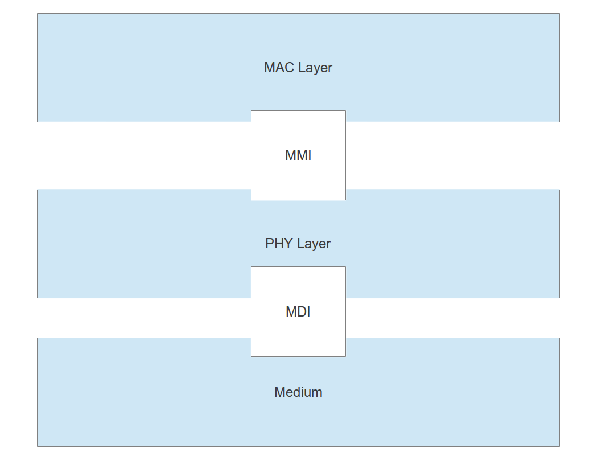
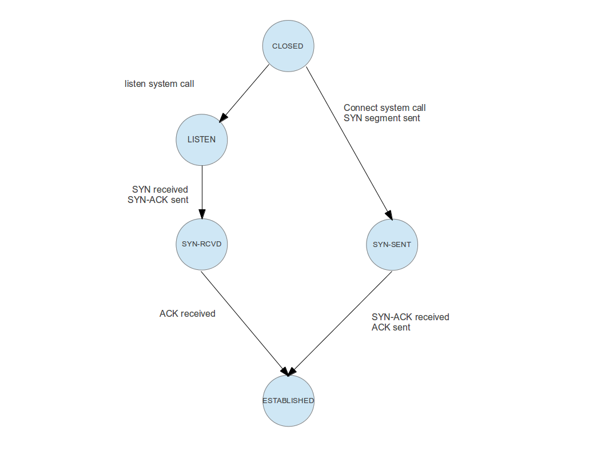
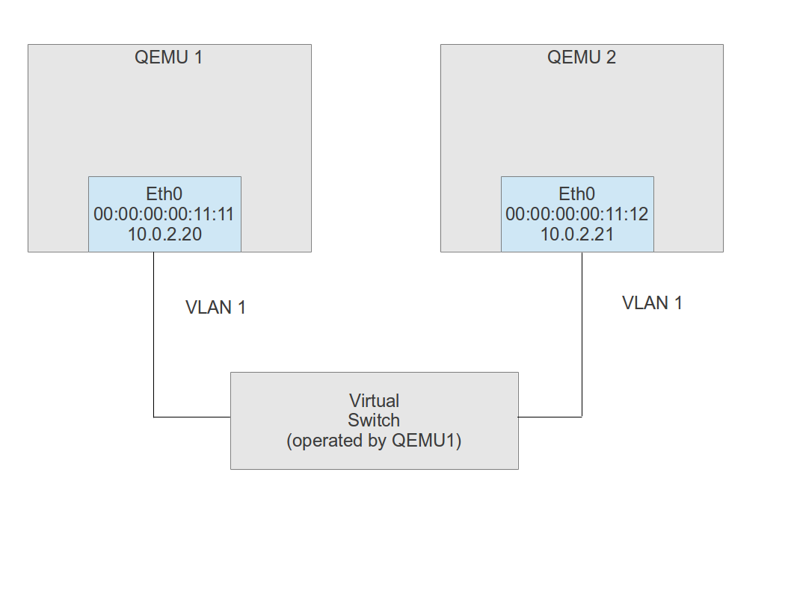
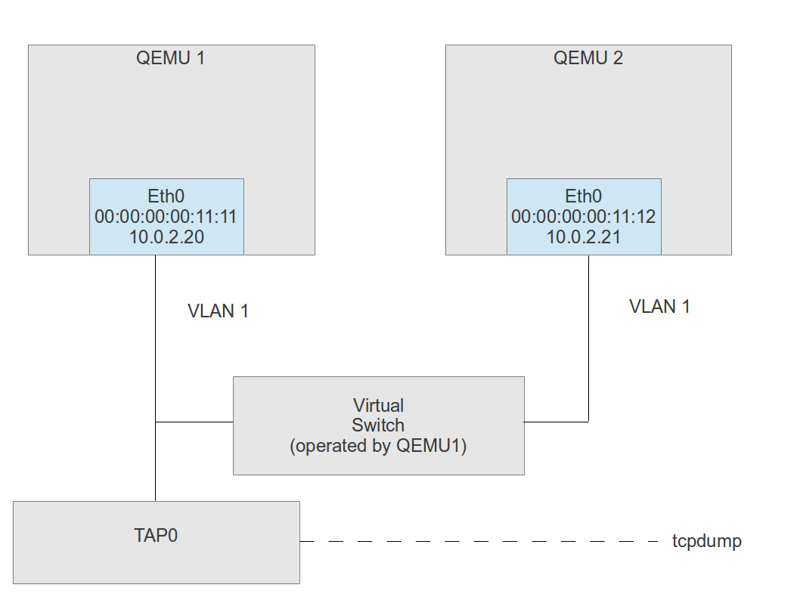
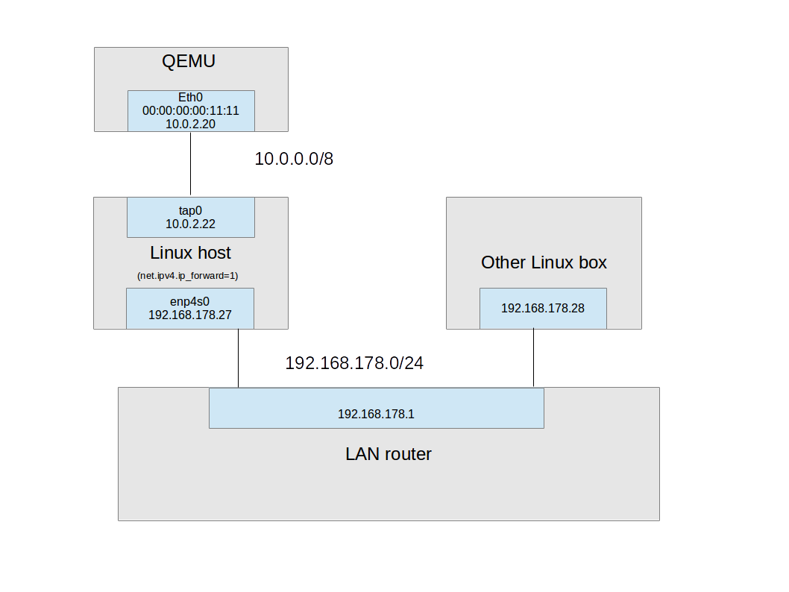

# Ethernet

Ethernet is a standard which allows the transmission of network packages in a local network over a shared line. 

Originally, Ethernet was designed to use a protocoll known as CSMA/CD (Carrier sense multiple access / collision detect) which allowed several devices to use a shared network line by definining how a device acquires access to the line and how collisions are detected and handled.

In its early versions, all devices in an Ethernet network were connected to a common bus. Thus all devices connected to the bus receive all messages and have to filter for those messages which are directed towards the own device. **Hubs** (also called multiport repeater) where used to connected different network segments. Using a hub, a star topology can be realized. Instead of being connected to a common bus ("bus topology"), all devices are connected to the hub. The hub will then forward all packages to all devices, so that each device is connected to each other device in the network.

Whereas a hub will not filter any packages and send all received packages to all of its ports, a **switch** is designed to learn which devices are connected to all of its port and only sends packages to the port behind which the destination device is located. To be able to do this, a switch builds up a table (SAT, source address table)  mapping the physical addresses of the devices in the network (MAC-address) to its ports. When it receives a package, it looks up the MAC address of the destination in this table. When an entry is found, the switch forwards the package only to the port behind which the device is located. 

Originally, the SAT is empty, thus all packages are forwarded to all ports. Over time, the switch inspects the source MAC address of incoming packages and builds up the SAT from this information. When this initial phase ("learning phase") is completed, the switch knows all connected devices.

In combination with the use of twisted pair cables having separate transmit and receive lines, the use of switches avoids collisions on the network entirely and makes full-duplex mode possible. However, it can still happen that a station in the network is not able to process incoming packets fast enough. In this case, it can use a mechanism called **flow-control** to signal to all other devices to stop sending packages for a certain period of time.

## Ethernet physical layer

Originally, Ethernet devices were connected using a coaxial cable bus to which each station was directly connected, typically using a BNC T-connector. Consequently, all stations had to operate in half-duplex mode, i.e. sending and receiving data at the same time was not possible, because incoming and outgoing signals both ran over the same piece of wire. This wiring standard is also known as 10Base2. As all devices shared the same physical medium, CSMA/CD was required to be able to detect collisions.

In the early nineties, another type of cables called **twisted pair cable** became more and more popular. The first major standard for Ethernet over twisted pair cables was called 10BaseT. It requires to pairs of wires. A device uses one pair of wires to transmit data and another pair of data to receive data. 

In its most common form, the connection is provided by a CAT5 Ethernet cable which has four twisted pairs (so that theoretically, two Ethernet links can be run over it), and the cable is terminated using two 8-pin connectors according to the T568A standard, aka RJ-45. When one of the ends is terminated using T568B, which differs from T568A in that the pairs 2 and 3 are swapped, the cable is called a cross-over cable and used to directly connect two computers or two switches with each other. 

With 10BaseT, the bus topology is replaced by a star topology with a hub or switch sitting in the middle.

Note that using two pairs of wires by itself does not imply that full-duplex mode can be used. In a star topology with one hub, suppose that two connected PCs send data at the same time. A third PC connected to the hub will then receive both packages, thus a collision can occur on the pair of wires connecting the Tx output of this port to the Rx input of this PC. Therefore all stations still need to be able to detect collisions. To achieve that, each station which sends data is listening at the same time to see whether any other station is transmitting as well. The simultaneous occurance of signals on the transmit and receive pairs is considered a collision. Therefore full-duplex operation is not possible.

To be able to run at full-duplex mode, where receiving data and transmitting data is possible simultaneously, switches are necessary which effectively establish point-to-point connections with the attached devices. Switches are designed to detect collisions caused by incoming messages targeted at the same outgoing port and handle these collisions automatically (for instance by storing data temporarily).

The IEEE 802.3 standard defines two different components of a typical network card, which are displayed in the following picture.



The MAC layer is responsible for data encapsulation (i.e. adding for instance the CRC checksum to an Ethernet package), error detection and collision handling. It accesses the actual physical medium via the so called PHY (physical layer). The physical layer is responsible for encoding and decoding, collision detection, handling bit rates, synchronization and other aspects of the bit-by-bit low level communication.

IEEE 802.3 defines a standard called MII (medium independent interface) for the communication between a MAC and a PHY. The PHY layer and the actual medium are connected via the MDI (medium dependent interface).

## Ethernet frames

The Ethernet protocol is the lowest level of the networking stack which is used for the actual physical communication of devices in a local area network (LAN) over an Ethernet cable. On the Ethernet level, all devices within a network are identified by a 6 byte sequence called the **MAC address** (MAC is the abbreviation for Media Access Control). Devices which are connected to the network can send packages to specific devices or to all devices on the network.

An Ethernet package as transferred over the network has the following format. Note that for a byte, the least significant bit is transferred first, whereas for words and double words, big-endian encoding is used, i.e. the most significant byte is transferred first (network byte order). Thus the stream of bits 00000001 10000000 would be 0x8001. Here we use the usual notation that the first transmitted bit in a byte (octet) is placed on the left. Thus in this example, 7 zeroes would go over the wire, followed by a 1, another 1 and finally seven more zeroes.

<table>
<thead>
<tr class="header">
<th>Bytes and field name<br />
</th>
<th>Description<br />
</th>
</tr>
</thead>
<tbody>
<tr class="odd">
<td>Bytes 0 - 6 - Preamble<br />
</td>
<td>The preamble is a sequence of seven bytes, where each second bit (starting with the first one) is set and all other bits are cleared. It was used by older devices to synchronize the devices on the network. Usually the preamble is added by the network card. As the least significant bit is transmitted first, the preamble bytes are 0x55<br />
</td>
</tr>
<tr class="even">
<td>Byte 7 - Start Frame Delimiter (SDF)<br />
</td>
<td>The start frame delimiter is the sequence 10101011 (i.e. 0xd5, again note that the LSB is transferred first) and marks the end of the preamble and the start of the actual package<br />
</td>
</tr>
<tr class="odd">
<td>Bytes 8 - 13 - Destination MAC Address<br />
</td>
<td>MAC address of the package destination<br />
</td>
</tr>
<tr class="even">
<td>Bytes 14 - 19 - Source MAC Address<br />
</td>
<td>MAC address of the package destination<br />
</td>
</tr>
<tr class="odd">
<td>Bytes 20 - 21 - Length (for Ethernet I) or Ethertype (for Ethernet II aka DIX Ethernet)<br />
</td>
<td>For Ethernet I, this is the length of all following fields excluding the CRC sum and is limited to 1500. For Ethernet II, this is the type field which is always greater than 0x600 ( = 1536), so that the two protocols can be distiguinshed. 0x800 is IP and 0x806 is ARP.<br />
</td>
</tr>
<tr class="even">
<td>Bytes 22 - NN<br />
</td>
<td>This is the actual data. If less than 46 bytes are transferred, padding needs to be done with zeroes to fill up to at least 46 bytes<br />
</td>
</tr>
<tr class="odd">
<td>Bytes NN + 1 - NN +4 - 4 byte CRC<br />
</td>
<td>CRC sum of all other fields, excluding preamble and SDF. This field is added in most cases automatically by the network card<br />
</td>
</tr>
</tbody>
</table>

The Ethernet package without preamble and SDF is often referred to as the **Ethernet frame**. Also note that before the Ethertype field, there might be an optional 4-byte IEEE 802.1Q tag which contains the VLAN to which the package belongs and the QoS. By definition, the first two bytes are 0x8100, so that an Ethertype of 0x8100 means that the frame contains this field ("is tagged") and the actual Ethertype field is located after the Q-tag.

To send a packet to all devices on the network, the special MAC address FF:FF:FF:FF:FF:FF can be used. More precisely, all MAC addresses for which the least significant bit in the first octet (i.e. the first transmitted bit of the Ethernet frame) is set, are treated as multicast packets which are determined for a group of devices on the network. The actual MAC address FF:FF:FF:FF:FF:FF is reserved for broadcasts which are meant to be processed by all devices on the network. Also note that RFC1112 (IP multicasting) defines how an Ethernet multicast address can be mapped to an IP multicast address and vice versa.

# The ARP protocol

When we look in detail at the IP protocol in the following sections, we will see that each station in an IP network is uniquely identified by an **IP address**. If IP packets travel across an Ethernet network, it is therefore necessary to determine the MAC address of an interface from its assigned IP address. For this purpose, the **ARP protocol** (Address Resolution protocol) is used.

The ARP protocol can theoretically be used to translate more generally between protocol addresses (like IP-addressses) and hardware addresses (like the MAC address). We will therefore follow the usual conventions and refer to the IP address as the protocol address and the MAC address as the hardware address, keeping in mind that this is the most common, but not the only use of the ARP protocol.
The structure of an ARP package is as follows.

<table>
<thead>
<tr class="header">
<th>Bytes and field name<br />
</th>
<th>Description<br />
</th>
</tr>
</thead>
<tbody>
<tr class="odd">
<td>Bytes 0 - 1<br />
</td>
<td>Hardware type. This field determines the type of hardware addresses. Usually this is 0x1 for Ethernet<br />
</td>
</tr>
<tr class="even">
<td>Bytes 2 - 3<br />
</td>
<td>Protocol type. IP is 0x800<br />
</td>
</tr>
<tr class="odd">
<td>Byte 4<br />
</td>
<td>Hardware address length in bytes<br />
</td>
</tr>
<tr class="even">
<td>Byte 5<br />
</td>
<td>Protocol address length in bytes<br />
</td>
</tr>
<tr class="odd">
<td>Bytes 6 -7 <br />
</td>
<td>ARP operation code:<br />
0x1 = ARP request<br />
0x2 = ARP reply<br />
</td>
</tr>
<tr class="even">
<td>Starting at byte 8<br />
</td>
<td>Source hardware address<br />
</td>
</tr>
<tr class="odd">
<td>After source hardware address<br />
</td>
<td>Source protocol address<br />
</td>
</tr>
<tr class="even">
<td>After source protocol address<br />
</td>
<td>Destination hardware address<br />
</td>
</tr>
<tr class="odd">
<td>After destination hardware address<br />
</td>
<td>Destination protocol address<br />
</td>
</tr>
</tbody>
</table>

Here is an example captured via tcpdump.

```
02:00:36.600267 ARP, Request who-has 10.0.2.20 tell 10.0.2.15, length 46
    0x0000:  ffff ffff ffff 0000 0000 1112 0806 0001
    0x0010:  0800 0604 0001 0000 0000 1112 0a00 020f
    0x0020:  0000 0000 0000 0a00 0214 0000 0000 0000
    0x0030:  0000 0000 0000 0000 0000 0000
```

As usual, the first 14 bytes of the Ethernet frame are the Ethernet header, i.e. destination address (broadcast in this case) and source MAC address, followed by the Ethertype 0x806 for ARP. The actual ARP request then starts at offset 14 with the Hardware type 0x1 = Ethernet and the protocol type 0x800 = IP. The next two bytes are the hardware address length (6 bytes for a MAC address) and the protocol address length (4 bytes for a 32 bit IPv4 address), note that ARP is not used with IPv6). The ARP operation code is 0x1.

Next the source hardware address and the source IP address are filled with hardware address and IP address of the sender, i.e. 00:00:00:00:11:12 and 10.0.2.15. The destination MAC address is all zeroes, the destination IP address is the IP address which we want to resolve (10.0.2.20 in this case). The remaining bytes of the Ethernet package are zero, as the ARP packet is less than 64 bytes and therefore filled up with zeroes by the network card.

To build the ARP reply, the station which actually has the IP address 10.0.2.20 would fill the source hardware address with its MAC address and the source IP address with 10.0.2.20. It would put the source hardware address and the source IP address of the original packet into destination hardware address and destination protocol address of the reply, set the ARP operation code to 0x2 for reply and send the package back to the sender.

To avoid requesting the MAC address for each individual IP packet, a network driver builds up a cache of address resolution entries. This cache is not only built up from ARP replies, but also from ARP requests.

# The IP protocol

We have seen above that Ethernet is a protocol used to connect network stations which share a common medium or are connected via hubs or switches. However, Ethernet based communication is not able to cross network boundaries. If the goal is to build up a "network of networks", where various LANs are connected to a larger network, a different protocol is required which uses some sort of logical addressing, but is independent of the actual physical realization.

The protocol which is used for that purpose by most networks today is the **IP protocol (Internet Protocol)** as defined by RFC 791. All stations which participate in a communication using the Internet Protocol have a logical address called the IP-address. In the original version (IP v4), the IP address consists of four octets, i.e. 32 bits.

IP messages, so called **datagrams**, are preceeded by a header which contains relevant protocol information. The following table displays the format of an IP header if no options (see below) are used.

<table>
<thead>
<tr class="header">
<th>Bytes and field name<br />
</th>
<th>Description<br />
</th>
</tr>
</thead>
<tbody>
<tr class="odd">
<td>Byte 0 - Version and header length<br />
</td>
<td>The first 4 transmitted bits are the length of the header in dwords, the next 4 transmitted bits (i.e the most significant bits of the first byte) are the IP version (0x4 for IP v4).<br />
</td>
</tr>
<tr class="even">
<td>Byte 1 - Priority<br />
</td>
<td>The priority of the package (0x0 = normal)<br />
</td>
</tr>
<tr class="odd">
<td>Bytes 2 - 3 - Length<br />
</td>
<td>This is the length of header and data in total (in bytes)<br />
</td>
</tr>
<tr class="even">
<td>Bytes 4 - 5 - ID<br />
</td>
<td>ID of the package which identifies the package uniquely within the current stream (mostly used for fragmentation)<br />
</td>
</tr>
<tr class="odd">
<td>Bytes 6 - 7 - Fragment offset and flags<br />
</td>
<td>0x4000 if no fragmentation is used<br />
</td>
</tr>
<tr class="even">
<td>Byte 8 - TTL<br />
</td>
<td>Time to live, this is decremented by each station forwarding the package, if 0 is reached, the package is dropped<br />
</td>
</tr>
<tr class="odd">
<td>Byte 9 - Protocol<br />
</td>
<td>Protocol (0x1 = ICMP, 0x6 = TCP, 0x11 = UDP, see <a href="http://www.iana.org/assignments/protocol-numbers/protocol-numbers.xml" class="uri">http://www.iana.org/assignments/protocol-numbers/protocol-numbers.xml</a> for a complete list)<br />
</td>
</tr>
<tr class="even">
<td>Bytes 10 - 11 - Checksum<br />
</td>
<td>Checksum for header<br />
</td>
</tr>
<tr class="odd">
<td>Bytes 12 - 15 - IP address of sender<br />
</td>
<td>This is the IP address of the sender<br />
</td>
</tr>
<tr class="even">
<td>Bytes 16 - 19 - IP address of receiver<br />
</td>
<td>Destination IP address<br />
</td>
</tr>
</tbody>
</table>

<span style="font-weight: bold;">
</span>

A real-life example
===================

Now let us see how all this looks like in practice. To actually look at a real Ethernet package, we will use the tcpdump tool. First, let us collect some information about the local network setup using ifconfig.

```
$ ifconfig enp4s0
enp4s0    Link encap:Ethernet  HWaddr 1c:6f:65:c0:c9:85  
          inet addr:192.168.178.27  Bcast:192.168.178.255  Mask:255.255.255.0
          inet6 addr: fe80::dd59:ad15:4f8e:6a87/64 Scope:Link
          UP BROADCAST RUNNING MULTICAST  MTU:1500  Metric:1
          RX packets:17678 errors:0 dropped:0 overruns:0 frame:0
          TX packets:14124 errors:0 dropped:0 overruns:0 carrier:0
          collisions:0 txqueuelen:1000 
          RX bytes:14645009 (14.6 MB)  TX bytes:2744831 (2.7 MB)
```
Here we see that our network device enps4s0 is an Ethernet device with the MAC address 1c:6f:65:c0:c9:85 . The IP v4 address of the network card  is 192.168.178.27, thus the gateway is 192.168.178.1.

Now open a terminal, become root and enter the following command:

```
tcpdump -i enp4s0 -xxx
```

This will instruct tcpdump to dump packages going over enp4s0, printing all details including the Ethernet header (-xxx). On another terminal, execute

```
ping 192.168.178.1
```

Then tcpdump will produce the following output (plus a lot of other stuff, depending on what you currently run in parallel):

```
21:28:18.410185 IP your.host > your.router: ICMP echo request, id 6182, seq 1, length 64
	0x0000:  0896 d775 7e80 1c6f 65c0 c985 0800 4500
	0x0010:  0054 e6a3 4000 4001 6e97 c0a8 b21b c0a8
	0x0020:  b201 0800 4135 1826 0001 d233 de5a 0000
	0x0030:  0000 2942 0600 0000 0000 1011 1213 1415
	0x0040:  1617 1819 1a1b 1c1d 1e1f 2021 2223 2425
	0x0050:  2627 2829 2a2b 2c2d 2e2f 3031 3233 3435
	0x0060:  3637
21:28:18.412823 IP your.router > your.host: ICMP echo reply, id 6182, seq 1, length 64
	0x0000:  1c6f 65c0 c985 0896 d775 7e80 0800 4500
	0x0010:  0054 0b2c 0000 4001 8a0f c0a8 b201 c0a8
	0x0020:  b21b 0000 4935 1826 0001 d233 de5a 0000
	0x0030:  0000 2942 0600 0000 0000 1011 1213 1415
	0x0040:  1617 1819 1a1b 1c1d 1e1f 2021 2223 2425
	0x0050:  2627 2829 2a2b 2c2d 2e2f 3031 3233 3435
	0x0060:  3637
```

Let us examine this output in detail. As the preamble and SDF is stripped by the network card, it is not contained in the output of tcpdump. Instead, the output starts with the destination MAC address 08:96:d7:75:7e:80 which is the MAC address of my router (you can figure out the MAC address of your router using the `arp` command).

The next six bytes contain our own MAC address 1c:6f:65:c0:c9:85 and match the output of ifconfig. The next two bytes (Ethertype) are 0x800, indicating that this is an IP request. Next we see 0x45, i.e. we have an IP v4 package with a header length of 5 dwords, i.e. 20 bytes. The next byte 0x00 is the priority.

The first two bytes on the second line (0x0054) are the length of the IP package in total, i.e. including header and data. This is 0x54 = 84 bytes. As 20 bytes are used by the header, the total IP data part has 64 bytes, which matches the output of tcpdump on the row above the hex dump. 

The next two bytes are the ID, and fragment offset and flags are 0x4000, i.e there is no fragmentation. The package TTL is 0x40 = 64 and the protocol is 0x1 (ICMP). The next two bytes are the checksum (0x6e97).

The next four bytes (c0:a8:b2:1b) are the IP address of the sender. In decimal notation, this is 192.168.178.27 which is - as expected - the IP address assigned to enp4s0. Following the sender address, we see the destination address (c0:a8:b2:01) which is the address of the router to which the ping has been directed. The remaining bytes are the actual ICMP message.
The second package is very similar, with source and target addresses reversed.

## Fragmentation

By its nature, IP is a **message oriented protocol**, i.e. data is transferred in units called packets. Depending on the hardware used, a packet has a certain maximum length which may not be exceeded. 

If, for instance, data is sent via an Ethernet interface, the total size of the Ethernet packet is restricted to 1514 bytes. As at most 14 bytes are needed for the Ethernet header, the Ethernet payload can be at most 1500 bytes. In addition, the IP header consumes at least another 20 bytes, so that the IP payload of an IP packet transmitted via a standard Ethernet adapter can be at most 1480 bytes.

Now it might very well happen that IP is asked to transmit a packet which is longer than this size by an upper protocol layer. Suppose for instance that an application opens a UDP socket and uses the send system call to transmit a UDP message which is longer than 1480 - 8 = 1472 bytes.  As 8 bytes are needed for the UDP header, this will create an IP packet with a payload longer than 1480 bytes. If that happens, the IP layer needs to split the message into smaller pieces called **fragments**, a procedure known as fragmentation. The receiver needs to identify the incoming fragments as components of the same packet and will perform a reassembly before presenting the IP packet to the upper layers of the protocol stack.

Again let us look at an example. As indicated above, consider the case that a packet is transmitted via a UDP send which contains exactly 1473 bytes, thus requiring a total IP payload length of 1481 bytes. Then IP needs to create two fragments. The first fragment looks as follows (only the first few bytes are displayed)

```
00 1a 4f 30 24 eb 1c 6f  65 c0 c9 85 08 00 45 00   ..O0$..o e.....E.
05 dc f8 f2 20 00 40 11  76 b7 c0 a8 b2 14 c0 a8   .... .@. v.......
b2 01 a9 fd 75 30 05 c9  aa 63 00 01 02 03 04 05   ....u0.. .c......
```

Again, byte 0 and byte 1 of the IP header (0x45 and 0x00) are version, header length and priority. The next two bytes are the total length of the fragment, in this case 0x5dc, i.e. 1500. Note that this is the maximum size of an Ethernet payload. The ID field is now filled with the two byte number 0xf8f2. In addition, the combined fragment offset and flags field are now 0x2000.

The first three bits of this field are now 001, i.e. the second bit (DF) is zero, indicating that fragmentation is allowed, and the last bit (MF, more fragments) is set, indicating that more fragments are to come. The remaining 13 bits of the combined field "flags and fragment offset" are all zero, i.e. this is fragment 0.

The remainder of the header is well known from the previous example. Following the header, we find the first few bytes of data (in our example, we have placed i in data byte i).
Now let us look at the second fragment.

```
00 1a 4f 30 24 eb 1c 6f  65 c0 c9 85 08 00 45 00   ..O0$..o e.....E.
00 15 f8 f2 00 b9 40 11  9b c5 c0 a8 b2 14 c0 a8   ......@. ........
b2 01 c0                                           ...             
```

Here we see that the IP packet contains the same ID field 0xf8f2. In fact, the ID field is used to be able to combine fragments into packets again and, by definition, needs to be the same for all fragments within a packet. However, the total length of the second fragment is only 0x15 = 21 bytes, i.e. 1 data byte and 20 header bytes. Thus the total data length of both fragments is 1 + 1480 = 1481 as expected.
This time, however, the flags and offset field is 0x00b9. Thus the first three bits are zero, i.e. MF = 0 (indicating that this is the last fragment) and DF = 0. The remaining 13 bits are 0xb9 = 185. As the unit is 8 bytes, this corresponds to 185 \* 8 = 1480 bytes. This field defined the offset of the data in the fragment at hand within the entire packet. Note that this refers to the original, unfragmented IP datagram, not including the header.

Combining what we have found, we can now summarize the meaning of the possible combinations of offset and the MF flag.

<table>
<thead>
<tr class="header">
<th>MF<br />
</th>
<th>Fragment offset<br />
</th>
<th>Type of packet<br />
</th>
</tr>
</thead>
<tbody>
<tr class="odd">
<td>0<br />
</td>
<td>0<br />
</td>
<td>Unfragmented<br />
</td>
</tr>
<tr class="even">
<td>0<br />
</td>
<td>different from zero<br />
</td>
<td>Last fragment in a fragmented packet<br />
</td>
</tr>
<tr class="odd">
<td>1<br />
</td>
<td>0<br />
</td>
<td>First fragment in a fragmented packet<br />
</td>
</tr>
<tr class="even">
<td>1<br />
</td>
<td>different from zero<br />
</td>
<td>Fragment different from the first and last fragment<br />
</td>
</tr>
</tbody>
</table>

## Raw IP sockets

In contrast to TCP/IP sockets, which mark the endpoints of a connection oriented protocol and are stream oriented, raw IP sockets can be used by applications programs to send and receive IP packets directly. A common application of this is the ping utility which uses ICMP and directly assembles the required IP packets. The details of the raw socket API is implementation specific and not defined by the POSIX standard. This section describes the usage of raw sockets for Linux.

As other sockets, raw IP sockets are created using the socket system call. The syntax is
```
fd = socket(AF\_INET, SOCK\_RAW, proto);
```
Here the parameter proto specifies an IP protocol which determines which packets the socket will receive and accept for sending.  They are defined in linux/in.h and match the valid values in the IP protocol field of an IP header as specified by IANA.

```
enum {
  IPPROTO_IP = 0,		/* Dummy protocol for TCP		*/
  IPPROTO_ICMP = 1,		/* Internet Control Message Protocol	*/
  IPPROTO_IGMP = 2,		/* Internet Group Management Protocol	*/
  IPPROTO_IPIP = 4,		/* IPIP tunnels (older KA9Q tunnels use 94) */
  IPPROTO_TCP = 6,		/* Transmission Control Protocol	*/
  IPPROTO_EGP = 8,		/* Exterior Gateway Protocol		*/
  IPPROTO_PUP = 12,		/* PUP protocol				*/
  IPPROTO_UDP = 17,		/* User Datagram Protocol		*/
  IPPROTO_IDP = 22,		/* XNS IDP protocol			*/
  IPPROTO_TP = 29,		/* SO Transport Protocol Class 4	*/
  IPPROTO_DCCP = 33,	/* Datagram Congestion Control Protocol */
  IPPROTO_IPV6 = 41,	/* IPv6-in-IPv4 tunnelling		*/
  IPPROTO_RSVP = 46,	/* RSVP Protocol			*/
  IPPROTO_GRE = 47,		/* Cisco GRE tunnels (rfc 1701,1702)	*/
  IPPROTO_ESP = 50,		/* Encapsulation Security Payload protocol */
  IPPROTO_AH = 51,		/* Authentication Header protocol	*/
  IPPROTO_MTP = 92,		/* Multicast Transport Protocol		*/
  IPPROTO_BEETPH = 94,	/* IP option pseudo header for BEET	*/
  IPPROTO_ENCAP = 98,	/* Encapsulation Header			*/
  IPPROTO_PIM = 103,	/* Protocol Independent Multicast	*/
  IPPROTO_COMP = 108,	/* Compression Header Protocol		*/
  IPPROTO_SCTP = 132,	/* Stream Control Transport Protocol	*/
  IPPROTO_UDPLITE = 136,/* UDP-Lite (RFC 3828)			*/
  IPPROTO_MPLS = 137,	/* MPLS in IP (RFC 4023)		*/
  IPPROTO_RAW = 255,	/* Raw IP packets			*/
  IPPROTO_MAX
};
```


If IPPROTO_RAW is specified, all IP packets can be sent to the raw socket, regardless of their protocol number, but the socket will not receive any data. The handling of IP headers depends on the setting of the socket option IP_HDRINCL. When this option is set, the API assumes that the packet already contains a header. Otherwise, a header will be assembled and added to the message automatically. In received messages, the header will always be included.

To set IP_HDRINCL or other options on a raw socket, the system call setsockopt needs to be used.
```
setsockopt(int fd, int level, int optname, void* optval, socklen_t optlen);
```
The first argument to setsockopt is the file descriptor associated with the socket. The second argument is the level of the TCP/IP stack which is responsible for handling the option. For socket level options, this is SOL_SOCKET, socket level options are  defined in /usr/include/asm-generic/socket.h which is included by /usr/include/sys/socket.h. To set options at the level of a particular protocol, the protocol number needs to be used as value for the argument level.

The argument optval identifies the option to be set. optval is a pointer to the value of the option to be used. Finally, optlen, which is actually an integer, indicates the size of optval in bytes.

Once a raw IP socket has been created, data can be sent and received using the standard socket API functions. More specifically, we have the following options. First the socket can be connected using the ordinary connect system call. As the socket is not a stream oriented socket, this will not actually established any connection, but will set the foreign address of the socket to the provided address. This can be seen using netstat -a --inet -n.

As usual, connecting a socket implicitly binds the socket to an unused local address (using the IP address INADDR_ANY so that packets from all local interfaces will be received). After connecting the socket, send can be used on it as usual to send packets. If an application tries to use send on an unconnected raw IP socket, the error message EDESTADDRREQ (destination address required) is returned. The syntax of the send system call is the same as for ordinary TCP/IP sockets:

```
ssize_t send(int socket, const void *buffer, size_t length, int flags);
```

Instead of using send on a non-connected socket, however, there is the alternative to use sendto. This system call is very similar to send, except that there is an additional parameter which can be used to specify a destination address.

```
ssize_t sendto(int socket, const void *message, size_t length, int flags, const struct sockaddr *dest_addr, socklen_t dest_len);         
```

Here dest_addr is the destination address to which the data will be sent, and the last parameter specifies the length of the address data.

# TCP

## The TCP header

In contrast to IP, the TCP protocol is a connection oriented and stream oriented protocol, i.e. the connection appears as a stream of bytes to the sender and the receiver. Consequently, the TCP header contains additional fields used to identify the connection as well as the position of the transmitted package (called a "segment") within the byte stream. The following table lists the fields of a TCP header.

<table>
<thead>
<tr class="header">
<th>Bytes<br />
</th>
<th>Description<br />
</th>
</tr>
</thead>
<tbody>
<tr class="odd">
<td>0 - 1<br />
</td>
<td>Source Port<br />
</td>
</tr>
<tr class="even">
<td>2 - 3<br />
</td>
<td>Destination Port<br />
</td>
</tr>
<tr class="odd">
<td>4 - 7<br />
</td>
<td>Sequence number - this is the offset of the first byte of the segment within the stream of bytes transmitted via this protocol<br />
</td>
</tr>
<tr class="even">
<td>8 - 11<br />
</td>
<td>Acknowledgement number - for ACK messages, this is the next sequence number expected by the receiver<br />
</td>
</tr>
<tr class="odd">
<td>12 - 13<br />
</td>
<td>Header length in dwords (4 bits), reserved (6 bits) and control flags (6 bit)<br />
</td>
</tr>
<tr class="even">
<td>14 - 15<br />
</td>
<td>Receive window<br />
</td>
</tr>
<tr class="odd">
<td>16 - 17<br />
</td>
<td>Checksum<br />
</td>
</tr>
<tr class="even">
<td>18 - 19<br />
</td>
<td>Urgent Pointer<br />
</td>
</tr>
<tr class="odd">
<td>20 - max. 59<br />
</td>
<td>Options<br />
</td>
</tr>
</tbody>
</table>

The source and destination port determine - along with the IP destination and IP source address in the IP header - the connection to which the packet belongs. The sequence number is increased by the sender with every message and is the position of the sent segment within the byte stream, more specifically the position of the first byte in the segment within the byte stream. The acknowledgement number is transmitted by the receiver and contains the position of the next byte within the byte stream expected by the receiver, i.e. the sequence number of the next segment which the receiver expects. This field is only valid if the ACK flag is set.

### The TCP state machine

During its lifecycle, a TCP connection and consequently a TCP socket travels through a sequence of different states. When a TCP socket is initially created, it is in the CLOSED state and not associated with a specific connection. A socket used by a client is then typically brought into the SYN-SENT state by a connect system call. This call initiates the sending of a SYN segment. This is a special segment which has the SYN control flag set and does not contain any data. The sequence number used for the SYN segment is called the initial sequence number (ISN).

When a client has send a SYN segment, is usually receives a SYN-ACK segment from the server, i.e. a segment which has the control flags SYN and ACK both set. This segment acknowledges the receipt of the SYN segment and - at the same time - represents the SYN of the server. Upon receiving this segment, the client transfer to the state ESTABLISHED.

Corresponding to the sequence run through by the client, there is a similar sequence executed by the server. First, the server is brought to the LISTEN state by the listen system call. When it receives a SYN while being in this state, it sends a SYN-ACK and enters the state SYN RECEIVED. Once it receives the acknowledgement for this segment, it also enters the state ESTABLISHED. This part of the TCP state machine - sometimes called the three-way handshake - is displayed in the following diagram.



Let us look at a real-world example to see how this works. Let us create a connected socket by opening a TCP connection to a known machine, say www.gnu.org, using telnet, and look at the resulting data using tcpdump.

```
$ sudo tcpdump -i enp4s0 -xxx tcp
tcpdump: verbose output suppressed, use -v or -vv for full protocol decode
listening on enp4s0, link-type EN10MB (Ethernet), capture size 262144 bytes
222:07:11.825122 IP my.box.48494 > wildebeest.gnu.org.http: Flags [S], seq 443857666, win 29200, options [mss 1460,sackOK,TS val 2663544 ecr 0,nop,wscale 7], length 0
	0x0000:  0896 d775 7e80 1c6f 65c0 c985 0800 4510
	0x0010:  003c 1f7a 4000 4006 ec62 c0a8 b21b d076
	0x0020:  eb94 bd6e 0050 1a74 bb02 0000 0000 a002
	0x0030:  7210 6f4a 0000 0204 05b4 0402 080a 0028
	0x0040:  a478 0000 0000 0103 0307
22:07:11.955617 IP wildebeest.gnu.org.http > my.box.48494: Flags [S.], seq 2167862485, ack 443857667, win 28960, options [mss 1394,sackOK,TS val 1747284744 ecr 2663544,nop,wscale 7], length 0
	0x0000:  1c6f 65c0 c985 0896 d775 7e80 0800 4500
	0x0010:  003c 0000 4000 3206 19ed d076 eb94 c0a8
	0x0020:  b21b 0050 bd6e 8136 f4d5 1a74 bb03 a012
	0x0030:  7120 1f31 0000 0204 0572 0402 080a 6825
	0x0040:  7308 0028 a478 0103 0307
22:07:11.955665 IP my.box.48494 > wildebeest.gnu.org.http: Flags [.], ack 1, win 229, options [nop,nop,TS val 2663577 ecr 1747284744], length 0
	0x0000:  0896 d775 7e80 1c6f 65c0 c985 0800 4510
	0x0010:  0034 1f7b 4000 4006 ec69 c0a8 b21b d076
	0x0020:  eb94 bd6e 0050 1a74 bb03 8136 f4d6 8010
	0x0030:  00e5 bdd5 0000 0101 080a 0028 a499 6825
	0x0040:  7308

```


The first packet which we observe is origination from port 0xbd6e (48494) and directed to port 0x0050 (80). The sequence number - which is the initial sequence number used for this connection - is contained in the next four bytes and is 0x1a74bb02 = 443857666. The acknowledge number is zero - there is nothing to acknowledge yet. The next byte 0xa0 contains the header length (0xa0 = 10) in dwords, i.e. 40 bytes and four reserved bits.

The next byte (0x2) consists of two more reserved bits and the flags 000010. The set flag is the SYN flag and marks the segment as a SYN segment. This field is followed by the 2-byte window size 0x7210 = 29200. This is the maximum number of bytes which the receiver is willing to accept - we will look at the concept of send and receive windows in one of the following sections.

After the checksum, we see the urgent pointer which is not set in this case. After the urgent pointer, there are 20 more bytes - as indicated by the total header length of 40 bytes - of options. Each option is started by a byte called the option-kind which indicates the type of the option, followed by another byte containing the option length (including kind and length itself). An exception is made for the option kinds 0 and 1 which do not have a length. The following table lists some of the standard options.

<table>
<thead>
<tr class="header">
<th>Option kind<br />
</th>
<th>Option length<br />
</th>
<th>Description<br />
</th>
</tr>
</thead>
<tbody>
<tr class="odd">
<td>0<br />
</td>
<td>Used to indicate the end of the option list<br />
</td>
<td>-<br />
</td>
</tr>
<tr class="even">
<td>1<br />
</td>
<td>NOP<br />
</td>
<td>No option, but used to fill up the header to a dword boundary<br />
</td>
</tr>
<tr class="odd">
<td>2<br />
</td>
<td>4<br />
</td>
<td>Maximum segment size (MSS)<br />
</td>
</tr>
<tr class="even">
<td>3<br />
</td>
<td>3<br />
</td>
<td>Window scale<br />
</td>
</tr>
<tr class="odd">
<td>4<br />
</td>
<td>2<br />
</td>
<td>SACK Permitted - sender is willing to accept selective acknowledgements<br />
</td>
</tr>
</tbody>
</table>

In our example, the first option has option kind 2, i.e. MSS, and is four bytes long. As this includes kind and length, the actual value is 2 bytes long and is 0x5b4 = 1460. This option indicates the maximum size of a segment which the receiver will accept and is usually determined by the MTU.

The next option has option kind 4 and is 2 bytes long, i.e. the option does not have any data. This option is called the **SACK permitted** option and is only allowed to appear in SYN segments. It indicates to the receiver that the sender is willing to accept so called **selective acknowledgements**.

The next option has kind 8 and is 10 bytes long, i.e. there are 8 data bytes. This is the **time stamp option (TSO)**. The first 4 data bytes contain the time stamp of the segment generated by the receiver. The next four bytes are only valid for ACK segments and contain a timestamp previously received.

The next option is a NOP and is followed by the last option with kind 3. This is the **window scale option** and defines a scaling factor (7 in this case) which is to be applied to the window size in the header to arrive at the actual window size. More precisely, the value in this field is the number of bits by which the window size needs to be shifted to the left to arrive at the effective window size. As many other options, this option can only appear in SYN segments and is only valid if both sides send this option during the 3-way handshake establishing the connection.

The segment sent back by www.gnu.org is a SYN-ACK segment, i.e. both flags SYN and ACK are set (the flags field is 0x12 = 10010). The acknowledge field is now filled with the sequence number sent by the client in the SYN segment plus one. The same segment also contains the initial segment number of the server which is 0x8136f4d6. Again this segment contains options.

Finally, the last segment is the acknowledgement of the SYN. After the server has received this packet, the connection is fully established. Note that this happens even if the server has not yet executed the accept system call. In fact, after executing this sequence, the connection will show up as ESTABLISHED in the netstat output event though accept has not yet been called.

The full TCP state machine model is very complicated, and I will not fully replicate it here. Instead, I refer the reader to some of the available excellent literature (for instance the two volumes "TCP/IP Illustrated" by F. Stevens), the quite readable RFCs like [RFC 793](https://tools.ietf.org/html/rfc793) or to the TCP module tcp.c, in particular `tcp_rx_msg`.


# Networking with QEMU


In order to test and debug networking code, it is extremely helpful to have an isolated environment in which the entire traffic can be easily dumped and analyzed. One way to build up such an environment is offered by QEMU which is able to emulate a network interface card (NIC) which is presented to the guest and connect this virtual NIC to the host computer or other guests running on different instances of QEMU.

QEMU uses the term VLAN (not to be confused with an IEEE VLAN) to refer to a virtual bus to which a NIC is connected. Image a VLAN as a sort of virtual Ethernet backbone or Ethernet hub to which all devices with the same VLAN ID are connected in a bus topology. However, a VLAN is only valid within an individual instance of QEMU - we will see in a minute how different instances can be connected.

For these tests, I have used the lean [Alpine Linux](https://alpinelinux.org/downloads/) distribution, but it should work with any of the standard distributions. Let us assume that we have downloaded a CDRM ISO image which is called `linux.iso`.


The following command line options to QEMU are used for these tests:

```
-net nic,vlan=1,model=e1000,macaddr=00:00:00:00:00:11
```

This option will attach a network card using the e1000 chipset to the guest. The network card will be connected to the specified virtual LAN (VLAN) (we have used ID 1 in this case) and use the specified MAC address.

```
-net socket,vlan=1,listen=127.0.0.1:9030
-net socket,vlan=1,connect=127.0.0.1:9030
```

These options can be used to emulate a switch connecting the two virtual LANs. The instance of QEMU started with the listen option will establish a socket at the specified IP address and port and listen for incoming requests. The second instance will try to connect to this socket.

```
-net dump,vlan=1,file=test.pcap
```

This option will dump the entire network traffic which goes over the specified VLAN into a file which can then be read with tcpdump -r.

To test this, open two terminals. On the first terminal, run qemu using the following command line:

```
qemu-system-i386 -cdrom linux.image -net nic,vlan=1,macaddr=00:00:00:00:11:11,model=e1000 -net dump,vlan=1,file=qemu1.pcap -net socket,vlan=1,listen=127.0.0.1:9030
```

and in the second terminal, use

```
qemu-system-i386 -cdrom linux.img -net nic,vlan=1,macaddr=00:00:00:00:11:12,model=e1000 -net dump,vlan=1,file=qemu2.pcap -net socket,vlan=1,connect=127.0.0.1:9030
```

Now on the first emulated PC, enter the following command

```
ifconfig eth0 10.0.2.20
```

and in the second PC, enter

```
ifconfig eth0 10.0.2.21
```

You can now use ping to prove that the network cards are really connected. To understand how this works, think of the socket option of -net as establishing a virtual switch which connects VLAN 1 of the first QEMU instance with VLAN 1 of the second instance. The switch is realized by using a TCP/IP connection which connects the two instances of QEMU.



With this setup, we are able to capture all output to a file. However, it is not possible to monitor the traffic online. To achieve this, we add another device to our network - a so called **TAP devic**e. Essentially a TAP device is a virtual network adapter on the host system. An application can get a file descriptor to write data to the device. For all other applications accessing the network device, this data looks as if it would be coming from the virtual network device. Conversely, packets written to the virtual network card can be captured by the application using the file descriptor.

One advantage of having a TAP device in our local network is the ability to use tcpdump to capture traffic in this network. To add the TAP device to the virtual LAN of the first QEMU instance, we modify the command used to bring up our first QEMU instance as follows.

```
sudo qemu-system-i386 -cdrom linux.img -net nic,vlan=1,macaddr=00:00:00:00:11:11,model=e1000 -net dump,vlan=1,file=qemu1.pcap -net socket,vlan=1,listen=127.0.0.1:9030 -net tap,vlan=1,script=no
```

Note that QEMU needs to be run as root to be able to add the tap device. By default, the tap device created by QEMU will be named tap0. It can be seen by running ifconfig -a in a separate terminal window. The second instance of QEMU can be brought up as before, and the network devices need to be configured in the two QEMU instances as before.

Once this has been done, open a third terminal and enter the following commands.

```
sudo ifconfig tap0 10.0.2.22
sudo tcpdump -i tap0 -xxx not ip6
```

Now the entire traffic (except IP6 traffic) which is exchanged between the two virtual machines is displayed with a short delay by tcpdump. Behind the scenes, QEMU instance 1 will write all data which is posted on VLAN 1 into the file descriptor which is has opened to connect to the TAP device. Therefore this traffic will appear to originate in the TAP device for an instance of tcpdump running on the host system. Thus it appears as if the QEMU virtual machine were another host connected via the Ethernet device tap0 to the Linux host system.




Note that it is also possible - but not described in this document - to add the newly created TAP device to a virtual Ethernet bridge along with the real network card of the host interface. Using this option, it is possible for a network of virtual machines to behave as if they would share an Ethernet network with the actual host network interface, i.e. they appear as being located outside the host system in the same Ethernet segment. 

In addition to this method, there is another way to connect the virtual machine to a real network. The idea is to set up the Linux host on which QEMU is running such that it forwards IP packets received from tap0 to the gateway of the local network in which the host is located. In addition, a static route needs to set up on the gateway such that IP packets can reach the QEMU network. The following diagram shows how this looks like in my own home network.




The Linux host is connected to a local network 192.168.178.0 with netmask 255.255.255.0. Part of this network is a router which is connected to the local network via its interface 192.168.178.1 and acts as a gateway to connect the local network to the internet. 

The second network interface of the Linux host is the virtual interface tap0 created by QEMU (this diagram is a logical view and ignores that of course this interface exists "within" the host - the beauty of tap devices is that for the Linux kernel, they appear to be an external interface). This interface, along with the simulated Ethernet adapter offered by QEMU, forms another local network 10.0.0.0 with netmask 255.0.0.0

The first thing that we will do is to add a route to the QEMU Linux instance to instruct the kernel there to send every packet that does not go to the local network to the emulated device eth0. So in the QEMU window (say the first one, but it does not really matter), enter

```
ifconfig eth0 10.0.2.20
ping 10.0.2.22
ip route add default dev eth0 via 10.0.2.22
```

Now when we try to ping another machine on the local network, say the router 192.168.178.1, from the QEMU guest, this fails. When we look at the output created by tcpdump, we see why. An ICMP echo request generated from within the guest and captured at tap0 looks as follows.

```
	0x0000:  8216 fc43 8680 0000 0000 1111 0800 4500
	0x0010:  0054 baa6 4000 4001 0145 0a00 0214 c0a8
	0x0020:  b201 0800 d78e aa06 0000 e457 9212 0000
	0x0030:  0000 0000 0000 0000 0000 0000 0000 0000
	0x0040:  0000 0000 0000 0000 0000 0000 0000 0000
	0x0050:  0000 0000 0000 0000 0000 0000 0000 0000
	0x0060:  0000
```

We see that the IP source address is 0a00 0214, i.e. 100.2.20, and the target is c0a8b201, i.e. 192.168.178.1. However, the target is not an address associated with a device of the Linux host (if you try to ping 192.168.178.27, i.e. the Linux host, this will work). Thus we need to instruct the Linux host to act as a router and forward the package. The first step is to enable IP forwarding in the kernel.


```
sudo sysctl -w net.ipv4.ip_forward=1
```

However, a ping from the QEMU guest still does not work. The reason becomes clear if we use tcpdump on both interfaces - tap0 and enp4s0 - to monitor the traffic. First, this is the first ICMP echo request that is captured at tap0.

```
20:25:21.797505 IP localhost > my.router: ICMP echo request, id 45062, seq 1, length 64
	0x0000:  8216 fc43 8680 0000 0000 1111 0800 4500
	0x0010:  0054 14da 4000 4001 a711 0a00 0214 c0a8
	0x0020:  b201 0800 479b b006 0001 2137 df25 0000
	0x0030:  0000 0000 0000 0000 0000 0000 0000 0000
	0x0040:  0000 0000 0000 0000 0000 0000 0000 0000
	0x0050:  0000 0000 0000 0000 0000 0000 0000 0000
	0x0060:  0000

```

The corresponding packet at enp4s0 looks as follows.

```
20:25:21.797540 IP localhost > my.router: ICMP echo request, id 45062, seq 1, length 64
	0x0000:  0896 d775 7e80 1c6f 65c0 c985 0800 4500
	0x0010:  0054 14da 4000 3f01 a811 0a00 0214 c0a8
	0x0020:  b201 0800 479b b006 0001 2137 df25 0000
	0x0030:  0000 0000 0000 0000 0000 0000 0000 0000
	0x0040:  0000 0000 0000 0000 0000 0000 0000 0000
	0x0050:  0000 0000 0000 0000 0000 0000 0000 0000
	0x0060:  0000

```

The packet on tap0 comes from the MAC address of the emulated eth0 device and is targeted to the MAC address of the tap0 device. Its IP source address is 10.0.2.20, its IP destination address 192.168.178.1. Then the kernel picks up the packet, applies forwarding and sends it via eth0. We see that now the IP target address is still 192.168.178.1, the IP source address is still 10.0.2.20, the MAC target is 08:96:d7:75:7e:80 (which is the MAC address of my router) and the MAC source address is 1c:6f:65:c0:c9:85, which is the MAC address of the enp4s0 network device on my computer.

However, when the echo request arrives at the router, the router will try to direct the answer back to the IP address from where it came, i.e. to 10.0.2.20. Now on the LAN, there is no device with that IP address, and therefore the router does not know where to send the answer.

There are different approaches to deal with this. If you control the router, you could of course add a static route on the router, asking it to send all packets for this target address to the Linux host. However, there is a different approach which is in fact easier - we can use SNAT (source net address translation) on the Linux host (also called masquerading) to instruct the kernel on the host to change the IP source address of all packets coming from the tap0 device to be 192.178.168.27.

```
sudo iptables -A FORWARD -o tap0 -m conntrack --ctstate RELATED,ESTABLISHED -j ACCEPT
sudo iptables -A FORWARD -i tap0 ! -o tap0 -j ACCEPT
sudo iptables -A POSTROUTING -s 10.0.0.0/16 ! -o tap0 -j MASQUERADE -t nat
```

You should now be able to ping the router from the QEMU system! To finally add DNS as well, run - assuming that you use Alpine Linux - the script `/sbin/setup-dns` or manually create a file /etc/resolv.conf looking at follows

```
search my.domain                <----- check on your Linux box what the correct value is
nameserver 192.168.178.1        <----- the IP address of your router
```
of course without my comments. Then do 

```
wget www.google.com
```

and you should be able to connect and download index.html
