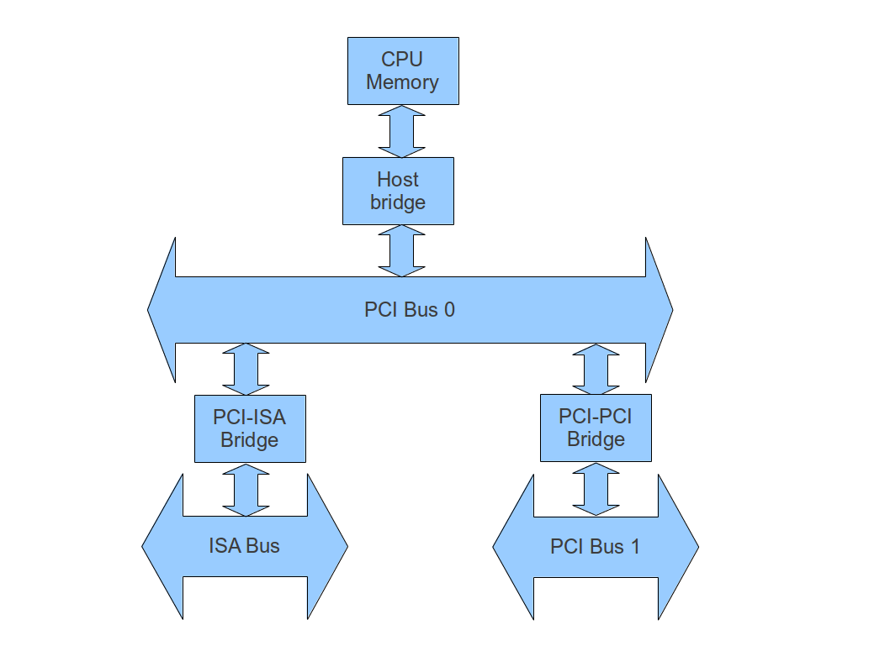

# PCI configuration

## Some background on PCI and how it works

PCI is the abbreviation for **Peripheral component interconnect** and is a standard which specifies physical, electrical and logical characteristic of a bus connecting devices on a PC with each other, the memory and the CPU. 

The PCI standard was developed and pushed into the market in the early nineties, aiming at suceeding the older ISA bus specification. In contrast to the ISA bus, PCI allows devices to communicate over a bus while the CPU is free to do other work. In addition, PCI devices can present their own configuration on the bus to other devices and an operating system, so that the system can configure itself during the startup phase, an ability that was named "Plug and play (PnP)". 

Devices are connected via a **PCI bus*. The bus is connected to the CPU and the memory via a special device called a **PCI Host bridge**. Other types of bridges can be used to connect two PCI busses (PCI-PCI bridge) or to connect a PCI bus with legacy ISA/EISA/MCA busses.

Address and data are multiplexed on the same bus. Each bus transaction consists of an address phase, followed by one or more data phases. A separate 4 bit line is provided for bus commands. Each PCI device has four pins named INTA\#, INTB\#, INTC\# and INTD\# which it uses to raise interrupts.
Essentially, PCI supports three different types of transactions.

-   Read/write in I/O space
-   Read/write in memory space
-   Read/write in configuration space

Here the **configuration space** is a separate address space of 256 bytes which each device on the bus implements and which contains configuration data. System software reads from the configuration space to determine characteristics of the device and writes to the configuration space to set up devices, for instance to assign addresses a device may use.

A special device on the bus, called the arbiter, is responsible for granting access to the bus. Transaction control is implemented via three specific pins called DEVSEL\#, REQ\# and GNT\#. If a device ("master") wants to start a read/write transaction, it asserts its REQ\# pin to request exclusive access. If the arbiter grants access to a device, it asserts the GNT\# pin of the master. The master then initiates a transaction, targeted towards another device ("target"), by writing an address and a command.  Each device on the bus will decode the address and compare it to its own address. If the address matches, the target asserts its DEVSEL\# pin to indicate that it is taking part in the transaction and the data phase starts.

Busses are connected to each other via PCI-PCI bridges. A **bridge** implements two interface by which it is connected to two busses, called the **primary interface** and the **secondary interface**. It will only answer to configuration space transactions via its primary interface, so a bridge only shows up on one bus when scanning the bus for PCI devices. By definition, the bus which is directly connected to the host bridge is numbered 0, all other busses are numbered at system startup by the BIOS.

Once set up, each PCI bridge claims transactions in a certain are of the memory or I/O address space and forwards the transactions to the other bus. This address space is defined via special registers in the PCI bus configuration. A special forwarding mechanism exists for configuration transactions, as these might occur at a point in time when the bridge is not yet set up and these address spaces have not yet been assigned.

Devices on a PCI bus can implement more than one function. Each function implements its own configuration space and is therefore accessible separately from the other functions on the device.  Logically, a unit on the PCI bus is therefore defined by specifying a bus number (0-255), a device number (0-31) and a function number (0-7). By convention, the combination of bus, device and function is often denoted as &lt;bus&gt;:&lt;device&gt;.&lt;function&gt;, so 00:1f.2 is bus 0, device 1f hex and function 1.

## The PCI configuration space

A major advantage of PCI over earlier bus systems like ISA is the PCI configuration mechanism which allow system software to dynamically configure devices at system startup. This is realized by means of a special address space called configuration space.

Each PCI device implements a 256 byte configuration space which can be thought of as 64 registers of width 32 bit or alternatively of 256 registers of width 8 bit. The first 64 bits in this configuration space are standardized, whereas the remaining bytes are device specific.

To access the configuration space, two special registers are mapped into the I/O space of the system. These registers are located at **0xcf8 (configuration address)** and **0xcfc (configuration data)** and are 32 bit registers (so you need to use the inl and outl x86 instructions to access them).
To access a register located at offset x in the PCI configuration space, you first need to build up a special 32 bit address pointer which specifies bus, device and function which you want to access. This pointer is described in the following table:

<table>
<thead>
<tr class="header">
<th>Bits 
</th>
<th>Description 
</th>
</tr>
</thead>
<tbody>
<tr class="odd">
<td>Bit 31 
</td>
<td>Always 1, marks configuration address 
</td>
</tr>
<tr class="even">
<td>Bit 16-23 
</td>
<td>Bus number 
</td>
</tr>
<tr class="odd">
<td>Bit 11-15 
</td>
<td>Device number 
</td>
</tr>
<tr class="even">
<td>Bit 8-10 
</td>
<td>Function number 
</td>
</tr>
<tr class="odd">
<td>Bit 2-7 
</td>
<td>Bits 2-7 of register offset. You can only address registers at 4-byte boundaries, i.e. you read four byte-registers at a time. So if you want to access register 1, you use the offset 0, read 32 bit from that offset and retrieve the content of register 1 as bits 8-15 of this doubleword 
</td>
</tr>
<tr class="even">
<td>Bits 0-1 
</td>
<td>Always 0 
</td>
</tr>
</tbody>
</table>

As mentioned above, access to the configuration space is requested for four registers at a time, i.e. for a range of 4 bytes in configuration space. To access a byte in configuration space, located at the offset 4x+n, the following steps are necessary.

-   build up the address pointer as described in the table above, using offset 4x
-   write this address pointer into the register located at 0xcf8 in I/O space (configuration address register)
-   read 32 bit from the register located at address 0xcfc in I/O space (configuration data register) 
-   out of these 32 bits, extract bits n\*8 to n\*8+7 to retrieve the value of the register at offset 4x+n

The first 64 bytes of the configuration space are standardized. In fact, there are two possible layouts, one for ordinary devices and one for PCI-PCI bridges. The first 7 bits at offset 0xe in configuration space determine which layout applies. They are set to 0x0 for ordinary devices, 0x1 for PCI-PCI bridges and 0x2 for PCI-Cardbus bridges. Bit 7 of this register indicates whether the device is a multifunction device (bit 7 = 1) or not.
The following tables list the most relevant registers for these two layouts.

<table>
<thead>
<tr class="header">
<th>Offset 
</th>
<th>Width 
</th>
<th>Description 
</th>
</tr>
</thead>
<tbody>
<tr class="odd">
<td>0x0 
</td>
<td>2 byte 
</td>
<td>Vendor ID. This is a 16 bit value which uniquely defines the vendor of the device 
</td>
</tr>
<tr class="even">
<td>0x2 
</td>
<td>2 byte 
</td>
<td>Device ID. This 16 bit value identifies the device, but is only unique when combined with the vendor id. 
</td>
</tr>
<tr class="odd">
<td>0x4 
</td>
<td>2 byte 
</td>
<td>Command register. This register contains flags to control, among other things,  access of the device to I/O space and memory space. Some bits in this register are: 
Bit 0: if set, the device has access to the I/O space 
Bit 1: if set, the device has access to the memory space 
Bit 2: if set, the device is able to act as a bus master 
Setting the register to 0 effectively prevents the device from using the bus except for configuration read/writes 
</td>
</tr>
<tr class="even">
<td>0x6 
</td>
<td>2 byte 
</td>
<td>Status register. Contains status information of the device. Bit 4 of this register signals that the configuration contains a capability list. Bit 3 of this register (INTS) indicates whether the interrupt line is asserted 
</td>
</tr>
<tr class="odd">
<td>0x9 
</td>
<td>1 byte 
</td>
<td>Programming interface 
</td>
</tr>
<tr class="even">
<td>0xa 
</td>
<td>1 byte 
</td>
<td>Subclass 
</td>
</tr>
<tr class="odd">
<td>0xb 
</td>
<td>1 byte 
</td>
<td>Base class. Base class, subclass and programming interface together classify devices according to their functionality. For instance, a base class of 0xc, a subclass of 0x3 and a programming interface of 0x20 is a EHCI USB controller, whereas base class 0xc, subclass 0x3 and programming interface 0x30 is a XHCI USB controller 
</td>
</tr>
<tr class="even">
<td>0x3c 
</td>
<td>1 byte 
</td>
<td>Interrupt line. This register contains the information to which ISA IRQ of the legacy PIC the interrupt of this device is mapped. It is not used by the device, but filled by the BIOS at boot time to inform the operating system on the IRQ mapping 
</td>
</tr>
<tr class="odd">
<td>0x3d 
</td>
<td>1 byte 
</td>
<td>Interrupt pin. This is the interrupt pin (1 = INTA#, 2=INTB#, 3=INTC#, 4 = INTD#) used by the device. If the value is 0x0, the device does not raise interrupts via its interrupt pins (but may raise MSI interrupts) 
</td>
</tr>
<tr class="even">
<td>0x34 
</td>
<td>1 byte 
</td>
<td>Capability list pointer. This register points to the first entry in the capability list (see below) 
</td>
</tr>
<tr class="odd">
<td>0x18 
</td>
<td>1 byte 
</td>
<td>Only for PCI-PCI bridges: this register contains the primary bus to which the bridge is connected 
</td>
</tr>
<tr class="even">
<td>0x19 
</td>
<td>1 byte 
</td>
<td>Only for PCI-PCI bridges: this register contains the secondary bus to which the bridge is connected 
</td>
</tr>
</tbody>
</table>

To structure the bytes above offset 63 of the configuration space which are not standardized, a list of so called **capabilities** is used. This is a chained list of areas within configuration space. Each entry starts with one byte containing the ID of the capability. The next byte is a pointer to the next entry in the list, specifying the offset into configuration space at which this entry can be accessed. The remaining entries contain the actual information on the capability. A pointer value of 0x0 indicates that the last element of the list has been reached.

To scan the entire PCI bus system for devices, the following approach can be used

-   start to scan bus 0, i.e. the bus directly connected to the host bridge
-   scan this bus by reading vendor id and device id of all devices on the bus, using all possible combinations of device and function
-   if there is no device with that device number and function number, 0xffff will be returned by the bus system for vendor id and device id
-   Any other value indicates that a device exists for this combination of bus, device and function
-   Use the value of the header type field at offset 0xe to check whether the entry is a bridge or an ordinary device
-   for each bridge found, read the secondary bus number from the configuration space of the bridge and scan this bus as well
-   repeat this procedure until no more bridges are found

## Base address registers

One of the most important features of the PCI bus is the possibility to relocate ports (both I/O and memory mapped) to avoid conflicts. For that purpose, each device (except bridges) contains six so-called **Base Address Registers (BAR)**, each of which specifies one address range in I/O space or memory space claimed by the device. These BARs are 32 bit registers starting at offset 0x010 into the PCI configuration space.

The BAR contains not only the base address of the address range used by the device, but also additional control bits. Its structure depends on whether the BAR specifies an area in memory space or in I/O space.
The following table lists the meaning of the individual bits for memory mapped ranges.

<table>
<thead>
<tr class="header">
<th>Bits 
</th>
<th>Description 
</th>
</tr>
</thead>
<tbody>
<tr class="odd">
<td>0 
</td>
<td>Always zero to indicate mapping into memory space 
</td>
</tr>
<tr class="even">
<td>1-2 
</td>
<td>Specifies whether the range is located in 32 bit address space (value 0x0) or in 64 bit address space (value 0x2). If the range is a 64 bit address range, the upper dword is stored in the subsequent BAR. 
</td>
</tr>
<tr class="odd">
<td>3-31 
</td>
<td>Bits 3-31 of the base address of the range, bits 0-2 of the base address are always zero. In case of 64 bit addresses, this is the lower 32 bit part. 
</td>
</tr>
</tbody>
</table>

For ranges in I/O space, the layout of the register is slightly different. Bit 0 can be used to distinguish between I/O space (bit=1) or memory space (bit=0) areas. For I/O space, the layout is as follows.

<table>
<thead>
<tr class="header">
<th>Bits 
</th>
<th>Description 
</th>
</tr>
</thead>
<tbody>
<tr class="odd">
<td>0 
</td>
<td>Always one to indicate mapping into I/O space 
</td>
</tr>
<tr class="even">
<td>1 
</td>
<td>Reserved 
</td>
</tr>
<tr class="odd">
<td>2-31 
</td>
<td>Bits 2-31 of the base address of the range, bits 0-1 of the base address are always zero. 
</td>
</tr>
</tbody>
</table>

Note that the BARs only contain the base address of the memory ranges, it is not immediately clear what the size of the claimed range is. Instead, devices will usually hardwire the lower bits of the address in the BAR to zero, indicating the size of the address they claim. If, for instance, a device claims 1 MB of memory, it would only use the top 12 bits of the address and hardwire all other bits to zero. Thus, the area it claims in memory will always be aligned at a 1 MB boundary. Upon startup, the BIOS can write 0xffffffff to the BAR and read the value back. This will delivers zeros in the area of the address which is hardwired to zero by the device. In this way, the BIOS can determine the size of memory required by the device.

## Further reading

-   /usr/include/linux/pci\_regs.h
-   /usr/include/linux/pci.h
-   [The Linux documentation project - The Linux Kernel](http://tldp.org/LDP/tlk/dd/pci.html)
-   The device and vendor ID repository at <http://www.pcidatabase.com>

