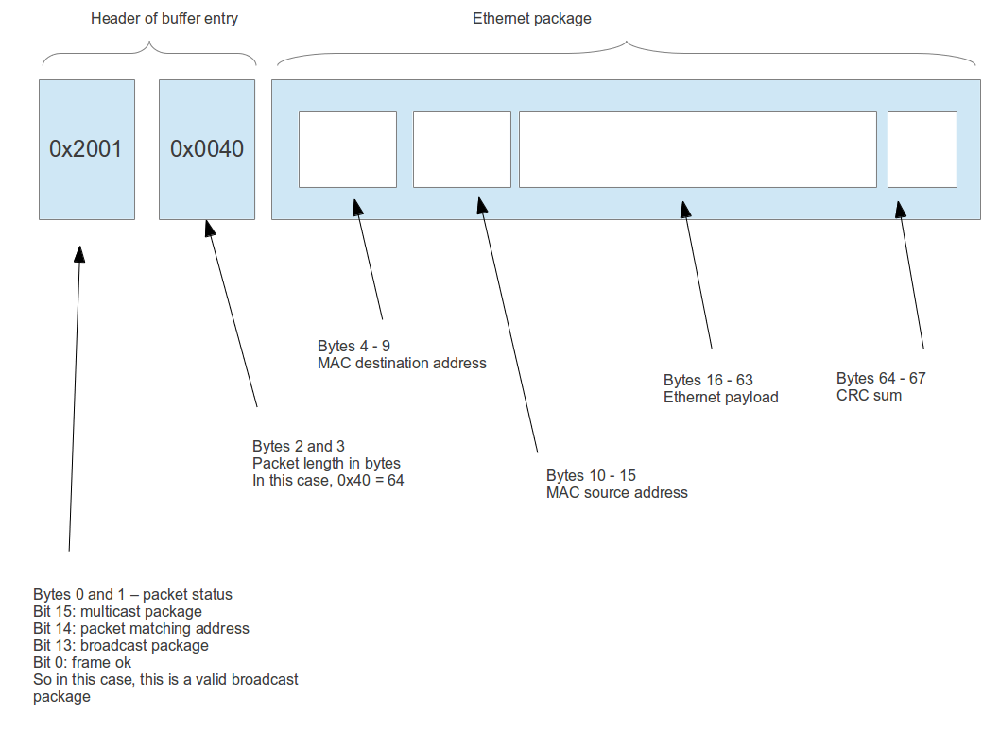
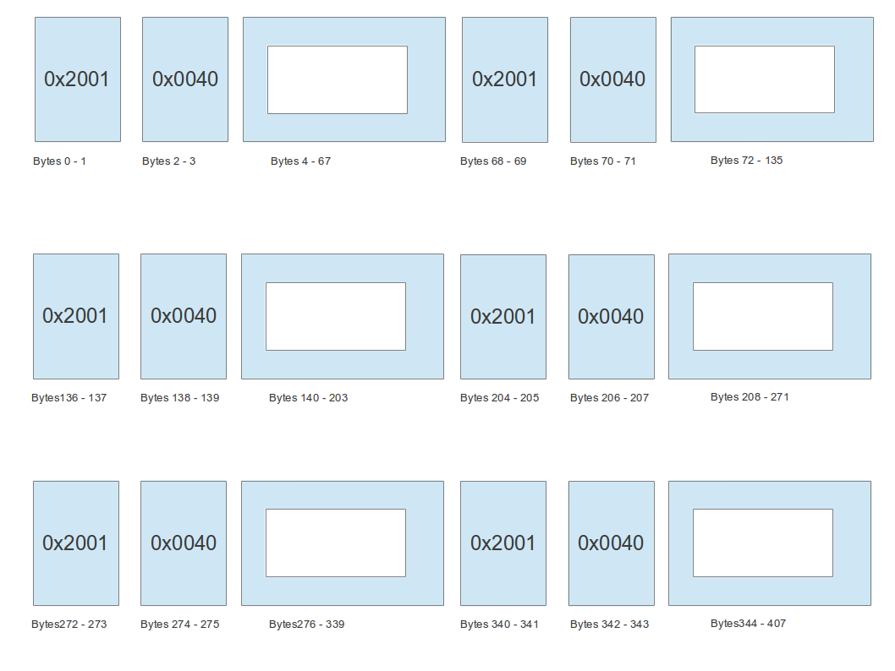
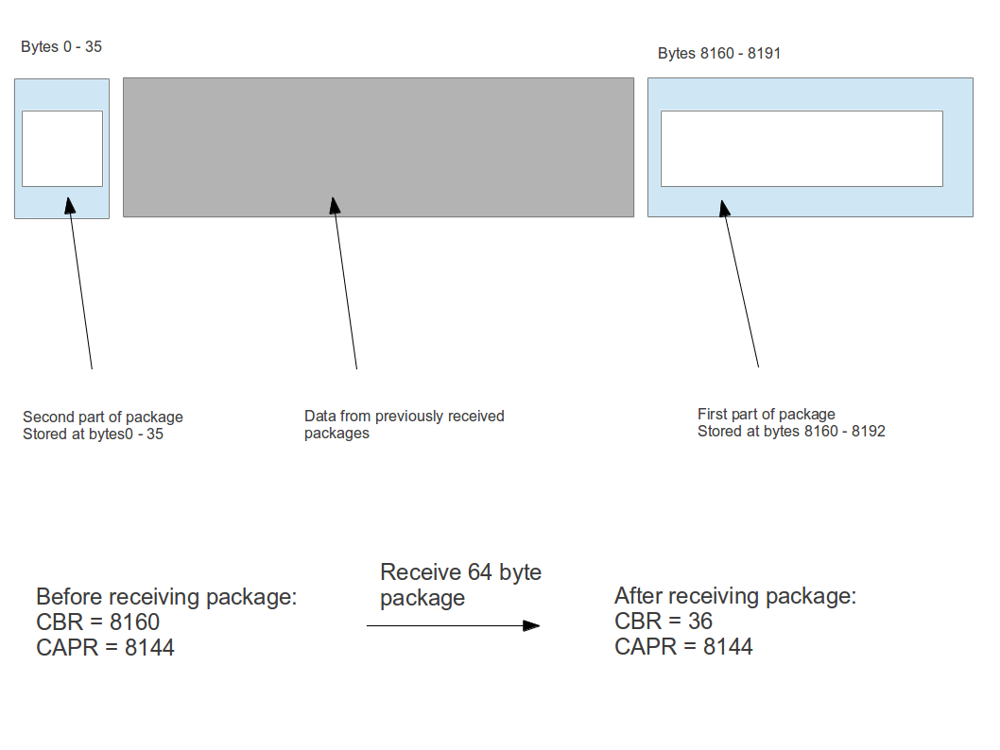

# Using the RTL8139 NIC chipset


## Registers


This section lists some of the registers of the 8139 which are needed for basic operations. These registers are mostly explained in the following sections. All offsets are with respect to the start of the I/O address space which can be determined by parsing BAR0 of the PCI configuration space.

<table>
<thead>
<tr class="header">
<th>Offset (bytes)<br />
</th>
<th>Description<br />
</th>
</tr>
</thead>
<tbody>
<tr class="odd">
<td>0x0<br />
</td>
<td>IDR0 - octet 1 of MAC address<br />
</td>
</tr>
<tr class="even">
<td>0x1<br />
</td>
<td>IDR1 - octet 2 of MAC address<br />
</td>
</tr>
<tr class="odd">
<td>0x2<br />
</td>
<td>IDR2 - octet 3 of MAC address<br />
</td>
</tr>
<tr class="even">
<td>0x3<br />
</td>
<td>IDR3 - octet 4 of MAC address<br />
</td>
</tr>
<tr class="odd">
<td>0x4<br />
</td>
<td>IDR4 - octet 5 of MAC address<br />
</td>
</tr>
<tr class="even">
<td>0x5<br />
</td>
<td>IDR5 - octet 6 of MAC address<br />
</td>
</tr>
<tr class="odd">
<td>0x10 + 4*x<br />
</td>
<td>TSDx - transmission status of descriptor x<br />
</td>
</tr>
<tr class="even">
<td>0x20 + 4*x<br />
</td>
<td>TSADx - transmission address of descriptor x<br />
</td>
</tr>
<tr class="odd">
<td>0x30<br />
</td>
<td>RBSTART - physical start address of receive buffer<br />
</td>
</tr>
<tr class="even">
<td>0x37<br />
</td>
<td>Command register CR. Relevant bits are:<br />
Bit 4 (RST) - software reset<br />
</td>
</tr>
<tr class="odd">
<td>0x38<br />
</td>
<td>CAPR - current address read<br />
</td>
</tr>
<tr class="even">
<td>0x3a<br />
</td>
<td>CBR - current buffer address<br />
</td>
</tr>
<tr class="odd">
<td>0x3c<br />
</td>
<td>IMR - interrupt mask register<br />
</td>
</tr>
<tr class="even">
<td>0x3e<br />
</td>
<td>ISR - interrupt status register<br />
</td>
</tr>
<tr class="odd">
<td>0x40<br />
</td>
<td>TCR - transmission configuration register<br />
</td>
</tr>
<tr class="even">
<td>ßx44<br />
</td>
<td>RCR - receive configuration register<br />
</td>
</tr>
</tbody>
</table>

Sending data
------------

To send data, four different buffers are used. Each buffer x (x = 0,1,2,3) is associated with a descriptor which in turn consists of two registers, called TSDx and TSADx. The first register TSDx is the transmission status of descriptor x. It contains status information about the packet that was last sent using the descriptor. The second register, TSADx, contains the physical start address of the associated buffer in memory.

It is important that all four descriptors are used in a round-robin fashion. So if the first packet is sent using descriptor 0, the next packet uses descriptor 1 and so forth.

To send a packet, the following steps are necessary.

1.  Determine the number x (x = 0,1,2,3) of the descriptor to use
2.  allocate system memory large enough to hold the packet and store the packet there. Note that the packet needs to include the 14 byte Ethernet header (destination MAC address, source MAC address, Ethertype), but that the card will usually append the CRC checksum itself, depending on the content of the TCR (see below)
3.  set TSADx to the physical start address of the buffer
4.  Write the length of the buffer to TSDx. Note that the length must not exceed 0x700h

Bit 13 in the TSDx register is called the OWN flag. When a driver writes the length of the buffer to TSDx, this bit is cleared as part of the write operation (as the buffer length must not exceed 0x700). The hardware will set this bit once the transmission of the packet from system memory to its internal FIFO has been completed. It will then update bits bits 30 (TABT), 14 (TUN) and bits 15 (TOK) of the register. If bit TOK is set, the packet has been successfully transmitted. If bit TUN is set, a FIFO underrun occurred during transmission. However, this does not imply that the package has not been sent as the network card is able to retransmit if this happens. Bit TABT indicates that the transmission has been aborted.

If the packet has been sent, the card will raise an interrupt and will set either the TOK bit in the Interrupt status register ISR (bit 2) to signal successful delivery or the TER bit (bit 3) which indicates that the transmission was aborted.

To manage the descriptors, the drivers thus has to maintain two counters

```
tx_sent
tx_queued
```

Initially, both counters are zero. When a package has been written to a descriptor, tx\_queued is incremented by one. When an interrupt is raised signalling that a package has been sent, tx\_sent is incremented by one. Thus tx\_queued - tx\_sent is the number of descriptors currently in use.

When the driver needs to send packages, it first needs to check whether any free descriptors are available, i.e. whether tx\_queued - tx\_sent &lt; 4. If not, it waits on a condition variable until the interrupt handler signals that a descriptor is available. It then uses the descriptor tx\_queued % 4 for the next package and increases tx\_queued when it is done.

Thus we have the following pseudo-code for sending a package and the interrupt handler.

__Send package__

```
Get tx_lock
WHILE (tx_queued - tx_sent >= 4) DO
  wait on condition variable using tx_lock
DONE
x = tx_queued % 4
make sure that TSADx points to physical start address of package buffer
write length of buffer to TSDx, thereby setting bit 13 to zero
wait until bit 13 of TSDx is set
tx_queued++;
release tx_lock
```

  
__Interrupt handler__

```
Get tx_lock
entry = tx_sent
WHILE (entry < tx_queued)  DO
  read TSD for descriptor entry % 4
  IF none of the bits TOK, TUN, TABT is set THEN
    leave while loop as we reached the first unprocessed descriptor
  END IF
  entry++;
DONE
tx_sent = entry;
do broadcast on condition variable
Release tx_lock
```

Note that the interrupt handler should only be invoked if one of the bits TER (bit 3) or TOK (bit 2) in the ISR register are set, indicating that either the packages has been sent or the package could not be sent due to too many collisions.

The transmission of packets to the network is controlled by the transmission configuration register (TCR), which needs to be set up before the first package is sent. This register is defined as follows.

<table>
<thead>
<tr class="header">
<th>Bit in TCR<br />
</th>
<th>Description<br />
</th>
</tr>
</thead>
<tbody>
<tr class="odd">
<td>Bit 31<br />
</td>
<td>Reserved<br />
</td>
</tr>
<tr class="even">
<td>Bits 26 - 30<br />
</td>
<td>These bits encode the different models within the 8139 series and are read only<br />
</td>
</tr>
<tr class="odd">
<td>Bits 24 - 25<br />
</td>
<td>These bits determine the Inter Frame Time Gap. Setting these bits to 11 forces the card to use the IEEE standard value, other bits can be used to set lower values<br />
</td>
</tr>
<tr class="even">
<td>Bits 19 - 24<br />
</td>
<td>Read only / reserved<br />
</td>
</tr>
<tr class="odd">
<td>Bits 17 - 18<br />
</td>
<td>Loopback test. Setting this to 11 enters loopback mode where no frames are actually emitted. In normal operations, this should be set to 00<br />
</td>
</tr>
<tr class="even">
<td>Bit 16<br />
</td>
<td>Append CRC. Usually, the card will append CRC bytes automatically to each send packet. Setting this bit to 1 will suppress these CRC sums<br />
</td>
</tr>
<tr class="odd">
<td>Bits 11 - 15<br />
</td>
<td>Reserved<br />
</td>
</tr>
<tr class="even">
<td>Bits 8 - 10<br />
</td>
<td>Maximum size of a DMA burst, computed as 16 &lt;&lt; (3-bit value of Bits 8 - 10)<br />
</td>
</tr>
<tr class="odd">
<td>Bits 4 - 7<br />
</td>
<td>Transaction retry count. This field can be used to specificy how many retries the card will perform in the case of collisions on the line. Setting this to 0 enables the IEEE standard value of 16<br />
</td>
</tr>
<tr class="even">
<td>Bits 1 - 3<br />
</td>
<td>Reserved<br />
</td>
</tr>
<tr class="odd">
<td>Bit 0<br />
</td>
<td>Clear abort. Setting this bit to one will force a retransmit of the last package if the transmission was aborted<br />
</td>
</tr>
</tbody>
</table>

Receiving data
--------------

Data received by the network card is stored in a fixed area of memory which is organized as a ring buffer. Each Ethernet package stored in this ring buffer is preceded by two words which are added by the card. The first word is a status word which contains the information about how the packet has been received. The most important bits in this status field are

* Bit 15: multicast package
* Bit 14: packet accepted because its destination MAC address matches the MAC address of the card
* Bit 13: broadcast package
* Bit 4: set if a package of less than the minimum size of 64 bytes has been received ("runt package")
* Bit 3: Long packet - this bit is set if the size of the received packet exceeds 4 kB
* Bit 2: CRC error
* Bit 1: Frame alignment error
* Bit 0: frame  received and stored without errors

The next word is the length of the actual package,  including the CRC checksum of the Ethernet package. After this word, the actual data is stored.

The operation of the ring buffer is controlled by four register: the RBSTART register, the CAPR register, the CBR register and the RCR register.

The RBSTART register (Rx Buffer Start Address) contains the physical address of the ring buffer. It needs to be set during the initialization of the card and should obviously not be changed while the receiver is enabled.

The CBR (Current Buffer Address) register contains the number of bytes already written to the ring buffer modulo the size of the ring buffer, i.e. the tail of the buffer. Initially, the register is 0 so that the first package is written to this location. This register can only be read but never be written to by software.

The CAPR register points to the first byte within the ring buffer which as not yet been read by the driver. It needs to be updated by the driver to signal to the card that data in the ring buffer has been read and can be overwritten. This register is actually owned by the driver and - after initialization - never changed by the hardware.

For some strange reason, CAPR does not really contain the address of the first byte not yet read. Instead, it contains this address minus 16. So initially, CAPR is not 0 but 65520, which is the maximum value minus 16. This offset of 16 seems to be well known (it is reflected in the QEMU source code rtl8139.c for the emulated NIC, in the Linux driver source code 8139too.c and in the RTL 8139 programming guide), but I have not been able to find any real explanation for this offset.
Consequently, the buffer is considered empty by the card if CAPR + 16 == CBR mod the size of the ring buffer. In fact, there is a bit called BUFE (buffer empty) in the comand register CR which is set if and only if this condition is fulfilled and signals that the buffer is empty.
Finally, the RCR (Receive Configuration register) needs to be written to during initialization and defines the setup of the ring buffer and the cards receive engine. The relevant bits of this register are defined as follows

<table>
<thead>
<tr class="header">
<th>Bit in RCR<br />
</th>
<th>Description<br />
</th>
</tr>
</thead>
<tbody>
<tr class="odd">
<td>Bits 24 - 27<br />
</td>
<td>Used to set up the early receive mode. In this mode, the card will raise an interrupt already when a part of the package has been received and transferred into the ring buffer. Set this to 000 to turn off early receive mode<br />
</td>
</tr>
<tr class="even">
<td>Bit 17<br />
</td>
<td>Used with early receive mode, set this to 0 if early receive mode is not used<br />
</td>
</tr>
<tr class="odd">
<td>Bits 13 - 15<br />
</td>
<td>Rx Threshold level. When the number of bytes in the internal receive FIFO of the network card has reached this threshold, the card will start to transfer data to the ring buffer in system memory. The treshold is computed as 16 &lt;&lt; (bits 13 - 15)<br />
</td>
</tr>
<tr class="even">
<td>Bits 11 - 12<br />
</td>
<td>These bits indicate the size of the receive buffer. The receive buffer size is computed as 8192 &lt;&lt; (bits 11- 12). Note that the driver should allocate 16 additional bits at the end of the receive buffer<br />
</td>
</tr>
<tr class="odd">
<td>Bits 8 - 10<br />
</td>
<td>Maximum size of a DMA burst. 111 means unlimited<br />
</td>
</tr>
<tr class="even">
<td>Bit 7<br />
</td>
<td>Wrap. If this bit is set, the network card will NOT wrap a packet starting near the end of the ring buffer, instead it will continue to write the packet into up to 1500 bytes following the ring buffer<br />
</td>
</tr>
<tr class="odd">
<td>Bit 3<br />
</td>
<td>Accept broadcast packets<br />
</td>
</tr>
<tr class="even">
<td>Bit 2<br />
</td>
<td>Accept multicast packets<br />
</td>
</tr>
<tr class="odd">
<td>Bit 1<br />
</td>
<td>Accept packets whose destination address matches the own MAC address<br />
</td>
</tr>
<tr class="even">
<td>Bit 0<br />
</td>
<td>Accept all packages<br />
</td>
</tr>
</tbody>
</table>

To understand how exactly the ring buffer works, let us look at a few examples and analyze the data within the ring buffer. First, suppose that after initializing, we receive a single Ethernet packet. Assume that the size of the package (including the checksum) is 64 bytes. Before we receive the packet, the ring buffer is in its initial state, i.e.

```
CAPR = 65520
CBR = 0
BUFE = 1
```

When the packet arrives, the netword card first places a four byte header in the ring buffer. The first two bytes contain a status, the next two bytes contain the length of the packet (including the CRC sum). Then the actual packet is copied to the next 64 bytes of the ring buffer.



At this point, CAPR is still 65520 as this register is never manipulated by the hardware, only be the driver. However, CBR has been updated by the hardware and is now 68, marking bytes 0 - 67 of the buffer as used. The driver now needs to read the data and update its own internal pointer into the ring buffer to 68. It then needs to write 68 - 16 into CAPR (note the mysterious 16 byte offset again). Then the difference of CAPR and CBR  will again by 16, thus that the hardware considers the buffer as empty. Consequently, BUFE will now be one upon the next read from the status register. Thus

```
CAPR = 52
CBR = 68
BUFE = 1
```

Note that it might also happen that when an interrupt is raised, multiple packets are in the ring buffer and ready to be read. The picture below shows the layout of the ring buffer after receiving 5 packets. Initially, CABR was 65520 as in the previous example. When the interrupt was raised, CBR was 408. After reading the first packet, CAPR is updated to 52. However, this time BUFE remains zero. Thus the driver needs to continue to read data until all packages have been read.



After each read, CAPR is updated until the final and last update sets CAPR to 392 (408 - 16). Then BUFE is reset to 1 by the hardware and the read loop stops.

Finally, let us look at an example where the data in the ring buffer wraps around. Suppose that a ring buffer of size 8192 bytes is already almost filled up so that CBR = 8160 and CAPR = 8144. As the difference is 16 again, the buffer is considered empty. When an Ethernet packet arrives, the NIC will start to place the ring buffer header (status and length) followed by the actual Ethernet packet at offset 8160 in the ring buffer After writing the first 32 bytes, the offset reaches 8192 and the ring buffer wraps around. The remaining 36 bytes of the 68 bytes (64 bytes packet including CRC and 4 bytes ring buffer header) will now be stored at the beginning of the ring buffer, i.e. at bytes 0 - 3.



With this understanding of ring buffer operations, we can now design the interrupt handler for incoming packets. To keep track of the position within the ring buffer, the driver maintains a counter rx\_read which counts the number of bytes received and read by the driver and is initially zero. The algorithm used by the interrupt handler is as follows.

```
Get lock rx_lock
WHILE (0 == BUFE bit in register CR) DO
  cursor = rx_read
  Read 4 bytes ring buffer header from ring buffer, starting at position cursor, and increment cursor after each byte has been read
  Extract length from ring buffer header 
  Read Ethernet package from ring buffer (ignoring the CRC sum) and increment cursor after each byte read
  Forward Ethernet package to protocol stack
  Increment cursor by 4 to account for CRC sum
  Re-align cursor to dword boundary
  Write cursor - 16 back to CAPR
  rx_read = cursor
DONE
release lock
```

This interrupt handler can be used to handle correctly received packets (bit 0 - TOK in ISR) as well as receive buffer overflows (bit 4 - RXOVW in ISR).

## Initialization

The first step to initialize the 8139 chip is to read the PCI configuration space. To identify the chipset, the PCI Vendor ID of Realtek (0x10ec) and the device ID 0x8139 can be used. Once the chipset has been detected, BAR0 of the PCI configuration space can be used to determine the start address of the register space in I/O space. The PCI setup code also needs to make sure that the device operates in DMA bus mastering mode, if that has not yet been done by the BIOS.

Once the device has been detected, its MAC address can be determined by reading the registers IDR0 - IDR5.

Next the device needs to be reset. This is done by setting bit 4 (RST) to 1. Once the reset is completed, the bit is set to 0 by the hardware, so the driver should wait for this bit to clear before proceeding.

Then the engines for receiving and transmitting packages can be set up and started.  To do this, the TCR and RCR registers have to be set up first as explained above. In addition, the address of the receive buffer needs to be stored in the RBSTART register. Then the engines can be started by settings the bits TE (transmit engine, bit 2) and RE (receive engine, bit 3) bits in the command register CR.
Finally, the interrupt mask register IMR should be set up as 0xFFFF to enable all interrupts.

## MII and PHY control

The 8139 is able to operate in two different modes. In MII mode, an external physical layer controller (PHY) is used which communicates with the chip via the MII / MDIO standard (IEEE 802.3, section 2). In the so called UTP mode,  the internal PHY is used. The mode can be controlled by the medium control bits in the basic mode status register (BMSR), bits 6 -7. The default is 00b for "auto-detect".

If the device is operated in UTP mode, the chipset offers a set of registers which implement a subset of the MII management interface. These registers can be read and written to detect and control link status, speed, duplex mode and autonegotation. The two most relevant registers for this purpose are the BMCR register (basic mode control register) at offset 0x62 and the BMSR register (basic mode status register) at offset 0x64. The following table lists
the most relevant bits of these two registers.

<table>
<thead>
<tr class="header">
<th>Register<br />
</th>
<th>Bits<br />
</th>
<th>Description<br />
</th>
</tr>
</thead>
<tbody>
<tr class="odd">
<td>BMCR<br />
</td>
<td>15<br />
</td>
<td>Reset PHY. Set this bit to 1 and wait until it clears again to force a reset of the PHY layer<br />
</td>
</tr>
<tr class="even">
<td>BMCR<br />
</td>
<td>13<br />
</td>
<td>Speed Set. This bit can be set to force 100 MBps if auto-negotiation is not enabled<br />
</td>
</tr>
<tr class="odd">
<td>BMCR<br />
</td>
<td>12<br />
</td>
<td>Enable auto-negotiation<br />
</td>
</tr>
<tr class="even">
<td>BMCR<br />
</td>
<td>9<br />
</td>
<td>Set this bit to restart auto-negotiation<br />
</td>
</tr>
<tr class="odd">
<td>BMCR<br />
</td>
<td>8<br />
</td>
<td>Duplex mode<br />
</td>
</tr>
<tr class="even">
<td>BMSR<br />
</td>
<td>15<br />
</td>
<td>100BASE-T4 supported (read only)<br />
</td>
</tr>
<tr class="odd">
<td>BMSR<br />
</td>
<td>14<br />
</td>
<td>100BASE-X full-duplex supported (read only)<br />
</td>
</tr>
<tr class="even">
<td>BMSR<br />
</td>
<td>13<br />
</td>
<td>100BASE-X half-duplex supported (read only)<br />
</td>
</tr>
<tr class="odd">
<td>BMSR<br />
</td>
<td>12<br />
</td>
<td>10 MB/s in full-duplex mode supported (read only)<br />
</td>
</tr>
<tr class="even">
<td>BMSR<br />
</td>
<td>11<br />
</td>
<td>10 MB/s in half-duplex mode supported (read only)<br />
</td>
</tr>
<tr class="odd">
<td>BMSR<br />
</td>
<td>6 - 7<br />
</td>
<td>Medium select. 00b = auto-detect, 10b = MII, 01b = UTP<br />
</td>
</tr>
<tr class="even">
<td>BMSR<br />
</td>
<td>5<br />
</td>
<td>Auto-negotiation process completed<br />
</td>
</tr>
<tr class="odd">
<td>BMSR<br />
</td>
<td>2<br />
</td>
<td>Link established<br />
</td>
</tr>
</tbody>
</table>


