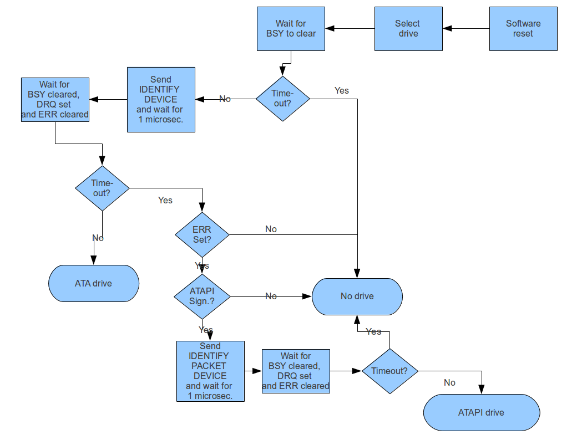
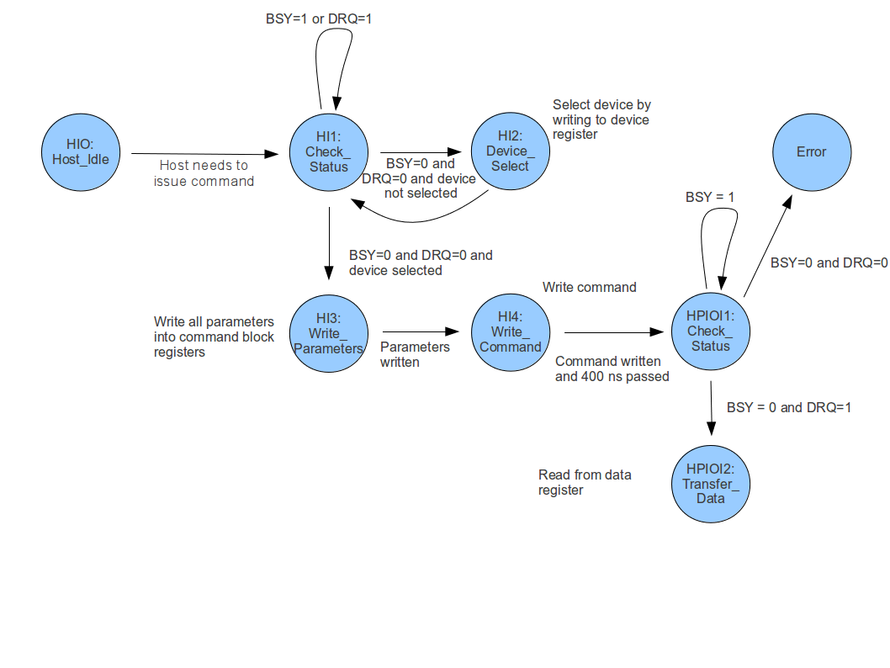
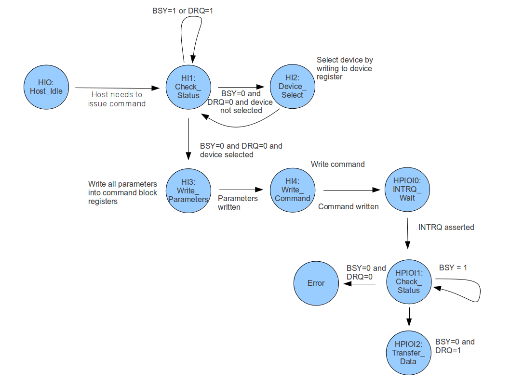
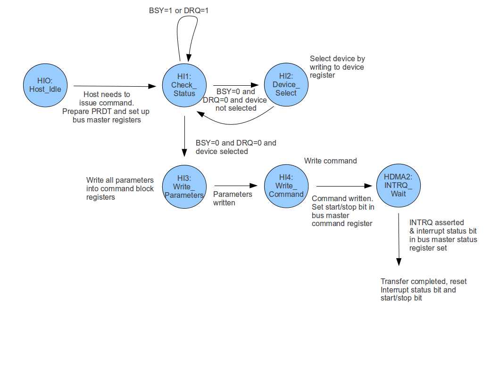
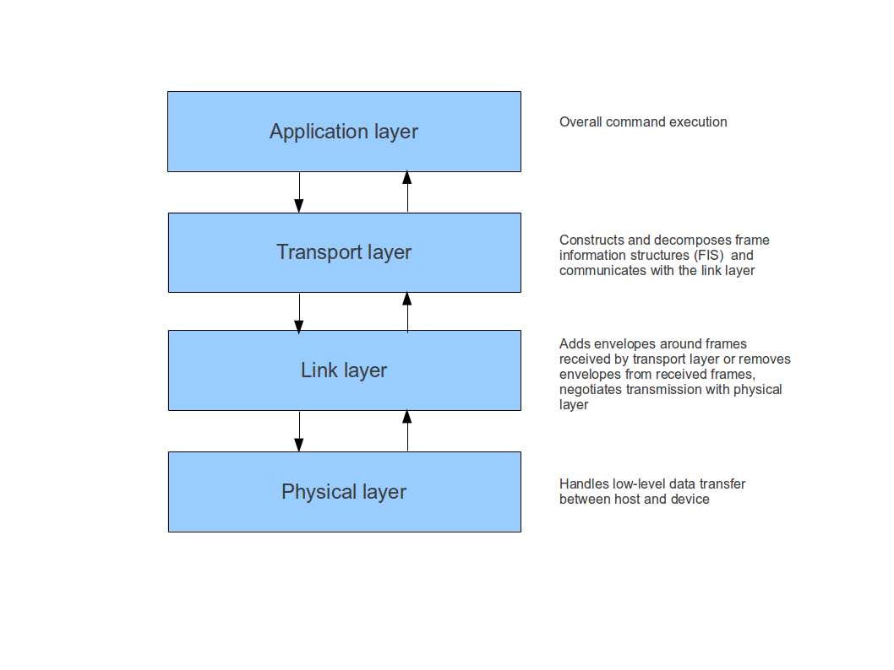
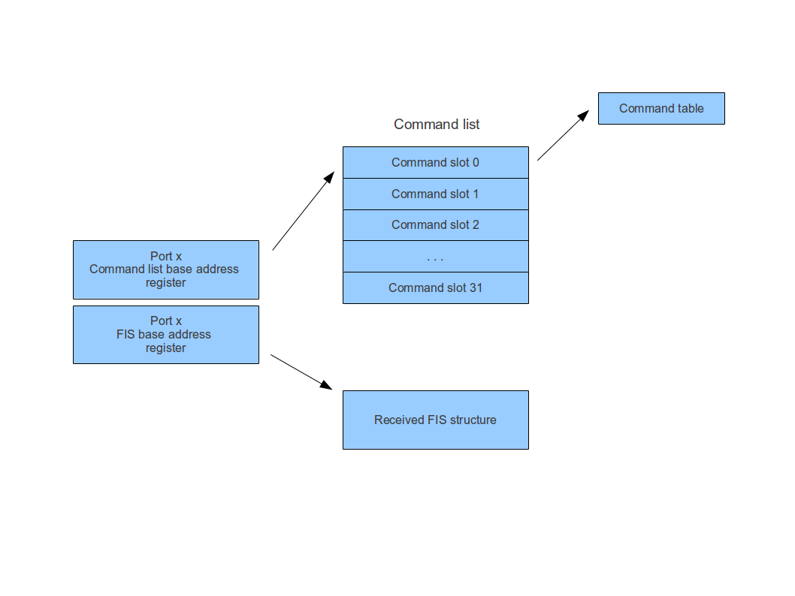
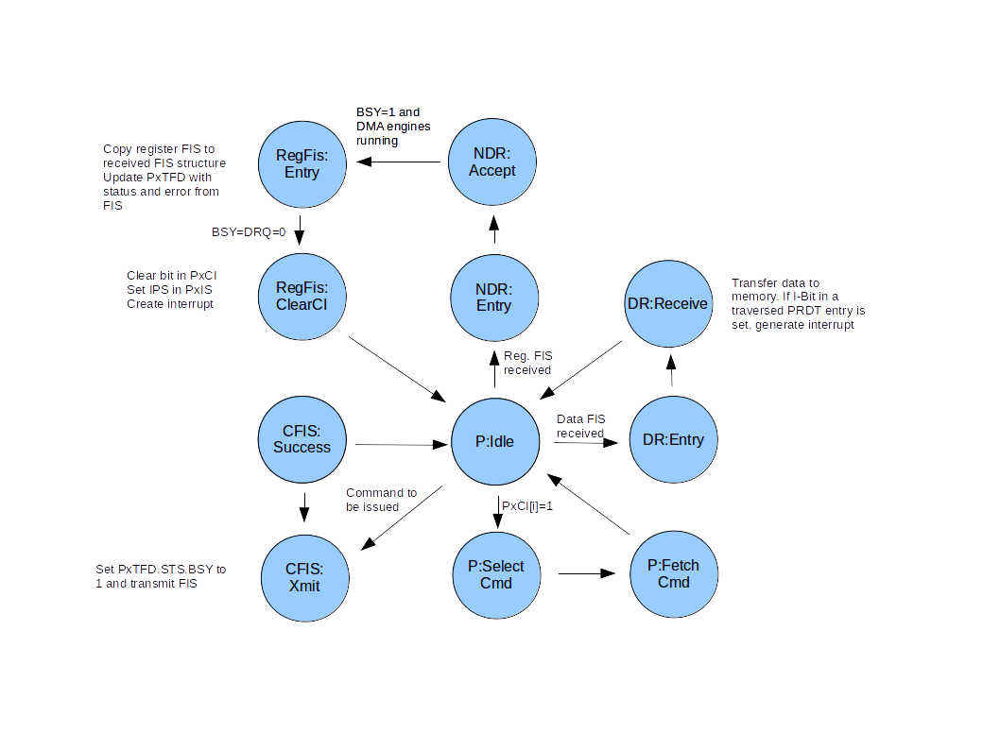
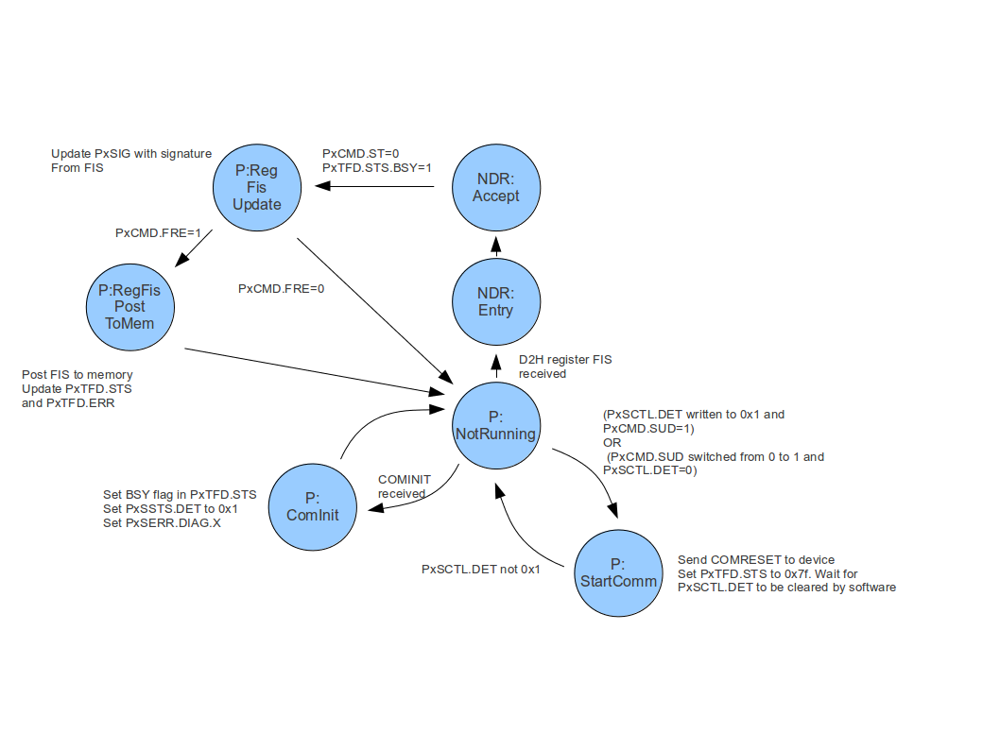
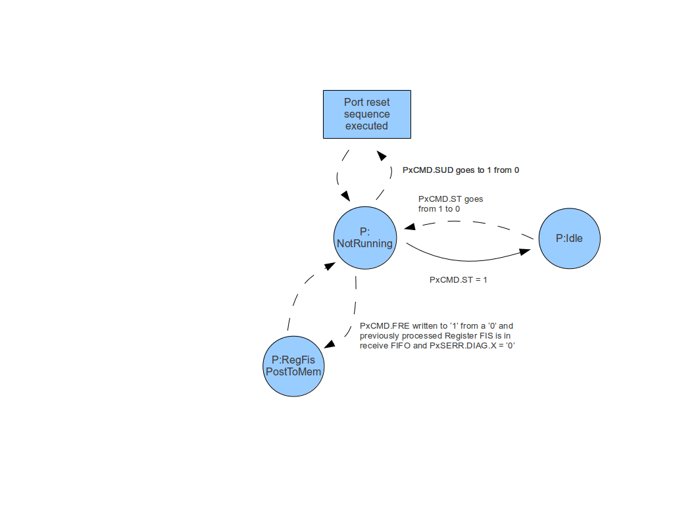

# IDE, SATA and all that

Even though the IDE/ATA parallel interface is about to vanish in modern PCs in favour of the more advance Serial ATA (SATA) technology, the IDE/ATA programming interface, more precisely the register model and the ATA commands, are still relevant, for a couple of reasons

-   SATA specific protocols like AHCI still resemble somehow the IDE programming model and use a very similar structure
-   most SATA controllers still can operate in a legacy mode, in which they appear to the host to be an IDE controller, even though they use the SATA protocol to communicate with the drive

Therefore we will recall some basics on the IDE/ATA specification from a programmers point of view in this section and explain how IDE devices can be accessed.

An IDE controller manages two **channels** to which drives can be connected. These channels are called primary and secondary channel. To each channel, up to two drives can be connected, which are called **master** and **slave**. So in total an IDE controller can take care for up to four drives (even though there are controllers around that offer four channels in total and thus can control eight drives).

While the two channels can be accessed individually via two separated sets of command and control registers, the two devices connected to one channel cannot be accessed at the same time. Instead, a device has to be selected when a command is executed, so that each command refers to either master or slave.

There are two ways to transfer data to and from the controller. In **PIO mode** (programmed I/O), data is transferred by the CPU by reading data from I/O ports of the controller and writing them to memory and vice versa. In **DMA mode**, the data is transferred directly between the memory and the controller (either by a DMA controller or by the controller itself).

In this document, we will not consider the ATAPI protocol, which is for instance used for CD-ROM devices.

## The register set

The controller communicates with the host via two register sets. The first register set is called **command block registers**. It contains the following eight registers. All registers are 8 bit wide, except the data register, which is 16 bit wide. The following table lists these registers together with their offset to the start of the command block in I/O space.

<table>
<thead>
<tr class="header">
<th>Register<br />
</th>
<th>Offset<br />
</th>
<th>Description<br />
</th>
</tr>
</thead>
<tbody>
<tr class="odd">
<td>Data register<br />
</td>
<td>0x0<br />
</td>
<td>Contains data to be exchanged with the device<br />
</td>
</tr>
<tr class="even">
<td>Sector count<br />
</td>
<td>0x2<br />
</td>
<td>Command dependent<br />
</td>
</tr>
<tr class="odd">
<td>LBA low<br />
</td>
<td>0x3<br />
</td>
<td>Contains the lower part of the LBA address of a sector<br />
</td>
</tr>
<tr class="even">
<td>LBA mid<br />
</td>
<td>0x4<br />
</td>
<td>Contains the middle part of the LBA address of a sector<br />
</td>
</tr>
<tr class="odd">
<td>LBA high<br />
</td>
<td>0x5<br />
</td>
<td>Contains the upper part of the LBA address of a sector<br />
</td>
</tr>
<tr class="even">
<td>Device<br />
</td>
<td>0x6<br />
</td>
<td>Bit 4 of this register is used to select the device, all other bits are command dependent<br />
</td>
</tr>
<tr class="odd">
<td>Command/status register<br />
</td>
<td>0x7<br />
</td>
<td>Use to send commands to the device and to receive status information<br />
</td>
</tr>
<tr class="even">
<td>Error/Features<br />
</td>
<td>0x1<br />
</td>
<td>Used to receive error codes from the device and to set features<br />
</td>
</tr>
</tbody>
</table>


The second block of registers is called **control block registers**. It contains only one registers which is called Alternate Status register/Device Control register. On read, it provides the alternate status, on write, it acts as the device control register. This register is located at offset 0x6 to the base of the control block I/O space area.

Let us now go through some of these registers and briefly describe their contents.

__Command and status register__

The Command/Status register is a combined 8 bit register which acts as command register upon write and as status register upon read. The command register is used to send commands to the device. Writing to this register will clear any pending interrupts and start command execution. We will look at some of the available commands later.

When being read, this register acts as status register. Reading from this register will clear any pending interrupts, so the host should use the alternate status register which follows the same semantics while it expects interrupts from the device. The following table explains the individual bits of this register.

<table>
<thead>
<tr class="header">
<th>Bit<br />
</th>
<th>Description<br />
</th>
</tr>
</thead>
<tbody>
<tr class="odd">
<td>7<br />
</td>
<td>BSY (Busy). If this bit is set to one, it indicates that the device is busy. The host should never write any commands to the command register if this bit is set<br />
</td>
</tr>
<tr class="even">
<td>6<br />
</td>
<td>DRDY. This bit indicates that the device has completed its power-on cycle, hardware reset or software reset.<br />
</td>
</tr>
<tr class="odd">
<td>4-5<br />
</td>
<td>Depending on command<br />
</td>
</tr>
<tr class="even">
<td>3<br />
</td>
<td>DRQ. This bit indicates that the device is ready to transfer data to the host or is waiting for data from the host<br />
</td>
</tr>
<tr class="odd">
<td>1-2<br />
</td>
<td>Obsolete<br />
</td>
</tr>
<tr class="even">
<td>0<br />
</td>
<td>ERR. This bit indicates that an error occured during execution of a command<br />
</td>
</tr>
</tbody>
</table>

__LBA registers__

Since 1994, LBA addressing mode is the standard for ATA/IDE interfaces. LBA addressing means that the device appears as a sequence of sectors, each of which is 512 bytes long (regardless of the actual geometry of the disk). The first sector is sector 0, the highest sector is (using 28 bit LBA) FFFFFFF.

To specify a sector, the IDE controller has three LBA registers, each being 8 bit wide. LBA low (bits 0-7 of LBA), LBA mid (bits 8-15 of the LBA) and LBA high (bits 16-23 of the LBA). The remaining bits 24-27 are stored in the device register (called head number there, though it has nothing to do any more with the head in the older cylinder/head/sector addressing scheme).

__Device register__

This register is used to select the device and the head number.

<table>
<thead>
<tr class="header">
<th>Bit(s)<br />
</th>
<th>Description<br />
</th>
</tr>
</thead>
<tbody>
<tr class="odd">
<td>0-3<br />
</td>
<td>Bits 24-27 of LBA in LBA mode<br />
</td>
</tr>
<tr class="even">
<td>4<br />
</td>
<td>Master slave bit. 0=master, 1=slave<br />
</td>
</tr>
<tr class="odd">
<td>5<br />
</td>
<td>Obsolete, should always be 1<br />
</td>
</tr>
<tr class="even">
<td>6<br />
</td>
<td>Choose between LBA addressing (1) and CHS addressing (0), should nowadays always be 1<br />
</td>
</tr>
<tr class="odd">
<td>7<br />
</td>
<td>obsolete, should always be 1<br />
</td>
</tr>
</tbody>
</table>

__Sector count register__

This register specifies the number of sectors to be read and written during an I/O operation.  It is 8 bit wide, i.e. at most 256 sectors can be accessed per operation.

__Device control register__

The most relevant bit in this register is bit 1. If this bit is set to 1, the drive will not issue an interrupt when an operation has been completed. Other bits in this register are used for a software reset and for the 48 bit LBA mode.

## Commands

The following table summarizes some of the commands available in the ATA command set. The usage of these commands is explained in the following sections.

<table>
<thead>
<tr class="header">
<th>Command code<br />
</th>
<th>Command name<br />
</th>
</tr>
</thead>
<tbody>
<tr class="odd">
<td>0xec<br />
</td>
<td>IDENTIFY DEVICE<br />
</td>
</tr>
<tr class="even">
<td>0xa1<br />
</td>
<td>IDENTIFY PACKET DEVICE<br />
</td>
</tr>
<tr class="odd">
<td>0x20<br />
</td>
<td>READ SECTORS<br />
</td>
</tr>
<tr class="even">
<td>0xc8<br />
</td>
<td>READ DMA<br />
</td>
</tr>
<tr class="odd">
<td>0xca<br />
</td>
<td>WRITE DMA<br />
</td>
</tr>
</tbody>
</table>

### Doing a software reset

A software reset is applied to primary or secondary channel of a controller and effectively sets back the channels registers and the devices to a known state. To execute a software reset, the bit SRST (bit 2) in the device control / alternate status register can be used. To reset, the host has to set this bit to one, wait for at least 5 microseconds, clear the bit again, wait for 2 milliseconds and then start polling the status register until the BSY bit is cleared.

Note that a software reset might take some time - on my older PC, for instance, I used to get a timeout at this point if waiting for less than one second to complete.

A software reset should be done at the initial setup of a drive and before probing the channel for attached drives. As the device control register also contains the nIEN bit (bit 1 of the register) which controls whether an interrupt is issued (bit set to 0) or not (bit set to 1) when a command completes, doing a software reset is also a good point in time to set this flag as needed.


### Identify Device

The command IDENTIFY DEVICE (0xec) is used to read characteristics of an attached drive. When the command is sent to a device, it will provide 512 bytes of data as 256 words which can be read by reading the data register 256 bytes. This command is usually issued after a software reset to retrieve the characteristics of the device.
To use this command, the host needs to conform to the following protocol (assuming that we have turned off interrupts by setting nIEN in the device register to 1)

1.  Select the device by writing to the device register
2.  Wait until the BSY bit in the status register and the DRQ bit in the status register are both cleared
3.  Write the command 0xec to the command/status register
4.  Wait for 400 ns
5.  Start to poll the status register until BSY=0 and DRQ=1
6.  Read 256 words from the data register

Steps 1-3 are characteristic steps which need to be executed by the host any time before a command is issued. 

The ATA/ATAPI specification uses state diagrams to describe the handshake between host and device. In the terminology of these state diagrams, steps 1-3 are called the bus idle protocol and take the host from the state "HI0: Host_idle" via the states "HI2: Device_Select" (step 1) to the state "HI4: Write\_Command".

Steps 4 to 6 follow the PIO data-in command protocol and take the host from the state "HI4: Write_Command" via "HPIO1: Check_Status" reached after step 4 to "HPIO12: Transfer_Data" in step 6 back to the state "HI0: Host_Idle".
Here is a list of the most relevant bits of information returned by the IDENTIFY DEVICE command.

<table>
<thead>
<tr class="header">
<th>Location of data<br />
</th>
<th>Description<br />
</th>
</tr>
</thead>
<tbody>
<tr class="odd">
<td>Words 10-19 (20 bytes)<br />
</td>
<td>Serial number as a 20 character string<br />
</td>
</tr>
<tr class="even">
<td>Words 27-46 (40 bytes)<br />
</td>
<td>Model number as a 40 character string<br />
</td>
</tr>
<tr class="odd">
<td>Word 49, bit 9<br />
</td>
<td>LBA supported<br />
</td>
</tr>
<tr class="even">
<td>Word 49, bit 8<br />
</td>
<td>DMA supported<br />
</td>
</tr>
<tr class="odd">
<td>Word 83, bit 10<br />
</td>
<td>48 bit LBA supported<br />
</td>
</tr>
<tr class="even">
<td>Words 60, 61<br />
</td>
<td>Number of addressable sectors plus 1<br />
</td>
</tr>
<tr class="odd">
<td>Words 100-103<br />
</td>
<td>Number of addressable sectors plus 1 for 48 bit LBA mode<br />
</td>
</tr>
</tbody>
</table>

ATAPI devices do not implement the IDENTIFY DEVICE command and abort with an error if that command is sent. Instead, they implement the command IDENTIFY PACKET DEVICE (0xa1) which follows the same protocol and returns the same data.
To allow the host to identify an ATAPI device, ATAPI devices are required to leave what is called the signature in the three LBA registers when the command IDENTIFY DEVICE is executed. This signature identifies the device as an ATAPI device and is built up as follows.

-   sector count contains 0x1
-   LBA low contains 0x1
-   LBA mid contains 0x14
-   LBA high contains 0xeb

### Detecting devices

At startup, an operating system or system software needs to scan both channels of each detected IDE controller to find out which devices are attached to its channels.

Detecting devices, especially the slave, can be tricky. The specification allows a so called device 0 only configuration in which, after selecting an non-existing slave, commands are silently routed to the master and the register contents may appear perfectly valid. Thus to detect presence of a slave, it is not good enough to simply select the slave and check register contents. Instead, you will have to actually issue a command to see how the controller reacts.

Do detect drives, I use the following algorithm which works on at least two different physical machines and on the emulators Bochs and QEMU with different configurations.

1.  Apply a softreset to the channel and wait for its completion as described above
2.  Select the device by writing into the device register and wait for 1 millisecond
3.  Loop until the BSY flag in the status register clears or a timeout occurs
4.  In case of a timeout, exit - no drive present
5.  Otherwise, send the command IDENTIFY DEVICE to the drive
6.  Wait for 1 microsecond and wait until BSY clears again, ERR is cleared and DRQ is set
7.  If there is a timeout caused by an error (indicated by ERR in the status register being set), the reason might be that the device is an ATAPI device which does not implement the command IDENTIFY PACKET DEVICE. In this case, read the signature of the drive from the LBA registers. If the signature is LBA low = 0x1, LBA mid = 0x14, LBA high = 0xeb, i.e the signature that an ATAPI device is supposed to put into these register, try the command IDENTIFY PACKET DEVICE instead.
8.  If IDENTIFY PACKET DEVICE or IDENTIFY DEVICE is successful (i.e. no error, DRQ set), it can be assumed that the drive exists
9.  If both IDENTIFY DEVICE and IDENTIFY PACKET DEVICE fail, there is no drive

The following diagram shows the decision path for this algorithm.



### Reading a sector in PIO mode - no interrupts

To read a sector in PIO mode when interrupts are disabled, i.e if nIEN in the device register is set, a protocol very similar to the protocol for IDENTIFY DEVICE can be used. As an additional step before submitting the command READ SECTORS (0x20) to the device, the other registers in the command block, especially the registers LBA low, LBA mid and LBA high, have to be initialized. In terms of state diagrams, this step corresponds to the additional status "HI3: Write_Parameters".
More precisely, the sequence to read one sector using READ SECTORS is as follows.

1. Wait until the controller is ready, i.e. until BSY=0 and DRQ=0
1. Select the device by writing to the device register
1. Wait again until the BSY bit in the status register and the DRQ bit in the status register are both cleared.
1. Set up the registers in the command block as follows.
    1.  The registers LBA low, LBA mid and LBA high contain the lower 24 bit of the LBA to be read
    2.  The device register contains the remaining bits of the 28 bit LBA and bit 6 of the device register is set to 1 to indicate usage of LBA addressing
    3.  the sector count register contains the number of sectors to be read, i.e. one in this case
1. Write the command 0x20 (READ SECTORS) into the command register
1. Wait for 400 ns
1. Start to poll the status register until BSY=0 and DRQ=1
1. Read 256 words from the data register to receive a total of 512 bytes, i.e. one sector

When multiple sectors are to be read, steps 6 and 7 have to be repeated for each sector, i.e. the device will assert DRQ again for each new sector to be retrieved by the host and the host needs to wait for DRQ for each sector to be read. The command READ SECTORS MULTIPLE can be used to transfer more than one sector with only one DRQ cycle.
The following diagram shows the entire sequence of states and state transitions which the host undergoes when following this protocol.



### Reading a sector in PIO mode - use interrupts

The protocol described above has the major disadvantage that the host needs to poll the status register constantly, i.e. the CPU is kept busy and cannot work on another task while the read request is processed by the device. To avoid that waste of CPU time, the device can be programmed to deliver an interrupt when data is available for read. For this purpose, delivery of interrupts needs to be enabled by setting bit 1 (nIEN) in the drive control register to 0.
When interrupts are enabled, the following modified protocol can be used.

1. Wait until the controller is ready, i.e. until BSY=0 and DRQ=0
1. Select the device by writing to the device register
1. Wait again until the BSY bit in the status register and the DRQ bit in the status register are both cleared.
1. Set up the registers in the command block as follows.
    1.  The registers LBA low, LBA mid and LBA high contain the lower 24 bit of the LBA to be read
    2.  The device register contains the remaining bits 25-28 of the 28 bit LBA and bit 6 of the device register is set to 1 to indicate usage of LBA addressing
    3.  the sector count register contains the number of sectors to be read, i.e. one in this case
1. Write the command 0x20 (READ SECTORS) into the command register
1. Wait until the drive issues an interrupt
1. Upon receiving the interrupt, start to poll the status register until BSY=0 and DRQ=1
1. Read 256 words from the data register to receive a total of 512 bytes, i.e. one sector

The following diagram illustrates this protocol.



Note that within the interrupt handler, the operating system needs to make sure that the interrupt line of the device is deasserted again when using level triggered interrupts, otherwise the interrupt handler would be invoked again immediately after the IRET instruction. To achieve this, it should theoretically be good enough to read once from the status register. However, in practice, I experienced an interesting issue with my controller (ICH10 integrated IDE controller). For this controller, a read of the status register does **not** clear pending interrupts. Instead, it is necessary to write a 1 to bit 2 of the bus master status register for the corresponding channel (see below for a description of this register and its location) to clear the bit. So the interrupt handler  would

-   set a flag somewhere in memory to indicate to the mainline that the interrupt has been invoked 
-   read the status register
-   if the device implements the PCI/IDE bus master capability, write 1 to bit 2 of the bus master status register of the corresponding channel to reset this bit
-   if the interrupt has been received via the legacy 8259 PIC, issue an EOI to master and/or slave
-   if the interrupt has been received via I/O APIC, write 0 to the EOI register of the local APIC

### Reading a sector in DMA mode

In PIO mode, the CPU needs to explicitly read the data from the IDE controller one word at a time. This implies that a comparatively large amount of CPU time is needed to read one sector. In DMA mode, the data is written by the IDE controller directly into main memory without the involvment of the CPU.

In this document, we will only look at PCI bus mastering DMA in contrast to the older ISA DMA. Every PCI device which implements the bus master capability can take control over the PCI bus and request reads from and writes to the main system memory. The '"Programming interface for Bus Master IDE controller" specifies how IDE devices on a PCI bus use this technology to implement DMA.

To support this standard, three additional registers per channel are required, i.e. six registers in total. The base address in I/O space for these registers is stored in the BAR (base address register) at offset 0x20 in the PCI configuration space of the IDE controller. The following table lists these registers and their offset to the base register.

<table>
<thead>
<tr class="header">
<th>Register<br />
</th>
<th>Offset primary channel<br />
</th>
<th>Offset secondary channel<br />
</th>
<th>Description<br />
</th>
</tr>
</thead>
<tbody>
<tr class="odd">
<td>Bus master command register<br />
</td>
<td>0x0<br />
</td>
<td>08h<br />
</td>
<td>Command register which controls the bus master operations. The relevant bits are:<br />
bit 3: read/write control. Setting this bit to 1 indicates a bus master write, i.e. the controller writes data to memory.<br />
bit 0: start/stop bus master operations.<br />
</td>
</tr>
<tr class="even">
<td>Bus master status register<br />
</td>
<td>0x2<br />
</td>
<td>0xa<br />
</td>
<td>Status register for bus master operations. The relevant bits are:<br />
Bit 2: indicates whether there is a pending interrupt from this device<br />
Bit 1: error bit. This bit indicates whether an error occured<br />
Note that these two bits can only be cleared by writing 1 (!) to them!<br />
</td>
</tr>
<tr class="odd">
<td>Physical descriptor table pointer register<br />
</td>
<td>0x4<br />
</td>
<td>0xc<br />
</td>
<td>32 bit register which contains the pointer to the PRDT (see below)<br />
</td>
</tr>
</tbody>
</table>

To prepare a DMA transfer, the host needs to reserve an area in main system memory to which the controller is supposed to write and communicate this area to the controller. For that purpose, a table called the **physical region descriptor table (PRDT)** is set up by the host and a pointer to this table is written into the PRDT pointer register of the IDE controller.

One entry in this table, called a physical descriptor, is 8 bytes long and describes an area in memory which can be accessed by the controller. This entry is structured as follows.

<table>
<thead>
<tr class="header">
<th>Byte(s)</th>
<th>Description<br />
</th>
</tr>
</thead>
<tbody>
<tr class="odd">
<td>0-3<br />
</td>
<td>These 4 bytes specify the 32 bit physical base address of the memory area<br />
</td>
</tr>
<tr class="even">
<td>4-5<br />
</td>
<td>These two bytes specify the size of the area in bytes. A 0 in both bytes indicates a size of 64k<br />
</td>
</tr>
<tr class="odd">
<td>6-7<br />
</td>
<td>Reserved, up to the MSB of byte 7 which indicates whether the entry is the last table entry (1) or not (0)<br />
</td>
</tr>
</tbody>
</table>

Note that a physical region described in the PRDT must never cross a 64 kb boundary. In addition, the PRDT itself must be word aligned and must not cross a 64 kb region in memory.
To read a sector in DMA mode, the following steps need to be taken by the host.

1. Prepare the DMA transfer by
    -   setting up a physical region descriptor table (PRTD) in main memory
    -   load the physical address of the PRDT into the PRDT pointer register of the controller for the respective channel
    -   set the read/write bit  in the bus master command register for the respective channel to write, as we ask the controller to write data it receives from the device to main memory
    -   clear interrupt bit and error bit in the bus master status register for the respective channel by writing "1" to these bits
1. Prepare the submission of the ATA command similar to the PIO protocol with interrupt usage, i.e. advance to the state "HI3: Write_Parameters"
1. Issue the command "READ DMA"  (0xc8)
1. Set the start/stop bit in the bus master command register to start the DMA transfer
1. The device will now execute the command and transfer the data directly into main system memory. For this purpose, it will walk through the PRDT and fill the regions in memory described by the table entries until either all data has been transferred or the last region in the table has been filled up (which is an error condition and should be avoided). When the transfer is completed, an interrupt will be raised, so the host should enter a wait state after setting the start/stop bit to 1 and wait for the interrupt to fire.
1. When the interrupt arrives, inspect the interrupt status bit (bit 2) of the bus master status register - this bit is set when the interrupt has been initiated by the drive. The controller needs to make sure that a read from the status register does not complete until all available data has been written to memory
1. Clear the interrupt status bit within the interrupt handler and read from the IDE controller status register to make sure that any pending interrupts are cleared
1. Reset the start/stop bit in the bus master command register to 0
1. Evaluate the status register of the controller to detect any error conditions

No separate data transfer is necessary any more, as the controller will have written the data directly in the buffer areas pointed to by the PRDT before raising the interrupt.



### 48 bit LBA addressing

When reading and writing data as described above, the number of bits for the LBA address limits the number of addressable sectors. As each of the three LBA registers can hold 8 bytes and in addition, bits 0-3 are used as well for LBA addressing, we have a total of 28 bit. As each sector is 512 bytes, this implies that we can address 2^28/2 kBytes, i.e. 2^7=128 Gigabytes. As modern disks usually have a capacity which is much higher, this is a problem. 

To access all sectors on a disk, the **48 bit LBA feature** needs to be used which also allows the sector count parameter of the READ SECTOR(S) command to be up to 65536.

When a device supports the 48 bit LBA feature, the LBA registers and the sector count register are basically implemented internally as a shift register. The device will not only know the current content of the register, but also the previous content before the last write into these registers. The device will use previous content and current content of each of the three registers to asssemble a 48 bit LBA address and a 16 bit sector count.

When executing a 48 bit LBA command, the host first writes bits 24-47 of the 48 bit LBA value into the registers LBA low (bits 24-31), LBA mid (bits 32-39) and LBA high (bits 40-47). It then writes the lower 24 bits (bits 0-23) as usual.  Similarly, it writes bits 8-15 of the sector count into the sector count register first, then bits 0-7 as usual.

To inform the device that 48 bit LBA mode is to be used, a special command set is implemented by devices support this feature. Each of the LBA relevant commands has a 48 bit equivalent. The most important 48 bit LBA commands are

-   READ SECTOR(S) EXT - command 0x24
-   WRITE SECTOR(S) EXT - command 0x34
-   READ DMA EXT - command 0x25
-   WRITE DMA EXT - command 0x35

with their obvious 28 bit counterparts.
Apart from the additional register write operations and the different command codes, the remainder of the protocols for PIO and DMA read and write operations remains unchanged.

### Writing a sector in DMA mode

To close the section on legacy ATA / IDE, let us finally look at an example for a write transaction, namely a DMA write operation.
The first part of the state sequence for this transaction is similar to a read operation. The host, initially being in state HI0:Host_Idle moves to state HI1:Check_Status first to wait until the device becomes available. If necessary, a device is selected. When device selection is completed and the device is again available, the host writes parameters to the corresponding registers and finally writes the command into the command register.
At this point, the setup of the DMA engine should have been completed by the host, i.e.

-   a physical region descriptor table (PRTD) has been set up in main memory
-   the physical address of the PRDT has been loaded into the PRDT pointer register of the controller for the respective channel
-   the read/write bit  in the bus master command register for the respective channel has been set to read as we ask the controller to read data from memory and transfer it to the drive
-   interrupt bit and error bit in the bus master status register for the respective channel have been cleard by writing "1" to these bits

 In particular the data which the host wishes to transfer needs to be available in the memory region pointed to by the PRDT table. At this point, the host software should also set the start bit in the bus master status register to enable DMA transfer.

After submitting the WRITE DMA (or WRITE DMA EXT) command, the host will now enter the state HDMA0:Check_Status and wait until the device requests a data transfer by asserting the DMARQ line. As that happens, the controller advances to the state HDMA1:Transfer_Data. In this state, the host controller will start to read the data from memory and transfer it to the device.

 When the data transfer has been completed, the host will move to the state HDMA2:Intrq_Wait to wait for an interrupt. At arrival of the interrupt, the command is completed and the host can check the status registers for errors.
 
Note that the status transitions from HI4:Write_Command to HDMA2:Intrq_Wait happen without intervention from the host software, as the communication is handled by the controller internally. The device will only raise an interrupt if the command execution has been completed or was aborted due to an error. Thus from a software point of view, the host should wait for an interrupt immediately after submitting the command by writing to the command register.
Consequently, the effective state diagram from the software point of view for this use case is identical to the state diagram for the data read, and the algorithm software needs to apply to write via DMA is as follows.

1. Prepare the DMA transfer, i.e.
    -   setting up a physical region descriptor table (PRTD) in main memory
    -   load the physical address of the PRDT into the PRDT pointer register of the controller for the respective channel
    -   set the read/write bit  in the bus master command register for the respective channel to read, as we ask the controller to read data from memory and transfer it to the device
    -   clear interrupt bit and error bit in the bus master status register for the respective channel by writing "1" to these bits
    -   copy the data which is to be written to the device to the memory regions described in the PRDT
1. Prepare the submission of the ATA command, i.e. advance to the state "HI3: Write\_Parameters"
1. Issue the command "WRITE DMA"  (0xca) or "WRITE DMA EXT" (0x35)
1. Set the start/stop bit in the bus master command register to start the DMA transfer
1. The device will now execute the command and the controller will read the data directly from main system memory and transfer it to the device. When the transfer is completed, an interrupt will be raised, so the host should enter a wait state after setting the start/stop bit to 1 and wait for the interrupt to fire.
1. When the interrupt arrives, inspect the interrupt status bit (bit 2) of the bus master status register - this bit is set when the interrupt has been initiated by the drive. The controller needs to make sure that a read from the status register does not complete until all available data has been written to memory
1. Clear the interrupt status bit within the interrupt handler and read from the IDE status register to make sure to clear the interrupt
1. Reset the start/stop bit in the command register to 0
1. Check the status register of the controller to detect error conditions

## The PCI-IDE specification

In the times of the ISA bus, the interrupts and ports used by an IDE controller were fixed. The command block registers started at 0x1f0 for the primary channel and 0x170 for the secondary channel, the control block registers started at 0x3f0 for the primary channel and 0x370 for the secondary channel (meaning that the alternate status/device control register is located at 0x3f6 and 0x376 respectively). Similarly the IRQs were fixed: IRQ 14 was used for the first channel and IRQ 15 was used for the second channel.
When the PCI bus was introduced and IDE controllers became PCI devices, things became more complicated. A PCI IDE controller can be run in two different modes of operation.

-   legacy mode - in this mode, the controller uses the legacy ISA IRQs and ports
-   native mode - in this mode, the I/O ports used by the controller are subject to the PCI configuration mechanism via BARs. As the entire controller is one device/function on the bus, both channels share the same interrupt which is stored in the PCI configuration space

To detect an IDE controller on a PCI bus, the class code field can be used. According to the PCI IDE specification, the base class is 0x1, the sub class is 0x1 and the programming interface determines some of the features of the device.

<table>
<thead>
<tr class="header">
<th>Bit of programming interface<br />
</th>
<th>Description<br />
</th>
</tr>
</thead>
<tbody>
<tr class="odd">
<td>0<br />
</td>
<td>If this bit is set, it indicates, that the primary channel is operating in native PCI-mode. If the bit is cleared, the primary channel operates in legacy mode. If a controller supports both modes, this bit is read/write<br />
</td>
</tr>
<tr class="even">
<td>1<br />
</td>
<td>This bit indicates whether the primary channel supports legacy mode as well as native mode (bit set) or only one mode of operation (bit cleared)<br />
</td>
</tr>
<tr class="odd">
<td>2<br />
</td>
<td>If this bit is set, it indicates, that the secondary channel is operating in native PCI-mode. If the bit is cleared, the primary channel operates in legacy mode. If a controller supports both modes, this bit is read/write</td>
</tr>
<tr class="even">
<td>3<br />
</td>
<td>This bit indicates whether the secondary channel supports legacy mode as well as native mode (bit set) or only one mode of operation (bit cleared)</td>
</tr>
<tr class="odd">
<td>7<br />
</td>
<td>Indicates whether the device can act as bus master<br />
</td>
</tr>
</tbody>
</table>

If a channel is operating in native mode, its registers are completely relocatable. An operating system must read the BAR registers located in the PCI configuration space of the device to determine the location of the registers in the I/O space. The following table summarizes how the location of the individual registers can be determined.

<table>
<thead>
<tr class="header">
<th>Channel<br />
</th>
<th>Register<br />
</th>
<th>Location<br />
</th>
</tr>
</thead>
<tbody>
<tr class="odd">
<td>Primary<br />
</td>
<td>Command block<br />
</td>
<td>The address of the command block (i.e. the address of the data register) is described by BAR0<br />
</td>
</tr>
<tr class="even">
<td>Primary<br />
</td>
<td>Alternate status register<br />
</td>
<td>The address of the alternate status register is the address described in BAR1 plus 0x2<br />
</td>
</tr>
<tr class="odd">
<td>Secondary<br />
</td>
<td>Command block<br />
</td>
<td>The address of the command block (i.e. the address of the data register) is described by BAR2</td>
</tr>
<tr class="even">
<td>Secondary<br />
</td>
<td>Alternate status register<br />
</td>
<td>The address of the alternate status register is the address described in BAR3 plus 0x2</td>
</tr>
</tbody>
</table>

Note that, as the BARs describe I/O memory spaces, bits 0-1 of their contents need to be masked with 0 to obtain the actual address in I/O space.

## SATA Basics

Serial ATA (SATA) is a replacement for the classical ATA (which has been renamed to PATA) protocol for the communication between mass storage devices and a host. Whereas PATA is a parallel protocoll where data is exchanged between host and device over a 40 or 80 pin cable, serial ATA uses a serial interface between mass storage device and host.
Using a serial interface in contrast to a parallel interface has a few advantages, even though at one clock cycle, less data can be transferred.

-   Parallel connections often suffer from skewness, i.e. not all signals on all parallel cables arrive at the destination at the same time
-   Many cables running in parallel causes capacitive or inductive coupling which makes it more difficult to achieve high transfer rates
-   Serial communication cables require less wires and thus consume less space and tend to be cheaper

The latest version of SATA (3.2 at the time of writing, also called SATA Express) allows for up data transfer rates of up to 8 GBit/second over PCIe, compared to a transfer rate of 133 MByte/s for ATA/133 UDMA.

### Serial ATA architecture layers

Serial ATA is a layered architecture, consisting of four layers as described in the following diagram.



An important concept which is at the heart of the SATA specification is the concept of a **FIS**. This is the abbreviation for **frame information structure** and names a packet of data transferred forth and back between the host and the device. The transport layer builds FIS structures which are to be sent to the device and passes them on the link layer for transmission. Conversely, if the host received a data package from the device, the transport layer decomposes the FIS for usage by the application layer.
The following table summarizes the most relevant FIS types.

<table>
<thead>
<tr class="header">
<th>FIS type<br />
</th>
<th>ID<br />
</th>
<th>Description<br />
</th>
</tr>
</thead>
<tbody>
<tr class="odd">
<td>Register FIS - host to device<br />
</td>
<td>0x27<br />
</td>
<td>This FIS type is used to transfer the contents of the shadow registers to the device. It is used to send ATA commands to the device for processing<br />
</td>
</tr>
<tr class="even">
<td>Register FIS - device to host<br />
</td>
<td>0x34<br />
</td>
<td>This FIS is send from the device to the host when the shadow register need to be updated, for instance at command completion<br />
</td>
</tr>
<tr class="odd">
<td>Set Device Bits - device to host<br />
</td>
<td>0xa1<br />
</td>
<td>This FIS is sent by the device to signal completion of a NCQ command, see below<br />
</td>
</tr>
<tr class="even">
<td>Data FIS - bidirectional<br />
</td>
<td>0x46<br />
</td>
<td>This FIS type is used to transfer data between device and host<br />
</td>
</tr>
<tr class="odd">
<td>DMA Setup FIS - bidirectional<br />
</td>
<td>0x41<br />
</td>
<td>This FIS is sent from the host to the device or the device to the host as part of the execution of a native queued command to signal readiness to transfer data via DMA.<br />
</td>
</tr>
</tbody>
</table>

There are two ways in which a SATA device can present itself to the system software. Most SATA devices can operate in a **legacy mode** in which the application layer implements the entire ATA register set (command register, control register) so that system software can communicate with the SATA host controller using the IDE/ATA protocol. These registers are commonly referred to as **shadow registers**, because they shadow the status of the device. When the content of a shadow register changes, a FIS is assembled and sent to the device to update the device status. If, conversely, the device status changes, the device will send a FIS to the host so that the shadow registers can be updated.

In addition, a controller can implement the **AHCI protocol** which offers advanced SATA features and is the current standard for SATA operations. AHCI is described in detail further below.

SATA also differs from PATA with respect to drive and controller topology. With PATA, most of the controller logic was actually located in the devices. Two devices where attached to one channel of the host controller, operating in master-slave mode. A total of four devices can be attached to one PATA controller.
With SATA, there is no distinction between master and slave controller. Up to six devices can be connected to a single SATA host controller. When running in legacy mode, only four of these devices can be used. Many SATA controllers therefore emulate a total of two IDE controllers to cover all six devices.
In addition, the SATA specification allows for a special device called a port multiplier which acts as a sort of hub to connected additional devices to the host.

### Native command queueing

One of the features offered by Serial ATA is **native command queueing**. This is a mechanism which allows a device to reorder commands received by the host to optimize drive throughput.

For classical parallel ATA, once the device has received a command, it needs to wait for the completion of that command and until the data associated with the command has been fully transferred before it can start to process the next command. Native command queueing allows a device to separate the command execution from data transfer, i.e. a device can accept several commands into an internal queue and inform the host when data from one of these commands is ready to be transferred. For instance, a device could accept three commands, then transfer the data for command 1, accept an additional command, transfer the data for this command and finally transfer the data for commands 2 and 3. 

To keep track of the execution status of commands in the queue, the Serial ATA register SActive is used. Each bit in this 32 bit register corresponds to one entry in the command queue (so the maximum length of the command queue is 32 bit).

Whether native command queueing is supported and how many entries in the command queue are supported by the device can be derived from the output of the IDENTIFY DEVICE command.

To be able to match commands and data transfer, a tag is used which is embedded into the commands sent by the host to the device and is transmitted from the device to the host in preparation of data transfer. Essentially, the SATA protocol for native command execution works as follows.

-   the host locates a free entry in the internal command queue of the device by inspecting the SActive register and claims that slot by setting the bit to one
-   the host sends a command which is designed for native command queueing. Currently, there are two commands in that class: READ FPDMA QUEUED (0x60) and WRITE FPDMA QUEUED (0x61). As part of the command, it will send a 5 bit tag which matches the position of the chosen bit in SActive
-   the device accepts the command and sends a device to host register FIS to the host to indicate that it is ready to accept additional commands
-   when the device is ready to transfer data to the host, it will send a DMA setup FIS. This FIS also has a tag field so that the host can match the FIS to the command previously issued command
-   Once the data has been transferred, the device will signal command completion by sending a Set Device Bit FIS again containing the tag identifying the command. Upon receiving this FIS, the host will clear the corresponding bit in the SActive register again

Note that NCQ commands and ordinary ATA commands must not be mixed. If the device receives a non-NCQ command while there are still NCQ commands in the queue, it will raise an error.

### Intel ICH10 chipset: modes of operations for SATA devices

To better understand how a controller switches between IDE and AHCI mode, let us look in depth at the way a specific chipset handles this, namely Intels ICH10 integrated SATA controller (which, by a strange coincidence, it the chipset in my own PC...).

This controller supports six ports. When operating in AHCI mode, things are simple. The controller presents itself as a PCI device on bus 0, device 1f, function 2 and class code 0x1 (base class - mass storage device) and 0x6 (sub class - AHCI controller). In this mode, the controller controlls all six ports.

A different picture emerges when the controller is switched to IDE mode. In this case, it will again present itself as PCI device on bus 0 with device 1f and function 2, but this time the sub class code will be set to 0x1 (IDE controller).
However, an IDE controller is only capable of managing up to four drives. To cover all six drives which might potentially be connected to it, the controller will emulate a second IDE controller. This controller is placed on bus 0, device 1f, function 5 and takes care of the remaining two drives.
That implies that changing the operating mode of the SATA controller will not only change its own signature on the PCI bus, but will also make an additional device appear or disappear.

To control the operating mode, the controller uses a specific register called MAP (address remap register) within its PCI configuration space at offset 0x90. This register is located in the configuration space of device 1f, function 2 to be accessible in all modes of operation.
Bits 6 and 7 (SMS) in this register select in which mode the controller is operating.

-   0x0 - IDE mode
-   0x1 - AHCI mode
-   0x2 - RAID mode

Bit 5 controls how many ports are available for the controller at device 1f, function 2. If this bit is set to 1 (only possible for AHCI mode), the controller will manage all six ports. If it is set to zero, it will only control four ports.
The first two bits (MV, bits 0-1) of the register are read-only. Older versions of the ICHx series supported a combination of four parallel ATA devices and two SATA devices being attached to the controller. The MV bit was used to define whether the controller operated in combined mode, meaning that both PATA and SATA devices where attached, or in non-combined mode where either all devices were PATA devices or all devices where SATA devices.

The content of the MAP register is not set by the operating system, but by the BIOS based on the configuration options selected by the user.

## AHCI

AHCI is a protocol which is based upon the transport layer, link layer and physical layer as specified by the SATA specification. Most modern SATA controller implement AHCI as a native SATA protocol as opposed to the legacy mode emulating a PATA register set.

By design, AHCI is based entirely on DMA. System software constructs a set of command tables and data buffers in main memory and then switches on a specific bit in the memory mapped I/O space of the controller to initiate a data transfer. The AHCI controller takes care of exchanging data with the SATA transport layer and reads / writes the data buffers in physical main memory. The protocol and the data structures are based on bus master DMA and the ATA register set.

As a matter of terminology, SATA host controllers implementing AHCI are referred to as **HBA** (host bus adapter) in the AHCI specification. Each HBA supports up to 32 ports to which devices can be connected, either directly or via a SATA port multiplier.

Instead of a single command, AHCI maintains a table of up to 32 command slots which is placed in main system memory. When the operating system wishes to issue a new command, it locates an unused command slot and places the command there. In this manner, it can queue more than one command. This command list is not to be confuses with the device internal queue for the native queueing SATA feature and also present if the device does not support native queueing. Even thought AHCI hides most of the complexity of native command queueing from the operating system, we will not look in detail at NCQ but restrict ourselves to legacy ATA command execution in this document.

### PCI configuration header for AHCI devices

AHCI capable SATA host controllers can be detected on the PCI bus using base class code and sub class code. The base class code is always set to 0x1 (mass storage devices). The sub class code is set to 0x6 (AHCI controller).
The base address of the AHCI register memory area is contained in the BAR at offset 0x24 (BAR5) into the configuration space, which is the last BAR of the device. The AHCI registers are always memory mapped registers.
All AHCI controller implement the PCI power management capability. The MSI capability is optional, even though most modern controller will probably support MSI.

### AHCI global registers

The register memory space of the AHCI controller is divided in two sections. All registers below offset 0x100 are global registers which refer to the controller as a whole. All registers above that line are specific to an individual port.

The register located at offset 0x0 is called the *capabilities register* (CAP) and is a 32 bit register which indicates the capabilities of the controller. The following table lists a few relevant bits and bit areas in this register.

<table>
<tbody>
<tr class="odd">
<td>Bit(s)<br />
</td>
<td>Name<br />
</td>
<td>Description<br />
</td>
</tr>
<tr class="even">
<td>20-23<br />
</td>
<td>ISS - Interface Speed Support<br />
</td>
<td>The value of this register indicates which generation the controller supports.<br />
1 = 1,5 GBit/s<br />
2 = 3 GBit/s<br />
3 = 6 GBit/s<br />
</td>
</tr>
<tr class="odd">
<td>18<br />
</td>
<td>SAM - Supports AHCI only<br />
</td>
<td>This bit is cleared when the controller supports legacy IDE operations in addition to AHCI<br />
</td>
</tr>
<tr class="even">
<td>8-12<br />
</td>
<td>NCS - Number of Command Slots<br />
</td>
<td>As mentioned above, command ordering is supported by allowing the host to use more than one command slot. This register contains the number of available slots, where 0 means that only one command is supported<br />
</td>
</tr>
<tr class="odd">
<td>0 - 4<br />
</td>
<td>NP - Number of ports<br />
</td>
<td>Number of ports theoretically supported by the controller (0 = one port)<br />
</td>
</tr>
</tbody>
</table>

The register located at offset 0x4 is called the *global HBA control register* (GHC) and contains a few bits that control the operation of the entire HBA.

<table>
<tbody>
<tr class="odd">
<td>Bit(s)<br />
</td>
<td>Name<br />
</td>
<td>Description<br />
</td>
</tr>
<tr class="even">
<td>31<br />
</td>
<td>AE - AHCI enable<br />
</td>
<td>A value of 1 in this register indicates that the controller operates in AHCI mode. A 0 in this register means that the controller is in IDE mode. Note that this bit is usually set by the BIOS at startup. If the SAM bit in the CAP register is 1, this bit is read-only and always one<br />
</td>
</tr>
<tr class="odd">
<td>24<br />
</td>
<td>SCLO - CLO supported<br />
</td>
<td>Command list override supported - see below<br />
</td>
</tr>
<tr class="even">
<td>1<br />
</td>
<td>IE - Interrupt enable<br />
</td>
<td>When set, the controller is allowed to issue interrupts. At reset, this bit is cleared and needs to be set by the operating system<br />
</td>
</tr>
<tr class="odd">
<td>0<br />
</td>
<td>HR - HBA reset<br />
</td>
<td>Setting this bit initiates a reset of the entire HBA<br />
</td>
</tr>
</tbody>
</table>

At offset 0x8, there is the *interrupt status register* (IS). This register is a 32 bit double word. Each bit in the register indicates whether one of the up to 32 ports has raised an interrupt. This allows an operating system to detect which port needs service when an interrupt is asserted by the HBA.

Note that most controller implement much less than the 32 ports which are theoretically possible. It might also be that the number of ports which are actually available is less than indicated by CAP.NCS (this is a shorthand notation for bits NCS in the register CAP which we will continue to use throughout this document). To figure out which ports are usable, the *ports implemented* (PI) register can be used by software. This 32 bit register located at offset 0xc is read-only, and a bit set to 1 indicates that the corresponding port is available. As part of initialisation, software will usually scan this register to determine which ports are functional (note that this does not yet imply that an actual device is connected to this port).

### AHCI port registers and in-memory data structures

In addition to the global ports, there is an additional set of registers per port. These ports are, among other things, the root in a hierarchy of tables in main memory which are used by AHCI to communicate with system software.

The area in memory holding the registers for port x is located at offset 0x100+ x*0x80. So the register area of port 0 is located at offset 0x100, the register area for port 1 at 0x180 and so forth. In this area, there are 17 different registers which are currently used. In this section, we focus on those which are most relevant for "daily operations" of an AHCI controller, the reader is referred to the AHCI specification for details regarding those and other registers.

Before we start to describe the port specific registers, let us take a first glance at the memory structure which is used by AHCI.



The first part of this structure is the so called *command list*. This is a list of up to 32 pointers to command tables which describe commands to be executed by the device. This table is filled by drivers or system software to define commands for the device and then passed to the HBA for processing by triggering a specific bit in the so called *command issue register* for the port (PxCI). 

The location of the first entry in the command list is pointed to by the *command list base address register* (PxCLB). A part of the command table is a physical region descriptor table very similar to that used for IDE bus master DMA which specifies where data received from the device is stored in memory.

The second part of the structure is the *received FIS structure*. This in an area in memory where the controller will store FIS received from the device. The *FIS base address register* contains a pointer to this area.

Note that the two ports on the left hand side of the above diagram are located in the memory mapped I/O area of the HBA, whereas the command list, the command tables and the received FIS structure are located somewhere in ordinary physical main memory and need to be allocated by the system software.
So the HBA needs to run DMA engines to read commands from the command list structure and to store data received from the device in the received FIS structure or in the memory areas pointed to by the PRDT entries. Logically, these are two different DMA engines referred to as the **command list state machine** and the **FIS receive DMA engine**. Both engines can be started and stopped via certain bits in the ports command register to avoid that the DMA engine operates before the in-memory structures AHCI requires are fully set up.

The following table summarizes the most important port specific registers, before we explain their usage in detail.

<table>
<thead>
<tr class="header">
<th>Offset to start of port register area<br />
</th>
<th>Name<br />
</th>
<th>Description<br />
</th>
</tr>
</thead>
<tbody>
<tr class="odd">
<td>0x0<br />
</td>
<td>PxCLB - Port command list base address<br />
</td>
<td>This 32 bit register holds the base address of the command list, i.e. the address of the first command slot. This structure is 1k in length and must be 1k aligned, consequently bits 0-9 of this register are read only.<br />
</td>
</tr>
<tr class="even">
<td>0x8<br />
</td>
<td>PxFB - FIS base address<br />
</td>
<td>This register contains the base address of the received FIS structure. This structure is 256 byte long and must by 256 bytes aligned.<br />
</td>
</tr>
<tr class="odd">
<td>0x10<br />
</td>
<td>PxIS - Port interrupt status<br />
</td>
<td>The port can raise interrupts in a lot of different situations, for instance when an error occurs, an external device is connected and so forth. The bits in this register are used to indicate which type of interrupt occured. Maybe the most relevant bit in this register is bit 5 (DPS) which corresponds to interrupts being raised when the controller has processed the last entry in a PRDT.<br />
</td>
</tr>
<tr class="even">
<td>0x14<br />
</td>
<td>PxIE - Port interrupt enable<br />
</td>
<td>The bits in this register correspond to the bits in the PxIS register and are set to 1 if the device is allowed to generate interrupts in that specific situation<br />
</td>
</tr>
<tr class="odd">
<td>0x18<br />
</td>
<td>PxCMD - Port command and status<br />
</td>
<td>Used to control operation of the respective port. The bits most relevant to us are<br />
Bit<br />
Bit 0 (ST) - if this bit is set by software, the HBA starts to process the command list<br />
Bit 1 (SUD) - used to spin up the device if staggered spin-up is supported<br />
Bit 2 (POD) - used to supply power to the device if supported<br />
Bit 3 (CLO) - this bit is used to force the BSY bit to clear - see below<br />
Bit 4 (FRE) - if this bit is set/cleared, the FIS receive DMA engine is started/stopped<br />
Bit 15 (CR) - indicates whether the command list DMA engine is running<br />
Bit 14 (FR) - indicates whether the FIS receive DMA engine is running<br />
</td>
</tr>
<tr class="even">
<td>0x28<br />
</td>
<td>PxSSTS - Port serial ATA status<br />
</td>
<td>The serial ATA status registers as described in the serial ATA specification. Among other things, this register can be used to detect devices.<br />
</td>
</tr>
<tr class="odd">
<td>0x38<br />
</td>
<td>PxCI - Port command issue<br />
</td>
<td>Each bit in this 32 bit register corresponds to one command slot. When set by software, the HBA starts to transfer the corresponding command to the device. This bit is reset by the HBA after command completion<br />
</td>
</tr>
<tr class="even">
<td>0x24<br />
</td>
<td>PxSIG - device signature<br />
</td>
<td>This register contains the signature of the attached device<br />
</td>
</tr>
<tr class="odd">
<td>0x20<br />
</td>
<td>PxTFD - Task file data<br />
</td>
<td>This register contains a copy of the ATA status register (PxTFD.STS) in bits 0-7 and of the ATA error register (PxTFD.ERR) in bits 8-15<br />
</td>
</tr>
<tr class="even">
<td>0x2c<br />
</td>
<td>PxSCTL - Serial ATA control register<br />
</td>
<td>This register is used to control the behaviour of the controller at the SATA native level, for instance to reset the controller or to set restrictions on speed<br />
Bits 0-3 (DET): writing 0x1 to these bits will initiate a port reset<br />
</td>
</tr>
<tr class="odd">
<td>0x30<br />
</td>
<td>PxSERR - Serial ATA error register<br />
</td>
<td>The upper word (DIAG) of this register contains diagnostic information, whereas the lower bit contains error codes. Some relevant bits in SERR.DIAG are<br />
Bit 26: DIAG.X - set when COMINIT is received from the device<br />
Bit 22: DIAG.H - set when a handshake error occurs<br />
</td>
</tr>
</tbody>
</table>

Roughly speaking, the host uses the following protocol to send commands to a device and to receive data after the device has been initialized (we will look at initialization and the details of the command execution process below):

-   if the operating system wishes to send a command to the device, it prepares a host-to-device FIS containing that command and the corresponding ATA register set (for instance LBA register)
-   if applicable, it reserves an area of memory for the results of the command and constructs a physical region descriptor table which is very similar to the PRDT used for classical bus master IDE
-   It places the FIS along with the PRDT in a command table and sets up an entry in the command list pointing to this command table
-   the HBA will now start to process the command and - if applicable - use the PRDT in the command table to store data received by the device in main memory. Depending on the settings of the register PxIE (note that the nIEN bit in the device control register is ignored in AHCI mode and should be set to 0 by software), interrupts are generated - see below for a more detailed description of interrupt processing
-   as part of the command execution, the HBA will - if applicable - store data received from the device in the DMA buffer pointed to by the PRDT
-   if the execution of the command is completed, the HBA will reset the corresponding bit in the PxCI register
-   software can now start to work with the data in memory

Now let us look in detail at the structures which need to be established in memory, starting with the <span style="text-decoration: underline;">command table</span> which is described in the following table.

<table>
<thead>
<tr class="header">
<th>Offset<br />
</th>
<th>Description<br />
</th>
</tr>
</thead>
<tbody>
<tr class="odd">
<td>0x0<br />
</td>
<td>Command FIS. The area between offsets 0x0 and 0x40 in the command table holds the command FIS which is to be sent to the device. The command FIS is built up according to the SATA specification as described above.<br />
</td>
</tr>
<tr class="even">
<td>0x40<br />
</td>
<td>ATAPI command - this area is used to hold a 16 byte ATAPI command if the device is an ATAPI device<br />
</td>
</tr>
<tr class="odd">
<td>0x50<br />
</td>
<td>Starting at 0x50, there is a reserved area up to 0x7f<br />
</td>
</tr>
<tr class="even">
<td>0x80<br />
</td>
<td>At 0x80, the physical region descriptor table PRDT for this command starts<br />
</td>
</tr>
</tbody>
</table>

The <span style="text-decoration: underline;">physical region descriptor table</span> can hold up to 65536 entries, each of which is made up of four dwords as follows.

<table>
<thead>
<tr class="header">
<th>DWord<br />
</th>
<th>Description<br />
</th>
</tr>
</thead>
<tbody>
<tr class="odd">
<td>0<br />
</td>
<td>Base address of memory region described by this entry. The region must be word aligned, so bit 0 of this address should always be zero.<br />
</td>
</tr>
<tr class="even">
<td>1<br />
</td>
<td>Upper 32 bits of base address if 64 bit mode is used<br />
</td>
</tr>
<tr class="odd">
<td>2<br />
</td>
<td>Reserved<br />
</td>
</tr>
<tr class="even">
<td>3<br />
</td>
<td>Interrupt on completion (&quot;I&quot;-bit&quot;): the most significant bit (bit 31) of this dword indicates whether an interrupt should be asserted if the data for this entry has been transferred. Note that at this time, the data might still be on its way towards main memory (read) or be processed in the device (write), so this is not a good indicator for command completion.<br />
Data byte count (DBC) in bits 0-21: these bits hold the number of bytes - 1 in this memory area. The byte count must always be even, so bit 0 is always set.<br />
</td>
</tr>
</tbody>
</table>

Each command table is pointed to by one entry in the command slot list which is also called command header. A <span style="text-decoration: underline;">command header </span>is a 32 byte structure in the following layout.

<table>
<thead>
<tr class="header">
<th>Bytes<br />
</th>
<th>Description<br />
</th>
</tr>
</thead>
<tbody>
<tr class="odd">
<td>0x0 - 0x1<br />
</td>
<td>The first word of the structure contains various flags and the length of the CFIS in the respective command.<br />
Bits 0-4: These bits contain the length of the CFIS in dwords.<br />
Bit 5: ATAPI: this flag indicates whether the command contains an ATAPI command<br />
Bit 6: Write: if this bit is 1, it indicates that the command is a write (i.e. system memory to device). A value of 0 indicates a read.<br />
Bit 7: indicates whether the HBA is allowed to prefetch PRDs in anticipation of a data transfer<br />
Bit 8: Reset. If the command includes a soft reset via SRST in the device control register, this bit needs to be set<br />
Bit 9: BIST: needs to be set if the command is for sending a BIST FIS<br />
Bit 10: Clear busy upon ok: if set, the HBA will clear the busy bit in the shadow status register after successfully transmitting the FIS. This bit is usually zero as the BSY bit is cleared based on the response received from the device, not based upon the successful transmission of a FIS from host to device. However, some commands like soft reset to not result in a FIS being sent by the device and therefore this bit is needed to prevent BSY from remaining set indefinitely<br />
Bit 11: reserved<br />
Bits 12-15: PMP (port multiplier), to be set to zero if the device is directly attached to the slot<br />
</td>
</tr>
<tr class="even">
<td>0x2-x03<br />
</td>
<td>PRDTL: length of physical region descriptor table (i.e. number of entries) for this command<br />
</td>
</tr>
<tr class="odd">
<td>0x4-0x7<br />
</td>
<td>PRDBC - physical region descriptor byte count. This field is set by the HBA and indicates the number of bytes transferred<br />
</td>
</tr>
<tr class="even">
<td>0x8-0xb<br />
</td>
<td>32 bit physical base address of the command table, aligned at 128 bytes<br />
</td>
</tr>
<tr class="odd">
<td>0xc-0xf<br />
</td>
<td>Upper 32 bits of command table base address (only used in 64 bit mode)<br />
</td>
</tr>
<tr class="even">
<td>0x10 - 0x1f<br />
</td>
<td>Reserved<br />
</td>
</tr>
</tbody>
</table>

Now let us look in further detail into how these tables are used to initialize the port and to exchange data with the device. To describe these use cases, we will use slightly simplified state transition diagrams based upon the state machine descriptions in chapter 5 of the AHCI specification.

### Command execution

During standard operations, the port is in the state called P:Idle and ready to accept commands. To send a command to the device, the operating system first needs to build up a command FIS. The following table lists the fields in the command fis and describes their value for command execution.

<table>
<tbody>
<tr class="odd">
<td>Bytes<br />
</td>
<td>Description<br />
</td>
<td>Content for command execution<br />
</td>
</tr>
<tr class="even">
<td>0x0<br />
</td>
<td>FIS-Type - this field is present in all FIS types and indicates the type of the FIS. For a register host to device FIS, this is 0x27<br />
</td>
<td>Always 0x27<br />
</td>
</tr>
<tr class="odd">
<td>0x1<br />
</td>
<td>The most significant bits of this byte is set to indicate that the FIS contains a command or is cleared to indicate that the FIS is used to send an update device control register to the device. The bits 0-3 of this byte contain the port address of the respective port multiplier in case the device is attached via a port multiplier<br />
</td>
<td>Set to 0x80 for command execution if no port multipliers are to be used<br />
</td>
</tr>
<tr class="even">
<td>0x2<br />
</td>
<td>Command register<br />
</td>
<td>This register contains the command to be transmitted to the device. All ATA commands can be used with the exception that the 48 bit LBA versions of read and write commands have to be used, i.e. READ DMA EXT instead of READ DMA.<br />
</td>
</tr>
<tr class="odd">
<td>0x3<br />
</td>
<td>Feature register<br />
</td>
<td>This register is filled as required by the ATA command<br />
</td>
</tr>
<tr class="even">
<td>0x4<br />
</td>
<td>LBA low<br />
</td>
<td>This register is filled as required by the ATA command</td>
</tr>
<tr class="odd">
<td>0x5<br />
</td>
<td>LBA mid<br />
</td>
<td>This register is filled as required by the ATA command</td>
</tr>
<tr class="even">
<td>0x6<br />
</td>
<td>LBA high<br />
</td>
<td>This register is filled as required by the ATA command</td>
</tr>
<tr class="odd">
<td>0x7<br />
</td>
<td>Device<br />
</td>
<td>This register is filled as required by the ATA command</td>
</tr>
<tr class="even">
<td>0x8<br />
</td>
<td>LBA low - expanded part for 48 bit mode<br />
</td>
<td>This register is filled as required by the ATA command. It contains bit 24-31 of the 48 bit LBA<br />
</td>
</tr>
<tr class="odd">
<td>0x9<br />
</td>
<td>LBA mid - expanded part for 48 bit mode<br />
</td>
<td>This register is filled as required by the ATA command. It contains bit 32-39 of the 48 bit LBA</td>
</tr>
<tr class="even">
<td>0xa<br />
</td>
<td>LBA high - expanded part for 48 bit mode<br />
</td>
<td>This register is filled as required by the ATA command. It contains bit 40-47 of the 48 bit LBA</td>
</tr>
<tr class="odd">
<td>0xb<br />
</td>
<td>Feature register - expanded part for 48 bit mode<br />
</td>
<td>This register is filled as required by the ATA command. It contains the upper bits of the feature register<br />
</td>
</tr>
<tr class="even">
<td>0xc<br />
</td>
<td>Sector count register<br />
</td>
<td>This register is filled as required by the ATA command</td>
</tr>
<tr class="odd">
<td>0xd<br />
</td>
<td>Sector count register - expanded part for 48 bit mode<br />
</td>
<td>This register is filled as required by the ATA command. It contains the upper bits of the sector count register<br />
</td>
</tr>
<tr class="even">
<td>0xe<br />
</td>
<td>Reserved<br />
</td>
<td>Should be set to zero<br />
</td>
</tr>
<tr class="odd">
<td>0xf<br />
</td>
<td>Device control register<br />
</td>
<td>Device control register as required by ATA command. Note that if the highest bit of the byte at 0x1 is not set, the FIS will cause the content of this register being written into the device control register of the device without any command being executed. As AHCI uses 48 bit LBA, bits 0-3 are obsolete<br />
</td>
</tr>
<tr class="even">
<td>0x10-0x14<br />
</td>
<td>Reserved<br />
</td>
<td>Should be set to zero<br />
</td>
</tr>
</tbody>
</table>

When the FIS has been assembled, it should be copied into the command FIS area of an unused command table. Then the remaining fields of the command table need to be filled. The ATAPI command field should be set to zero if the command is not an ATAPI PACKET command. The reserved area should be filled with zeros.

To fill the PRDT part of the command table, the driver needs to decide how many bytes are expected to be received and into how many different chunks in memory the data should be copied. If, for instance, a sector is to be read from the device, only 512 bytes are expected, therefore a single physical region with a size of 512 bytes is sufficient, meaning that the PRDT only contains one entry. So the driver needs to allocate a buffer somewhere in memory which is word aligned and put the address of that buffer into the first dword of the PRD. If operating in 32 bit mode, the second dword should be set to zero. The same holds for the third dword which is reserved for future use. The DBC area of the last dword is set to 511. If interrupts are to be used, the highest bit of this dword should be set to one.

Once the command table has been set up, a free entry in the command list has to be identified by reading the PxCI register and locating a bit which is zero. The position of this bit (starting with bit 0) within the register indicates the corresponding entry in the command list (starting with entry 0). The command header at the corresponding position in the command list is then set up to point to the command table. The PRDTL word is set to the number of entries in the PRDT, which is one in this case. Bits 0-4 of the first word in the command header structure contain the length of the command FIS in dwords, i.e. 5 in our case. The write bit is set to zero if we read data from the device and to one if we write to the device. All other bits of the byte can usually be set to zero.

After the command header structure has been set up, software needs to inform the HBA that the command can be processed. This is done by setting the corresponding bit in the PxCI register to one. 

When the command has been completed, the HBA will set the bit back to zero, so software can poll for this bit to learn about command completion. If data was transferred to the host as part of the operation, is has been written to the memory buffer designated in the PRDT.

The following diagram shows the status transitions which the port undergoes when a command transferring data from the device to the host, for instance READ DMA EXT, is processed. Note that the PIO versions of the READ and WRITE commands should not be used with AHCI as AHCI is by its nature a DMA based protocol.



When no commands are processed, the port is in state P:Idle. As soon as a bit in PxCI is set to one by software, it leaves this state and enters the state P:SelectCmd immediately followed by P:FetchCmd. In this state, the HBA reads the command header from the command list and updates an internal pointer which always points to the command currently being processed. It then returns to the idle state.

As command execution is now in process, the idle state is immediately left again in favor of the state CFIS:Xmit. In this state, the controller will update the BSY bit in the PxTFD register to one. It will then read the command table from memory, extract the FIS and send it to the device. In addition, an internal variable is set which contains a pointer to the last command issued and used later on to locate the PRDT entry to use for DMA transfer. If the FIS is accepted by the device, it moves to status CFIS:Success.

In this state, the controller checks the "Clear BSY upon ok" bit in the command header. If this bit is set - which should only be done for commands which do not expect an answer - it clears the PxCI bit again. In our case, as this bit is not set, it simply returns to the idle state.

In parallel, the device has started the execution of the command. At some point, it will send a "data device to host FIS" to the host containing the data which has been read from disk. Upon receiving this FIS, the controller will leave the idle state again and enter the state DR:Entry. In this state, the port multiplier field in the response is checked and, if valid, the state DR:Receive is entered.

Upon entering DR:Receive, the HBA will parse the PRD entries in the command table for the command and copy the data from the data FIS into memory. If a physical region has been filled up successfully and the I-Bit in the corresponding PRTD entry is set, an interrupt is generated and PxIS.DPS is set. Optionally, the PRDBC field in the command header is updated. Then the port returns to the state P:Idle.

When the last FIS has been transmitted, the device will send a D2H Register FIS. This will again cause the controller to leave the idle state, this time entering the state NDR:Entry. In this state, the FIS is checked and - if the checks are successful - the controller moves to the state NDR:Accept.

In this state, the controller first checks the status of the BSY flag and the DMA engines. If the DMA engines are both running and the BSY flag is set, it moves on to the state RegFis:Entry. In this state, the controller copies the content of the register FIS to the area in memory as specified by the content of PxFB/PxFBU. It also updates the status and error bytes in PxTFD with the values taken from the FIS. If now BSY=DRQ=0, the controller moves on to the state RegFis:ClearCI in which the CI. The controller then moves through a sequence of additional states in which an interrupt is issued when the "I"-Bit in the received FIS is set and the register PxIS is updated accordingly (bit DHRS). It finally 
settles at P:Idle again.

Note that the SATA specification requests that the I-bit is set to one in the final D2H register FIS sent by a device upon completion of a command. This also holds when the device has completed with an error.

Here is a note for all users of QEMU. The course of events described above does not include the transmission of a DMA setup FIS from the device to the host. In fact, a DMA setup FIS is only sent by the device if native command queuing is used.  This expectation is in line with what I observe when testing on real hardware (Intel ICH10 SATA controller and a Samsung HDD in my case). When using QEMU, however, the interrupt status register PxIS indicates that after a successful DMA read, a DMA setup FIS has been received by the (emulated) host adapter, which seems to be a bug in QEMU. As this FIS is handled internally by the controller, this is not a real issue.

Writing data is very similar to reading data, with the following differences.

-   we have to copy the data we wish to write into the DMA memory buffer pointed to by the PRDT entries before submitting the command
-   we use the ATA command WRITE DMA EXT instead of READ DMA EXT
-   when assembling the command header, the write bit needs to be set to one

### Port reset

There are two ways to initiate a port reset.

1.  If PxCMD.SUD=1, a port reset can be forced by writing 0x1 into the lower 4 bits (DET) of the PxSCTL register, waiting for at least one millisecond and then writing 0x0 to DET
2.  If PxCMD.SUD=0 and PxSCTL.DET=0, a change of  PxSUD from 0 to 1 will trigger a soft reset

In both cases, a port reset should only be done if the DMA command list engine is not running, as indicated by PxCMD.CR=0. Software should try to stop this engine prior to a reset by writing 0 to PxCMD.ST.

A reset can be done regardless of the value of PxCMD.FRE. If, however, this bit is cleared, the BSY flag will remain set after the port reset sequence is completed, see below. As I experienced some problems with my Intel ICH10 controller when doing a reset without clearing PxCMD.FRE, I usually clear this bit to shut down the FIS receive DMA engine as well.

A successful port reset is indicated by bit 0 of PxSSTS being set, so an operating system should poll for this bit after writing 0x0 to PxSCTL.DET before proceeding. The state transisitions which the controller undergoes during a port reset are displayed in the following diagram.



In contrast to the READ DMA EXT example at which we have looked in the previous section, the course of events now starts in the state P:NotRunning which is the state the port is in when the DMA engines are not running. When one of the two triggers for a port reset explained above occurs, the port enters the status P:StartComm. In this status, the BSY bit of PxTFD status is cleared and all other bits are set.

The port then sends a COMRESET signal to the device which is a specific bit sequence telling the device to re-establish the connection and set PxSSTS.DET to 0 (see section 10.4.2. of the specification). The port remains in this state until PxSCTL.DET is cleared by software and then returns to P:NotRunning

As part of the COMRESET protocol laid out in the SATA specification, the device sends a COMINIT signal to the host. If this signal is received, the port leaves P:NotRunning again and moves into the state P:ComInit. The controller sets PxTFD.STS to either 0x80 or 0xff, so the BSY bit is set at this point. Further the controller sets PxSSTS.DET to 0x1 to indicate that the device is connected again. In addition, the bit PxSERR.DIAG.X is set. Then the port returns to P:NotRunning again.

When the communication negotation sequence has completed, the value of the status register PxSSTS.DET is set to 0x3. Unfortunately, the state diagrams in the AHCI specification do not clearly explain in which state this happens.

After the device has completed its diagnostic which is part of the reset sequence, it will send a register FIS to the host containing the results of the initialization. In either case, the FIS contains the signature in the registers LBA low, LBA high, LBA mid and sector count. If the initialization was successful, the error register contains 0x1, if not, it contains either 0x0 or a value between 0x2 and 0x7f. The exact content of the status register in the FIS is device specific. However,the BSY bit will always be cleared in the FIS.

Upon receiving the register FIS, the port will move into the state NDR:Accept which we already have seen in the READ DMA EXT example above. However, as the command list DMA engine is shut down, the controller will not move on to the state RegFis:Entry. Instead, it will enter the state P:RegFisUpdate. In this state, the register PxSIG is updated with the values from the FIS. If the received FIS DMA engine has not been shut down before the reset was initiated, the FIS will be posted to memory and PxTFD will be updated with the status and error values from the FIS by moving to the state P:RegFisPostToMem. If, however, PxCMD.FRE=0, the value of PxTFD.STS and PxTFD.ERR will remain unchanged and the FIS remains in the internal FIFO of the controller.

Note that, as a consequence, the BSY bit might remain set after a port reset has been executed. When the FIS receive engine is started and PxSERR.DIAG.X is cleared while the port is in P:NotRunning, however, the FIS will be fully processed, including posting its content to memory and updating PxTFD (at least this is the theory layed out in the specification, whereas for my harddrive, this did not work). This implies that at some point after a port reset, and before starting the Receive FIS DMA engine by writing 1 to PxCMD.FRE, the operating system should clear PxSERR.DIAG.X to make sure that BSY is cleared.

### Port initialization

To set up a port, the operating system first needs to set up the in-memory structures (command list, FIS receive structure) described above and make them known to the controller. Then both DMA engines need to be started so that the controller becomes fully functional.

To avoid that the DMA engines use not fully configured memory structures, the DMA engines first have to be shut down before an initialization can take place. This is done by clearing PxCMD.ST and PxCMD.FRE (in that order) and waiting for the DMA engines to shut down as indicated by the bits PxCMD.CR and PxCMD.FR.

As the FIS receive command engine needs to run at any time when the command list DMA engine is active, we first shut down the command list DMA engine and then the FIS receive engine. When starting up the engines after initialization, the order is reversed and the FIS receive engine is started first.

Some devices support a feature which is called staggered spin-up. This feature allows a controller to individually spin-up connected devices to balance power supply. As it might be that a device has been spun down, the initialization code needs to spin-up the device again. This is done by setting PxCMD.SUD to one. If this bit was zero before, the edge from zero to one will cause a COMRESET to be sent to the attached device, implying that a port reset as described above will effectively take place as part of the initializiation sequence.

In any case, even if no port reset took place, the operating system should wait for PxSSTS.DET to be set to 0x3 indicating that a drive is connected and ready before setting PxCMD.ST to one to start the command list DMA engine again. In addition, the operating system should wait for BSY and DRQ in PxTFD.STS to be cleared.

Note that there are cases when BSY is not cleared, but an initialization needs to be done. One example where this happens is an initialization after a port reset took place which left BSY pending (this might also be a port reset happening as a consequence of spinning up the device).  To clear BSY in this case, we need to clear the error register first and then start the FIS DMA engine by setting PxCMD.FRE to one. This will process any received D2H register FIS entries in the internal FIFO queue.

If that does not work or the pending BSY flag is not the consequence of a port reset, the operating system can apply the CLO flag. This flag in the PxCMD register can be set to override a pending BSY flag. This should only be done immediately before setting PxCMD.ST to one. The operating system needs to wait for this flag to clear again before setting PxCMD.ST to one.

The following pseudo code summarizes the initialization steps which the operating system needs to take. For all wait steps, a timeout logic should be added which aborts the initialization procedure if the time limit is exceeded.

```
01 set PxCMD.ST = 0
02 wait for at least 500 milliseconds until PxCMD.CR = 0
03 if PxCMD.CR could not be cleared exit with error
04 set PxCMD.FRE = 0
05 wait for at least 500 milliseconds until PxCMD.FR = 0
06 if PxCMD.FR could not be cleared exit with error
07 Set PxCMD.POD =1
08 Set PxCMD.SUD = 1
09 wait until PxSSTS.DET = 0x3 (abort at timeout)
10 ptr_to_received\_fs_area = allocate_memory(256 bytes)
11 ptr_to_command_list = allocate_memory_for_command_list (32 slots)
12 set PxFBU:PxFB = ptr_to_received_fis_area
13 set PxCLBU:PxCLB = ptr_to_command_list
14 set PxSERR = 0xffffffff to clear error register
15 set PxCMD.FRE = 1
16 wait until PxTFD.STS.BSY = 0 and PxTFD.STS.DRQ = 0
17 If timeout occurs during wait then
18   if CLO is supported (GHC.SCLO=1)
19     set PxCMD.CLO = 1
20     wait until PxCMD.CLO = 0
21     if timeout occurs during wait abort initialization
22   else
23     abort initialization
24   end if
25 end if
26 set PxCMD.ST = 1
```

We will now walk through these steps and look at the state transitions which the port undergoes as part of this sequence. The following diagram displays these states and transitions. Transitions which depend on pre-conditions of the initialization sequence are marked as dashed arrows.



In case PxCMD.ST = 1 at the begin of the initialization sequence, the port is in state P:Idle, and setting PxCMD.ST to 0 in step 01 will take the controller to the state P:NotRunning. Otherwise, if PxCMD.ST was zero at the beginning of the initialization sequence, we start at P:NotRunning.

The next status transition potentially occurs in step 08. If PxCMD.SUD was already one at this point in time (which is likely, as the BIOS will usually spin up the device for us), no state transition takes place. If, however, the bit was zero previously, the state transition from zero to one causes a port reset to occur as described in the previous section. We do not include the full sequence for the port reset in our diagram as this has been explained in detail in the corresponding section. Note, however, as PxCMD.FRE =0  at this point, the BSY flag will be set to one after the port reset. The reset sequence - if any - ends with step 09 after which we are back in state P:NotRunning.

In step 15, we again have a potential state transition. If the port is in state P:NotRunning and PxCMD.FRE goes from zero to one and PxSERR.DIAG.X is cleared, the controller will check whether there are any received D2H register FIS in its internal FIFO which could not be fully processed because PxCMD.FRE = 0. If so, the state P:RegFisPostToMem is entered. This will for instance happen in case a softreset took place previously, either executed independently or by setting PxCMD.SUD to one, and BSY is still pending.

In the state P:RegFisPostToMem, the controller will post the register FIS from its internal FIFO into main memory. It will also update the registers PxTFD.STS and PxTFD.ERR with the values taken from the FIS. So this is the point where BSY should clear if it was set previously. Then the port returns to state P:NotRunning.

Finally, when setting PxCMD.ST to one, the controller moves to the state P:Idle and is ready to accept commands.

### Soft reset

To issue a soft reset to a device, the operating system needs to issue two command FIS via the command list (i.e. the DMA engines need to be running for that purpose) to set and clear the SRST flag in the device control register.

The first command FIS has the command flag (MSB of byte 0x1 of command FIS) set to zero to indicate that the FIS does not contain an ATA command, but is sent to update the device control register. In the command FIS, the byte containing the device control register is set to 0x4, i.e. the SRST flag is set. In the command header, the control bits in the first word are set as follows.

* Bit 5 (ATAPI)  - set to zero as we do not transmit an ATAPI command
* Bit 6 (Write)  - set to one as we want to write into the device control register of the device
* Bit 7 (Prefetch) - set to zero, as there is no data transfer expected
* Bit 8 (Reset) - this bit needs to be set, see below
* Bit 9 (BIST) - set to zero
* Bit 10 (Clear busy upon ok) - set, see below
* Bit 11 (reserved) - set to zero
* Bits 12-15: PMP (port multiplier), to be set to zero if the device is directly attached to the slot

Setting the reset bit instructs the controller to issue a special command sequence called SYNC escape to put the device into an idle state. Setting the "Clear busy upon ok" bit affects the way the port handles the BSY bit and PxCI when processing the command. 

As we have seen in the section above explaining state transitions for the READ DMA EXT command, clearing the BSY flag and the bit in PxCI for the command slot entry usually happens when a D2H FIS is received in response to a command. However, for a softreset, the device will not issue such a FIS so that BSY and PxCI would remain set forever. To avoid this, the controller will check the "Clear busy upon ok" bit in the command header when reaching the state CFIS:Success. If this bit is set, it will enter the state CFIS:ClearCI in which the bit for the command in PxCI and the BSY bit are cleared before returning to P:NotRunning.

After transferring the first FIS setting SRST in the device control register, the host is supposed to wait for at least 5 microseconds before sending a second FIS to clear SRST again. This FIS is similar to the first one, with the following exceptions.

* Bit 8 (Reset) - set to zero for second FIS
* Bit 10 (Clear busy upon ok) - set to zero for second FIS
* Device control register - zero

The reason that bit 10 needs to be cleared in that second FIS is that upon deasserting SRST, the device will execute a self test and return a register FIS with the results similar to a COMRESET.

Prior to issueing a softreset, the operating system should stop and restart the command DMA engine. To do this, set PxCMD.ST to 0 and wait for PxCMD.CR to clear. Then wait until BSY and DRQ in PxTFD.STS are cleared and set PxCMD.ST to one again. If BSY and / or DRQ to not clear, the operating system can try to use the CLO feature to be able to restart the engine anyway.

### HBA reset

When resetting a port is not sufficient, the entire HBA can be reset. This is done by setting bit 0 (HR) in the GHC register and waiting for the HBA to clear this bit again after a successful reset. According to the specification, it can take up to one second to complete the reset.
When a HBA reset is done, all global registers and all port register except PxCLB/CLBU and PxFB/FBU are set back to their initial value. In particular, this implies that

-   If the controller can be set up as ATA/IDE interface, GHC.AE might be set back to zero
-   PxCMD.CR=PxCMD.FR=0
-   PxCMD.ST=PxCMD.FRE=0
-   PxCMD.CLO=0
-   PxIS=PxIE=0
-   PxSSTS=0
-   PxCI=0
-   PxSERR=PxSCTL=0
-   If staggered spin up is supported, PxCMD.SUD=0.

Note that if staggered spin-up is not supported, a HBA reset will also cause a port reset for all ports. If, however, staggered spin-up is supported PxCMD.SUD will be zero and needs to be set to 1 as part of the initialization sequence, causing a softreset at this point.
The operating system should set GHC.AE back to one after a HBA reset.

### Handling interrupts

As a HBA is by definition a PCI device, all ports use the same INT line to signal command completion or other status information. Therefore the HBA applies a multi-level strategy to allow an operating system to determine which port caused the interrupt and why it was determined and to control interrupt generation on all levels.

On the highest level, the IE flag in the GHC global register (bit 2) controls whether the HBA will generate any interrupts at all. Setting this bit to 0 will suppress all interrupts from all ports.

On the second level, the global register IS (interrupt status register) is used to signal to software which port caused an interrupt when the PCI interrupt line is asserted. Each bit in this 32 bit register corresponds to one of the available ports.

Finally, on the level of individual ports, the register PxIS contains the interrupt status for an individual port. Each of its bits corresponds to one potential reason for an interrupt. An operating system can read from this register to determine the reason for an interrupt and clear individual bits if the interrupt has been serviced.

The PxIE register controls in which situations the port will raise an interrupt, its bits correspond 1-1 to the bits in the IS register. Note that regardless of the content of the PxIE register, the bits in PxIS will be set, PxIE merely controls whether the corresponding interrupt is raised.
Let us now look at some of the bits in the PxIS and PxIE register in detail.

<table>
<thead>
<tr class="header">
<th>Bit<br />
</th>
<th>Description<br />
</th>
</tr>
</thead>
<tbody>
<tr class="odd">
<td>30 - TFES (Task file error status)<br />
</td>
<td>This bit is set when the status register (PxTFD.STS) is updated and the error bit in the status register is set<br />
</td>
</tr>
<tr class="even">
<td>22 - PRCS (PhyRdy status change)<br />
</td>
<td>This bit is set when the status of the phy layer changes. It corresponds to the bit DIAG.N in the ports Serial ATA error register PxSERR.  To clear it, software needs to clear PxSERR.DIAG.N<br />
</td>
</tr>
<tr class="odd">
<td>6 - PCS (Port connect status change)<br />
</td>
<td>Set when the connection status of a port changes. It corresponds to the bit DIAG.X in the ports Serial ATA error register PxSERR.  To clear it, software needs to clear PxSERR.DIAG.X</td>
</tr>
<tr class="even">
<td>5 - DPS (Descriptor processed)<br />
</td>
<td>This bit is set whenever an entry in the PRDT is processed for which the interrupt flag is set. This happens for instance when a data FIS has been received and process right after the state DR:Receive if the interrupt bit in the PRD was set<br />
</td>
</tr>
<tr class="odd">
<td>0 - DHRS (Device to host FIS received)<br />
</td>
<td>This bit is set whenever a D2H FIS has been received in which the I bit is set. In terms of the state transitions looked at above, this happens after leaving the state RegFis:ClearCI.<br />
</td>
</tr>
</tbody>
</table>

As the interrupt bit DHRS is coupled with updating the PxCI register, this interrupt can be used to detect completion of a command in the command list. Note that the SATA specification requests that a device sends a D2H register FIS with the interrupt bit set if a DMA data transfer to or from the host completes.

The semantics of interrupt generation depends on whether the HBA is set up to use MSI or PIN based interrupts. If pin based classical PCI interrupts which are level triggered are used (and interrupts are enabled), the interrupt line will remain asserted as long as at least one port signals a pending interrupt, i.e. as long as at least one bit in the global IS interrupt status register is set. If (single) MSI is being used, each individual event at one port causes a new message to be sent. Note that in particular, a MSI message will be sent if one bit in IS is cleared but at least one bit remains set.

To clear an interrupt, the operating system must first clear the corresponding bit in the PxIS register and then clear the bit in the global IS register for the corresponding bit. Only clearing the global IS register will cause the interrupt to be resent. As some bits in PxIS correspond to PxSERR, the error register needs to be cleared first. Note that to clear any of these registers, you have to write 1 to all bits which are set!

Note that the nIEN bit in the device control register is not used by AHCI and should be set to zero in a FIS.

### Further reading

-   The ATA/ATAPI specification revision 7 (Volumes 1 and 2 describe the legaca ATA interface, Volume 3 describes the SATA physical and transport layer) - draft versions available at <http://www.hddguru.com/documentation/>
-   The PCI IDE specification
-   The IDE bus master specification ("Programming interface for Bus Master IDE controller")
-   The AHCI specification v1.3 - available at <http://www.intel.com/technology/serialata/ahci.htm> or <https://www.intel.com/content/www/us/en/io/serial-ata/serial-ata-ahci-spec-rev1-3-1.html>


