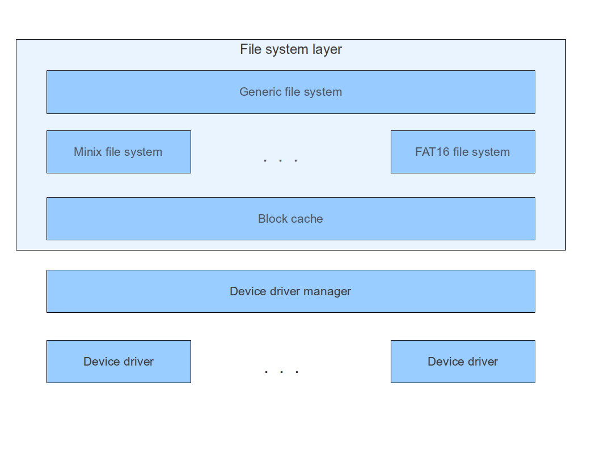
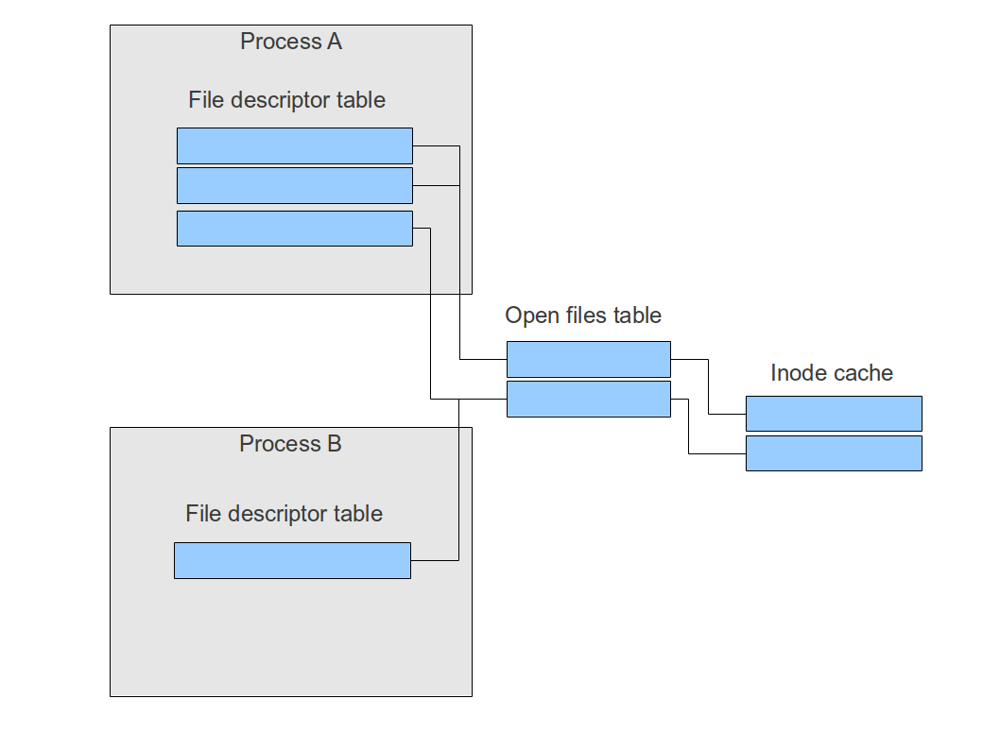
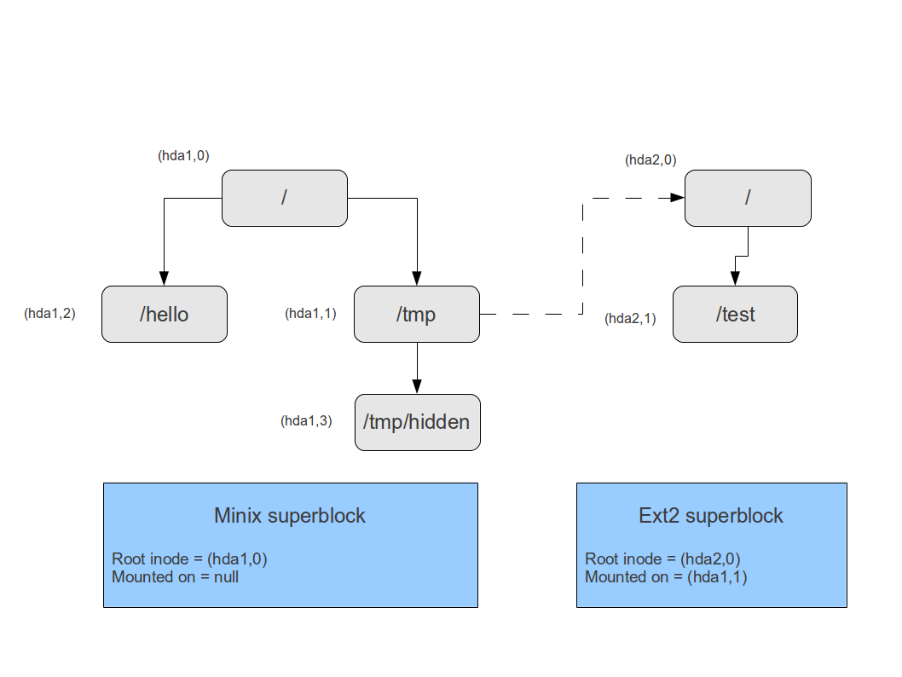
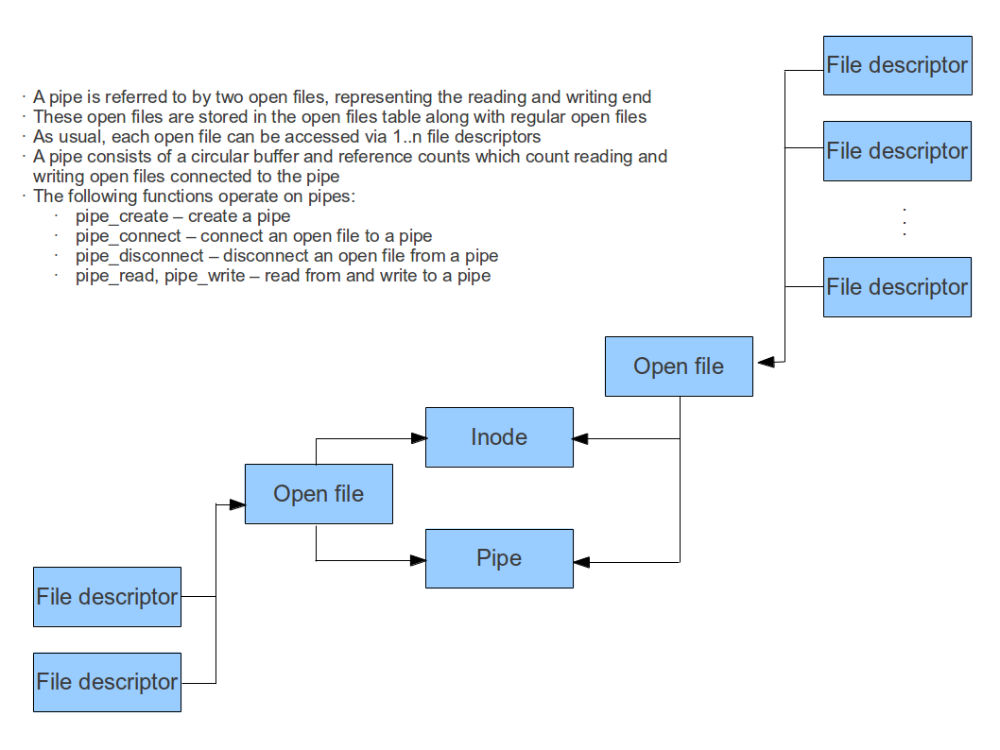
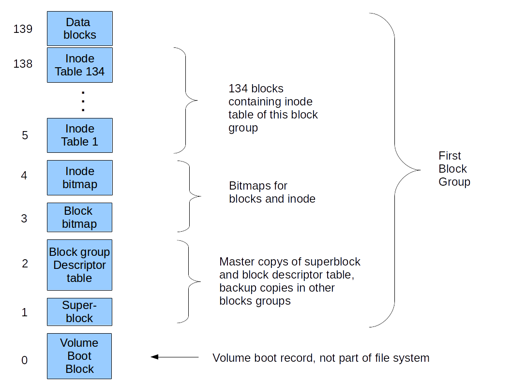
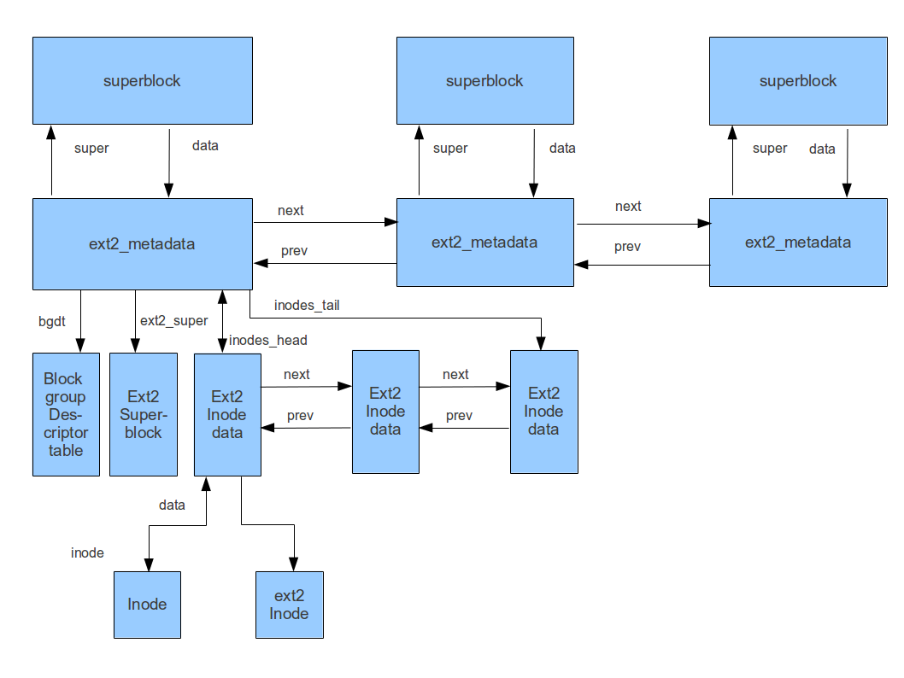
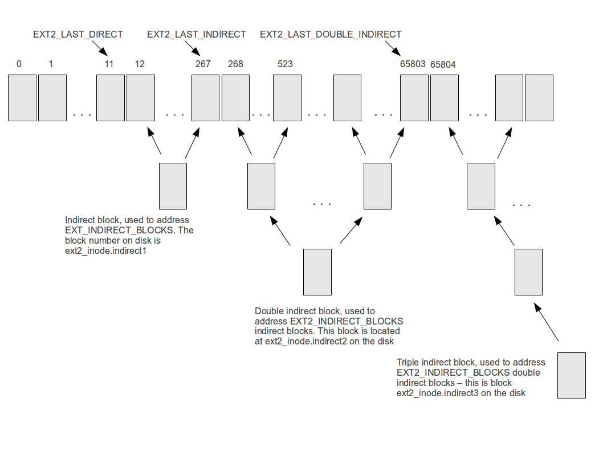
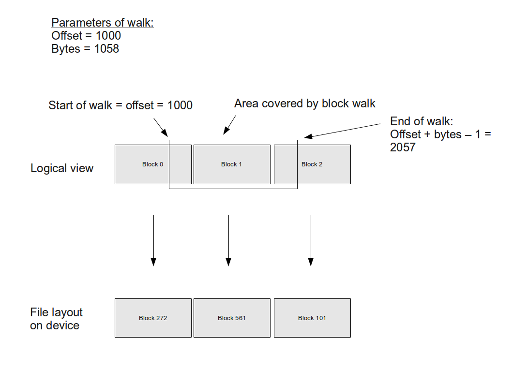

# The file system layer


## Overview

The ctOS file system layer is the component of the operating system which implements basic system calls like read and write. It is responsible for locating directories and files on the attached devices and translating read and write requests on the system call level into the corresponding calls to the device drivers.

For a UNIX like operating system, it is a typical setup to have a file system into which several physical devices are mounted. On each of these devices, different file systems can be located. If, for instance, the root device is a Minix filesystem, other parts of the file system could be mounted on a disk with a FAT32 file system or an EXT2 file system. To simplify access to different file system types, ctOS implements a layer called **generic file system** which is essentially an abstraction layer for the various actual file systems used.

Another layer which is a part of the filesystem stack is the block cache. Whenever an actual read/write operation is to be performed on a block device, this request is routed via the block cache. The cache will determine whether the requested data is already present in memory and make sure that read/write operations are only performed if this is not the case, thus improving performance considerably.

The following diagram summarizes the layered structure of the file system code in ctOS. Note that the diagram simplifies reality at one point: when a *character* special device is accessed, the file system calls the device manager directly, bypassing the block cache.




## The generic file system

### Inodes

Even though the generic file system is supposed to be an abstraction layer which can be applied to all file systems which could be reasonably used on an UNIX system, it is modelled closely along the ideas of classical UNIX file systems, trying to cover those parts of the concept which apply to other file systems as well.

The basic abstraction of a file is an**inode**. An inode represents exactly one actual file on the file system. Technically, the inode is a data structure which contains an inode number and a device. The inode number by itself is not unique, but is unique in combination with the device. This implies in particular that the same device cannot be mounted twice.

Looking at the contents of the inode data structure in typical UNIX file systems, we find that there are basically two different types of attributes. First, there are attributes like owner, modification time etc. which have a well defined meaning for each file on most file systems around. Second, there is the information on the exact location of the file on the device. The inode data structure in the generic file system only includes the attributes of the first type. Thus the inode contains the following data (which is in parts mandated by the POSIX standard, see <sys/stat.h>)

* the file system mode (mode_t)
* the owner of the file (uid_t)
* the group ID of the file (gid_t)
* the size of the file in bytes (off_t)
* the inode number (ino_t)
* the device on which the file is located (dev_t)
* an opaque pointer of type void* which can be used by the actual file system to store additional data
* function pointers for the operations on the inode (inode_ops)
* a flag which indicates whether this inode is a mount point
* a reference to the superblock describing the file system on which the inode is located


The inode number links the inode on the level of the generic file system to the inode on the level of the actual file system, for instance the EXT2 file system. In addition, a file system implementation can place a pointer to additional data in the generic inode which - for instance - can point to a cached copy of the actual inode to improve performance.

Along with the inode, a pointer to a structure of type `inode_ops_t` is stored. This structure contains function pointers to operations which can be performed on the inode and defines the interface of an actual file system. Each file system which is accessed via the generic file system needs to provide such a structure.

The following operations are part of the inode_ops structure.

* read bytes from an inode (`inode_read`)
* write bytes to an inode (`inode_write`)
* truncate an inode (`inode_trunc`) to a given size
* for inodes of type directory: iterate through the directory entries within the inode (`inode_get_direntry`)
* indicate to the file system that the pointer to the inode is duplicated so that the reference count on the inode needs to be increased (`inode_clone`)
* release the inode (`inode_release`) - if this is the last reference to the inode, the inode will be evicted from the cache. If in addition the link count reaches zero on disk, the inode is deleted from disk
* clone a reference to an inode (`inode_clone`)
* for inodes of type directory: create a new inode in the given directory (`inode_create`)
* unlink an inode, i.e. remove a directory entry pointing to it (`inode_unlink`). Note that as required by the POSIX standard, the inode itself remains on the disk until the last directory entry referring to it is removed and the last in-memory reference to the inode is released
* flush the inode (`inode_flush`), i.e. write changes to disk if the generic level has changed inode attributes like mode and timestamps


### Inode modes

The mode field in the inode corresponds to the st_mode in the structure defined in sys/stat.h on a POSIX system. It contains information on the file type as well as information on the file access rights.  On ctOS as well as on traditional Unix systems, this field is a 16 bit integer with the following decoding:

| Bits 12 - 15 |	Bits 9 - 11 |	Bits 6 - 8| 	Bits 3 - 5| 	Bits 0 - 2|
|:---|:---|:---|:---|:---|
|Type of file |	Sticky bit (bit 9), SGID bit (bit 10) and SUID bit (bit 11) | Access rights (r, w, x) for others |	Access rights (r, w, x) for the group |	Access rights (r, w, x) for the file owner

Each of the first four 3-bit combinations follows the classical octal encoding, so that bits 0 - 11 taken together represent the standard UNIX file access bits, for instance 0701 for rwx-----x. The type of the file is defined by the header file constants S_IF* defined in sys/stat.h

### Directory entries

From the point of view of the generic file system, directories are simply inodes which contain a list of directory entries. Each directory entry is a data structure which contains the following fields.

* file name
* the number of the inode representing the file

Note that the special directories . and .. are really physically contained in the inode data for most filesystems and are not created "on the fly" by the generic file system layer. The way how file name and inode number are stored in the actual inode on the disk depends on the underlying file system implementation.


### Superblocks

In addition to the inodes, the generic file system handler maintains a second set of data structures called superblocks. There is exactly one superblock for each mounted file system. A superblock contains meta-information on the corresponding file system and pointers to operations which do not refer to an individual inode. The following information is stored in the superblock.

* device on which the file system is mounted (major and minor device number)
* the number of the root inode of the file system
* a pointer to a function `get_inode` which returns an inode given the inode number and a device number
* a function to release a superblock
* a function `is_busy` to determine whether a mounted superblock is still in use, i.e. whether there are any inodes open for this superblock

At boot time, the file system initialization code loads one superblock corresponding to the root file system into memory. This superblock is called the **root superblock**. Additional superblocks are created when a file system is mounted, but at each time, one of them will be designated as the root superblock.


### Getting initial access to a file system

As described above, the inode operations structure and the superblock structure both contain function pointers which need to be set to actual implementations by a file system to work together with the generic file system layer. In addition to these functions, however, there need to be function which allow the generic file system to get the initial handle to a superblock of a file system when it is being mounted and to determine whether a file system on a device is ready. For that purpose, there is an additional structure called **file system implementation structure** which contains pointers to these two functions, a pointer to an initialization routine and a string identifying a file system. A table of these structures, one for each file system known to the generic file system, is kept in the table `known_fs` within fs.c.

### Inode caching

When the generic file system layer uses the function `get_inode` of the superblock of a file system to get a pointer to an inode, it expects that this pointer remains valid until it calls `inode_release` and that subsequent calls to this function return the same pointer. Inodes are compared by inspecting the device and inode number though, no comparison is done by comparing addresses. The generic file system layer will call `inode_clone` whenever the reference count of the inode is to be increased and `inode_release` when a reference is dropped.

It is expected that file system implementations will maintain a cache of inodes to increase performance. However, whether a cache is implemented and what caching mechanism is used is up to the file system implementation.

### Reference counting for inodes

Even though the details of the inode cache are left to the implementing file systems, the following rules are assumed to manage reference counts on inodes.

* when an inode is initially created by the file system implementation and handed over to the generic file system by `get_inode`, its reference count is set to one
* each subsequent call to `get_inode` which returns the same inode will increase the reference count by one
* In addition, the reference count of the *superblock* is increased by one each time an inode is returned by `get_inode` (this is done to account for the additional pointer to the superblock contained in each inode)
* the generic file system will call `inode_clone` on an inode each time it stores a reference to the inode in an additional data structure
* each time a data structure which contains a pointer to an inode is destroyed, `inode_release` is called
* when a function receives a pointer to an inode and hands it over to a caller, the reference count is not increased
* if a function receives a pointer to an inode which is not stored nor passed on to a caller, it calls `inode_release` before returning


| Function |	Impact on inode reference count |	Impact on superblock reference count |
|:---------|:-----------------------------------|:---------------------------------------|
|release_superblock | n/a|	Reference count of superblock is decremented by one 
|get_inode|	Reference count of inode is incremented by one|	Reference count of superblock is incremented by one
|inode_clone|	Reference count of inode is incremented by one|	Reference count of superblock is incremented by one
|inode_release|	Reference count of inode is decremented by one |	Reference count of superblock is decremented by one
|inode_create |	Reference count of new inode is set to one |	Reference count of superblock is incremented by one
|inode_unlink |	n/a |	n/a

Let us look at an example to see how this works. Suppose the function `do_open` is called to open a new file. This function will in turn use `fs_get_inode_for_name` to get a pointer to an inode representing the file to be opened. At some point, `get_inode` is called and returns an inode which has reference count one. As `do_open` stores a pointer to this inode in an additional data structure, it calls `inode_clone` to increase the reference count which is now two. At the end of the function ´do_open`, the local variable holding a pointer to the inode is destroyed and `inode_release` is called. This implies that after executing the function, there is only one pointer to the inode in use, namely the one within the open file structure, and this is reflected by the reference count of the inode being one.

### Concurrency

Now let us discuss the concurrency issues involved with writing to a file which are not directly related to allocating additional blocks but also occur if file content is simply overwritten. The first and most obvious topic is the actual data within the file. If a thread writes to an inode and another thread reads from it in parallel, reading and writing access to the file are serialized on the level of the block cache and the device driver, but eventually the result of the read operation is not clearly defined. Even worse, the writing thread might change attributes of the inode like the size (which can also happen if no new blocks are allocated) so that the reader might see an inconsistent state of the inode.

One possible approach would be to add a mutex to each inode structure which is used to guard against concurrent access (note that no spinlock can be used as a thread might issue a read/write request to the device driver and hence go to sleep while holding the lock). However, this would also prevent two threads from reading data concurrently which is usually not an issue. To avoid this, a read/write lock is used. Thus each inode data structure contains a read/write lock which is acquired by the respective functions in the generic file system layer. This structure makes sure that an arbitrary number of threads can read from a file in parallel, but only one thread can write to it at a time. In addition, the writer will wait until all readers are complete and no new readers will be allowed as long as a writer is active.


### File descriptors and open files

For each process, the file system layer maintains a list of file descriptor. A file descriptor is nothing but an index into a table the entries of which are pointers to an open file. An open file in turn is the data structure within the kernel which is created each time a file is opened. Among other things, it contains the current seek position into the file and a pointer to the inode of the file. The table of open files is shared between all processes.

Thus if two file descriptor point to the same entry in the open file table, a read from one of these file descriptors will advance the file offset and thus affect the next read on the second file descriptor as well. The following picture illustrates the relations between processes, file descriptors and open files.



As indicated in the diagram, two file descriptors within the same process can point to the same open file - this will happen when the dup system call is used. As file descriptors are inherited when a process forks, two file descriptors in different processes can point to the same open file. Also note that when opening a file on disk twice, two open file entries will be generated which now point to the same inode, so the relation between inodes and open files is also not 1-1.

Note that the file descriptor table is per-process, i.e. all tasks within a process share the same list of file descriptors.

As the file descriptors are inherited when a process is forked, the generic file system offers a special function `fs_clone` which is invoked by the process manager if a fork is executed. This function will walk the list of file descriptors for the source process. For each valid file descriptor, it will create a matching entry in the file descriptor table for the target process which points to the same open file and increase the reference count of the open file by one.

### Examples

To understand how the generic file system layer and the various file system implementations interact, we will look at a few examples in this section. Suppose that the root file system is placed on a Minix file system on hda1 and contains the directories / and /tmp. As / is the root inode for this file system, its inode number is 0. Let us assume that the inode number of /tmp is 1.

At boot time, the kernel will then create a superblock describing the Minix file system on hda1 and add the root inode to the list of inodes. As an inode is identified uniquely by device and inode number, we will refer to this inode as (hda1,0).  Consequently, (hda1,1) is the inode /tmp.

Now we mount an Ext2 filesystem located on hda2 onto the mount point /tmp. During the mount operation, a second superblock for the Ext2 file system will be generated and the root inode (hda2,0) of this file system will be added to the inode cache. In the superblock of the Ext2 file system, the field mounted_on will be set to (hda1,1) and the root inode will be set to (hda2,0).

Further suppose that the Ext2 filesystem contains a single file test. After mounting, this file will then be accessible as /tmp/test. In addition, we assume that there is a file called hello located on the Minix file system directly in the root directory which has inode 2. The following diagram illustrates this example.



__Locating files__

First let us unterstand how the kernel is able to identify the inode for /tmp/test, given only the path and file name. It will start its search at the root inode of the root superblock, i.e. (hda1,0). During the entire search, it will maintain a variable current_superblock which is initially set to the root superblock. Using the function `inode_get_direntry`, it will first determine the inode number of the entry "tmp" which is 1. It will then follow the function pointer get_inode of the current superblock to retrieve a pointer to the inode (hda1,1).

Inspecting this inode, the kernel will then see that the mount point flag in this inode is set to 1. It will then scan the list of mount points to locate the superblock which is mounted on (hda1,1) and find the superblock of the Ext2 file system. At this point, it will update the variable current_superblock  with the Ext2 superblock and continue the search at the root inode of this superblock, i.e. (hda2,0). This is the root inode of the Ext2 filesystem and a directory.

Conversely, if we have a directory - say /tmp - on which another file system is mounted and we try to access /tmp/.., then the function `inode_get_direntry` will return the root inode of the mounted file system. As we expect to get the parent inode of /tmp, not the parent inode of the root directory on the mounted file system (which would be the root directory itself), we need to switch back across the mount point before we scan the directory for "..".

Finally the kernel will read the directory entries in this inode and find the entry for test. To retrieve the inode for test, it can then call `get_inode` on the current superblock - which is now the Ext2 superblock - to get a pointer to the inode representing /tmp/test.

__Opening files__

To open a file specified by name, the file system first uses the mechanism above to get a pointer to the inode representing the file. It then creates a new entry in the table of open files, locates the lowest free file descriptor and adds a pointer to the open file into the file descriptor table of the current process at this index.

Additional processing is necessary in case the file to be opened does not exist. In this case, the behaviour is determined by the flags passed to the open system call. If the bit O_CREAT is not set, the function will return an error. If the bit is set, however, it will try to create the file.

Taking this into account, we arrive at the following algorithm for opening a file.

```
Try to locate file in file system
IF file does not exist THEN
   IF O_CREAT set THEN
     Determine directory in which file is to be created
     Get write lock for this directory
     Scan directory to see if file exists now
     IF file does still not exist THEN
       Create new inode
     ELSE
       Get existing inode
     END IF
   ELSE
     return error code "file not found"
  END IF
END IF
locate free file descriptor in file descriptor table of current process
Create new entry in open files table
Place pointer to this entry in the file descriptor table of the current process
```

__Closing files__

When a file is closed, the reference count of the open file descriptor is decremented by one. If the reference count drops to zero, the inode which refers to the file is released and the open file is removed from the list of open files. In each case, the entry in the file descriptor table of the current process which is closed is marked as available again.

__Reading from a file and writing to a file__

When a process makes a system call to read from the file, the file is identified by a file descriptor. The kernel then looks up this file descriptor in the file descriptor table of the current process. It follows the link to navigate to the corresponding open file and thus gets a pointer to the inode representing the file. Using the inode_ops structure, it can then read the requested number of bytes from the inode. Finally, the file offset in the open files structure is adapted. Writing to a file is similar.

Note that neither the read nor the write function which is part of the generic file system performs any boundary checks against the actual file size. This is left to the implementing file system which is also in charge of updating the file size within the inode if needed.

__Initializing the file system__

To initialize the file system using a specified device as root device, the following steps are necessary. First, the file system layer walks a compile-time table of known file systems and calls the init and the probe function of each file system. This function accepts a device as argument and is supposed to return a boolean value indicating whether the device contains an instance of this file system. When the first file system returns true, the file system layer calls get_superblock on this filesystem to get the superblock of this file system. From the superblock, it retrieves the root inode of the file system. Finally it marks the new superblock as the global root superblock.

Note that, as the initialization layer of the generic file system calls init for each specific file system, the kernel startup code may simply call `fs_init` to initialize all known file systems. Within the init routine, each specific file system in turn has a chance to build up its internal data structures which do not refer to a specific device.

In case the passed root device is equal to DEVICE_NONE, no file system will be initially mounted, i.e. root superblock and root inode both are set to 0.

__Mounting a file system__

To capture the superblocks of all mounted file systems, the generic file system layer maintains a list of **mount points**. Each mount point is a data structure containing the device and a pointer to the root inode of the file system mounted on this device.  This list can easily be scanned to locate the superblock for a given device which is mounted.

When a file system is mounted, the following steps are necessary.

* make sure that the same device is not already mounted
* make sure that the mount point is not in use
* call the probe function of the file system to verify that the given file system implementation can work with the respective device
* get the root inode of the new file system
* add a new entry to the list of mounts points
* set the mount point flag on the inode on which the new file system is being mounted

Once this has been done, the mechanism to locate a file on the file system described above will make sure that the files on the newly mounted device appear at the correct location within the global file system tree.

Note that the probe function of the file system needs to make sure that the file system is opened, this is not done by the file system layer.

The root filesystem itself is not stored in the mount point list. Therefore a special processing is necessary in order to mount the root filesystem. First it is checked that the root filesystem is not yet mounted, i.e. that the pointer root_inode is NULL. If this is the case, the pointers are re-initialized without adding a new entry to the mount point list.

Note that as an inode contains an indirect reference to the superblock it belongs to, we do not store an explicit reference to the superblock in the mount point structure. This has an impact on the reference counts after mounting a file system. Let us look at this point in a little more detail. Initially, only the root file system is mounted, i.e. the root inode is stored in the static variable `root_inode` within fs.c. Therefore the reference count of the root inode is one and - due to the implicit reference - the reference count of the superblock of the file system is one as well.

Now suppose a second file system is mounted, say on /tmp. This will create a new mount point structure which contains a reference to the inode /tmp and a reference to the root inode of the mounted file system. The reference to /tmp accounts for one additional reference to the root inode of the root file system. Thus we have the following reference counts after executing this operation.

* Root inode of root file system: 1
* Inode of /tmp on root file system: 1
* Superblock of root file system: 2
* Root inode of mounted file system: 1
* Superblock of mounted file system: 1

__Unmounting a file system__

The function `fs_unmount` is called with a mount point as parameter (i.e. the inode on which the device is mounted) to remove a mounted device from the file system. In the example above, `fs_unmount` would be called with the inode (hda1,1) as parameter to remove the device hda2 again from the file system tree.

When the function is invoked, a number of checks are done first to make sure that the device to be removed is not busy:

* the function `is_busy` of the superblock to be removed is called to check whether there are any open inodes on the file system which is to be removed (note that while `fs_unmount` is in progress, no additional files can be opened as `fs_get_inode_for_name` also uses the semaphore `mount_point_sem`)
* the list of mount points is scanned to see whether there is another device mounted on the device which is to be removed from the file system tree, i.e. if the device to be unmounted is dev, the mount point list is walked and for each mount point, it is verified that the condition mounted_on->dev == dev is not true

In case all of these checks are successful, the mount point is removed from the list of mount points and `release` is called on the root inode of the file system. In addition, the flag mount_point of the mount point inode is reset.

A special processing is necessary in case it is requested to unmount the root file system. This is done by calling `fs_unmount` with the argument NULL. In this case, the function will first verify that no other file systems are mounted, i.e. that the list of mount points is empty, and that there is no open file at all. Only if these conditions hold, the root file system is unmounted by setting root_inode and root_superblock to NULL.

Note that all functions which access the mount point structure and the mount_point flag within the inode (`fs_get_inode_for_name`, `fs_mount` and `fs_unmount`) use the semaphore `mount_point_sem` to synchronize access to their respective critical sections. This avoids race conditions which could otherwise occur if for instance `fs_get_inode_for_name still` sees a mount superblock while `fs_unmount` is just removing the mount point in parallel.

### Working with character devices

A special situation occurs when filesystem operations invoked for an inode which does not represent an ordinary file, but a character device. Then reading from respectively writing to this inode simply amounts to performing the respective operation on the character device. In this situation, the device driver manager is called directly by the generic file system layer, bypassing the specific file system layer entirely. For the following functionalities, a special processing is required.

__Reading and writing from respectively to character devices__

When reading or writing from an inode, the function `fs_read` uses the macros defined in sys/stat.h to check the type of the inode. If the inode represents a character device, the function `fs_rw_chr` is invoked to read from the device directly instead of calling the underlying specific file system layer. A similar processing is implemented for writing to special files.

__Opening and closing character devices__

When `fs_open` or `fs_close` are called to open respectively close a file, it is checked whether the file in question is a character device. If this is the case, the open/close function of the device will be called in addition to the normal processing. Note that device driver that actually implement open and close are expected to do some reference counting to make sure that the device remains usable as long as the number of calls to close is less than the number of calls to open.

__Seeking in character devices__

A similar processing is implemented in `fs_lseek`. After updating the cursor in the open file description, the function will check whether the inode in question is a character device and perform a seek on the device.

### Sockets 

The Berkeley socket API uses file descriptors to identify networking sockets. To support this, the data structure which describes a socket (an instance of the structure socket_t) can be associated with an open file via a pointer in the structure open_file_t. For ordinary files, this pointer is 0. If an operation is requested on a file descriptor, the file system layer checks whether this pointer is different from NULL. If this is the case, the request is forwarded to the networking stack.

A system call which has its origins in the Berkeley socket API is the `select` system call which can be used to block a process or task until a file descriptor is ready for reading or writing, or, more precisely, until a read or write on the file descriptor will not block. This system call is implemented on the file system layer in the function `do_select` in fs.c. When this function is invoked with a list of file descriptors, it first builds up an array of pointers to those open files which are referred to by the passed file descriptors. It then creates a semaphore which is stored in the kernel heap (and thus visible from every other process as well) and calls the select implementation of the networking layer, passing that semaphore as argument. This function is supposed to add the semaphore to a "select queue" which is a queue of semaphores on which an *up* operation is performed if the socket changes its state.

Then the file system layer does a *down* on this semaphore and thus sleeps until the networking layer detects that one of the sockets is ready to read or write and performs its *up* operation. When this happens, the file system will invoke another part of the select implementation in the networking layer which is supposed to remove the semaphore from all select queues again and check the state of the socket once again. This state is then returned to the caller.

### Pipes

As pipes are not represented by any structure on the disk and on the actual physical file system, their processing is handled entirely on the level of the generic file system layer. Essentially, a **pipe** is a circular buffer which is connected to two files, each of which represents one end of the pipe. Thus creating a pipe will result in two entries in the open files table to represent both ends of the pipe.



Note that the open files representing the ends of a pipe also refer to an inode. However, this inode is only a dummy inode which does not refer to any inode on a physical file system and has an empty inode operations structure.

To set up the data structure described above, the following steps need to by taken if a pipe is established by the pipe system call.

* a pipe is created
*  a dummy inode representing the pipe needs to be created
* then `fs_open` is called using this inode as parameter to establish an open file description for the reading side
* a reference to the pipe is added to the open file
* a file descriptor is reserved and made to point to the newly created open file
* the same procedure is repeated to create a second open file representing the writing end of the pipe
* both file descriptors are returned to the caller


When `fs_close` is called on a file which is the reading or writing end of a file and the reference count drops to zero, `fs_pipe_disconnect` is called on the pipe, with a mode depending on the flags in the open file structure. If this function returns 1, indicating that no more open files are connected to the pipe, both the inode and the  pipe will be freed.

The data which is contained in a pipe and has not yet been read is organized as a circular buffer of total length PIPE_BUF (which, according to POSIX, needs to be defined in limits.h). Thus a pipe essentially consists of an array of length PIPE_BUF, two integer variables head and tail and a spinlock to protect the structure from concurrent access.  Monitors and condition variables are used to synchronize reads and writes.

To write data to a pipe, we enter the monitor and verify whether there is space left in the buffer. If yes, we write to the buffer and send a broadcast message to all threads waiting for data to become available. If the pipe is full, we wait until we are in turn signaled by a reader that data has been read. We repeat this until all data has been written and leave the monitor again.

Conversely, to read data, we enter the monitor and check the status of the pipe. If there is some data in the pipe, we read from it and signal all processes waiting for space to become available before we leave the monitor. If no data is available, we perform a wait until we are informed by a writer that data has been written.

We also respect the file status flag O_NONBLOCK - if this flag is set, we do not wait for data or slots to become available but return immediately.

A special processing applies if we attempt to read from or write to a pipe which is no longer connected to open files at both ends. If all file descriptors for the reading end are closed and thus the open file representing the reading end is closed, the reference count for readers stored in the pipe drops to zero. If in this situation a write to the pipe is attempted, the write method will deliver a specific error code which needs to be interpreted by the writing task and reacted upon by sending SIGPIPE to the currently active task (not the process!) and returning the error code EPIPE. It is not clearly specified whether this also applies if a partial write could be performed before the pipe breaks, we return the number of bytes written in this case without generating a signal. Conversely, if a request is made to read from a pipe which has no writers connected to it anymore, the read is supposed to return an EOF error code.

As both conditions (closing the last reader and closing the last writer) might occur while a task is waiting for the pipe to become ready for writing or reading, all tasks waiting need to be notified as well in this case. More specifically, if an open file is disconnected from a pipe and the reference count of reading files drops to zero, all threads waiting for the pipe to become ready for writing need to be notified. If the reference count of files writing drops to zero, all threads waiting to be able to read data from the pipe need to be notified.

Here is the pseudo-code to write n bytes of data to a pipe. Note that when a write of up to PIPE_BUF bytes is requested, we write all n bytes atomically in one operation. If n exceeds the size of the pipe buffer, the write is no longer guaranteed to be atomically, but we write in chunks using any free space in the write buffer which we can find.

```
bytes_left = n
while (bytes_left>0) DO
  Enter monitor, i.e get spinlock pipe->spinlock
  IF (number of readers is zero) THEN
    leave monitor
    if (bytes_left==n) THEN
      send SIGPIPE to current task
      return -EPIPE
    ELSE
      return n-bytes_left
    END IF
  END IF
  elements_in_buffer = tail - head;
  free_slots = PIPE_BUF - elements_in_buffer;
  IF ((n>PIPE_BUF) AND (free_slots > 0)) OR free_slots >=n THEN
    fill up buffer, i.e. add min(free_slots, bytes_left) bytes at position tail % PIPE_BUF and increase tail by that number
    bytes_left = bytes_left - min(free_slots, bytes_left)
    notify readers that we have written data to the pipe by calling cond_broadcast(pipe->written)
    leave monitor, i.e release spinlock on pipe
  ELSE
    if (O_NONBLOCK set) THEN
      leave monitor
      IF (bytes_left==n)
         return -EAGAIN
      ELSE
         return n-bytes_left
    END IF
    wait until data has been read from the pipe by calling cond_wait(pipe->read);
    if we were interrupt by a signal, return -EINTR if no data was written or the number of bytes written
    release spinlock, i.e. leave monitor
  END IF
DONE
```

The code to read up to n bytes is quite similar. Again we enter a monitor and check whether data is available. If yes, we read it and notify all writers that additional space is available in the buffer. If no data is available, we wait until we are notified by a writer that data has been added.

```
read_bytes = 0
while(read_bytes = 0) DO
  Enter monitor, i.e. get spinlock on pipe
  IF (tail > head) THEN
    read min(tail-head, n) bytes from position head % PIPE_BUF
    increase read_bytes
    head = head + min(tail-head, n)
    cond_broadcast(pipe->written)
    leave monitor
  ELSE IF (no writers connected) THEN
    leave monitor
    return 0
  ELSE
    if (O_NONBLOCK is set)
      leave monitor
      return -EAGAIN;
    END IF
    wait until data has been written to the pipe by calling cond_wait(pipe->read)
    if we were interrupted by a signal, return -EINTR if no data was read or the number of bytes read
    leave monitor by releasing spinlock
  END IF
DONE
return read_bytes
```

To protect the reference counts of readers and writers from concurrent access, the functions to connect and disconnect to and from a pipe need to enter the monitor represented by the pipe spinlock as well.


### Working with directories


The handling of directories is very similar to the handling of open files. When a programm wishes to read from a directory, it will first use the open system call to open the directory as if it were a file which will invoke `fs_open` on the inode representing the directory. This will create an entry pointing to the directory in the table of open files. Initially, the offset in this table is 0 as it is the case for all newly generated files.

To read from a directory, the interface function `fs_readdir` of the generic file system layer is used. This function will get the directory entry with index 0 from the inode using the `get_direntry` function stored in the respective inode and increase the offset in the open file structure by one. It returns 0 upon success or -1 if all directory entries have already been read from the directory. When the function is called the next time, it will get the offset from the open file descriptor which is now one and call the `get_direntry` function with offset 1 and so forth.

The corresponding system call implementation `do_readdir` accepts a file descriptor and a direntry buffer and calls `fs_readdir` to fill the passed direntry structure.

Note that the section on concurrency applies to directories as well. Whenever a directory is modified, the generic file system first needs to get a write lock for the respective inode. In turn, a thread which scans a directory will have to get a read lock on the directory first. This implies that in particular the lock on the root directory can be a performance bottleneck if several processes create files and scan the directory tree concurrently. To avoid this, it is planned to add a directory entry cache with an improved locking strategy in later releases of ctOS.

Creating a directory is somehow similar to the creation of an ordinary file, with the exception that when a directory is created first, the two entries "." and ".." have to be added. This is handled by the interface function `inode_create`, i.e. by the lower layers of the file system, as the exact implementation of these directories might be specific to the file system. This function is also responsible for updating the link count of the parent directory to account for the ".." entry and will assume that the generic file system layer has locked the parent directory.

When a directory is removed, care needs to be taken by the lower levels of the file system to adapt the link count of the parent directory to account for the .. entry in the removed directory.

### Representing a process within the file system

For each process, the file system layer needs to keep track of a few data items.

* we need to store the file descriptors associated with the process and the associated file descriptor flags
* for each process, we need to keep track of the current working directory
* the file creation mask (umask)

To do this, the file system layer maintains a table of fs_process_t structures. This structure is defined as follows.

```
typedef struct _fs_process_t {
    inode_t* cwd;                        // Current working directory (NULL = /)
    open_file_t* fd_tables[FS_MAX_FD];   // File descriptors
    int fd_flags[FS_MAX_FD];             // file descriptor flags
    mode_t umask;                        // umask
    spinlock_t fd_table_lock;            // Lock to protect file descriptor table
    spinlock_t spinlock;                 // lock to protect all fields of the structure except the fd table
} fs_process_t;
```

Note that by convention a value of NULL for the cwd member in this structure refers to the root directory. The reason for this is as follows. Whenever a process executes the cwd system call to change the current working directory, the cwd structure will be updated with a pointer to the inode for the new working directory. Consequently, the reference count of this inode is increased by one. This, however, implies that no file system can be unmounted as long as there are still processes active with a current working directory somehere on this file system. Whereas this makes sense in most situations, it can be a problem when shutting down the system. Even if all user space processes are killed at this point, the INIT process might still be active. To avoid that this process holds a reference to the root inode and thus prevents unmount of the root filesystem, we therefore use the convention that NULL means the root filesystem. Thus when a process changes its current working directory to /, the reference to the previous working directory will be dropped but not reference to the root inode is created and the root inode can be cleanly unmounted.

When a new process is created, the process manager is supposed to invoke the function fs_clone which will create a new entry in that table which is an exact copy of the existing entry, including the current working directory. In case a process is terminated, fs_close_all is invoked by pm.c and will set the cwd member to NULL, thereby dropping any previous references.

## The public interface of a specific file system

The full public interface which each actual file system needs to implement looks as follows.

| Function |	Accessed via |	Description |
|:---------|:----------------|:-------------|
| get_superblock|	File system implementation structure |	Build a superblock for the respective file system and return a pointer to it. This function needs to be called before any inodes can be retrieved from the file system
| get_inode |Superblock |	Given an inode number and a device, return a pointer to an inode structure for the respective inode
| inode_read |	Inode operations |	Read a specified number of bytes from an inode. Return a negative error code or the number of bytes read
| inode_write |	Inode operations |	Write a specified number of bytes to an inode
| inode_clone |	Inode operations |Clone an inode
|inode_release |	Inode operations |	Release an inode again, evict the inode from the cache if this is the last reference and - if in addition the link count of the inode is zero - remove the inode from disk as well
| inode_get_direntry |	Inode operations|	For an inode which is a directory, get  a directory entry by index. This function returns 0  if the requested index was in range and a non-zero return code otherwise
|probe|	File system implementation structure|	Given a device, check whether the device contains an instance of the file system and returns 1 if the file system can be mounted
|release_superblock|	Superblock |Release a given superblock, giving the underlying file system implemenation a chance to flush the cache, deallocate resources etc.
| init |	File system implementation structure |	Perform all initialization tasks which are not specific to a device - all device specific initializations should be done in get_superblock
|is_busy|	Superblock|	Returns 1 if there are any inodes in use which refer to the superblock with the exception of one reference to the root inode of the file system. This function is used by fs_unmount to check whether a file system is still busy
| inode_create |	Inode|	Create a new inode in a given directory
|inode_unlink |	Inode |	Unlink the inode, i.e. remove a directory entry pointing to it
| inode_trunc |	Inode |For regular files only: set the size of the inode to zero and deallocate all blocks associated with the inode previously
| inode_flush |	Inode |	Sync the attributes of the inode maintained at the generic file system level (access rights, timestamps) back into the lower layers and to disk

## The block cache

The block cache is used as an additional layer between all file systems and the actual devices on which these filesystems reside. Each read and write operation for one of these devices is routed through the block cache. The block cache is therefore able to cache read data so that the number of I/O operations is reduced.

In the current release of ctOS, the block cache is not yet implemented. However, the public interface of the block cache is already in place to avoid that the file systems have to be adapted once the block cache is added. The following functions constitute the public interface of the block cache.

| Function| 	Description |
|:--------|:-----------|
|bc_init |	Initialize the block cache |
| bc_read_bytes |	Read a given number of bytes from a device using the block cache
| bc_write_bytes|	Write a given number of bytes to the device
| bc_open |	Open a device
| bc_close |	Close a device

There is one subtlety which even the primitive block cache currently in place needs to take care of when writing data. Suppose that a thread requests to write 100 bytes to block 0 with offset 1000. Then the write will effectively cover blocks 0 and block 1, i.e. the block cache needs to ask the device driver to write blocks 0 and 1 to the disk. However, the caller only provides the data to be writting starting at offset 1000 into the first block. Therefore the block cache first needs to read the two affected blocks into a temporary buffer, copy the changed data to the buffer starting at offset 1000 and write the entire buffer (2048 bytes) back to disk. Without that additional read operation, we would write random data to the first 1000 bytes of the first block.

## The Ext2 file system

### Creating a sample image

For the purposes of this document and for later unit and assembly testing, let us first create a sample flat disk image containing an ext2 file system. Here are the steps which need to be taken to set up this image.

```
dd if=/dev/zero of=ext2image bs=512 count=19136
sudo losetup /dev/loop0 ext2image
sudo fdisk /dev/loop0
```

Now enter parameters to create a new primary partition starting at sector 2048 with type 83 (n, p, 1, , 2048, accept default, w). Next, we add an ext2 file system to this image.

```
sudo losetup /dev/loop1 -o $((512*2048)) ext2image
sudo mkfs -t ext2 -b 1024 -O none  /dev/loop1 
```

Here is the output of the mkfs command.

```
mke2fs 1.42.13 (17-May-2015)
Discarding device blocks: done                            
Creating filesystem with 8544 1k blocks and 2144 inodes
Filesystem UUID: 45d1345d-cd1f-4181-9044-fc62acc722a9
Superblock backups stored on blocks: 
	8193

Allocating group tables: done                            
Writing inode tables: done                            
Writing superblocks and filesystem accounting information: done
```

Once we have created the file system, we can now mount it and create some sample data.

```
sudo mount /dev/loop1 /mnt
sudo mkdir /mnt/tmp
sudo -s
echo "hello" > /mnt/hello
```

Finally we can use the following command to strip of the first 2048 blocks and get a file containing only the actual ext2 partition which is suitable for use as a ramdisk.

```
dd if=ext2image of=rdimage ibs=512 obs=512 skip=2048
```

### Disk layout

As it is the case for most file systems, the space on the disk is addressed in units of **blocks**, which may or may not be identical to the physical sector size on the disk. In fact, most of the time the block size is 1024 bytes, whereas the physical sector size is 512 bytes. The block size of the ext2 file system is not fixed, but specified in the superblock.

The disk is organized in groups of blocks called (well, you might guess that) **block groups**. Each block group contains actual data along with some metadata, for instance a bit map of used blocks within the block group.

Located 1024 bytes from the beginning of the volume, each ext2 volume contains a superblock which holds the information on the layout of the file system on the disk. By convention, this is called block 1, whereas block 0 is reserved for the volume boot record.

Following the superblock, there is one or more block group descriptor tables, which describe how the volume is split into block groups. These blocks are followed by the actual block groups. Each block group again contains bitmaps to keep track of free blocks and inodes and the actual inodes and data blocks. In addition, depending on the revision of the file system, there might be backup copies of the superblock and the block group descriptor tables at the beginning of a block group.

Note that the ext2 file system comes in various revisions. In ctOS, we will only use revision 1 of the file system.

### The superblock

The following table lists the fields of the superblock which are present in revision 1 of the ext2 file system.

| Offset| 	Size| 	Name| 	Description
|:------|:------|:------|:------------
| 0	| 4 bytes 	| s_inodes_count | Total number of inodes on the disk
| 4 |	4 bytes |	s_blocks_count |	Total number of blocks on the file system
| 8 |	4 bytes |	s_r_blocks_count |	Number of blocks reserved for the super user
| 12 |	4 bytes |	s_free_blocks_count |	Number of free blocks on the volume
| 16 |	4 bytes |	s_free_inode_count |	Number of free inodes on the volume
| 20 |	4 bytes |	s_first_data_block | The number of the block on the volume which contains the superblock. If the block size is 1024, this is always 1. For a larger block size, this is always zero
| 24 | 	4 bytes  |	s_log_block_size |	The block size is 1024 shifted to the left by s_log_block_size bits
| 28 |	4 bytes |	s_log_frag_size |	The fragment size is 1024 shifted to the left by s_log_frag_size bits. As fragments are not supported as of Linux 2.6, this is usually equal to s_log_block_size |
| 32 |	4 bytes |	s_blocks_per_group |	Number of blocks in each block group
| 36 |	4 bytes | 	s_frags_per_group |	Usually equal to s_blocks_per_group, see above
| 40 |	4 bytes	| s_inodes_per_group |	The number of inodes per block group
| 44 |	4 bytes |	s_mtime |	Unix time of the last mount time
| 48 |	4 bytes |	s_wtime |	Unix time of the last write access to the file system
| 52 |	2 bytes |	s_mnt_count |	Number of times the unit has already been mounted since last check
| 54 |	2 bytes |	s_max_mnt_count | Number of mount times after which a check needs to be done
| 56 | 	2 bytes |	s_magic |	ext2 magic number - always 0xef53
| 58 |	2 bytes | 	s_state |	File system state:1 - unmounted cleanly, 2 - errors detected
| 60 |	2 bytes |	s_errors |	Indication what the driver should do if an error is detected:1 - ignore, 2 - re-mount read-only, 3 - kernel panic
| 62 | 	2 bytes |	s_minor_rev_level |	Minor version
| 64 |	4 bytes |	s_last_check |	Time of last file system check
| 68 |	4 bytes | 	s_check_interval | 	Interval for forced file system check
| 72 | 	4 bytes |	s_creator_os |	Operating system by which the file system has been created:0 -Linux, 1 - GNU HURD 2 - MASIX, 3 - FreeBSD, 4 - Lites
| 76 | 	4 bytes |	s_rev_level |	Revision level 
| 80 |	2 bytes |	s_def_res_uid |	UID of the user who is allowed to use the reserved blocks (usually 0)
| 82 |	2 bytes | 	s_def_res_gid |	GID of the user who is allowed to use the reserved blocks
| 84 |	4 bytes |	s_first_ino |	First not reserved inode
| 88 |	2 bytes |	s_inode_size |	Size of each inode in bytes. Note that ctOS assumes 128 bytes here, this can be enforced with the parameter -I of mkfs.ext2
| 90 | 	2 bytes |	s_block_group_nr |	If the superblock is a backup, this is the block group number of the block group in which the superblock is contained
| 92 |	4 bytes |	s_feature_compat |	This is a bitmask of features which may or may not be supported by an implementation without a risk to damage the file system if they are not supported. Valid bitmasks are: 0x1 - block pre-allocation for new directories, 0x2 - AFS server inodes exist, 0x4 - an ext3 journal exists, 0x8 - extended inode attributes are present, 0x10 - non-standard inode size used, 0x20 - directory indexing used
| 96 |	4 bytes |	s_feature_incompat |	This is a bitmask of features which a file system MUST support in order to be able to mount this volume: 0x1 - volume uses compression, 0x2 - directory entries contain a type field, 0x4 - file system needs to replay its journal, 0x8 - file system uses a journal device
| 100 | 	4 bytes |	s_feature_ro_compat |	This is a bitmask of features which, if present, force a read-only mount: 0x1 - sparse superblock, 0x2 - large file support, 0x4 - btree sorted directory,  files
| 104 |	16 bytes |	s_uuid |UUID of the file system as returned by blkid

As an example, let us create a hex dump of our test image and inspect the individual fields.


```
$ hd -n 1200 rdimage 
00000000  00 00 00 00 00 00 00 00  00 00 00 00 00 00 00 00  |................|
*
00000400  60 08 00 00 60 21 00 00  ab 01 00 00 3e 20 00 00  |`...`!......> ..|
00000410  55 08 00 00 01 00 00 00  00 00 00 00 00 00 00 00  |U...............|
00000420  00 20 00 00 00 20 00 00  30 04 00 00 6e 9b dd 5a  |. ... ..0...n..Z|
00000430  6e 9b dd 5a 01 00 ff ff  53 ef 00 00 01 00 00 00  |n..Z....S.......|
00000440  fe 9a dd 5a 00 00 00 00  00 00 00 00 01 00 00 00  |...Z............|
00000450  00 00 00 00 0b 00 00 00  80 00 00 00 00 00 00 00  |................|
00000460  00 00 00 00 00 00 00 00  45 d1 34 5d cd 1f 41 81  |........E.4]..A.|
00000470  90 44 fc 62 ac c7 22 a9  00 00 00 00 00 00 00 00  |.D.b..".........|
00000480  00 00 00 00 00 00 00 00  2f 6d 6e 74 00 00 00 00  |......../mnt....|
00000490  00 00 00 00 00 00 00 00  00 00 00 00 00 00 00 00  |................|
```


Here we see that

* our disk contains 0x860 = 2144 inodes (matching the output of the mkfs command above)
* it has 0x2160 = 8544 blocks in total, out of which 0x1ab = 427 are reserved for the super user
* 0x20e3 = 8254 blocks are marked as free
* 0x855 = 2133 inodes are still free
* the superblock is on block 1
* the block size is 1024
* s_log_frag_size is 0, i.e. the fragment size is 1024 as well
* Each block group has 0x2000 = 8192 blocks (and the same number of fragments)
* There are 0x430 = 1072 inodes per group
* The file system has been mounted at Unix time 1524472686 for the last time (April 23th 2018, 10:38:06) and this is also the time of the last change
* the file system has been mounted once since the last check
* no forced file system check (dummy 0xFFFF = -1 as signed integer)
* the EXT2 magic number is properly contained in the superblock
* the file system is clean (this field contains zero, not one in my case though)
* errors are to be ignored
* minor version is zero
* the time of the last file system check is 112 seconds before the first mount time
* no forced file system check
* the file system has been created by Linux 
* the revision level is 1
* reserved blocks can be used by the user with UID = 0, GID =0
* the first not reserved inode is 0xb = 11 (if you run `ls -li` on the mount point, you will see that actually this is the first inode used)
* each inode has 0x80 = 128 bytes
* all feature bitmasks are zero
* the UUID of the file system is 45d1345dcd1f41819044fc62acc722a9 (check with `blkid /dev/loop1`)

### The block group descriptor table

In the next block after the block in which the superblock is contained, the **block group descriptor table** is stored. For each block group on the volume, there is one entry in this table which describes the layout of this block group. The following elements are contained in this table.

| Offset |	Bytes  |	Name | 	Description
|:-------|:--------|:--------|:------
|0 |	4 |	bg_block_bitmap |	Block ID of the first block of the block bitmap for the group (the size can be computed from the number of blocks per block group) - as all block IDs in this block group, this is the absolute block ID and not the number of the block within the block group itself
| 4 |	4 |	bg_inode_bitmap |	Block ID of the first block of the inode bitmap for the group
| 8 |	4 |	bg_inode_table |	Block ID of the first block of the inode table for this group
| 12 | 	2 |	bg_free_blocks_count |	Number of free blocks within this group
| 14 | 	2 |	bg_free_inodes_count |	Number of free inodes within the group
| 16 |	2 |	bg_used_dirs_count |	Number of inodes which are allocated to directories for this group
| 18 |	2 |	bg_pad |	Padding |
| 20 |	12 | 	bg_reserved |	Free space for future extensions

Again let us look at our sample file to understand the details here. As the superblock is always starting at byte 1024 of the volume and in our case, the block size is 1024 bytes, the block group descriptor table starts at offset 2048 into the volume. Here is a hexdump of the first few bytes at 
this location.

```
$ hd -n 64 -s 2048 rdimage 
00000800  03 00 00 00 04 00 00 00  05 00 00 00 68 1f 24 04  |............h.$.|
00000810  02 00 04 00 00 00 00 00  00 00 00 00 00 00 00 00  |................|
00000820  03 20 00 00 04 20 00 00  05 20 00 00 d4 00 2f 04  |. ... ... ..../.|
00000830  01 00 04 00 00 00 00 00  00 00 00 00 00 00 00 00  |................|
```

So we see that the first block managed of the bitmap of this group is block 3. This makes sense - block 1 is the superblock itself and block 2 is the block in which the block group descriptor table itself is stored. 

The first block of the inode bitmap - the next field - is block 4. The inode table itself starts at block 5. Within the group, we have 0x1f68 = 8040 free blocks and 0x424 =1060 free inodes. Two inodes are allocated for directories.  


As we have seen from the superblock, we have 1072 inodes per group. Each inode is 128 bytes wide, so that we can fit 8 inodes into one block. We therefore need 1072 / 8 = 134 blocks to store our inode table. 

Let us take a look at the block bitmap. This bitmap is starting at block 3, i.e. at byte 3*1024 = 3072 = 0xc00. As we have 8192 blocks in each block group, the bitmap is exactly 1024 bytes wide. Here is a hexdump.

```
$ hd -n 1024 -s 3072 rdimage 
00000c00  ff ff ff ff ff ff ff ff  ff ff ff ff ff ff ff ff  |................|
00000c10  ff ff 7f 00 00 00 00 00  00 00 00 00 00 00 00 00  |................|
00000c20  00 00 00 00 00 00 00 00  00 00 00 00 00 00 00 00  |................|
*
00000c40  01 00 00 00 00 00 00 00  00 00 00 00 00 00 00 00  |................|
00000c50  00 00 00 00 00 00 00 00  00 00 00 00 00 00 00 00  |................|
*
00001000
```

Each 0xff in this dump represents 8 free blocks. The 0x7f value is another 7 bits which are set, so that we have in total 18*8+7 = 151 used blocks at the beginning of the block group, ranging from absolute blocks 1 to 151. An additional block is in use at byte 0xc40. Thus we have 8192 - 152 = 7040 unused blocks which is in line with the information contained in the block group descriptor itself. Note that the superblock and the block group descriptor table itself are considered to be part of the block group and therefore occupy the first few blocks of the block group, and bit 0 in the bitmask is the superblock. In fact, unless the "sparse superblock" feature is chosen, each block group has a coy of the superblock and each block group has a copy of the block group descriptor table, so that each block group has the same layout.

The following diagram summarizes the information on the layout of our file system gathered so far.



Note that from the number of blocks per block group stored in the super block, the number of the block group (starting with 0) in which a block is located can be computed as follows.

block_group_nr = (block_nr - 1) / s_blocks_per_group

In reality, the block group descriptor table can be larger than one block and therefore the block bitmap is not always the third block of a block group. 

### The inode table

Each block group contains an inode table starting at the block bg_inode_table. Thus the entire inode table of the file system is split among all block groups. Inode number x (starting with 1) is located in block group

(x-1) / s_inodes_per_group

The first few inodes are reserved for special purposes. Traditionally the first free inode was inode 11 which was hardcoded in revision 0. Now the first free inode is contained in the field s_first_ino which is 11 in our case but could be a different value for other instances of the file system. The most important reserved inode is inode 2 which represents the root directory of the file system.

Each entry in the inode table describes one inode and has the following structure.

| Offset| 	Bytes| 	Name|	Description
|:------|:-------|:-----|:--------------
|0 |	2 |	i_mode |	Mode, containing type and permissions as defined in the file sys/stats.h
| 2|	2|	i_uid |	User ID of the owner of the file
| 4|	4|	i_size|	Lower 32 bits of file size, only useful for regular files
| 8|  	4|	i_atime|	Last access time
|12||	4|	i_ctime|	Creation time
|16|	4|	i_mtime|	Last modification time
|20|	4|	i_dtime|	Deletion time
|24|	2|	i_gid|	Group ID
|26|	2|	i_link_count|	Count of hard links, i.e. directory entries referring to this inode. When this is 0, the inode is deallocated.
|28 |	4 |	i_blocks |	Count of disk sectors (not Ext2 blocks) reserved for the data of this inode, not counting the actual inode structure, but including blocks holding indirect block pointers
| 32 |	4 |	i_flags |	Flags which determine how this inode is handled by the file system implementation:<br>0x1 - secure deletion<br>0x2 - record for undelete<br>0x4 - compressed file<br>0x8 - synchronous update<br>0x10 - immutable file<br>0x20 - append only<br>0x40 - do not dump / delete file<br>0x80 - do not update i_atime<br>0x100 - dirty<br>0x200 - compressed blocks<br>0x400 - access raw compressed data<br>0x800 - compression error<br>0x1000 - btree or htree directory<br>0x2000 - AFS directory<br>0x4000 - journal file data<br>0x80000000 - reserved
|36 |	4|	i_osds1|	Reserved for OS specific use 
|40 |	48 |	i_block |	12 32 bit values which hold the direct pointers to the blocks used by the inode. A block pointer with value 0 is an unallocated block which is either outside the file or represents a hole
|88 |	4 |		Single indirect block pointer |
| 92 |	4 |	Double indirect block pointer |
|96 |	4 | 	Triple indirect block pointer |
|100 |	4 |	i_generation |	Generation number (used by NFS)
| 104 |	4|	i_file_acl |	Extended attribute block
|108 |	4 |	i_dir_acl |	Upper 32 bits of file size
| 112 | 4 |	i_faddr |	Block address of fragment
| 116 | 	12 |	i_osd2 |	Reserved for OS specific use


Let us look at the root inode for our test filesystem. As mentioned above, the root inode number is 2, thus this is the second entry in the inode table. In the block group descriptor table, we have seen that the inode table starts at block 5. As each inode occupies 128 bytes, the second entry is at offset 128 into this block. So in our image file, we need to display 128 bytes starting at offset 5*1024+128:

```
$ hd -s $((1024*5+128)) -n 128 -v rdimage
00001480  ed 41 00 00 00 04 00 00  fe 9a dd 5a 6e 9b dd 5a  |.A.........Zn..Z|
00001490  6e 9b dd 5a 00 00 00 00  00 00 04 00 02 00 00 00  |n..Z............|
000014a0  00 00 00 00 02 00 00 00  8b 00 00 00 00 00 00 00  |................|
000014b0  00 00 00 00 00 00 00 00  00 00 00 00 00 00 00 00  |................|
000014c0  00 00 00 00 00 00 00 00  00 00 00 00 00 00 00 00  |................|
000014d0  00 00 00 00 00 00 00 00  00 00 00 00 00 00 00 00  |................|
000014e0  00 00 00 00 00 00 00 00  00 00 00 00 00 00 00 00  |................|
000014f0  00 00 00 00 00 00 00 00  00 00 00 00 00 00 00 00  |................|
00001500

```

Here we see that the file mode is 0x41ed = 040755 octal. The user ID is 0 (this is the UID of root). The size of the inode is 0x400 = 1024 bytes. After the four time stamps, we have group ID zero and the hard link count 4 (. and .. in the root directory itself, .. in /tmp and .. in /lost+found). The inode occupies two disc sectors (matching the size information). The first and only block occupied by the file is located at address 0x8b = 139, as we expect from our layout above.

### Directories

Here is the layout of a directory entry. Note that the length of a directory entry is variable, but all directory entries need to be aligned on a dword boundary on the disk. A record entry must be contained entirely in one block on the disk.


| Offset|	Bytes|	Name|	Description
|:------|:-------|:-----|:-------------
|0|	4|	inode|	Inode number of the file which is described by the entry
|4|	2|	rec_len|	Total size of this entry
|6|	1 |	name_len |	Length of name - as only one byte is used, the name length is restricted to 255 characters
|7 |	1 |	file_type |	Type of file:<br>0 - unknown<br>1 - regular file<br>2 - directory<br>3 - character device<br>4 - block device<br>5 - fifo<br>6 - socket<br>7 - symbolic link<br>
|8 |	variable |	name |	Name of file 


In the previous section, we have found out that data for the root directory is located in block 210. Let us dump this block and see what it contains.

```
$ hd -s $((1024*139)) -n 128 -v rdimage
00022c00  02 00 00 00 0c 00 01 00  2e 00 00 00 02 00 00 00  |................|
00022c10  0c 00 02 00 2e 2e 00 00  0b 00 00 00 14 00 0a 00  |................|
00022c20  6c 6f 73 74 2b 66 6f 75  6e 64 00 00 31 04 00 00  |lost+found..1...|
00022c30  0c 00 03 00 74 6d 70 00  0c 00 00 00 c8 03 05 00  |....tmp.........|
00022c40  68 65 6c 6c 6f 00 00 00  00 00 00 00 00 00 00 00  |hello...........|
00022c50  00 00 00 00 00 00 00 00  00 00 00 00 00 00 00 00  |................|
00022c60  00 00 00 00 00 00 00 00  00 00 00 00 00 00 00 00  |................|
00022c70  00 00 00 00 00 00 00 00  00 00 00 00 00 00 00 00  |................|
00022c80
```

The first four bytes give the inode of the first entry in the directory which is 2, i.e. the root directory itself. The size of this entry is 0x000c = 12 bytes. The length of the name is 1 characters, the name is ".". The file_type field is not used as we have disabled the feature "filetype" when the file system was created.

The next entry starts at offset 0xc. It again refers to inode 2, i.e. the root directory, and is 12 bytes wide. The name now contains 2 characters and is "..".

The next entry is refering to inode 0xb = 11. It is 0x14 = 20 bytes wide. The name length is 10, the name is "lost+found".

The following entry belongs to inode 0x431 = 1073 and describes the directory /tmp.

Finally the last entry describes the file "/hello". From this entry we can see that this file is represented by inode 0xc = 12.

Also note that the record length of the last directory entry is chosen such that the entire block is occupied by the directory. This is in fact not a mere coincidence - existing implementations of the ext2 file system seem to expect that the size of a directory inode is always a multiple of the block size and that therefore, the last entry is padded to reach the desired length. Also note that no directory entry is allowed to cross a block boundary.

Using this information, we can now access the contents of the file /hello. We now that inode 12 is located in the inode table at offset 11*128 = 1408. Thus we can inspect this inode by dumping 128 bytes in block 5 starting at address 1408.

```
$ hd -s $((1024*5+1408)) -n 128 -v rdimage
00001980  a4 81 00 00 06 00 00 00  6e 9b dd 5a 6e 9b dd 5a  |........n..Zn..Z|
00001990  6e 9b dd 5a 00 00 00 00  00 00 01 00 02 00 00 00  |n..Z............|
000019a0  00 00 00 00 01 00 00 00  01 02 00 00 00 00 00 00  |................|
000019b0  00 00 00 00 00 00 00 00  00 00 00 00 00 00 00 00  |................|
000019c0  00 00 00 00 00 00 00 00  00 00 00 00 00 00 00 00  |................|
000019d0  00 00 00 00 00 00 00 00  00 00 00 00 00 00 00 00  |................|
000019e0  00 00 00 00 61 f9 a5 c9  00 00 00 00 00 00 00 00  |....a...........|
000019f0  00 00 00 00 00 00 00 00  00 00 00 00 00 00 00 00  |................|
```

From this entry, we learn that the first block of the file is located at block address 0x0201 = 513, and that the file contains 6 bytes of data. Let us dump this region:

```
$ hd -s $((1024*513)) -n 8 -v rdimage
00080400  68 65 6c 6c 6f 0a 00 00                           |hello...|
00080408
```

 And this is the actual content of the file as expected!
 
### Holes

A nice feature of the Ext2 file system is the ability to insert holes into files which do not consume any space on the disk. In fact, suppose that you create a file with the following sequence of operations:

* create the inode representing the file
* write 10 bytes into the file so that these files are written into the first direct block
* seek forward to byte 2048, i.e. to the third block
* write another 10 bytes

In this situation, an implementation of the Ext2 file system might decide to only allocate space on the device for blocks 0 and block 2, i.e. for those blocks in which data is stored. In this case, the first and third direct block will be ordinary block numbers, but the second direct block will be zero. This does not refer to block zero on the device, but simply indicates that no block has been allocated for that part of the file yet because it does not contain any data. The file size as stored in the inode will still be 2058 though, indicating the logical size of the file.


## The implementation of the ext2 file system in ctOS


In the current release, ctOS only supports an ext2 file system under the following conditions:

* none of the incompatible or read-only features is present
* the block size is 1024 bytes
* the inode size is 128 bytes

These constraints are verified in the implementation of the probe function to make sure that file systems which do not fullfil these constraints cannot be mounted.

### In-memory data structures

As the superblock and the block group descriptor table are used very often, copies of these data structures are set up in memory for each file system for which `get_superblock` has been called by the generic file system layer. These data structures are tied together with the generic superblock using the data pointer in the generic superblock.

To bundle the Ext2 superblock and the block group descriptor table belonging to it into one data structure, a structure ext2_metadata is introduced which contains pointers to an Ext2 superblock, the corresponding generic superblock returned to the generic file system layer and the block group descriptor table. These structures are collected in a linked list which can easily be searched by device.

A similar pattern is applied for inodes as expected by the generic file system layer and ext2 inodes. A structure `ext2_inode_data` is used which contains pointers to an ext2 inode data structure and a matching `inode_t` data structure. These structures again form a linked list. The head and the tail of the list are stored in the ext2 metadata structure. Thus, we effectively have one inode cache per metadata block, i.e. one inode cache per instance of the file system.

Finally, to be able to easily get the metadata structure which belongs to a given inode, the inode data structure contains a pointer to the ext2 metadata structure as well. The following diagram demonstrates how these data structures are tied together.



### Reference counting

The data structures above are owned by the ext2 file system, but pointers to the inodes and super blocks are returned to the generic file system layer. Reference counting is used to make sure that these pointers remain valid as long as they are used. The general rules described in the section on reference counting above are followed. In addition, reference counts are used to maintain the integrity of the data structures and to make sure that the references to the superblock contained within each inode data structure remains valid while the inode is in use. This is achieved by incrementing the reference count of the superblock each time a new inode structure is returned which uses this superblock. The following table summarizes the impact of calls to functions in the public interface of the ext2 file system implementation on the reference counts for the inode and the superblock.

| Function | 	Impact on inode reference count | 	Impact on superblock reference count |
|:---------|:-----------------------------------|:---------------------------------
|fs_ext2_get_superblock|	n/a|	Reference count of superblock is incremented by one
|fs_ext2_release_superblock|	n/a|	Reference count of superblock is decremented by one
|fs_ext2_get_inode | 	Reference count of inode is incremented by one |	Reference count of superblock is incremented by one
|fs_ext2_inode_clone | 	Reference count of inode is incremented by one |	Reference count of superblock is incremented by one
|fs_ext2_inode_release|	Reference count of inode is decremented by one|	Reference count of superblock is decremented by one
<fs_ext2_inode_create |	Reference count of new inode is one|	Reference count of superblock is incremented by one

### Locking

As every global data structure, the list of superblock as well as the list of inodes need to be protected against concurrent access. This comes in different flavours:

* it needs to be avoided that while the list of inodes or the list of superblocks is scanned by a reader, a writer thread adds elements to the list or removes elements, leaving the list temporarily in an inconsistent state while the list operation is in progress. Thus the lists need to be protected by locks
* when a new inode or superblock is requested via `fs_ext2_get_inode` or `fs_ext2_get_superblock` respectively and is not already in the list, it needs to be avoided that another thread concurrently adds the same inode to the list which would lead to a duplicate
* concurrent updates on reference counts need to be avoided
* finally, it attributes of an inode like size, access time or block list are changed by one thread, concurrent access by other threads needs to be avoided

The last problem is handled already by the generic file system layer and not specific to the ext2 file system. For the other potential race conditions in the list above, two locks are used. One spinlock called ext2_metadata_lock is used to protect the list of ext2_metadata_t structures which is used to keep track of loaded superblocks. For each element in the list, i.e. for each instance of the ext2_metadata_t structure, a  second spinlock which is contained in this structure is used to protect the list of inodes for this superblock.

By convention, the spinlock protecting a list is also used to avoid concurrent updates on the reference count of any item in the list. Thus a thread which needs to change the reference count of an inode needs to get the lock on the associated ext2_metadata_t structure first. This implies in particular that if a reference count drops to zero, the thread already holds the lock needed to remove the element from the list and thus reduces the danger of deadlocks.

This solution is simple, but not very efficient, as the lock needs to be acquired at least for a short time during each call of, for instance, `fs_ext2_get_inode`. Therefore access to the inode cache is effectively serialized. This is not a huge issue, as the lock is only held for a few lines of code, but could be improved in future versions of ctOS, for instance by using a read/write lock.

Another point which needs to be observed when definining the locking patterns within the module is that a call to a function like `get_inode` might eventually result in an I/O request which is forwarded to the device driver. If at this point a spinlock is still held, i.e. interrupts are disabled, the interrupt raised by the device driver will never be received.

As an example what this implies, consider the function `get_inode. `A naive implementation of this function might look like this.

```
Get lock on inode list
Walk list to check whether requested inode is in cache
if inode is not in cache then
  read inode from disk
  add inode to list
end if
release lock on cache
return inode
```

However, this implementation would result in a spinlock being held while an inode is read from disk, i.e. an I/O operation with interrupts disabled. To avoid this, the actual flow of this function looks like follows.

```
Get lock on inode list
Walk list to check whether requested inode is in cache
if inode is not in cache then
  release lock on inode list
  read inode from disk
  get lock on inode list again
  if (inode is still not in list) Then
    add inode to list
  end if
end if
release lock on cache
return inode
```


This pattern makes sure that the lock is only held for a comparatively short time and in particular is released before any I/O operation occurs. Note that the second scan of the list is necessary as another thread might concurrently execute the same code and add the inode while we wait for the inode read operation to complete.


### Basic file system operations

Most operations which can be performed on files and inodes come down to a number of elementary file system operations which manipulate inodes representing ordinary files and directories. In this section, we briefly list these operations before we look at each of them into more detail in the subsequent sections.

* Walking a file. A file - represented by an inode - is a collection of data blocks on the device. Often, these data blocks need to be processed in their logical order, i.e. in the order in which they appear in the file. This operation is called "walking a file"
* Reading from an inode. Being able to walk an inode, we can now easily read from an inode as well
* Allocating and deallocating new blocks. When a new block is needed on the device, be it to store additional data in a file or to store meta data, a free block has to be located and marked as used. Conversely, if the block is no longer needed, it needs to be marked as available again
* Writing to an inode. This is very similar to reading from an inode, except that we might need to allocate new blocks as we go to hold the new data
* Allocating and deallocating inodes. Similar to blocks, inodes on disk are a shared ressource which need to be properly allocated and deallocated
* Locating directory entries. When translating a path name into an inode, the directory needs to be scanned for an entry matching the path name
* Creating directory entries and removing directory entries. As part of the operation of removing a file, a directory entry pointing to the file needs to be removed. Conversely, if a new file or a hard link is created, a new directory entry needs to be added to a directory.
* Creating and wiping out inodes. If a new file is created on the device, a new inode data structure needs to be created as well and written to the disk. Conversely, if the last directory entry pointing to an inode is removed and the inode is no longer referenced, it needs to be wiped out on disk and all blocks allocated by it need to be released.

### Walking a file

When performing operations on a file, we often need to walk a file in the logical order of the data stored in it. Thus we need to be able to determine all blocks on the device which make up a specific file and visit these blocks in their logical order.  For the first twelve blocks of the file, this is easy, as within the inode data structure, the first few blocks are stored as absolute address in the first 12 dwords of the field i_blocks.

Within 12 blocks, only 12*1024 bytes, i.e. twelve kBbytes can be stored. For larger files, the next dword is used. This dword contains the address of a block which in turn contains 1024/4 = 256 dwords. Each of these dwords contains the absolute address of one block. In this way, an additional 256 blocks can be occupied by the file, leading to a file size of 12+256 = 268 blocks.

For files which are even larger, a double indirect pointer is used. This dword contains the address of a block which is again split in 256 dwords. Each of these dwords contains the address of a further block. Each of these blocks in turn contains 256 block addresses. Thus we have 256*256=65536 addtional blocks which we can address, giving us a total file size of 65536+268 = 65804 blocks, i.e. 65 MB.

Finally, there is a triple indirect pointer which, using the same pattern with an additional layer of indirection, allows for 256*256*256 = 16777216 additional blocks. Thus the maximum file size is 16777216+65804 = 16843020 blocks, i.e. slightly more than 16 GB.

Consequently the area on the disk allocated by a large file can be split into four areas.

* area 1: this is the area which is addressable using direct pointers only and ranges from block 0 to block 11 of the file
* area 2: this is the area which is addressed using the indirect block pointer, this area ranges from block 12 to block 268
* area 3: this is the area described by the double indirect pointers, i.e. block 268 to block 65803
* area 4: this is the area addressed via triple indirect pointers, i.e. block 65804 and above

The following diagram visualizes how a file is split in these areas and how the individual blocks of a file are addressed using the direct, indirect, double indirect or triple indirect pointers. For each of the areas described above, a precompiler constant is defined in fs_ext2.h which is also referred to in the diagram.



The primary utility function to translate this structure into a sequential view of a files data blocks is a function which walks a list of blocks, i.e. an array of double words, and performs a specific function on each block. This function is called `walk_blocklist`. As the addresses of the first 12 blocks are stored in a contigous area of the ext2 inode, this function can be used to access the data  of the first twelve blocks.

To work with the data from the subsequent blocks the function `walk_indirect_blocks` is used. This function first loads the first indirect block into memory. This block can then be interpreted as a blocklist again, therefore it is again the function `walk_blocklist` which can be used to read or write the data from blocks 268 to 523.

Similary, the function `walk_double_indirect_blocklist` loads a double indirect block and then calls `walk_indirect_blocklist` for each block referenced in this double indirect blocks. And finally `walk_triple_indirect_blocklist` uses `walk_double_indirect_blocklist` to process a triple indirect block.

All these functions eventually invoke callback functions which might read data from the disk and copy the data into a buffer, write data from a buffer to disk or perform any other operation on the individual blocks of a file. There is a set of common data which all these functions need to be aware of:

* all functions need to maintain a counter bytes_processed which is increased with each byte written to this buffer or read from it
* to handle the offset into the first buffer correctly, the functions need to be aware of which block is currently processed and whether this is the first block requested
* similarly, if one of these functions happens to process the last block from which we need to read data or to which we write data, not the entire block is copied but only the number of bytes necessary to fulfill the request, so we also need the information on the total number of blocks and the total number of bytes requested
* to be able to allocate new blocks, we need to know the block group in which the inode which we process is located as the allocation algorithm will try to allocate a block in the same block group first
* in addition, a flag abort in the block walk structure can be used to abort a walk prematurely - this is for instance used if a write operation cannot be fully executed because the device is full
* for block allocations, the ext2 metadata structure is needed as well and the allocation function needs access to the inode to update the i_blocks field
* finally, the device number is needed to call the device driver

To make this data available to all the utility functions mentioned above, a data structure of type `blocklist_walk_t` is used. The counters bytes_processed and blocks_processed within this data structure are manipulated directly by the callback functions. All other fields need to be set up before any of the above functions is called. This structure is the first argument to the callback function, whereas the second argument block_nr is the number of the block to be processed on the device. The full definition of the block walk structure is as follows.

```  
typedef struct _blocklist_walk_t {
    void* data;                                  // for rw-operations, this is the buffer to use
    u32 blocks_processed;                        // number of blocks already visited
    u32 bytes_processed;                         // number of bytes already processed
    u32 first_block;                             // first block of file which needs to be visited
    u32 last_block;                              // last block of file which needs to be visited
    u32 bytes;                                   // number of bytes to be processed
    u32 offset;                                  // offset into first block at which we start processing
    dev_t device;                                // device from which we read or to which we write
    int allocate;                                // if this flag is set, new blocks will be allocated during the walk if needed
    ext2_metadata_t* ext2_meta;                  // ext2 metadata structure
    u32 block_group_nr;                          // number of block group in which the inode we process is located
    ext2_inode_t* ext2_inode;                    // the inode which we process
    int abort;                                   // a callback function can set this to stop the walk
    int (*process_block)(struct _blocklist_walk_t * request, u32 block_nr);
} blocklist_walk_t;
```

A walk through a specific area of a file can now be done using the following algorithm.

```
Fill blocklist walk structure, using the appropriate callback function
IF (there is overlap between requested data and blocks 0-11) THEN
  Call walk_blocklist
END IF
IF ((there is still data to be processed) AND  (first block to be processed <= EXT2_LAST_INDIRECT_BLOCK) AND (abort flag not set)) THEN
  Call walk_indirect_block
END IF
IF ((there is still data to be processed) AND  (first block to be processed <= EXT2_LAST_DOUBLE_INDIRECT_BLOCK) AND (abort flag not set)) THEN
  Call walk_double_indirect_block
END IF
IF ((there is still data to be processed) AND (abort flag not set)) THEN
  Call walk_triple_indirect_block
END IF
Write changed inode back to disk if necessary
```

Let us consider an example to illustrate the usage of the various field. Suppose that we execute a walk through an area of a file starting at offset 1000 into the file, i.e. near to the end of block zero, and covers 1048 bytes, i.e. the last byte which is part of the walk is byte 2057.



Then the block walk structure fields first_block and last_block are initialized to first_block = 0 and last_block = 2. During this walk, the callback function will be invoked three times with the following values for bytes_processed and blocks_processed.

* At the first invocation, bytes_processed is zero and so is blocks_processed. After succesful execution, the callback function is supposed to update the fields to bytes_processed = 24 and blocks_processed = 1. The parameter block_nr to the callback function which indicates the block on the device to be processed will be 272.
* These are also the values which are set when the second invocation of the callback function takes place. Now bytes_processed is set to 1048 and blocks_processed is set to 2, whereas block_nr = 561.
* Finally, when the third invocation takes place, block_nr = 101. When this call completes, the callback function needs to set bytes_processed to 1058 and blocks_processed to 3.

### Reading from a file

Reading from a file is now easily realized as a block walk which is initiated by the function `fs_ext_inode_rw` which is also utilized for writing. The callback function used for reading (`read_block`) will simply read the data from the disk and copy it to the provided buffer at the offset indicated by the bytes_processed field in the block walk structure.

Note that special care needs to be taken while executing this algorithm when a block number is zero. Recall that this does NOT refer to block zero on the device, but indicates a hole in the file, i.e. an area which does not contain any data and for which no blocks have been allocated yet. In this case, this block - be it a direct block or an indirect block - is just read as zeroes.

### Allocating and deallocating blocks

To allocate a block for an existing inode , the following steps are necessary:

* first, all threads which wish to allocate a new block need to get a lock on the Ext2 superblock as they will have to change the number of free blocks as stored in the superblock. This lock is also used to protect the block bitmap and is realized as a mutex sb_lock in the ext2_metadata_t structure  due to the fact that allocating a block will involve read and write operations which might put the task to sleep
* next the block group to which the inode in question belongs is searched for a free block. For that purpose, the block bitmap of the table is read from disk and scanned for a free block. If a free block could be found, the block is marked as used and the number of free blocks in the block group descriptor as well as in the superblock is decreased by one
* If no free block could be found in the block group to which the inode belongs, all other block groups are scanned as well
* Then the superblock and the block group descriptor of the block group from which the block has been taken are written back to disc
* the lock on the superblock is released

All this is done by the internal utility function `allocate_block` which returns the block ID of a free group or zero if no free block could be found. Conversely, if a block is to be deallocated, the bit in the block bitmap is reset to zero and the number of free blocks in the block group descriptor table and the superblock are incremented by one before all these structures are updated on disk. This is realized in the function `deallocate_block`.


### Writing to a file

The complexity of the write process depends on whether the existing file size is sufficient for the data to be written or the file size needs to be increased, in which case additional blocks need to be allocated and added to the file. Let us first consider the case that we write to an existing file which is large enough to hold the data and does not contain any holes. In this case, the processing is very similar to reading from a file as described above. Note that the blockcache is responsible for making sure that when a block is only partially written, the remainder of the block is filled up with the existing data before sending the request to write the block to the device driver. The processing is more complex if additional blocks need to be allocated, either because we write to holes in the file or because the write exceeds the logical size of the file.

However, having the basic building blocks described above in place, writing to a file is now again accomplished by the functions `walk_blocklist` and friends. When a write operation is started, the function `fs_ext2_inode_rw` will first adapt the file size stored in the inode, i.e. if the write operation exceeds the upper boundary of the file, the file size is increased. At this point no blocks are allocated yet, this is left to the blocklist processing functions. Then the direct, indirect, double indirect and triple indirect blocks are walked as in the case of reading. If during this walk, a block with block number zero is encountered - which happens if we either hit upon a hole within the original file size or enter the region which is added to the file by the write operation - the function `allocate_block` is invoked to allocate a new block. This block is then added to the blocklist and the blocklist is immediately written back to disk. At the end of the write operation, the inode itself is written back to disk to reflect the changes.

Additional block allocations are necessary when we cross the boundaries of the regions described by direct, indirect and double indirect blocks. To illustrate the mechanism needed for these special cases let us look at the example of a file which originally only occupies two blocks on the disk, and assume that we write more than 12 kB of data to the file, so that we cross the boundary of block 12 and hence need an indirect block. From `fs_ext_inode_rw`, we will then first call `walk_blocklist`. This function will walk the twelve direct blocks. After block two, it will start to allocate blocks and update the blocklist passed to it (which is actually a part of the inode) with the newly allocated blocks. When this function returns, `walk_indirect_blocklist` will be called next, passing the number of the indirect block as stored in the inode as block number. As this number is zero, a new block will be allocated and its block number will be put into the field i_indirect1 of the inode. Using a copy of this block in memory as blocklist, `walk_blocklist` will then be called again. As all blocks in the direct block are still zero, `walk_blocklist` will allocate more blocks and update the indirect block with their block numbers. It will then return 1 in the dirty flag so that `walk_indirect_blocklist` knows that the blocklist has been changed and writes the indirect block back to disk.

### Allocating and deallocating inodes

Allocating and deallocating inodes is very similar to allocating and deallocating blocks, given that the involved data structures are very similar in nature. If a new inode needs to be allocated, we first need to scan the block group descriptor table to find a block group in which there is a free inode. We then read the inode bitmap for this block group, locate a free slot, mark the slot as used and write the bitmap back to disk. Again, the corresponding counters in the superblock and the block group descriptor need to be updated as well and written to the device.

Deallocating simply performs the same operations, but resets the bit in the inode bitmap and increments the counters of free inodes in the block group descriptor and the superblock. In addition, when deallocating an inode, we overwrite the entry in the inode table with zeroes. All this is handled by the functions `allocate_inode` and d`eallocate_inode`.

### Locating directory entries

Being able to read from an inode, reading and parsing a directory entry is now easily realized in the function `fs_ext2_get_direntry`. We have seen above that the directory is organized as a linked list, where each entry contains the offset at which the next entry starts. So we can loop through this list, advancing the offset by the length of each read record, until we hit upon the record which we are interested in. The data of this record is then copied to the direntry structure provided by the caller. Note that the end of the list is reached when the offset equals the size of the inode. Entries which are marked as deleted by setting the inode number to 0 are skipped. This is what the function `fs_ext2_get_direntry` is doing.


### Creating and removing directory entries

When adding directory entries to an existing directory, care needs to be taken to make sure that the constraints mentioned in the description of the EXT2 file system layout above are met, i.e. that the record length is a multiple of four bytes, the size of the directory inode is a multiple of the block size and that no directory entry crosses a block boundary.

To make sure that this is always the case, the algorithm to add a directory entry first tries to identify an entry which has been padded to fill up the entire remainder of the block and will try to split this entry into two parts so that no additional block needs to be allocated. If this fails, it will allocate an additional block for the directory inode and add the new entry to this block, taking up the entire block. The detailed algorithm for adding a directory entry is therefore as follows.

```
FOREACH entry in the existing directory DO
  Determine frst byte first_free_byte after the file name
  Round up first_free_byte to a multiple of four
  Compute free space between this byte and the end of the record
  IF free space >= (sizeof(ext2_direntry_t) + length of name) THEN
    adjust record length of existing entry so that it ends at first_free_byte-1
    store new entry starting at first_free_byte
    adjust record length of new entry such that it ends at the byte where the existing record ended previously
    return
  END IF
DONE
Add new entry at offset directory_entry->i_size
```

Adding a new directory entry is accomplished by the function `create_direntry` which in turn uses the function `splice_direntry` to verify whether the new entry can be merged into an existing one and perform this operation if possible. If this cannot be done, the function `append_direntry` is invoked which simply adds the entry at the end of the directory.

Similarly, removing directory entries needs to consider the same restrictions on the directory layout. We therefore walk the directory until we hit upon the entry to be removed. If the entry is not the first entry within the block, we extend the preceding entry so that it hides the entry to be removed, i.e. we increase the length of the preceding entry accordingly and write it back to disk. Assume for instance that we want to remove the entry at offset 300 which has a length of 100 bytes and the preceding entry starts at offset 250 into the inode. We then set the length of the entry at offset 250 to 150 and write it back to disk. If the next walk through the directory is performed, the entry at offset 300 is therefore skipped because we jump from offset 250 to offset 400 immediately.

This way of removing an entry does not work if the entry is the first entry within a block. In this case, we simply set the inode number of the entry in question to zero and write it back to disk. 


### Creating and removing inodes on disk

To create an inode, the following steps are necessary which are carried out by `fs_ext2_create_inode`.

* allocate a new inode as described above
* build up a new inode data structure in memory and  add it to the inode cache
* write the new inode to disk
* add a new directory entry pointing to the inode with the provided name

Removing an inode from disk entirely is actually done on the occasion of dropping a reference to the corresponding entry in the inode cache by the the function `fs_ext2_release_inode`. If this function has just dropped an inode from the inode caching because the last reference to it has been dropped - which in particular implies that no open file exists for this inode - it will read the link count for this inode. If the link count reaches zero as well, this implies that no directory entry exists any more which refers to this inode. As the inode can thus no longer be accessed, neither via a reference in memory nor via a reference on disk aka directory entry, it can be removed from disk.

The actual removal operation is carried out by `wipe_inode`. This function initiates a block walk through the inode in the course of which all blocks occupied by the inode will be released, including the blocks holding metadata like indirect blocks as well. Then the actual inode is deallocated by calling `deallocate_inode`.


 

  