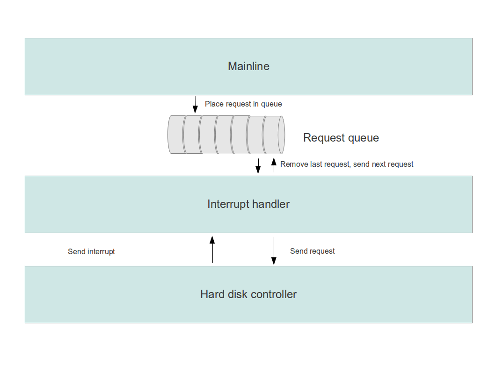
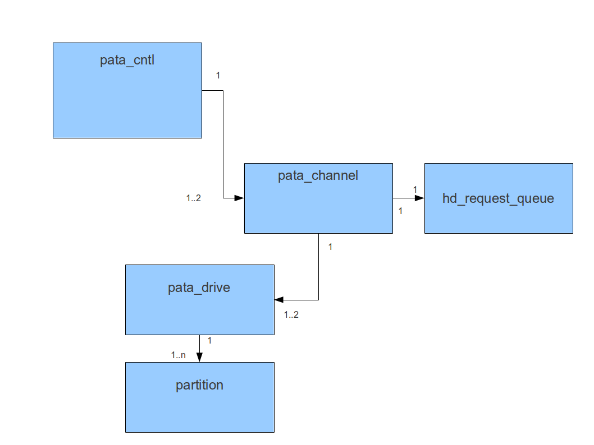
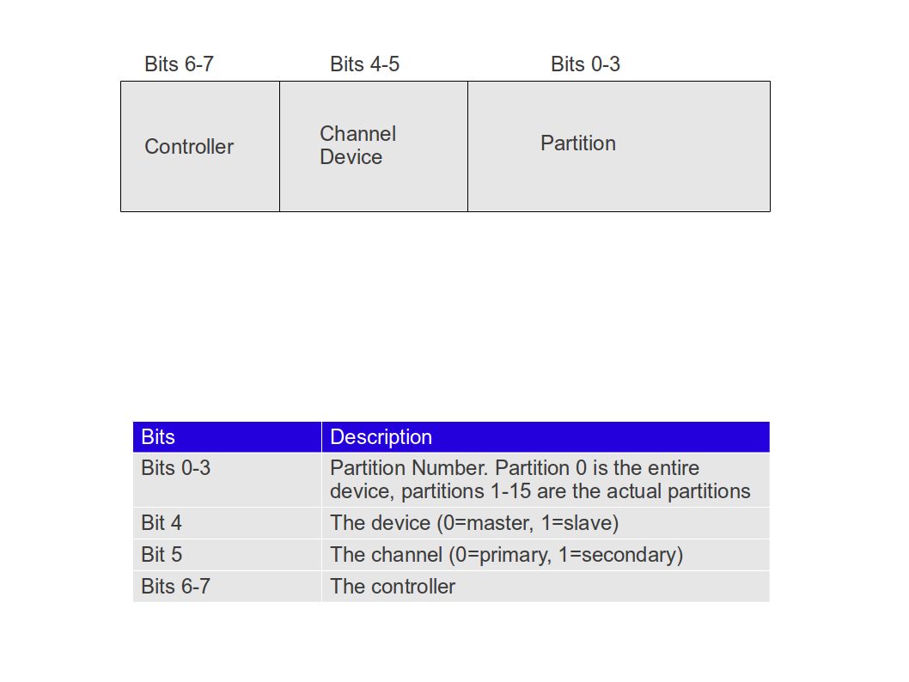
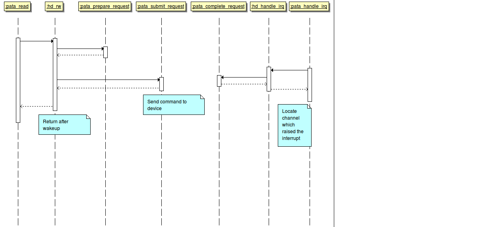
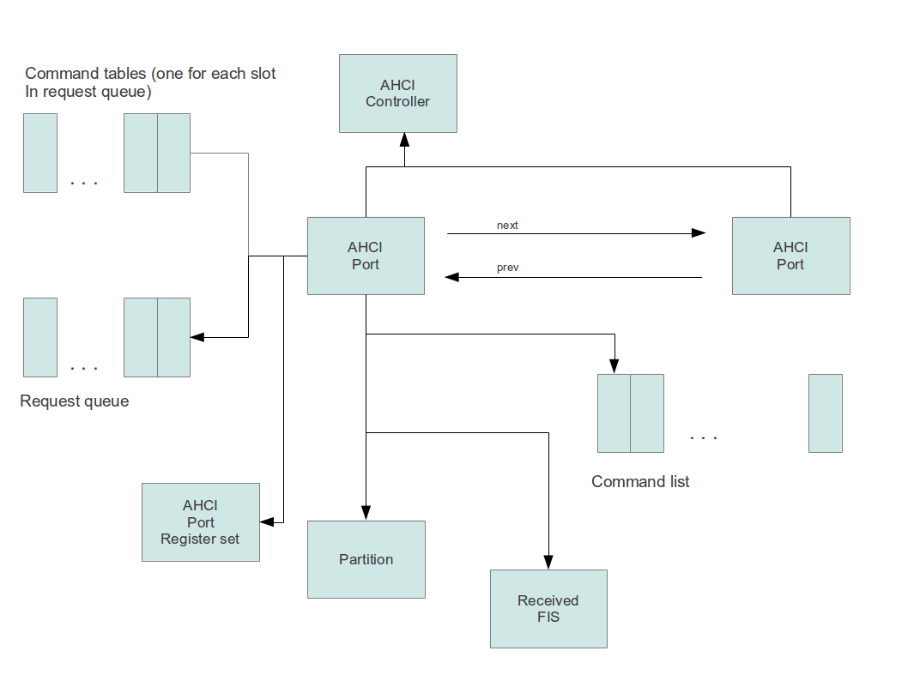

# The ctOS harddisk driver

This document describes the ctOS harddisk driver. Currently, two
different protocols are supported: parallel ATA (PATA) and SATA via
AHCI. Even though these two ways to communicate with a disk controller
appear to be different at the first glance, they have a lot of 
principles in common and in fact share a large part of the protocol
layer. Therefore some design patterns and functions within the harddisk
driver are used by both protocol specific drivers. Consequenty, the hard
disk driver consists of three different modules:

-   hd.c which contains common code and some utility functions
-   pata.c which contains the code for the PATA driver
-   sata.c which contains the AHCI/SATA driver

## Common design patterns and functions

### General approach

When a hard disk controller services a request, it goes through a series
of states. Consider, for example, an ordinary read operation. Initially,
the controller is idle, waiting for a request. Then a request is started
by sending some commands to the controller, either by writing to
registers in I/O space (PATA) or by filling an in-memory data structures
and switching a flag which is polled by the controller (AHCI). Then the
controller starts to process the request and will be busy for a certain
amount of time. Once the request completes, the controller will place
the results in a memory buffer using DMA. It will then inform the CPU by
issuing an interrupt that the request has completed and is ready to
process the next request.

At any time, only one request can travel through this chain of events
(at least as long as advanced features of the controller like native
command queuing are not used). Thus, access to the controller needs to
be serialized (in fact, that is not entirely true - for PATA, we only
need to serialize the access to a channel and for AHCI, we only need to
serialize access to a command slot - but we will get to this level of
detail later on). When a request is in progress, a thread that also
wishes to use the hard disk needs to wait until the drive is no longer
busy. To realize this, different approaches are possible.

Approach one uses a **semaphore**. When a thread wishes to send a request to
the controller, it first performs a down operation on the semaphore. If
the device was not busy at this time, the thread can continue and use
the controller. If, however, the device is busy, the thread goes to
sleep and is only woken up when the current request completes and the
thread owning the device performs an up operation on the semaphore.

Approach two uses a **queue** of pending requests. Assuming that the queue
is not full, a thread simply places a request in the queue and goes to
sleep. Once the request currently in progress completes, the driver
removes the next request from the queue, sends it to the device and
starts to process it. Whenever a request has been fully processed, the
owning thread is woken up and can work with the results of the request.

For ctOS, I have decided to use approach two and to use a **request queue**. This is
slightly more complicated, but has the advantage that the time during
which the drive is not busy is reduced compared to the first approach
because after an operation completes, the interrupt handler can simply
read the next request from the queue and send it to the device whereas
with approach one, the device would be idle until the task responsible
for the next request is scheduled again.

Consequently, our device driver has two parts. The first part, which we
call the **mainline**, implements the read
operation for the device. It will essentially assemble a request and
place it in the request queue. Then it goes to sleep until the request
has been processed. The second part, the **interrupt
handler**, is invoked when the drive has
completed a request. It wakes up the sleeping mainline, removes the next
request from the queue and sends it to the device.

To realize the request queue, we use a circular buffer. This avoids
concurrency issues between producer (i.e. a task putting a request on
the queue) and consumer (i.e. the interrupt handler sending the next
request to the device), but locks are still needed to protect the queue
from concurrent access by two providers.

In order to avoid lost wakeup issues when a thread is woken up because a
request which it has sent completes, we use a semaphore which is part of
the request to synchronize a thread and the interrupt handler.
Initially, this semaphore has value 0 so that a down operation on it
puts the mainline to sleep. Should however the interrupt fire before the
mainline code reaches that point, then the interrupt handler will set
its value to one and thus the down operation will return immediately.
Thus our first design draft for mainline and interrupt handler is as
follows.


__Mainline__

```
Assemble request
Get spinlock on tail of request queue
Add request to tail of queue
Release spinlock on tail of request queue
sem_down(request->semaphore);
```

__Interrupt handler__

```
request = request at head of request queue
sem_up(request->semaphore)
Remove request from queue
IF (request queue is not empty) THEN
  request = request at head of request queue
  Send request to device
END IF
```




However, there are a few potential issues with this simple design.

1.  Can it happen that the interrupt handler accesses the request in the
    queue while it is not yet fully assembled?
2.  If a request is placed in the queue while there is no request
    pending in the controller, the interrupt handler will never be
    called and the mechanism will come to a grinding halt
3.  the mainline needs to check whether the request queue is full. If
    yes, it could for instance sleep until the interrupt handler has
    removed an element from the queue. Thus an additional semaphore is
    needed to synchronize access to the queue in this case.

As to issue 1, it turns out that this problem can be avoided by a proper
implementation of the request queue as a circular buffer. In a typical
implementation, tail and head of the queue are 32 bit integer variables
which - modulo the buffer size - are used as index into an arrary. When
the mainline has placed a request in the queue, it increments tail by
one. Writing back the incremented value of tail into memory is an atomic
operation on x86 systems (as long as the variable tail is byte aligned).
Thus the interrupt handler will not see the new request until this
operation has completed.

To solve issue 3, we simply add an additional semaphore
*slots_available* to our design. The
initial value of this semaphore is the number of free slots in the
request queue. Whenever the mainline places a new request in the queue, it
calls *down* on this semaphore first. Thus the mainline will automatically
go to sleep if there are no free slots in the queue. The interrupt
handler will also call *up* on this semaphore if a request has been
processed and removed from the queue.

Finally, let us discuss issue 2. To solve this, the mainline needs to
send the request to the controller itself when it realizes that there is
no request being processed at the moment, i.e. when the device is not
busy. To keep track of this, a flag device_busy is maintained which is
protected by a spinlock. Whenever the interrupt handler places a new
request in the controllers registers, it sets this flag to one. If, at
some point in time, the interrupt handler realizes that the queue of
requests is empty and does not send a new request to the controller
immediately, it will set this flag to zero. When the mainline has added
a request to the queue, it checks this flag to see if there is a request
currently processed by the controller. If the flag is not set, the
mainline must not rely on the interrupt handler but send the request to
the device itself and set the busy flag to one afterwards.

The spinlock to protect the *device_busy*
flag also serves as a lock to avoid concurrent access to the device -
only code which holds this lock is allowed to send any requests to the
device. This is important if several mainlines are executed
concurrently, for instance on different CPUs in an SMP system. With this
lock in place, we can do away with the lock on the tail of the request
queue and use the same lock for both purposes.

Finally, after a request has complete, some cleanup steps might be
necessary to prepare the controller for the next request again. For
instance, the DMA protocol for IDE drives requires that the driver sets
the start/stop bit in the bus master command register back to 0 after
the request has completed to stop the DMA transfer. To perform these
cleanup activities, a function `complete_request` is called by the interrupt handler once a request has
been processed.

With all these changes, our algorithm now looks as follows (here we have
also worked out the handling of the circular buffer, which is an array
of requests, indexed by the integer variables tail and head 
and having QUEUE\SIZE elements:

__Mainline (hd_put_request)__
```
sem_down(slots_available);
spinlock_get(device_lock);
set up request
request_queue[tail % QUEUE_SIZE] = request;
tail++;
IF (0==device_busy) THEN
  submit(request_queue[head % QUEUE_SIZE]);                    // send  request to controller
  device_busy = 1;
END IF
spinlock_release(device_lock);
sem_down(request->semaphore);
Process read data
```


__Interrupt handler (hd_handle_irq)__

```
spinlock_get(device_lock);
request = request_queue[head % QUEUE_SIZE];
complete_request(request);                                     // perform necessary cleanup
sem_up(request->semaphore);
head++;
sem_up(slots_available);
IF (tail != head) THEN
  submit(request_queue[head % QUEUE_SIZE]);                    // send request to controller
  device_busy = 1;
ELSE
  device_busy = 0;
END IF
spinlock_release(device_lock);
```
It should be mentioned that this design has still one disadvantage. For
both types of controllers (PATA and AHCI), the system might need to wait
for some time until a new request can be issued to the device. If, for
instance, sending a new PATA request requires a switch from the master
to the slave on a channel, we have to wait until the channel indicates
via the BSY bit that it is ready again. Especially on older devices,
this might take some time. As this happens in an interrupt handler, the
CPU is blocked during this time. Other solutions for this might exist,
however for this release of ctOS, this disadvantage will be taken into
account  - usually, subsequent reads will address the same device in
which case the delays associated with the PATA protocoll are usually
only 1 ms or less and not a major issue.

Finally note a subtle point associated with using a circular buffer for
this purpose. Suppose that a thread places a request in the buffer and
goes to sleep. When the request has been processed by the device, the
interrupt handler calls *sem_up* on the associated semaphore. However,
it might happen that before the thread has a chance to execute again,
the buffer wraps around and the slot is reused. Therefore it is
necessary that each thread owns the semaphore used for a request itself,
i.e. the semaphore needs to be referenced by a pointer in the request
and allocated and freed by the thread itself.


### Working with DMA buffers

Both current PATA drives as well as SATA drives are usually capable of
performing a DMA transfer. This has several advantages over the older
PIO transfer mode. The obvious advantage is that the CPU is not kept
busy reading data from the controller, but can do something else
(running a different thread for instance) while the controller transfer
the data directly into main memory.

When assembling a request for the PATA or AHCI interface, the DMA buffer
to be used is presented to the controller in the form of a region table
(PRDT, "Physical region descriptor table"). Each entry in this list
refers to a contigous region of physical memory. When transfering data,
the controller will fill up these regions one by one until all data has
been transfered. Depending on the controller, there might be
restrictions on the layout of the DMA buffers, for instance alignment
restrictions.

Note that the DMA memory is specified in terms of physical addresses
because the DMA transfer is done by the DMA controller regardless of the
current context of the CPU.

For the allocation of DMA buffers, different approaches are possible.

1.  when a thread calls the read or write function of the driver, the
    thread is free to use any buffer in virtual address space. The
    driver will then allocate DMA memory which fulfills the existing
    alignment restrictions and use that for the transfer. Once the
    transfer has been done, it copies the data to the buffer provided by
    the caller of the read/write service. This needs to be done in the
    context of the caller and consequently in the mainline processing
2.  a thread needs to provide a buffer space to the read or write
    function of the driver which already respects the aligment
    restrictions. The driver then prepares a PRDT which splits the
    buffer into usable pieces. Thus the DMA controller will write the
    data directly into the buffer provided by the caller and no
    additional copy operation is necessary

To combine the advantages of both approaches, ctOS uses a mixed
approach. Before adding a new request to a request queue, the device
specific driver will check whether the provided buffer fulfills the
driver specific alignment requirements. If yes, this buffer is used as
DMA buffer and no additional copy operation is necessary. If no, the
driver needs to allocate an aligned buffer and use that buffer as
argument to `hd_put_request`. After the request has completed it then needs to copy the data
from this buffer to the original buffer and free the temporary buffer
again.

Setting up the DMA buffer and PRDT is done in the following steps.

-   the function `hd_put_request` which
    is responsible for adding requests to the request queue will call a
    function `prepare_request` which is
    driver specific
-   this function will allocate a PRDT - which might for instance be in
    a one-to-one relation with the entries in the request queue - and
    set up the PRDT to describe the buffer region provided by the caller
-   the function `submit_request` will then use this PRDT to assemble the
    request to the controller. Depending on the controller, this will
    usually imply that the buffer needs to be split into chunks which
    fulfil the alignment and size restrictions for DMA memory, and one
    entry in the PRDT is created for each chunk
-   consequently, the controller will access the buffer directly to
    write or read data and no further copy operation is necessary

Note that it is in fact necessary that the PRDT be set up within the
`prepare_request` function. The
alternative would be to fill the PRDT within the `submit_request`
function. However, this function is sometimes called within an interrupt
context and not within the address space context to which the read/write
buffer belongs. This makes it difficult to determine the physical
address of the buffer as the page table structures of the original
process in which the mainline executes is not present. Therefore we
haven chosen the approach to set up the PRDT in the context of the
mainline which is the context in which `prepare_request` executes.

Last but not least let us look at how error handling is performed in
this context. As some errors might only be detected in the interrupt
handler (for instance the ERR bit set in the ATA status register), a
mechanism needs to be in place to exchange error information between the
interrupt handler and the mainline. The request itself might look like a
good candidate to store an error code, however the request is removed
from the queue by the interrupt handler and might already be used by
another thread once the mainline wakes up. Therefore we only store a
pointer to an error code which is specific to the mainline in the
request, not the error code itself. The interrupt handler can place
error code information in this variable (which is allocated on the
kernel heap to be available to all processes) which can later be
evaluated by the mainline.


### Splitting a request into chunks

On real hardware, there are usually restrictions in place with respect
to the maximum number of sectors which can be read with one request.
These restrictions come from two sources.


-   the ATA protocol, which is also used by the AHCI SATA interface,
    only allows for a maximum of 65536 sectors per request, as the
    sector count register is a 16 bit register.
-   the size of the PRDT is usually limited and hence the size of the
    buffer space which can be used for DMA transfers has an upper limit

To handle this kind of limit, the function `hd_put_request` is never called directly by a lowlevel disk driver. Instead, the wrapper function `hd_rw` is
supposed to be used. This function will perform two additional
processing steps before eventually calling `hd_put_request`.


-   it will split the request into chunks, where the number of chunks
    (in sectors, i.e. usually 512 byte blocks) is retrieved from the
    request queue structure
-   for each chunk, it will verify that the available buffer is dword
    aligned and allocate a new, temporary buffer area if this is not the
    case

Then `hd_put_request`is invoked for each
chunk and the results are assembled in the original buffer.

A few words are in order with respect to the difference between sectors
and blocks. The hard disk driver usually operate on the level of actual
hard disk **sectors**. Both for ATA and AHCI drives, this is 512 bytes (even
though the specification is open for a flexible sector size in future
versions). All block numbers and block counts in the request structure
refer to hard disk blocks, i.e. sectors.

On higher levels, the kernel internally uses **blocks** of size 1024 bytes,
i.e. two sectors. Thus a call to a device drivers read interface
function requesting the read of one block means that actually two
sectors have to be read from the disk. The device driver is responsible
for converting the block numbers into sector number BEFORE calling any
of the public interface functions of the module hd.c.

### Requests and request queues

As already mentioned, the design pattern described above applies for
both PATA device drivers and AHCI device driver, and will probably be
useful for other devices as well in the future. Thus the interface to
the functions above is kept on a generic level to make them usable for
all device drivers.To realize this, functions which are needed to carry
out the algorithm above, but are specific to a protocol, are added as
function pointers to the request queue structure. This leads to the
following definitions for the request and the request queue structure.\

```
typedef struct {
    dev_t minor_device;                  // minor device number of device on which we operate
    u64 first_block;                     // start of read/write operation
    ssize_t blocks;                      // blocks to read/write
    int rw;                              // 0 = read, 1 = write
    u32 buffer;                          // address of buffer (virtual address)
    int* rc;                             // used to transfer error codes between IR handler and mainline
    semaphore_t semaphore;               // used to wake up issuing thread once request completes
    u32 data;                            // data container used to transfer driver specific data container
} hd_request_t;


typedef struct _hd_request_queue_t {
    u32 head;                            // head of circular buffer
    u32 tail;                            // tail of circular buffer
    semaphore_t slots_available;         // number of available slots
    int device_busy;                     // flag to indicate whether device is busy
    spinlock_t device_lock;              // synchronize access to device and protect busy flag
    void (*submit_request)
      (struct _hd_request_queue_t* queue,
       hd_request_t* request);           // submit a request
    void (*complete_request)
      (struct _hd_request_queue_t* queue,
       hd_request_t* request);           // complete a request
    void (*prepare_request)
      (struct _hd_request_queue_t* queue,
       hd_request_t* request);           // prepare a request
    ssize_t chunk_size;                  // maximum number of blocks per operation
    u32 block_size;                      // size of a block
    hd_request_t queue[HD_QUEUE_SIZE];   // actual circular buffer
} hd_request_queue_t;

```
### Reading the partition table

Another essential function offered by the module hd.c is the
function `hd_read_partitions`. This
function accepts a function pointer to a function which it can use to
read a sector from a hard disk and a pointer to a partition table. Each
entry in this table is an instance of the following structure defined in
hd.h which describes one partition.
```
typedef struct {
    int used;                // is this entry in the list of partitions used
    u64 first_sector;        // first sector of partition
    u64 last_sector;         // last sector of partition
} hd_partition_t;
```

It will parse the primary and logical partitions found in the MBR of a
given device and add  according entries to the partition table. Here the
following numbering scheme is used.

-   The first entry in the table, i.e. the entry with index 0, is not
    used as by convention, partition 0 refers to the entire device
-   numbering of logical partitions starts at index 5
-   an extended partition itself is not added to the table, only the
    logical partitions it contains

Thus if a drive contains four primary partitions of which the last one
is an extended partition which in turn contains two logical partitions,
the primary partitions will be stored at index 1, 2 and 3, index 4 is
left empty and the two logical partitions will be stored at index 5 and
6.

In case this function detects an entry in the partition table which indicates that a
GPT partionining scheme is used ("protective MBR"), it continues to locate and parse the GPT and disregards all further entries in the MBR itself. This implies that in case of an hybrid MBR, only the GPT information is actually used.

### Public interface functions of the common HD driver utilities

The algorithm above leads to the following public interface functions
for the HD driver utilities.

<table>
<thead>
<tr class="header">
<th>Function</th>
<th>Description</th>
</tr>
</thead>
<tbody>
<tr class="odd">
<td>ssize_t hd_rw( request_queue,sectors, first_sector,rw,  buffer, minor)
</td>
<td>Execute the part of the algorithm described above which takes place in the mainline, i.e. reserve a DMA buffer, format a request and add it to the request queue and initiate the processing of the request queue is necessary. This function will also split the request into chunks if necessary 
</td>
</tr>
<tr class="even">
<td>hd_handle_irq(request_queue) 
</td>
<td>
Perform the part of the processing above which takes place in the interrupt handler. This function is called by a controller-specific interrupt handler which is also responsible for identifying the request queue to be used
</td>
</tr>
</tbody>
</table>


The PATA driver
---------------

### Data structures and public interface functions

An IDE/PATA controller usually manages two independent channels. Attached to each channel, there can be up to two devices, a master and a slave. Most controllers are capable of handling parallel requests to both channels, i.e. it is possible to send a request to the primary channel while the secondary channel is busy and vice versa. However, each channel can only control one device at a time, so that requests to master and slave attached to the same channel need to be serialized.
Consequently, there is one request queue per channel. The driver needs to be able to

-   identify channel and device given the minor device number (as this is the identifier for the drive which is used by a read/write system call),
-   navigate from the channel to the request queue, and
-   within the interrupt handler, identify the channel and the request queue attached to it in which the request to which an interrupt refers is stored

To allow for this, the controller builds up an internal data structure which reflects the hierarchy of controller, channel and device. This structure is displayed in the following diagram.



To be able to easily map a given minor device number to a controller, a channel, a drive and eventually a partition, a fixed mapping is used where each part of the 16 bit minor device number corresponds to one of these structures. To allow for up to four controller per machine and up to four devices attached to each controller, the following encoding has been chosen.



Thus there can be up to 15 partitions per drive. Note that the partition number 0 is always reserved for accessing the drive itself. When another partition is accessed, the driver will automatically correct the block number passed to the system call by the offset of the partition on the drive.

To simplify the navigation, the individual instances of the controller, channel and device structure are stored in an array and indexed by the respective part of the minor device number. Thus for instance there are four slots for the controller structure. Given a minor device number, the number needs to be shifted by 6 bits to the right and the result is used as index into this table. To get a channel for the minor device number, shift the device number by 5 bits to the right and use the remaining number between 0 and 7 as index into the array of channels and so forth. This wastes some physical and virtual memory, but memory is usually not a bottleneck on standard desktop PCs today (recall that ctOS is mainly meant to be and educational effort and is therefore targeted at a typical developer machine on which wasting a few MB of memory is not an issue).
To be able to cooperate with the generic driver functions in hd.c described in the previous section, a PATA driver needs to implement a number of public interface functions which are described in the following table.

<table>
<thead>
<tr class="header">
<th>Function<br />
</th>
<th>Description<br />
</th>
</tr>
</thead>
<tbody>
<tr class="odd">
<td>pata_init<br />
</td>
<td>Initialize the PATA driver. This function is responsible for detecting the drives present in the system (by using the interface of the PCI bus driver) and to build up the internal data structures shown above. In addition, the init function should reserve a sufficient memory area which can be used as DMA buffer. Note that even though detecting a drive requires a read from the device (via the ATA request IDENTIFY DEVICE), interrupts are disabled at this point in time. Thus the drives needs to be accessed using a poll on the status register, and all interrupts need to be either disabled or cleared to avoing left over pending interrupts<br />
</td>
</tr>
<tr class="even">
<td>pata_read<br />
</td>
<td>This function is the read interface function of the device driver. First, this function will determine the request queue and partition to use based on the minor device number. It will then add the offset of the partition to the block number used in the system call to get the physical block number. Then it invokes the function <span style="font-style: italic;">hd_rw</span> to initiate the processing of the request.<br />
</td>
</tr>
<tr class="odd">
<td>pata_prepare_request<br />
</td>
<td>Prepare a request by setting up a PRDT for the request<br />
</td>
</tr>
<tr class="even">
<td>pata_submit_request<br />
</td>
<td>Interface function called by <span style="font-style: italic;">hd_submit_request</span> to actually send a request to the controller<br />
</td>
</tr>
<tr class="odd">
<td>pata_complete_request<br />
</td>
<td>Clean up after a request has been processed<br />
</td>
</tr>
</tbody>
</table>

### Initializing the driver

To detect all usable IDE disks present in the system, the driver uses the PCI bus driver query function to retrieve all PCI devices which have base class 0x1 and sub class 0x1. For each of these drives, it uses the programming interface to verify that the device supports the PCI bus master specification (bit 7 set), all other drives will be ignored.
Then the entries for the primary and secondary channel are created in the array of available channels. For each channel, the I/O addresses of the bus master command register, the bus master status register and the PRDT register are determined and stored in the channel structure. If bit 7 of the bus master status register (simplex bit) is set for one of the channels, then the entire controller is not used as this mode is not supported by ctOS.
Finally, the drives attached to each channel are probed. To do this, the following algorithm is used for each drive (master and slave).

-   first, a soft reset is done for the respective channel. If the soft reset results in a timeout, it is assumed that the channel is not functional and hence that no drives are attached
-   then, the drive is selected. Again, if a timeout occurs, it is assumed that no drive is attached
-   finally, the command ATA IDENTIFY DEVICE is sent to the device. Then the status register is polled until the ERROR flag and the BSY bit are cleared, but the DRQ flag is set. If this results in a timeout, it is assumed that no drive is present

If this sequence of commands succeeds, the presence of an ATA device is assumed. Note that an ATAPI device will return an error if it receives an IDENTIFY DEVICE command, therefore ATAPI devices are not registered.

### Setting up the DMA buffers

The bus mastering IDE specification requires the usage of DMA buffer that need to fulfill the following requirements.

-   the PRDT entries used by the PCI bus mastering protocol contain the physical address of the DMA buffer, so the physical address needs to be known to the driver
-   each entry in the table refers to a contigous area of physical memory which is at most 64 kB in size
-   each of these regions must not straddle a 64 kB boundary in physical memory
-   the PRDT itself needs to be aligned on a 4-byte boundary and must not cross a 64 kB boundary

On the other hand, the 48 bit LBA extension foresees a 16 bit block count, i.e. up to 32 MB can be transferred with only one command and only one interrupt.
To respect all these restrictions, the following approach is implemented in the function `pata_prepare_request` to set up the PRDT for a request. The buffer provided by the caller of `pata_read` which is stored in the request structure is split into *regions*. Each region is the intersection of the buffer with a 4096 byte page in virtual memory. Thus the size of each region is restricted to 4096 bytes at most. Furthermore, each region will be contigous area not only in terms of virtual memory, but also in physical memory. As each region is entirely contained in one page, none of them will cross a 64 kB boundary.

For each region, an entry in the PRDT pointing to the physical base address of the region is created. Thus for a request which has the maximum size of 32 MB, 8192 entries will be created. As each entry is 8 bytes long, the total size of the PRDT is therefore restricted to 64 kB as needed. However, this only holds if the provided buffer is page aligned. If not, two of the PRDT entries will only account for less than 4096 pages, so that the actual usable maximum size of a request is 32 MB - 2\*4096 bytes, i.e. 65536-16 = 65520 blocks.

Apparently, the hard drive controller emulated by QEMU has a different behaviour and only allows a PRDT size of up to one page, i.e. 512 entries. Taking two entries for a partial page into account, this means that a buffer size of 510\*4096 bytes should not be exceeded. Therefore the chunk size is set to 4080 if a QEMU hard drive is detected in `pata_setup_drive`.

Also note that the same function needs to set the chunk size of the request queue to if one of the drives or both drives attached to the respective channel do not support the 48 bit LBA extension. In this case, we can read at most 255 sectors with one request, i.e. 255\*512 bytes, which is 32 pages.
To manage the available PRDTs, an array of PRDTs is maintainted which contains one entry for each slot in the request queue. The request at position X in the queue will use PRDT[X]. Thus no additional allocation mechanism is necessary to distribute the available PRDTs to the requests. 

### Processing requests

The main entry point to the PATA driver is the function `pata_read`. This function needs to execute the following steps to trigger and process a read request.

-   as the parameters to this function count the start address and number of blocks to read in 1024 byte blocks, it needs to convert these blocks into the actual block size of 512 bytes
-   it then needs to validate the minor device number by checking whether the respective drive actually exists
-   if the drive exists, it identifies the request queue to be used and calls the function `hd_rw`

The following diagram displays the interaction between the functions defined in hd.c and the functions defined in the actual PATA driver when a read is performed.



As explained above, the function`pata_submit_request` is responsible for actually submitting a request to the device. For this purpose, it processes the following steps.

-   put the physical address of the PRDT (which has been prepared by `pata_prepare_request` into the PRDT register
-   Set up the bus master command register, i.e. clear start/stop bit and set read/write bit as needed
-   Clear interrupt bit and error bit in the bus master status register by writing 1 to them
-   Wait until BSY and DRQ bit in the IDE status register are cleared
-   Select the device
-   Set up LBA register, sector count register and device register
-   Issue the read respectively write command
-   Set the start bit in the bus master command register

### Handling interrupts

When handling interrupts, it is important to keep in mind that several channels can share one interrupt. In fact, this is the standard case when an IDE PCI device operates in native mode, as in this case, both channels are placed on the same PCI device and hence use the same interrupt. Thus the interrupt handler logic needs to be prepared for the case that a second interrupt from another channel is raised while one interrupt is processed. Therefore, the following steps need to be executed within the interrupt handler.

```
Scan all registered channels
For each channel, compare the IRQ used by the channel to the IRQ raised
if they match, then
    read the interrupt status bit (bit 2) from the bus master status register
    if this bit is not set, indicating that the channel has not raised an interrupt,  proceed with the next channel
    read from the channels IDE status register to clear any pending interrupts
    clear the interrupt status bit
    determine the request queue associated with the channel
    call `hd_handle_irq`
```

This logic makes sure that if for instance the secondary channel raises an interrupt before the interrupt status bit has been read for the secondary channel, it will be processed within the currently running interrupt handler. If the secondary channel fires after the read has been completed, i.e. after the bus master status register of the secondary channel has been read, the currently running handler will complete, leaving the secondary channel unchanged. If then hardware interrupts are enabled again, the handler will be invoked for the second time and the secondary channel is processed.

In addition, the interrupt handler is responsible for detecting error conditions and communicate them to the mainline. For this purpose, the function `hd_put_request` places a pointer to a thread-local return code in the request structure. The interrupt handler can then evaluate the channels status register and the bus master status register. If an error occurs, it will put a non-zero error code into the return code referred to in the request structure. Note that this return code must not be placed on the stack, as the interrupt might be raised when a different process is executing.

The AHCI driver
---------------

### Data structures

Recall that an AHCI controller (usually called HBA) controls up to 32 ports to which actual devices can be attached. Each port operates independently of the other ports and requires the setup of the data structures in memory which are used by the AHCI standard for the communication between HBA and CPU. Specifically, there needs to be one command list per port and one "Received FIS" data structure per port.
AHCI allows for command lists containing up to 32 entries per port. As long as native command queuing is not used (which is not the case for this release of ctOS), the commands in this list are processed in a linear fashion by the controller. Therefore there is no real parallel processing even if more than one command slot is actively used. In order to keep the implementation simple and to be able to share as much common code with the PATA driver as possible, it has been decided to only use one command slot per port (entry 0 in the command list) and to handle command queuing entirely via the request queue mechanism described above. Note that this design might have to be revised in a later release of ctOS when NCQ is implemented.
Each entry in the command list points to an AHCI command table which contains the command FIS and the physical region descriptor table (PRDT) used by the command. Similarly to the PATA driver, we maintain a list of command tables per slot the entries of which correspond 1-1 to the entries in the request queue, i.e. there is exactly one command table for each slot in the request queue. When a request is prepared in <span style="font-style: italic;">ahci\_prepare\_request</span>, this command table is set up. Later, within <span style="font-style: italic;">ahci\_submit\_request</span>, the command list entry at index 0 is made to point to the command table for the respective request.
In addition, we attach a list of partitions to a port and use a structure describing the ports in-memory register set to be able to easily access the registers of a port. The resulting data structures and relations between controllers (<span style="font-style: italic;">ahci\_cntl\_t</span>), ports <span style="font-style: italic;">(ahci\_port\_t</span>), request queues, command lists and command tables is summarized in the following diagram.

 

Note that most of these data structures are subject to certain aligment and size restrictions which originate from the fact that they are accessed via the DMA controller and hence need to have a specific layout in physical memory as well. The following table summarizes the restrictions which are in place and the impact on the implementation.

<table>
<thead>
<tr class="header">
<th>Restriction<br />
</th>
<th>Corresponding implementation detail<br />
</th>
</tr>
</thead>
<tbody>
<tr class="odd">
<td>The &quot;Received FIS structure&quot; needs to be a consecutive area in physical memory and aligned at a 256 byte boundary<br />
</td>
<td>As the length of the structure is 256 bytes only, this condition can be fulfilled by allocating the virtual memory with a call to kmalloc_aligned so that it is aligned on a 256 byte boundary in virtual (and consequently also in physical) memory and does not cross a page boundary<br />
</td>
</tr>
<tr class="even">
<td>The command list needs to be a consecutive area in physical memory which is aligned at a 1024 byte boundary<br />
</td>
<td>The total size of a command list is only 1 kB and hence less than a page. We can therefore fulfill the conditions by using a call to kmalloc_aligned which requests a page-aligned area in virtual memory.<br />
</td>
</tr>
<tr class="odd">
<td>Each command table needs to be aligned at a 128 byte boundary and needs to be a consecutive area in physical memory<br />
</td>
<td>To fulfill this condition, the driver reserves an array of command tables in the kernel BSS section and hence in the area which is mapped 1-1. The entire array is aligned to a 128 byte boundary. As the size of each indivual command table is a multiple of 128, this also holds for each invidiual command table within the array<br />
</td>
</tr>
</tbody>
</table>

A part of the command table structure is the PRDT which is used by the DMA engine. Hence the maximum size of the PRDT needs to be fixed at compile time. Each entry in the PRDT has a size of four dwords, i.e. of 16 bytes. To make sure that the size of the entire command table is a multiple of 128, the maximum number of entries needs to be a multiple of eight.
Another restriction on that size is again - similarly to the PATA driver - the number of bytes which can be transferred with one request, i.e. the chunk size. With a 16 bit sector count as it is foreseen by the standard, we can read up to 65535 sectors at 512 bytes, i.e. slighlty less than 32 MB (8192 pages) at a time. If we set up a PRDT in which one entry corresponds to one page within the buffer and take into account that we might need two entries for partial pages, we see that we need at most 8192 + 1 = 8193 entries in the list. To reach a multiple of eight, we therefore use a maximum size of 8200 entries.
Note that on QEMU, the number of entries a PRDT can have seems to be restricted to 168. Therefore the driver will scan for QEMU drives during initialization and reduce the chunk size to 1328 if a QEMU hard disk is found.

### Initialization

To initialize the AHCI driver, the PCI bus driver is used to retrieve a list of PCI devices which present themselves as AHCI controller (base class 0x1 and sub class 0x6). For each AHCI controller which has been detected in this way, the following initialization steps are performed by the function `ahci_register_cntl`:

-   set up an instance of the structure ahci_cntl_t which represents a controller and add it to the linked list of AHCI controllers
-   map the memory I/O register space of the controller into the virtual address space of the process
-   check that the controller is enabled (bit 31 in the GHC register of the controller) and enable it if necessary
-   set the interrupt enable bit in the GHC register to enable interrupts from this device
-   scan the PI register and for each bit in this register which is set (indicating an implemented bit), call the function `ahci_register_port` to register and initialize the corresponding port

When setting up a port, it has to be observed that the pure fact that a port is implemented by the HBA does not imply that a device is actually attached to this port. Therefore the ports PxSSTS register is read first to determine whether a device is attached. If bits 0-3 of this register are different from 0x3, it is assumed that no device is present and the initialization for this port is aborted.

When a device has been detected in this way, the next step in the initialization sequence is a port reset to make sure that the signature of the device in the signature register PxSIG is up to date. This reset (COMRESET) is implemented in the function `ahci_comreset`. 

Next memory is allocated as described above for the command list and the received FIS structure and the corresponding pointers in the port structure are set up. Then the device is started, i.e. the FIS command engine and the DMA engine are initialized and started. 

At this point, the signature becomes available and can be read from the signature register. If the signature indicates that the device is an ATAPI device, the initialization is stopped as this is not yet supported by ctOS.

Once this has been done, the command IDENTIFY DEVICE is submitted to get the model string which is also stored in the port structure. Finally, the partition table is read. Note that similar to the PATA driver, a synchronous version of the AHCI read function is used to read the partition table from disk as at this point in time, interrupts are not yet enabled.

### Executing read and write requests

Reading and writing from/to an AHCI drive is very much along the lines of the processing as described for the PATA driver above, using the utility functions in hd.c and the general request queue based mechanism described in the first few sections of this document. To explain the AHCI specific steps, let us look at the implementation of each of the functions referred to in the request queue structure.

__ahci_read__

This function first scans the list of known ports and their associated partitions to validate the minor device number and to determine the responsible AHCI port. It then converts the block number passed as arguments into sector numbers, taking partition offsets into account. Then the request queue is extracted from the port and the function `hd_rw` is invoked to process the request.

__ahci_prepare_request__

This function is responsible for setting up the command table and in particular the PRDT contained in it. It splits the buffer into chunks where each chunk is the intersection of one page with the buffer area, and creates one entry in the PRDT for each chunk. Then the fields in the AHCI command FIS which is also part of the command table structure are initialized.

There is one sublety which needs to be observed at this point. The number of entries in the PRDT is known to this function, but needs to be stored in the command header, not in the command table itself. As the command header is only filled by the function `ahci_submit_request`, we need to store the PRDT length somewhere where it can later be accessed by `ahci_submit_request`. For this purpose, the container field data in the request structure is used. Thus this field most not be used or overwritten by any other function in the driver.

__ahci_complete_request__

This function is currently empty and does not do anything.


__ahci_handle_irq__

Due to the fact that interrupts might be shared between more than one device and that even if this does not happen, all ports of an AHCI controller use the same interrupt, some logic is necessary in the interrupt handler to detect the source of the interrupt. First all controller which have registered for the given interrupt are checked. For each controller, the global interrupt status register IS is read. This register contains 32 bits, each bit corresponding to one of the ports of the controller. Each bit which is set indicates that the corresponding port has a pending interrupt.
For each port identified in this way, the local interrupt status register PxIS is read next to determine the cause of the interrupt. Only the bit DHS (D2H register FIS received) is used and evaluated. 

If this bit is set, this is an indication that a request has completed for this port and consequently the bit is cleared and `hd_handle_irq` is called. Note that it is actually necessary to clear the bit in PxIS before calling the interrupt handler in hd.c as this handler might send the next request to the device. If this request completes before we have returned from the interrupt handler, and raises another interrupt, PxIS will already be set and the interrupt will be lost. For the same reason, we need to clear the bit corresponding to a port in the global interrupt register IS before actually processing this interrupt.


