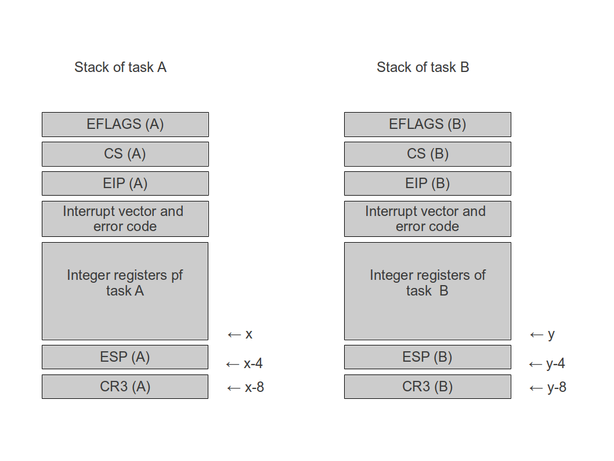
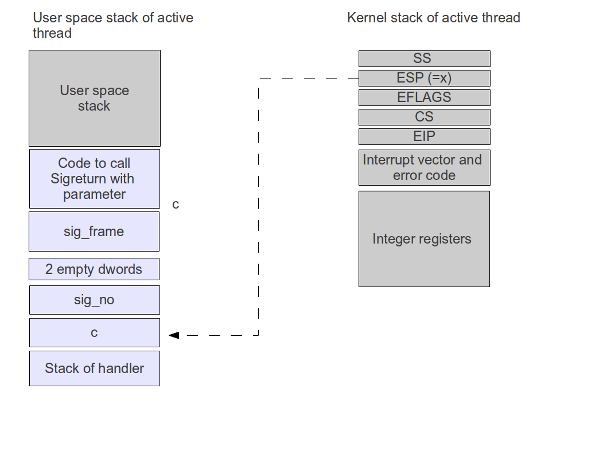

# Interrupt handling

## Overview

The interrupt manager is the part of the kernel that is responsible for setting up interrupt controllers and timer and dispatching incoming interrupts to device drivers. A device driver can register an interrupt handler for a given interrupt vector which will then be called whenever that interrupt vector is received by the CPU.

When an interrupt is raised by an interrupt controller (PIC or APIC), processing always starts in the function `gate_xxx` defined in hw/gates.S, where xxx is the interrupt vector. This function prepares the stack and then enters a common interrupt handler `gate_common` defined in the same module. The common handler will now push all general purpose registers and a few special registers onto the stack to save the current state of the CPU and then calls the dispatcher `irq_handle_interrupt` defined in irq.c.

The main responsibility of the dispatcher is to forward the interrupt request to the device driver. For this purpose, the function scans a table of know interrupt handlers and calls the handler which has been requested for the given interrupt vector. A special processing is invoked if the interrupt vector is 0x80. This interrupt number is reserved for system calls and thus the interrupt handler calls the system call dispatcher to locate and execute the proper system call.

For any interrupt, the scheduler is invoked next to determine the next task to run which is then handed over to the process manager to prepare the task switch. Finally, an EOI message is sent to the interrupt controller to acknowledge the interrupt if needed.

After `irq_handle_interrupt` returns to `gate_common`, the second phase of the interrupt processing starts. In this phase, the original state of the CPU is reconstructed from the stack. If needed, a special processing called post-interrupt processing is invoked which is used to execute code within the context  of the currently running task before a task switch happens, but using a common kernel stack. Finally, the IRET instruction is executed and the processing of the interrupt is complete.

## Stack Layout

To be able to set up new interrupt handlers easily, all interrupts are processed by a common interrupt handler. This handler uses a table containing function pointers to identify the actual handler to be called and takes care of all necessary setup activities.

When an interrupt occurs, the interrupt handlers needs to be able to read and change the following information

* content of all registers at the point in time when the interrupt occured
* return address (selector and offset)
* stack pointer value before the interrupt occured
* reason why the interrupt occured, i.e. interrupt number and potentially error code

Having this information and being able to change it will allow interrupt handlers to switch tasks and stack areas and will allow the in-system debugger to access this data.  To be able to process all kinds of interrupts in a common interrupt handler, all interrupt handlers will first add data to the stack to achieve a common stack layout before invoking the common interrupt handler. The common handler will then make this data available to the specific interrupt handlers as an instance of the structure `interrupt_context`.

When an interrupt is raised, the x86 processor will add the following data to the stack:

- EFLAGS (4 byte)
- code selector (as double word, only the LSB word is filled)
- return address (EIP, 4 byte)
- error code (only in some cases)

The interrupt handlers needs to add the following information:

- error code (if not added by the CPU)
- number of interrupt
- current value of stack pointer
- value of all integer registers

To be able to store the stack pointer, we will have to use one of the integer registers to hold the value of ESP temporarily, as it is not possible to push ESP directly on the stack. We will use EBP for that purpose, thus we have to push that first.

There is one additional complication we need to take into account: when an interrupt is raised in user mode (for instance a system call), we will switch to kernel mode to process it. In this case, the CPU will automatically switch the stack to a stack area described in the TSS of the current task. Thus we will have to reserve a stack area within the kernel memory area for each task. This stack is called the kernel stack of the task. Its address is saved in the kernel structure describing this task, and the TSS is updated during tasks switchs to always point to the kernel stack of the current task.

The processing of interrupts then follows the following pattern:

1. a specific interrupt entry point is invoked
1. if the CPU has not added an error code, push a dummy error code (long word) on the stack
1. push the number of the interrupt (as long word)
1. jump to the common part of the code
1. push integer registers and ds, cr2
1. push esp and cr3
1. invoke common interrupt handler


Thus in an interrupt context (within the common handler), the stack looks as follows (each row in the following table describes 4 bytes):

| |
|:---:|
| EFLAGS before entering the interrupt handler |
| Code selector old |
| EIP old |
| error code |
| interrupt number (vector) |
| eax |
| ebx |
| ecx |
| edx |
| esi |
| edi |
| ebp |
| ds (as 32 bit number) |
| cr2 |
| esp |
| cr3 |

Note that the value stored in the field "esp" in this diagramm is the value of the stack pointer immediately after pushing cr2, i.e. it is the adress of the field labeled cr2! This structure is defined in irq.h as `ir_context_t`.

Also note that if an interrupt occurs while code in ring 3 (user space) is executing, the CPU will in addition determine the location of the kernel stack using the TSS and - before pushing any of the values above - push the value of the old stack segment (SS) and old stack pointer (ESP). 

After returning from the common interrupt handler, the handler needs to do the following:

1. pop old value of cr3 into eax
1. pop old value of esp back into ebx
1. move ebx to esp and eax to cr3
1. pop all other registers in reverse order
1. increase esp by 8 to jump over interrupt number and error code
1. iret

## Specific and common interrupt handler

For each registered interrupt, an interrupt handler is declared in the file gates.S. By convention, this handler is called "gate_xx", where xx is the decimal code of the interrupt (starting with 00).

This handler will store error code and interrupt number as above and will then jump to the common handler, which is also defined in gates.S. Note that we use a jump, not a call, as a call would add another long word to the stack.

Within gate_common, the stack is set up as described above, and then a C function `handle_interrupt` defined in irq.c is invoked. This function looks up the actual handler in an array of function pointers, invokes this function and returns to gate_common, where the processing is completed as described above. When this function is invoked, the current stack is made available as an instance of the structure `ir_context_t`. 

Note that all interrupt gates are declared as so called "Interrupt gates", which implies that no further hardware interrupts can occur while processing the handler. 

## Task switching

In ctOS, task switching is only done during the processing of an interrupt. Task switching works by overwriting a small part of the interrupt context on the stack of the current task with previosly saved values from another task so that the CPU is tricked into picking up the full CPU state from the stack of the new task. As this includes the CR3 register, execution will continue with the register values, the stack and the virtual address space of the target task.

During a task switch, only two of the double words saved on the stack and accessible via the interrupt context are manipulated, namely the register CR3 and the stack pointer register ESP. To understand why this is sufficient, let us look in detail at what happens during a task switch. The following diagram shows the stack layout of two tasks called A and B at a point in time when task A is currently executed and was interrupted.



Let us denote the location of the last saved integer register of task A by x. Then the stack pointer of task A will be saved a address x-4 and the CR3 register of task A will be saved at address x-8. Similarly, let y denote the address of the last integer register of task B. Note that x and y might be located in different virtual address spaces (in case A and B belong to different processes) or the same virtual address space (in case A and B are threads within the same process). Also note that, as the memory location denoted by ESP for the respective process contains the value of the stack pointer register after pushing the last integer register to address x, ESP (A) = x and ESP (B) = y.

To achieve a task switch, the function `pm_switch_to` in the process manager pm.c is called. This function will retrieve the saved values (which are written into a kernel structure stored separately from the stack) when we switch away from a task) of the registers ESP and CR3 of task B from the task structure of task B. It will then overwrite the values of ESP and CR3 on the current stack with the values of task B. After having done this, the stacks of the two tasks now look as follows.


All this is done within an interrupt handler. When this interrupt handler has completed its work, the common handler is entered again. The code within the common handler will now start to pop the register of task A off the stack again. First, CR3 is popped and stored in register EDI and ESP is popped and stored in register ESI. However, as we have patched the stack, ESI now contains the saved ESP value of task B, i.e. y, and EDI now contains the saved CR3 value of task B.

Now ESI is moved to ESP and EDI is moved to CR3. Thus, CR3 now contains the physical address of the page table directory of **task B**, i.e. we operate in the virtual address space of task B. Furthermore, ESP contains the previously saved stack pointer of task B, i.e. y.

When now the common handler continues to pop the remaining register off the stack, it will therefore pop the saved integer registers of task B, the program counter of task B and so forth. Thus the CPU is now in exactly the state in which it was when task B was interrupted and the context of task B was created on the stack. We have achieved what we want - a task switch to task B.

It is vital at this point that in the common handler, ESP and CR3 are popped into integer registers first and then moved to ESP and CR3 at the same time. If, for instance, we would first get CR3 from the stack, move it into CR3 and then try to get ESP from the stack, we would try to access memory location x-4 in the address space of task A. If A and B are not in the same process, this would probably result in a page fault.

Note that if a task switch occurs between two tasks which belong to the same process, we overwrite CR3 again with the same value. As every write to CR3 causes the TLB to be flushed, this makes a task switch unneccessarily slow. To avoid this, we compare old an new value of CR3 and only perform a write to CR3 if these two values are different.

## Post interrupt handler

An additional complexity in the common interrupt handler arises out of the fact that it is sometimes necessary to execute a part of the interrupt handler on a common kernel stack. Consider for instance the case that a task has called exit() to complete itself. The system call exit() executes on the kernel stack which is specific to this task. If we now start to tear down the page tables of this task and return all allocated physical pages to the pool, we will also remove the mapping for this kernel stack, resulting in a page fault.

To solve this and similar problems, a post interrupt handler executes on a common kernel stack which is located in the area of memory which is mapped 1-1. This post handler is only invoked if a task switch occurs during the interrupt.

If this is the case, the following actions are performed.

* get the saved values of ESP and CR3 from the current stack - note that these values have been altered by the interrupt handler to force a task switch as described above
* switch to the common kernel stack (in fact, the return value from irq_handle_interrupt is used at new top of stack)
* push ESP and CR3 again onto this stack
* invoke the post interrupt handler `irq_post` defined in irq.c
* pop ESP and CR3 again
* load ESP and CR3 with these values as described above, potentially leading to a task switch

Thus in case of a task switch, the post interrupt handler still executes within the address space of the previously active task. Note, however, that calls to pm_get_task_id will already return the task ID of the new task. Similarly, calling pm_get_pid will return the new process ID.

## Handling the FPU state during a task switch

Special attention needs to be on the FPU state during a task switch. As saving and restoring the FPU state with every task switch is rather inefficient as most tasks do not use the FPU at all, an alternative approach is needed. In a uniprocessor system, an obvious approach would be to use the built-in ability of the x86 CPU to raise an exception when the FPU is used first (see further below for a description of that process) so that only at this point, the FPU state is saved and the FPU state of the current thread is restored. If, for instance, task A and task B both use the FPU and a task switch from A to B is done, the FPU state is not yet saved as part of the task switch. Instead, task B starts to execute and raises an exception if the FPU is used first. Whenever this happens, the current - still unmodified - state of the FPU is saved in a data structure associated with task A and the corresponding data structure for task B is used to load the FPU state from there.

This approach, however, raises the complexity significantly on an SMP system. On such a system, it might be that a task is migrated to a different CPU. If the FPU state of that CPU is not saved at this point in time, the CPU needs to be interrupted artificially, for instance using an IPI, if the FPU state of that CPU is needed. Even thought this is of course possible, ctOS uses a different approach.

* for each task, a flag fpu is maintained in the task structure
* this flag is set to 0 whenever a task is scheduled on a CPU
* if, during the current time slice, a task uses the CPU for the first time during that time slice, the flag is set to 1
* in addition, it is checked whether there is a saved FPU state for this task
* if yes, this state is restored
* if a task has completed its time slice and the fpu flag is set, the FPU state is saved and fpu is set back to 0

To maintain the fpu flag, we use the mechanism offered by the x86 CPU for that purpose. If the TS bit (bit 3) and the MP bit (bit 1) of CR0 are both set, the CPU raises the #NM exception (INT 7) whenever the FPU is used. The handler for this exception (pm_handle_nm_trap in pm.c) then needs to execute the CLTS instruction to clear the TS flag again and can set the fpu flag. 

## Signal handling

The final ingredient to the complete handling of interrupts is the handling of **signals**. Signal handling is done whenever an interrupt has been processed, but before invoking the post interrupt handler and consequently also before a potential task switch occurs (in fact, the entire interrupt handling is done in `irq_handle_interrupt` **before** calling the scheduler, as processing of a signal like SIGKILL or SIGSTOP might have impact on the process status). Interrupts are only processed if the value of CS on the stack indicates that the interrupt was raised while the CPU was in ring 3, i.e. in user mode.

To process a signal, we need to be able to force the current thread to continue execution in user space within the signal handler. When executing, the signal handler needs to find a stack to its disposition on which up to three arguments are available. When returning, execution should be resumed at the point at which the interrupt has been initiated, i.e. the CPU should be in the same state as if the signal handler had not been executed at all. This includes saving all integer registers before the signal handler is invoked and restoring them before resuming execution.

As an additional complication, the signal handler should be able to make system calls and switch to kernel mode again. As this will overwrite the kernel stack of the thread, we need to consume the entire kernel stack again as it is the case for an ordinary IRET before starting the execution of the interrupt handler.

All this is accomplished by manipulating the interrupt context of the active thread such that it resumes execution at a specified address - the signal handler - after the IRET has been executed and such that the signal handler executes on a prepared stack. The following diagram summarizes the necessary manipulations which we will look in detail now. The areas marked with light grey are those which are established by the signal processing code.



The sig_frame structure is a structure which is used to store the content of the CPU and some other information like the currently active signal mask on the user space stack for later use. When the execution of a signal handler is prepared, this structure is filled with the values taken from the current interrupt context. Thus if a signal is delivered, the following happens.

* First the kernel will prepare the user space stack as indicated in the picture above.
* Then the existing IR context is saved in the sig_frame structure on the user space stack
* In addition, the current state of the FPU is saved in the sigframe structure
* The kernel will then manipulate the existing interrupt context as follows:
    * the existing value of ESP is overwritten with the the new top of the stack, i.e. the address at which c is stored
    * the existing value of EIP is replaced with the address of the signal handler
* then the interrupt handler in irq.c continues as usual and returns to the common handler
* The common handler will handle return to user space as always, with the exception that, due to the manipulations described above, the user space code will start to execute the signal handler with ESP pointing to c
* Thus the stack layout is as if the signal handler would have been invoked with return address c and the arguments (currently the signal number and two empty dwords for future extensions) pushed on the stack
* When the signal handler has completed, it performs a return statement which pops c off the stack
* Now execution will continue at address c and the code placed there will get the signal number and a pointer to the sigframe structure from the stack and use it as arguments to the sigreturn system call
* The sigreturn system call now needs to restore the previous interrupt context so that when it completes, we return to the point in the user space code were we left off:
    * copy the content of the sig_frame to the current IR context (this includes the old value of EIP)
    * restore the previous value of ESP
* Now the sigreturn calls completes as usual and the execution of the userland code is resumed

Note that the return from the sigreturn system call might even include a task switch or the delivery of additional pending signals. 

## Restarting a system call

In some situations, it is necessary to restart a system call using an exact copy of the interrupt context as it was when the first invocation was done. To achieve this, the interrupt manager code is actually organized as a loop, with the following structure.

```
restart = 0
first_execution = 1
Determine new execution level and store old level on stack by calling pm_update_exec_level
WHILE (restart OR first_execution) DO
  IF (first_execution) THEN
    first_execution = 0
    save interrupt context on stack
  END IF
  IF (restart) THEN
    retrieve interrupt context from stack and copy it back to working copy
  END IF
  IF (interrupt is a system call) THEN
    dispatch system call
  ELSE IF (interrupt vector is > 31)
    call respective device driver if registered for this interrupt
    handle EOI processing
  ELSE
    handle exception
  END IF
  restart = pm_process_signals
END WHILE
IF (previous execution level is user space or kernel thread) THEN
  pm_handle_exit_requests
END IF
restore previous execution level by calling pm_restore_exec_level
IF (execution level is not interrupt level) THEN
  call scheduler and trigger task switch
END IF
```

Thus the signal handling code can force a restart of the currently processed system call by returning 1 from pm_process_signals. If no restart is required, the signal processing code is also responsible for adapting the return code in the interrupt context if required.


## Initialization

Having discussed the actual interrupt processing, let us now take a short   look at the initialization phase. At startup, the function `irq_init` in the interrupt manager is called. The processing in this function depends on the value of the kernel parameter `apic`. If this is set, the function first tries to locate an I/O APIC, using either the MP tables (as previously parsed by mptables.) or APCI. If an APIC could be find, the APIC will be initialized, otherwise the PIC will be used.

If the PIC is to be used, the functinon `pic_init` in the PIC driver is called. In this case, the mapping of interrupts to vectors is trivial - the base address is hard coded to be 0x20, so that the PIC input line n is mapped to the vector 0x20 + n. Then all interrupts are enabled.

If the APIC is used, the PIC will be set up as well, but all interrupts will be disabled in the PIC. 

Now suppose a PCI device is in its setup phase. The device will then call `irq_add_handler_pci` in the interrupt manager. Depending on the mode set in `pic_init`, the input of the interrupt controller to which the device is connected will either be determined using the entry in the PCI configuration space (PIC) or the MP table configuration (APIC). In APIC mode, a new redirection entry will be added to the APIC configuration, in PIC mode, only the assignment of a vector to the IRQ number will be done. In both cases, the interrupt handler will be associated with the vector so that it will be executed by the kernel whenever the interrupt is raised.

At the time of writing, ctOS does not support ACPI yet. As more and more motherboards do no longer create a full MP configuration table (a nice example is the ICH9 chipset emulated by Virtualbox, which only creates MP table entries for ISA interrupts), there is the option to add hardcoded entries to the table for specific devices and motherboards. This list is maintained in the array `forced_irq_routings` in irq.c.


