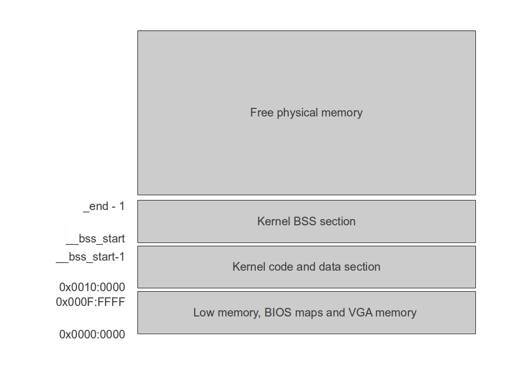
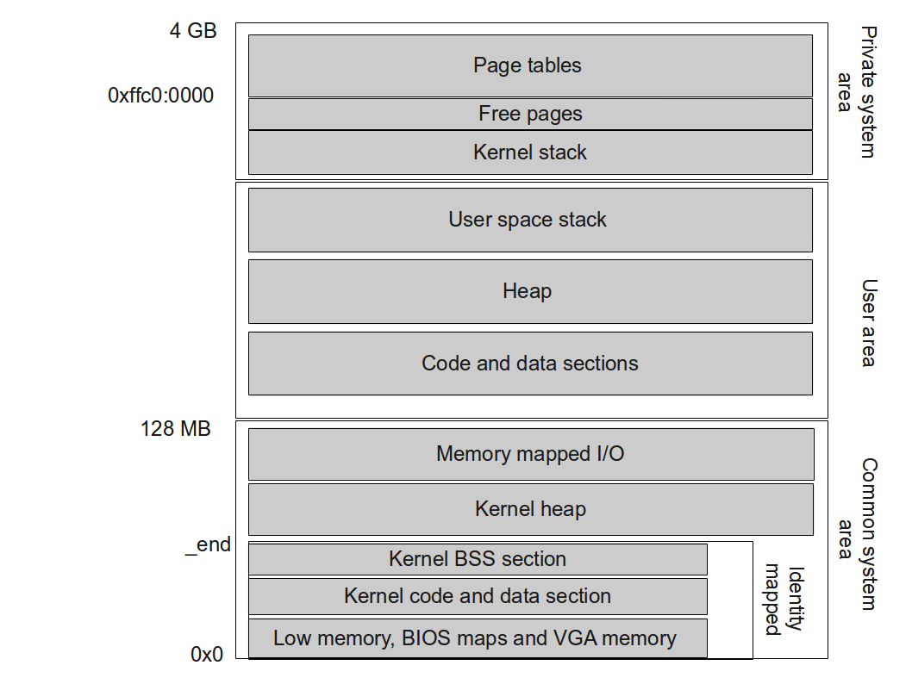
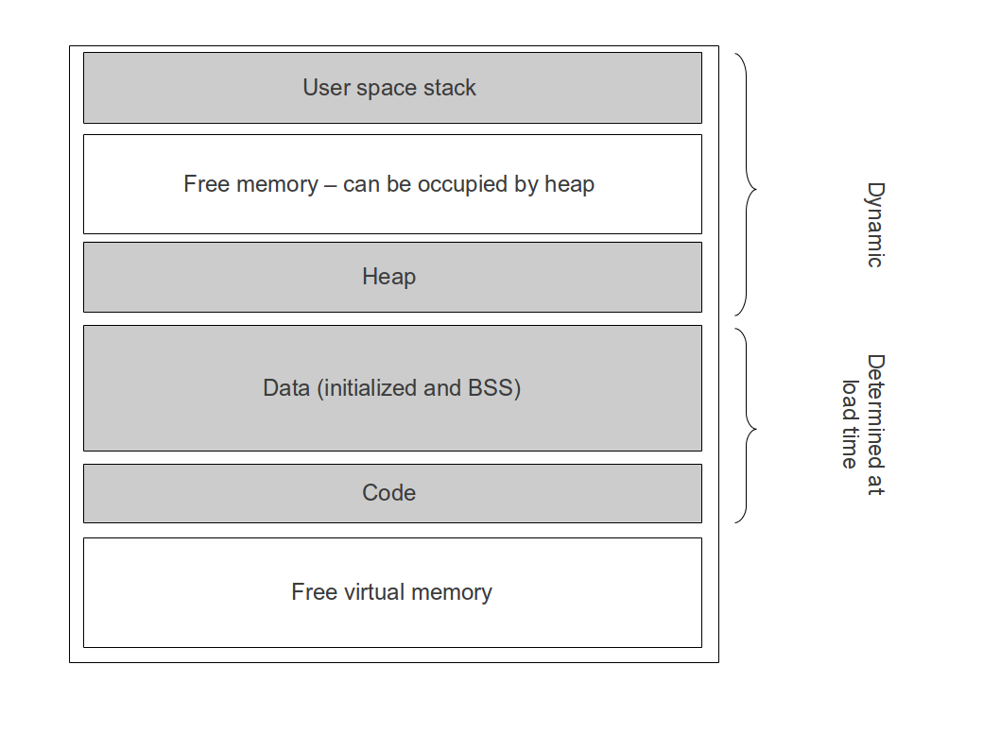

# Memory Management in ctOS

## Layout of physical memory

The physical 32 bit address space of the machine is organized as follows. The memory below 1 MB is not actively used by the kernel (with the exception of the video memory), but data stored in this section, for instance BIOS data, is read if needed. This memory area contains the RAM part of the BIOS code, BIOS data areas, VGA video memory and the boot image. 

At the 1 MB border, the kernel itself is located with its text and data sections. Above the kernel data section, the GRUB2 bootloader will place the BSS section which contains variables initialized to zero and which will be zeroed out by GRUB2 before loading the kernel. Somewhere above the BSS section, GRUB2 will place any modules loaded at boot-time. Typically the first module is placed right above the last page of the kernel BSS section, but a kernel must not rely on this - theoretically the module might be placed anywhere in memory.



Note that theoretically, even kernel data and BSS section are (as far as I know) not guaranteed to be contigous areas of memory. Therefore data and BSS section should only be accessed by means of the variables declared within C source code for which the loader will actually guarantee that, for instance, a char array of length len is a contigous area of len bytes in memory.

The memory manager maintains a structure containing the start and end addresses of the above areas. As a general rule, the memory manager is the only module which has an actual knowledge of the memory layout, whereas all other parts of the kernel code need to use services offered by the memory manager to get information on the location of kernel heap and the kernel code in physical memory. This approach is chosen to be as flexible as possible with respect to future changes of the memory layout. At boot time, this structure is filled using the symbols `_end`, `__bss_start` and `_start` in the kernel ELF image.

To keep track of used physical memory pages, the memory manager maintains a bit mask where each bit corresponds to one 4096 byte page in physical memory. This structure is initialized as follows.

* first all bits are set to 1 to mark all pages as reserved
* then the memory map presented by the GRUB2 boot loader is scanned. For each area of memory which is marked as available (type 1), all pages within this area are marked as free given that they are located above the 1M limit
* as this procedure will have marked pages used by the kernel itself as free, the third step will mark all pages within the kernel code and data section and within the kernel heap as used
* the multiboot information structure created by GRUB2 is scanned to find out whether a module (for instance the RAM disk) has been loaded. If this is the case, the pages occupied by this module will be marked as used as well

Note that the multiboot information structure created by GRUB2 is not protected in this way. Therefore the memory manager is responsible for evaluating this structure before it grants access to a physical page to other parts of the kernel. Currently, the only parts of this structure used are the memory map and the module map (no effort has been made to make ctOS particularly secure, of course we should zero out physical memory used by the boot loader before handing it over to any user space process, but ctOS does not take any precautions of this type).

When physical memory is requested, the bit mask is scanned to find a free page. In order to avoid time consuming full scans when several pages are requested, an additional variable start_search is maintained which stores the number of the page at which the search for free pages will be started. Thus all pages below this page number are guaranteed to be in use. To maintain this variable, the following algorithm is used.

* initially the value of start_search is 0
* when we search for a free page, we start the scan of the bit mask at this page. When we have detected the first free page, we return this page to the caller and set start_search to the next page (which might or might not be unused.
* when a page is returned to the pool, start_search is set to this page if the page number of the returned page is less than start_search

## Layout of virtual memory

The virtual memory is roughly divided into three areas called **common system area**, **private system area** and **user area**. The common system area contains those areas of virtual memory which are mapped to the same physical pages for all processes in the system. This is for instance necessary for interrupt handler, for which the system will take the virtual address from the IDT if an interrupt occurs, so this address must map to the same physical address in all processes. Another example is common system data like queues which need to be accessible from all processes.

The private system area contains system tables like the page tables as well as the kernel stack to which we switch when an interrupt occurs while being in userspace which are specific to a given process.

Finally, the user area holds all pages which can be accessed from user space. Within this area, the text and data sections of executables, the user space heap used by application programs and the user space stack are located.

The following diagram summarizes this division of virtual memory before we look at the individual sections in detail.



First let us look at the private system area. To be able to access the page tables for a process from within this process, we map these pages tables into the upper 4 MB of the virtual address space which are part of the system area. Specifically, as last entry in the page table directory, we use an entry with base address equal to the physical address of the page table directory itself. If now the CPU translates an address above 0xffc0:0000 which can be written as

0xffc0:0000 + x*4096+y

it first reads the upper 10 bits of the linear address. As these are all one, it uses the last entry in the page table directory and reads the base address from there. As this is the address of the page table directory itself, it then reads the entry with index x from the page table directory and extracts the base address from there which is the base address of page table x, 0<=x<1024. Thus this virtual address translates into the physical address of byte y in page table x. This mechanism allows us to access the page tables of a process from within the virtual address space of this process.

Another design decision that needs to be made is the location of the stack. There are two possible approaches. In the first approach, the location of the stack within the virtual address space is the same for all processes. This has the advantage that pointers which are saved on the stack and refer to other variables on the stack and the saved EBP registers remain valid when a process is cloned, but limits the layout of the virtual address space. Another approach would be to chose the location of the stack in virtual memory every time when creating a new process, trying to optimize the memory usage based on the current size of heap and stack, and to try to identify pointers on the stack when copying over the stack contents, thereby correcting them. It is, however, impossible to tell exactly which value on the current stack is a pointer into the stack itself and which is not. If an error occurs during this modification, it will be extremely hard to track down and to fix it. Therefore ctOS follows the approach to fix the location of the stack in virtual memory which we place starting a few pages below the page tables growing downwards. Note that this is the kernel stack which is used whenever a process executes in supervisor mode.

However, during initialisation, we need to move the current stack once to its new location for the root process, i.e. adjust the stack pointer to point to its new location somewhere in this virtual memory area once we have enabled paging. The easiest approach to this is to simply set ESP to the new top of stack. This, however, means that we may no longer access local variables (as the compiler might access them relative from ESP) and we cannot execute ret once this has been done as there is no return address on the stack. We can also no longer access any variables which have been passed to the main function. To make this work, the following rules must be obeyed by the main kernel function:

* this function must never return
* this function must not contain any local variables
* setting the stack pointer must be executed directly within this function and not in a utility function
* after switching to the new stack, parameters of the main function must no longer be accessed and local string variables must no longer be accessed (which the compiler might put on the stack)

Note that the kernel stack of a process holds all stack areas for all tasks within that process. Each task has its own kernel area which is used when an interrupt is invoked from within this task which leads to a switch from user space to kernel space.

As all tasks within a process share the same virtual memory, it is theoretically possible that the kernel stack of one task grows into the kernel stack of another task without resulting in an access violation. To decrease the likelihood of that event, each kernel stack with the entire stack space is followed by a few unmapped pages. Thus if for instance the initial task within the root process allocates two pages within the stack area, the next task created within the same process will leave at least one page below that stack unused. Thus if the stack pointer of the first task grows into that unmapped area, a page fault will result. However, it is of course theoretically possible that a task allocates a very large chunk of data on the stack and the value of ESP jumps over all unused pages. If that happens, a stack corruption will go unnoticed until the part of the allocated chunk which lies within the unmapped pages is actually used.

The number of stack pages used by one task within the kernel stack is contained in the constant MM_STACK_PAGES_TASK. The number of free pages between two consecutive stacks is defined in MM_STACK_PAGES_GAP

Above the kernel stack, we reserve a few pages for special tasks. One application of these pages is the cloning of a process. Here we will need to map physical pages temporarily into the virtual memory to set up the page table directory and page table of the new process and to copy physical pages.

Before discussing the common area of virtual memory,  let us briefly sketch the process of cloning an address space which is necessary when a new task is created. For each new task, the system needs to create a new page table directory and a new set of page tables. Specifically, suppose that the parent process maps a physical page X to a physical page Y. For the newly created address space, the virtual page X then also needs to be accessible. There are several ways to achieve this.

* copy the page, i.e. allocate a new virtual page in the address space of process X by creating a corresponding page table entry and map this page to a different physical page Y'. Then copy the content of Y to Y' so that initially, the child process has access to the same data as the parent process. This is done for most memory pages.
* clone the page, i.e. create a new page table entry for the new process which maps the virtual page X to the physical page Y as well. Thus both processes now share the physical page, and the physical page is mapped to the same virtual page in both processes. If, however, one of the processes changes its mapping afterwards, this will only affect this process and not be reflected in the other process address space.
* use the same page table entry, i.e. in the page table directory of the new process, add an entry for the 4 MB area containing X which points to the page table of the parent process. Thus both processes share the same page table, and consequently they use the same mapping even after changes to the page table are made. This, however, will imply that the entire 4 MB region in which page X is contained is shared.

To realize a common area, two alternative approaches are possible. In the first approach, the root process would allocate the full common area and map it one-to-one into virtual memory. When a new process is created, this mapping is inherited by cloning the corresponding physical pages instead of copying them. Because all processes are eventually childs of the root process, this will ensure that all processes have access to the common area and the common area is mapped one-to-one into their address spaces. This approach, however, has the disadvantage that we need to decide about the size of the common area and allocate all physical pages needed BEFORE the first fork is done. If, for instance, we decide that we need 4 MB of kernel heap, we need to allocate 4 MB of physical RAM initially even on small machines even though we might not actually need that much.

To avoid this, we choose a different approach. For the lower part of the common area, we actually allocate all physical pages when the root process is initialized and map them one-to-one. For the remainder of the common area, in particular for the kernel heap, we only set up page tables when initializing the root process in which most slots remain empty, so that we do not yet have to allocate physical pages for them. These page tables then become the first N entries in the page table directory of the root process. When cloning the address space of a process, we use the same N page table entries in the newly created page table directory for the child process. Thus the mapping of the low 4N MB of the virtual memory is the same between all processes at all the time, simply because we use the same page table. We can then allocate physical pages for additionally needed memory in the common area (for instance to increase the size of the kernel heap dynamically) and map them into this common page table set. Even though this mapping is not one-to-one, it will be the same for all processes so that the code and data located in this common area is visible at the same virtual address for all processes. With this approach, the maximum size of the kernel heap still needs to be fixed at bootup time, but this only limits the virtual memory available to user space programs, as we only consume a small amount of physical memory in the beginning.

The common area contains the entire kernel code, the kernel data section and the kernel bss section. Together with the area below 1 MB, all these pages are mapped one-to-one to physical memory. This implies that data located in these sections is available to all processes and that they can be accessed even if paging is disabled, for instance during early initialization of the kernel. All page table directories are contained in the BSS section of the kernel as well. This has the disadvantage of increasing the size of the kernel in memory - and with that the minimum physical size of the machine - considerably, but makes it easier to manage the page table directories especially when destroying an address space (otherwise releasing the physical page in which the page table directory is located would require a temporary switch to non-paged mode). As physical memory below a few MB is very uncommon these days, the increased memory consumption seems to be acceptable at this point.

In addition, the common area contains the RAM disk, the kernel heap and an area which is reserved for memory mapped I/O and DMA buffers. To understand why this is necessary, suppose that, for instance, an AHCI driver is used to issue a request to read data in process A. To do this, the driver needs access to the CI port register of the controller, i.e. it has to map this physical memory area into the address space of process A. While the I/O operation is in progress, a task switch might occur to process B. If now an interrupt is received and the interrupt handler of the AHCI driver is invoked, the handler is operating in the address space of process B. However, it will need access to the memory mapped registers of the controller again, to read the interrupt status register IS. Then the interrupt handler needs to map this area of physical memory again and remove the mapping once it is done. To avoid this need for remapping, the AHCI controller ports are mapped into the upper part of the common area so that they are available to all processes.

If a RAM disk is used, it is placed in virtual memory between the kernel heap and the end of the kernel BSS section and thus reduces the space available for the common area.

Special functions offered by the memory manager are used to allocate memory within the kernel heap and the memory mapped I/O area.

Finally, the user area contains text and data sections for user space programs and the user space stack. For the user space stack, we also chose a fixed location with the same rationale. It is located at the top of the user area in virtual memory and grows downwards towards the user space heap. As the switch to user space is done at the end of the initialization process, no stack switch is necessary.

As a general design rule, the size of all areas of virtual memory is controlled by preprocessor variables defined in mm.h so that the size of the individual segments can be changed at a later point in time. Additionally, only the code within the memory manager should make any assumptions on the layout of virtual or physical memory. The following table describes the meaning of these variables.

| Preprocessor constant| 	Description and dependencies |
|:---|:---|
|MM_HIGH_MEM_START|	This is the start of high memory above 1 MB. This value is specific to the x86 platform and should not be changed
| MM_SHARED_PAGE_TABLES | The number of page tables reserved for use by the common area. This can be enlarged to increase the size of the common area. Each page table accounts for 4 MB in the common area
|MM_COMMON_AREA_SIZE |	This derived constant is the size of the common area in bytes. It is computed from MM_SHARED_PAGE_TABLES, the number of entries each page table contains (i.e. the number of pages it controls) and the size of a page. Note that MM_COMMON_AREA_SIZE-1 is the highest address within the common area and MM_COMMON_AREA_SIZE is at the same time the lowest address within the user area.
| MM_MEMIO_PAGE_TABLES |This is the number of page tables which are reserved for the memory mapped I/O area in the upper part of the common area. This can be changed to increase or decrease the size of this area but must always be less than MM_SHARED_PAGE_TABLE
| MM_MEMIO_SIZE |	The size of the area reserved for memory mapped I/O. This is derived from MM_MEMIO_PAGE_TABLES 
| MM_VIRTUAL_TOS |	Top of kernel stack. This value is derived from MM_RESERVED_PAGES, but can theoretically be decreased to gain additional space between the mapped page table directory and the kernel stack
| MM_STACK_PAGES |	Number of pages within the kernel stack, can be increased at will
| MM_STACK_PAGES_TASK |	Whereas MM_STACK_PAGES is the number of pages of the total kernel stack area, this constant is the number of pages available to one individual task.
| MM_STACK_PAGES_GAP |The number of pages left as unmapped gap between the kernel stacks of two consecutive tasks
| MM_RESERVED_PAGES |Number of pages above the kernel stack which are reserved for temporary use
| MM_VIRTUAL_TOS_USER |	This is the top of the user space stack and at the same time the highest virtual address within the user area. This is currently derived from the location of the kernel stack (MM_VIRTUAL_TOS) and its size (MM_STACK_PAGES)
| MM_START_CODE |	Start of user space code section. Note that this is currently considerably above the end of the common area to allow room for enlarging the common area without having to relink all executables

## Support for RAM disks

To support RAM disks, ctOS relies on the boot module functionality offered by multiboot compliant boot loaders. These boot loaders are able to load additional files into memory at start-up time. Even though these files are commonly referred to as modules, the boot loader does not make any assumptions on their size and contents. It will simply load the files somewhere into physical memory (page aligned if requested via the corresponding flag in the multiboot header of the main kernel image) and pass their address and an additional command line per module to the kernel as part of the multiboot information structure.

ctOS assumes that either no modules are loaded at all - in this case no RAM disk is generated - or exactly one module is loaded. If a module is loaded, this module is supposed to contain the RAM disk image. When the physical memory map is established in `phys_mem_layout_init`, the physical memory in which this module is located is marked as used. During `mm_init_page_tables`, these physical pages will be mapped into the virtual memory space right above the kernel BSS section and below the kernel heap. As this is within the common area, the RAM disk will be available to all tasks regardless of the process they are running in.

The RAM disk device driver can use the public functions `mm_have_ramdisk()`, `mm_get_initrd_top()` and `mm_get_initrd_base()` to determine whether a RAM disk exists, the address of the first byte of the RAM disk and the address of the last byte of the RAM disk.

## Managing the kernel heap

To implement the management of the kernel heap, a generic set of functions has been implemented. In this model, a heap is described by the following structure.

```
typedef struct
{
  u32 start;
  u32 current_top;
  u32 (*extension)(int size, u32 current_top);
} heap_t
```

This structure contains the start of the heap and the current top of the heap, marking the memory area which is currently allocated by the heap.  If more memory is needed, there is a chance to increase the heap by allocating additional physical pages and map them into the virtual address space - this is done by an extension function which is pointed to by the member extension. All virtual addresses need to be page aligned (i.e. start and current_top+1 should be multiples of 4096). We also assume that the start and the end of the heap span an contiguous area of memory. Keeping the extension function generic will allow us to reuse the code later in userspace where the extension function will make a system call. The extension function is supposed to return the highest address of the newly allocated memory, i.e. the new current top of the heap.


To implement the management of the heap, some bookkeeping tables are needed which store the information whether a part of the heap is used or not. These tables could be put into separate data structures or - as in our example - can be put into the heap as well. For this purpose, the available area between start and current_top is divided into pieces of memory called a **chunk**. A chunk always starts with a data structure called the chunk header which is defined at follows.

```
typedef struct {
    void* footer;
    u8 last :1;
    u8 used :1;
} heap_chunk_header_t;
```

The variable used is either 0 or 1 and contains the information whether the chunk is in use. The member footer is a pointer to the footer of the chunk which will be described in an instance. Finally, chunks are organized as a linked list, and the member last indicates whether the member is the last one in the last (we will seen in instance how the address of the next header in the list is found).

Initially, the entire heap consists of one chunk which is not used. The size of this chunk equals the size of the entire heap area.

When memory within the heap is requested, the linked list of chunks is traversed until a chunk is found which is large enough. This chunk is then split into two parts, where the first part is used to satisfy the request, i.e. if x bytes are requested, then

* another header structure is inserted at an offset of x bytes after the existing header
* the existing header is made to point to the newly inserted header
* the newly inserted header points to the next header in the chain
* the existing chunk is marked as free

A pointer to the first address of the resized chunk after the header is returned. Note that this is only done if the chunk is large enough to store the request and still leaves space for the additional header, otherwise the chunk will be entirely used up and not be split.

If no chunk was found which is large enough to satisfy the request, it is tried to extend the heap. To that end, the function pointer extension which is stored in the heap_t structure is called. This function is supposed to return a pointer marking the new current top of the heap or 0 if no more memory could be allocated. If new memory could be allocated, current_top is adapted and the memory is returned to the caller of malloc as a chunk.

To be able to add the newly allocated chunk to the linked list of chunks in this situation, the last chunk in the list is needed. To find this, the footer can be used. The footer is the last 4-byte word of each chunk and contains a pointer to the header of the chunk. It can be used to navigate backwards through the list of chunks. In particular, the last header can always be found by converting the member current_top of the heap structure minus 4 bytes into a pointer to a chunk header.

The footer is also used to determine the address of the next header. As the footer is always one dword long and the mechanism layouted out above guarantees that the header of chunk n+1 will always follow the footer of chunk n immediately, the address of the next chunk header can be computed as the address of the footer plus four.

If a chunk is released by calling free, it is marked as unused. Then the pointer next is used to check whether the next chunk is also unused. Similarly, the footer of the last chunk (which can be found by going back from the address provided by the caller of free by sizeof(heap_chunk_header_t)+4 bytes) is inspected to find the chunk below the current chunk. This is repeated in both directions until either we hit upon start or end of the heap or upon a chunk which is used. In this way, a chain of currently unused chunks is identified. To avoid memory fragmentation, these chunks are then consolidated into one large chunk by readjusting the footer of the last chunk and the header of the first chunk in the chain. This will increase the probability that requests can be served without having to increase the heap size too often.

Additional care must be taken if aligned memory is requested. To fulfill such a request, up to two splits are necessary. First, a free chunk is split into a lower part which is not aligned and an upper part which is aligned. If that upper part is larger than the request, it is split again as above into a lower part used to serve the request and an upper part which remains free. Note that the pure fact that a piece of memory of, say, 4096 bytes is always placed between a header and a footer may imply that to serve a request for an entire page of memory on the heap, up to three virtual pages need to be allocated. It might therefore be a worthwile alternative to implement a separate mechanism for allocating entire pages and marking them as used so that they are not consumed by a growing heap, but this idea is not pursued further in ctOS to keep the code simple.

## Using memory mapped I/O

To map physical pages which contain memory mapped I/O regions into the virtual memory, an area above the kernel heap and thus at the top of the common area is used. Device drivers can request a mapping of physical pages into this area by calling the interface function `mm_map_memio`. This function will locate a free contigous area of virtual memory in this region and map the requested amount of physical memory into this area. It returns the virtual address of the region or zero if no mapping could be done.

Note that as this mapping is done in the common area, it applies to all processes. This is essential for being able to access the devices even within an interrupt handler. In contrast to ordinary pages, the pages used for memory mapped I/O are mapped with the PCD bit in the mapping table set to 1, i.e. with a disabled page cache.

## Stack allocation

In ctOS, threads are supported on the kernel level. The scheduler manages tasks, and several tasks can belong to the same process. In the memory manager, this is reflected by the fact that all tasks which belong to the same process share a common address space and tasks within that address space use different areas of the stack area for their respective stack.

Therefore the memory manager needs to implement functions which the process manager can call to allocate regions on the stack for exklusive use by an individual task. When the process manager creates a new task within an existing process, it calls this function to reserve a stack area for the new task. When the task is removed again, this stack area is deallocated again and can be used by a different task.

An additional complication arises when a process is cloned. In this case, the memory manager needs to clone the entire address space. However, within the new address space, not all allocated stack areas are supposed to be allocated as well, but only the stack area which corresponds to the currently active task.

To implement this, the following data structures are used within the memory manager. The memory manager maintains a table of stack allocators which correspond one-to-one to tasks and are identified by the task ID. Similarly, a table of address spaces is maintained which correspond one-to-one to processes. All stack allocators which belong to the same process are chained up in a linked list. The head and tail of this list are stored in the address space data structure.

When the process manager needs to create a new task, it calls the function `mm_reserve_task_stack`, passing in the ID of the task and the ID of the respective process as a parameter. This function will create a new stack allocator for an unused part of the kernel stack and return a pointer to the top of this area. In addition, it will add this stack allocator to the list of stack allocators for the respective process and map the corresponding pages into virtual memory if necessary.

To create a new address space, the function `mm_clone` is used. This function will add a new entry to the table of address spaces. It will then go through the list of stack allocators for the current process and identify the stack allocator which belongs to the currently active task. This stack allocator is then added to the list of stack allocators for the newly created address space. All other stack allocators are ignored, so that immediately after cloning, the new address space only has one associated stack allocator.

## Cloning an address space

The most complex part of the memory manager is the function `mm_clone` which is used when a new process is forked off to set up the page table directories for a new address space. Doing this, a couple of special cases have to be considered.

It needs to be made sure that within the new process, all memory addresses in the common area point to the same physical pages as it is the case for the existing process at all times. This is achieved by linking the same page tables into the page table directory of both processes.

In addition, when cloning the address space of a process which contains more than one task, only the stack of the currently active task is to be set up in the target process. To save memory, the pages associated with the stacks of the other tasks will be entirely ignored.

Thus this function performs the following tasks:

1. allocate a new physical page for the page table directory of the new process
1. clone the existing page table directory, i.e.
    * descend into all page tables of the existing process
    * for each page table entry, determine how the page is to be handled
    * if the page is within the common area, create a new entry in the page table directory of the target process pointing to the same page table
    * if the page is above the common area, but below the kernel stack, allocate a new physical page, map it into the new page table directory and physically copy the contents of the old page into the new page
    * if the page is within the kernel stack, use the stack allocators to determine whether the page belongs to the task stack of the currently active process. If yes, allocate a new physical page, map it into the target page table directory and copy over its contents from the old physical page
1. set up the special entries in the new page table directory to map the page table directory itself and all page tables
1. set up a new address space structure for the new process
1. set up a new stack allocator for the only task of the new process (this is the one which corresponds to the currently active task) and link it into the list of stack allocators for the new address space

Of course this is comparatively slow, as a large number of physical pages needs to be copied. Alternative methods which could be implemented in the future are lazy allocation of pages and copy-on-write mechanism to avoid this initial copy of memory content which is maybe never accessed.

To perform the actual cloning of a page table directory and of a page table, two utility functions `mm_clone_ptd` and `mm_clone_pt` are provided.


## Managing the user area

The layout of the user area follows traditional UNIX conventions. The user area contains code section, data section and stack of the currently active program. Between the end of the data section (which is the data initialized when a program is loaded), there is a heap area which can be used by the libc runtime library to dynamically allocate memory.

Currently the user area starts at address 0x800:0000, i.e. at 128 MB. To avoid rebuilding of all executables when this changes (remember that the start of the code segment is contained in each ELF file), ctOS uses the fixed address 1 GB (0x4000:0000, defined in mm.h as MM_START_CODE. Thus there is a considerable amount of free virtual memory between the end of the common area and the user area.



For each process, the memory manager keeps track of some minimum information on the layout of the user space area. Specifically, the memory manager remembers  (as part of a process address space data structure)

* the current break, which is by definition the first byte after the current end of the programs data and heap area, i.e. the first byte within the free memory above the heap
* the end of the programs data and bss section

Note that whereas the value of the break can be changed by a system call (brk and sbrk), the location of the code and data section are fixed and determined when the program is loaded.

To define the layout of the user space during program load, the memory manager offers two public functions. The first function `mm_map_user_segment` is invoked with the start address of a segment in virtual memory and a size. It will try to allocate a contingous area in virtual memory according to this specification (reusing mapped pages if they exist) and return a pointer to the first address in that area upon success. Each time this function is called, the end of the data section is adapted if the requested segment reaches beyond the current end of the data section and the program break is set to the current end of the data section plus 1. This function is supposed to be called by the program loader for each ELF program header to be loaded. A second function `mm_init_user_area` can be used to reset the layout of the user area to default values. The end of the data section is set to the start of the code section minus one, i.e. the data section is empty. The current break is set to the start of the code section, i.e. the heap area is empty as well. This function returns the recommended location of the user space stack to be used by the program loader and allocates space for this stack by mapping at least one page if required.

