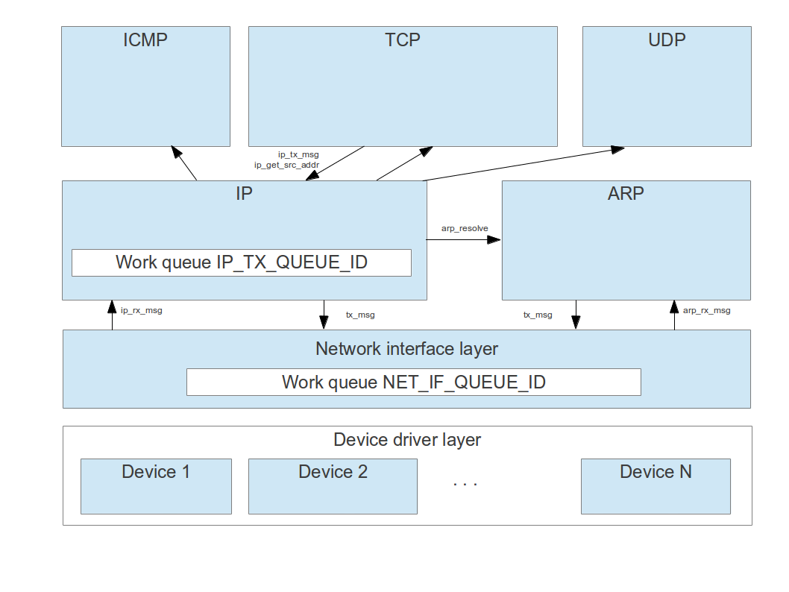
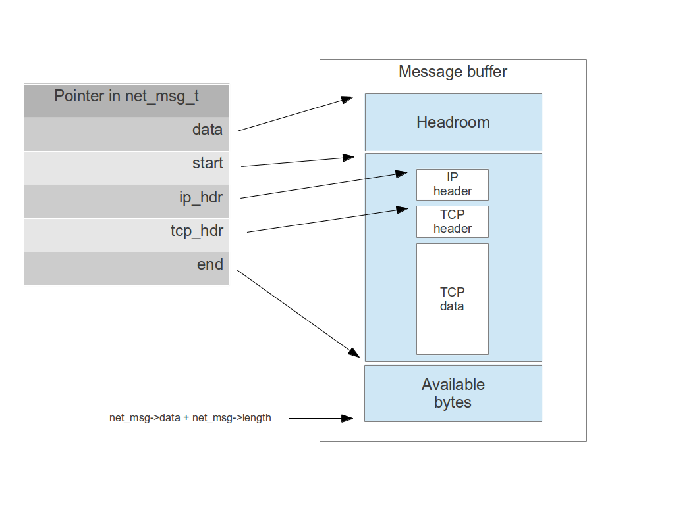
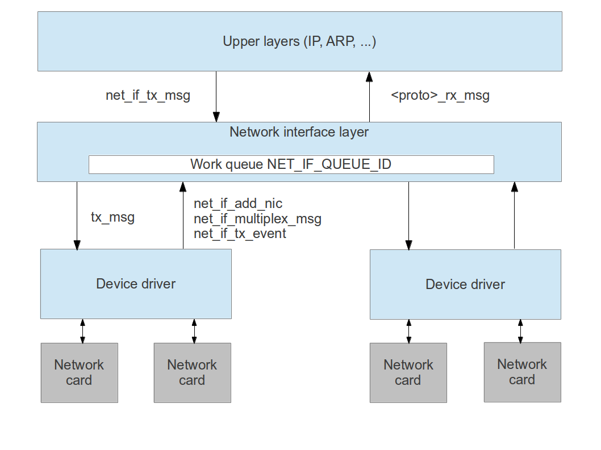
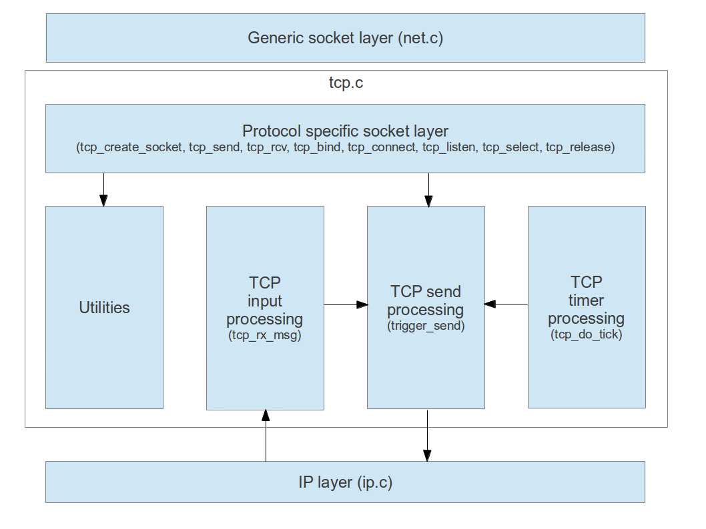
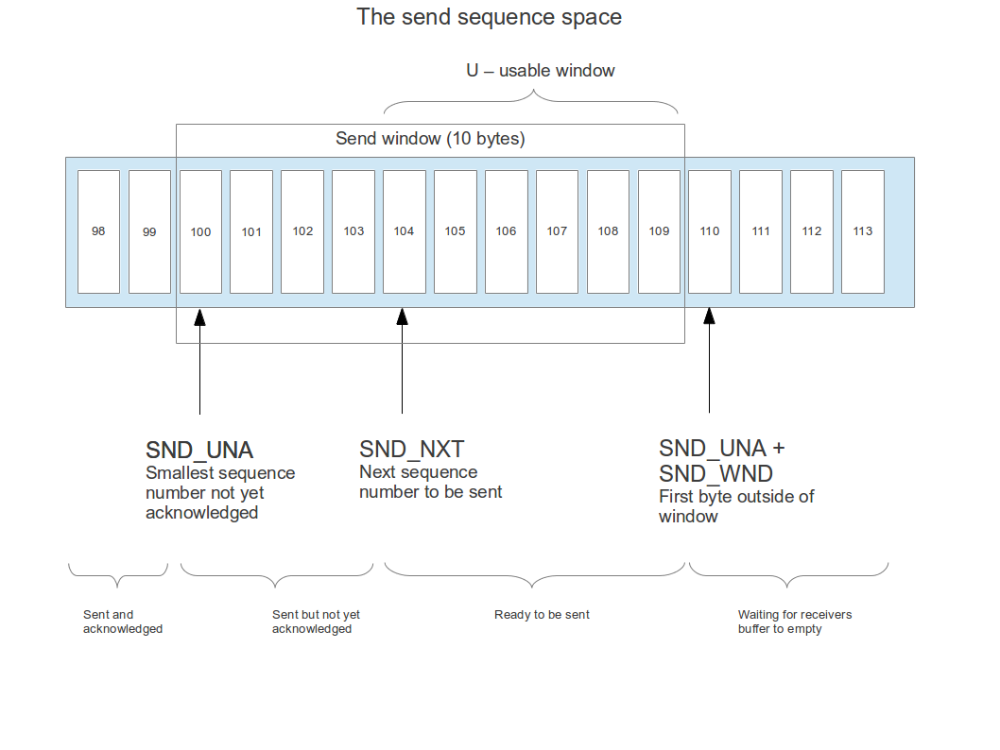
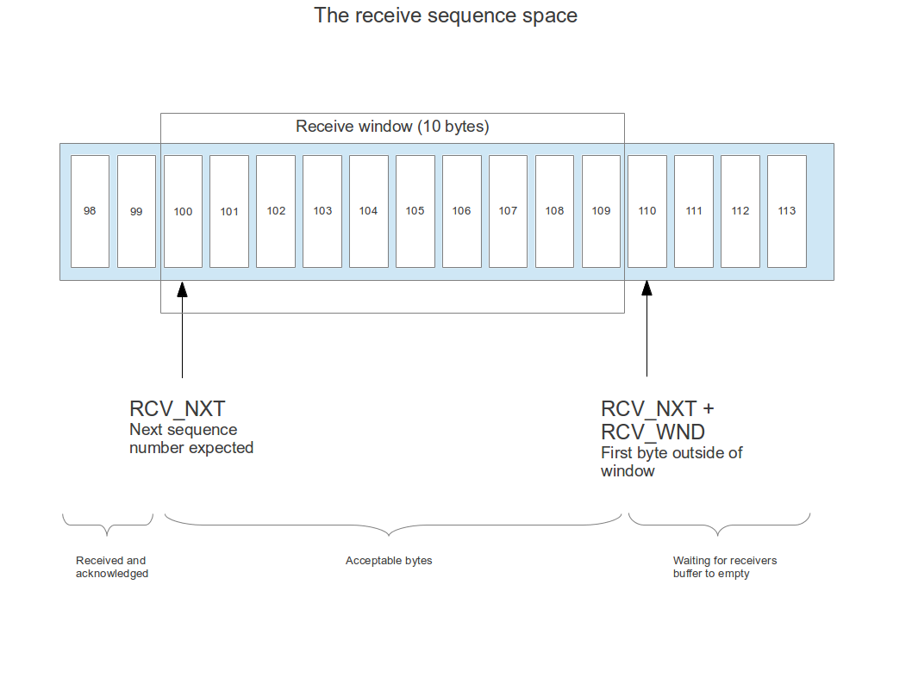

# The ctOS networking stack

## Overview

The part of ctOS which handles networking and TCP/IP is called the **networking stack** as it follows the classical approach of a layered architecture. The lowest layer of the networking stack, the device driver layer, deals directly with the networking hardware, i.e. typically networking interface cards. At the top of this layer, there is a device driver independent layer called the network interface layer which encapsulates the operation of the network cards for the higher layers.

Above this layer, there are so called protocol layers which are layered according to the TCP/IP layer model. Thus directly above the network interface layer, there is a layer for the protocols IP and ARP. On top of that, there are layers for those protocols which are based on IP as networking layer, i.e. TCP, UDP and ICMP.



## Handling network messages

As traffic is processed by the network card and handed over to higher layers or messages are generated by parts of the protocol layer and forwarded to a network interface for distribution, network messages travel up and down the network stack. To simplify the management of these messages and to avoid extensive copying, a common data structure called a *network message*, represented by an instance of the structure `net_msg_t`, is used throughout the protocol stack to encapsulate data.

Essentially, a network message is a data buffer with some additional fields to manage the buffer. Each network message has a pointer `data` and a length field which indicates how much bytes are available at the memory location pointed to by `data`. In addition, there are pointers `start` and `end` which point to the actually used area of the buffer. 

To understand where this difference comes from, let us consider the example of a TCP/IP message which is created by the TCP layer. To send this message down the entire networking stack, the TCP layer would allocate a new `net_msg` structure with - say - 1024 bytes. It would then insert the TCP header into the message, but not at the beginning of the available area pointed to by data, but at an offset to 34 bytes into the message. Thus the actual start of the message would be at data + 34.

When this message is now handed over to the IP layer, an additional IP header needs to be added to the message. However, thanks to the available headroom of 34 bytes, the IP layer does not have to reallocate memory and copy the package to a new memory area. Instead, it can just add the 20 byte IP header at offset data + 14. It then adapts the pointer start to point to data + 14 and hands the packet over to the Ethernet layer. In addition, both the IP layer and the TCP layer will set additional pointers within the network message to mark the start of the respective header. The following diagram shows the message at this point



At the level of the Ethernet layer, the remaining headroom of 14 bytes can be used to add the 14 bytes Ethernet header. Then the packet can be handed over to the actual network interface card for transmission. The Ethernet driver is then responsible for deallocating the entire message and freeing the memory again. 

Conversely, if an Ethernet driver receives a packet, it creates a `net_msg_t` structure which is then passed up the networking stack until the processing layer finally destroys the message again. While the message travels the stack upwards, each layer will set the pointers to the corresponding headers so that they are available for the next layer, i.e. when a message leaves a layer (say the IP layer), the target layer (say the TCP header) can rely on the pointer `tcp_hdr` to be valid.

The following operations on network messages are implemented by the common code in net.c

<table>
<thead>
<tr class="header">
<th>Operation<br />
</th>
<th>Description<br />
</th>
</tr>
</thead>
<tbody>
<tr class="odd">
<td>net_msg_create<br />
</td>
<td>Create a network message of a given total length with a specified headroom<br />
</td>
</tr>
<tr class="even">
<td>net_msg_new<br />
</td>
<td>Create a network message of a given length usable for the protocol layer and sufficient headroom for an IP header and a Ethernet header<br />
</td>
</tr>
<tr class="odd">
<td>net_msg_destroy<br />
</td>
<td>Destroy a network message again and deallocate the used memory<br />
</td>
</tr>
<tr class="even">
<td>net_msg_append<br />
</td>
<td>Append data to the end of the message. This operation will increase the pointer end by a specified value and return the old value of this pointer, i.e. the first byte which is still free for use. This function is intended to be used for something like memcpy(net_msg_append(net_msg, 20), source, 20) which will append 20 bytes to the end of the message<br />
</td>
</tr>
<tr class="odd">
<td>net_msg_prepend<br />
</td>
<td>Prepend data. Returns a pointer to the data (or 0 if there is not enough headroom) and increases start accordingly.<br />
</td>
</tr>
<tr class="even">
<td>net_msg_set_eth_hdr<br />
</td>
<td>Set the Ethernet header pointer to the provided offset<br />
</td>
</tr>
<tr class="odd">
<td>net_msg_set_arp_hdr<br />
</td>
<td>Set the ARP header pointer to the provided offset relative to the start of the Ethernet header<br />
</td>
</tr>
<tr class="even">
<td>net_msg_get_size<br />
</td>
<td>Return the size of the used data area, i.e. end - start<br />
</td>
</tr>
<tr class="odd">
<td>net_msg_get_start<br />
</td>
<td>Return a pointer to the data area, i.e. start<br />
</td>
</tr>
</tbody>
</table>

The following rules are in place for the handling of network messages:

-   each layer in the network stack that does not pass on the message to another layer is in charge of destroying the message again. If, for instance, the IP layer creates a packet and sends it down the network stack, the device driver sending the packet is in charge of destroying it
-   if a message leaves a network layer and is passed to a higher layer, the pointers to all headers for the layers below the target layer and the target layer need to be filled. Thus the device driver sets the pointer to the link layer header (Ethernet), then identifies the packet as, for instance, an ARP packet, sets the ARP header pointer `net_msg->arp_hdr` and then forwards the packet to the ARP layer

At the start of the file net.c, there is a table which describes which fields in a network message are supposed to be filled by each layer, depending on the direction the package is taking.

## The network interface layer

The network interface layer net_if.c provides an abstraction layer to access different network cards with different drivers. It maintains a table of known network interfaces, assigns IP addresses to network interfaces and offers a common interface for the upper layers to send messages to a network interface card. It also handles multiplexing, i.e. passing messages up the protocol layer based on protocol information contained in the packet header, and queueing services.

Towards the higher protocol layers, the network interface layer offers an easy way to send a packet via a defined network interface card without having to know about the details of the corresponding driver. For this purpose, the function `net_if_tx_msg` is offered which transmits a network message via a given NIC. This function uses a queue of not yet distributed messages if delivery of the message is not possible right away. The standard work queue mechanism implemented in wq.c is used for this purpose. This mechanism makes it possible to use the `net_if_tx_msg` even from within an interrupt context where waiting, for instance until used descriptors of the card are freed again, is not possible. 

When the card has completed a transmission and is about to free a descriptor, it needs to inform the network interface layer that a descriptor has become available. To do this, it calls `net_if_tx_event` which will wake up the worker thread for the used work queue.

At boot time, network adapters need to register with the network interface layer by calling `net_if_add_nic`. The network interface handler will then add the network interface to an internal list. 

To pass a network message to a higher layer, a network card driver can use the function `net_if_multiplex_message`. This function will use the Ethertype field in the Ethernet header to determine the protocol used by this message. Depending on that protocol, it will forward the message to the corresponding module for further processing.




## The ARP protocol layer


The ARP protocol layer is responsible for

-   maintaining an ARP cache, i.e. a table of mappings from the MAC address to the IP address
-   answering ARP requests received by a device
-   resolving IP addresses into MAC addresses if the IP layer assembles an Ethernet package
-   sending ARP requests and waiting for the answer if necessary

The ARP cache is a list of all known mappings of IP addresses to Ethernet addresses. Entries in the ARP cache have a state - they can either be valid, meaning that the mapping could be properly determined, or incomplete, meaning that an entry has been added to the cache in preparation of an expected incoming ARP message, but the entry is still incomplete.

Let us first take a look at how the ARP layer processes ARP requests. When an ARP request is received by a network card, the network interface layer is supposed to identify the packet as an ARP packet based on the Ethertype 0x806 and forward the packet to the ARP layer by calling `arp_rx_packet`. Regardless of the ARP operation type, this function will scan the ARP cache for the combination of sender IP address and sender. If an entry with a matching IP address exists, it will be updated with the senders MAC address, otherwise a new entry will be generated.

Specifically for the ARP operation code request, the ARP module now assembles a response. For this purpose, the source protocol address and source hardware address of the original reply are copied to the destination protocol address and the destination hardware address respectively. The source hardware address is filled with the own hardware address, the source protocol address with the own protocol address. Then the ARP operation code is set to 0x2 - ARP reply, and the message is handed over to the network interface layer for transmission.

The function `arp_rx_packet´ looks as follows

```
Get arp_lock
IF there is an entry in the cache matching the source protocol address of the request THEN
  update this entry with the source hardware address
  set status of entry to complete
ELSE
  add an entry for the source protocol address with the source hardware address
END IF
IF destination IP address is own IP address of adapter AND operation code of packet is ARP request 0x1 THEN
  copy destination protocol address to source protocol address
  fill source protocol address with own hardware address
  fill destination hardware address with source hardware address of original packet
  fill destination protocol address with source protocol address of original packet
  set ARP operation of new packet to 0x2
  transmit reply via network interface layer
END IF
release arp_lock
```

To resolve an IP address, the ARP module offers the public function `arp_resolve`. Essentially, this function will scan the ARP cache and try to locate a valid entry for this IP address. If an entry exists, the associated hardware address is returned. If no entry exists or if the entry is incomplete, an ARP request will be assembled and sent out as a broadcast to all stations in the network.

In order to avoid that subsequent calls of `arp_resolve` while the ARP request or the corresponding reply is still traveling over the network cause a flooding of the network with ARP requests, the ARP cache contains a timestamp associated with each entry which records when the last message has been sent our for the corresponding IP address. Thus if `arp_resolve` sends a request, it adds an entry with status incomplete to the cache (if not yet done) and uses the timestamp field of this entry to store the current time (in global CPU ticks). When it is called the next time for this IP address, it locates the entry again, retrieves the timestamp and only sends out a new request if a certain time has passed (currently set to 20 ms).

## The generic socket layer


The generic socket layer  - which is a part of net.c - offers a common API for different types of sockets and collects common routines which are used for all socket types. It communicates with the protocol specific socket operations via function pointers. In this section, we will describe the common data structures used by the generic socket layer and how it interacts with the protocol specific code to support various operations on sockets.

The generic socket layer uses an interface contained in a socket operations structure, i.e. an instance of the type *socket_ops_t* which is defined as follows.

```
typedef struct _socket_ops_t {
    int (*connect)(socket_t*, struct sockaddr*, int addrlen);        // this is called whenever a socket is connected
    int (*close)(socket_t*, u32* eflags);                            // close a socket
    int (*send)(socket_t*, void*, unsigned int, int);                // send data
    int (*recv)(socket_t*, void*, unsigned int, int);                // receive data
    int (*listen)(socket_t*);                                        // put socket into listen state
    int (*bind)(socket_t*, struct sockaddr*, int);                   // bind socket to local address
    int (*select)(socket_t*, int, int);                              // non-blocking select
    void (*release)(socket_t*);                                      // release reference obtained via create
} socket_ops_t;
```

The following table gives an overview of the various functions in this structure.

<table>
<thead>
<tr class="header">
<th>Function<br />
</th>
<th>Description<br />
</th>
</tr>
</thead>
<tbody>
<tr class="odd">
<td>connect<br />
</td>
<td>Connect the socket. This function is supposed to initiate a connect. If the connection is built up asynchronously (which is for instance the case for TCP sockets), the function should return -EAGAIN to indicate that the generic socket layer needs to wait for completion and raise an event on the condition variable <em>snd_buffer_change</em> in the socket structure once the connection is established. This function is also responsible for setting socket-&gt;connected<br />
</td>
</tr>
<tr class="even">
<td>close<br />
</td>
<td>Close the socket. This function should not release the reference to the socket held by the socket layer<br />
</td>
</tr>
<tr class="odd">
<td>send<br />
</td>
<td>Send data. Depending on the type of the socket, this can involve placing the data in a protocol specific buffer or sending it out immediately. If the calling thread needs to wait, this function should return -EAGAIN, otherwise it should return a negative error code or the number of bytes sent. In case no further data can be sent over this connection, this function should return -EPIPE<br />
</td>
</tr>
<tr class="even">
<td>recv<br />
</td>
<td>Receive data, i.e. copy data from the protocol specific receive buffer to a provided buffer. Return -EAGAIN if no data is available or the number of bytes copied. In case a connection has timed out, the protocol specific layer is supposed to set the flag socket-&gt;timeout<br />
</td>
</tr>
<tr class="odd">
<td>listen<br />
</td>
<td>This is only meaningful for connection oriented sockets and can only be used once the socket has been bound to a local address. It asks the socket to listen for incoming connections, but should return immediately<br />
</td>
</tr>
<tr class="even">
<td>bind<br />
</td>
<td>Bind the socket to a local address. Again, this function should return immediately and set the flag socket-&gt;bound in the socket structure upon success<br />
</td>
</tr>
<tr class="odd">
<td>select<br />
</td>
<td>This function should check whether the socket is ready for reading or writing or both, depending on the second and third parameter. It should not block, this is done by the file system layer<br />
</td>
</tr>
<tr class="even">
<td>release<br />
</td>
<td>Sockets are supposed to implement some sort of reference count on the protocol level. For each protocol, there is a protocol specific function &lt;xxxx&gt;_socket_create which is supposed to set the reference count to one to account for the reference held by the generic socket layer. The generic socket layer needs to call the release function is this reference is no longer needed. Note that this function might free the associated memory, so the socket must not be used any more once this function has been called<br />
</td>
</tr>
</tbody>
</table>

### Data structures

The structure `socket_t` contains all attributes of a generic socket along with a union proto which contains protocol specific fields. The attributes on the generic level can be grouped as follows.

-   attributes describing the state of the socket (bound, connected, error)
-   local and foreign address (laddr, faddr)
-   a pointer to a socket operations structure as described above
-   a spinlock which is used to protect the socket state
-   condition variables (`snd_buffer_change` and `rcv_buffer_change`) which are used by the protocol specific functions to inform the generic socket layer that a socket is now ready for reading or writing
-   a queue of incoming connections (`so_queue_head, so_queue_tail`), holding sockets which represent connections initiated via this socket which have not yet been retrieved via accept (currently only used for TCP sockets) and the maximum number of connections allowed on this queue (`max_connection_backlog`)
-   a pointer to a parent socket (again this is currently only used for TCP sockets and refers to the listening socket which has created the connection)
-   a select queue. This queue holds items which represent invocations of the select system call on this socket - see below
-   pointers prev and next used to chain sockets in a doubly linked list

When a network message is received by the networking stack, it needs to be distributed to the responsible socket. This process is called **multiplexing** and is not performed by the generic socket layer, but by the protocol specific layer, as the rules defining the responsible socket are protocol specific as well. To realize this, a protocol specific socket layer will typically implement a list or array of sockets which are in a state to receive packets. However, for this purpose it must not use the fields prev and next on the generic level, but the pointers included in the protocol specific part. In most cases, some sort of reference counting needs to be implemented as well. For instance, for a TCP socket, the generic socket layer drops the reference to a socket it holds when the close system call completes. In the background, the socket remains still existing - and remains in the list of sockets used for multiplexing - until the TCP close sequence has been fully completed. Once this happens, the TCP layer removes the socket from this list and drops the reference it holds, which will destroy the socket.

### Creating a socket

A socket can be created using the function `net_create_socket` in net.c. This function will set up the fields of the generic socket data structure. It will then invoke the protocol specific socket creation routine. This routine can perform any protocol specific setup and then needs to fill the `ops` structure in the socket which points to the protocol specific operations. The protocol specific function is also supposed to set the reference count of the socket if needed.

### Binding, connecting and closing a socket

**Binding** a socket to a local address refers to the process of attaching a valid protocol specific local address to a socket. This needs to be done before data can be sent (this holds for connection-oriented protocols as well as for connection-less protocols) using the send system call, as it determines the source IP address to use.

The function `net_socket_bind` first checks whether the socket is already bound, using the flag `socket->bound`, and returns an error message in this case. Otherwise it simply calls the protocol specific bind function. This function is supposed to

-   validate the address
-   set the field `socket->laddr` to the local address
-   set the flag `socket->bound`

In contrast to binding a socket, **connecting** involves fixing the foreign address used when data is sent over this socket. For connection oriented sockets, the combination of local address and foreign address usually specifies the connection. Again, the generic socket layer essentially forwards the request to the protocol specific layer after checking that the socket is not yet connected.

However, as connecting might involve exchange messages with the peer, the protocol specific implementation can return -EAGAIN to signal that the request is completed asynchronously. In this case, it is supposed to set the flag `socket->connected` and raise an event on the condition variable `socket->snd_buffer_change` once the process completes. The function `net_socket_connect` will sleep on this condition variable until this event is raised.

In any case, the protocol specific connect should

-   make sure that no connection attempt is in progress yet
-   validate the foreign address according to the protocol specific rules
-   store the foreign address in `socket->faddr`
-   determine a local address if the socket is not yet bound, write it to `socket->laddr` and set `socket->bound`

Finally, by closing a socket, the generic socket layer indicates that it will not try to send or receive any further data via this socket. Again, there is a protocol specific part which may complete asynchronously, however, the function `net_socket_close` does not wait for completion of this request. In addition, it sets the flags closed (to indicate that a close operation has been requested), eof (to indicate that no further data is expected to arrive via this socket) and epipe (to indicate that no further data can be written via this socket) in the socket structure. It then calls the release function on the socket to drop the reference to the socket is has held until then.

### Sending and receiving data

When sending and receiving data, buffering is done on the protocol specific level as different protocols have different requirements. A connection-oriented socket, for instance, might have to move data into a send buffer until the peer is ready to accept more data, whereas a connection-less protocol will typically send data immediately. However, the protocol specific functions are not supposed to block, this is handled by the generic socket layer if necessary.

When sending data, the function `net_socket_send` will try to send all data before returning to the caller unless it is interrupted by a signal. If necessary, it will wait until the protocol specific send function signals that is is ready to accept more data (using an event on the condition variable `socket->snd_buffer_change`). The following pseudo-code describes how this function operates

```
Validate parameter and make sure that socket is connected
sent = 0
DO
  call protocol specific send and store return code in variable rc
  IF send was successful THEN
    sent = sent + rc
  END IF
  IF (rc is negative and not equal to -EAGAIN) OR (all data has been sent) THEN
    leave while loop
  END IF
  wait on condition variable `socket->snd_buffer_change`
  IF interrupted by a signal THEN
    IF 0 == sent
      return -EPAUSE
    ELSE
      return -EINTR
    END IF
  END IF
DONE
Determine return code and return
```

In the special case that the protocol specific send function has returned -EPIPE, thus indicating that no additional data can be sent, this error code is returned directly to the caller. Also the protocol specific send routine is supposed to verify that the socket is connected as well as this might change while we are in the loop.

In contrast to sending data, receiving data does not necessarily require the socket to be connected, but only to be bound to a local address, as this is a prerequisite for multiplexing of incoming messages. In addition, it is not guaranteed that a request to receive a given number of bytes will not return with less bytes. In fact, for message oriented sockets like IP sockets, if a request has been made to read N bytes and a message arrives which has M bytes, and M is less than N, only M bytes will be returned. If M is greater than N, the last M-N bytes of the message are discarded. Thus the loop within `net_socket_recv` only waits until some data is available.

```
Validate parameter and connection state
DO
  call protocol specific receive and store return code in variable rc
  if (-EAGAIN == rc) THEN
    sleep on condition variable socket-&gt;rcv_buffer
    IF we are interrupted by a signal
      return -EPAUSE
    END IF
  ELSE
    leave loop as we have an error or read some data
  END IF
DONE
```

### Listen and accept

For TCP sockets, connections can be created in two different ways. A connection can be initiated actively by connecting to an existing socket - this is what a client is typically doing. Alternatively, a socket can be put into "listen" state using the listen system call in which it will act as a server and wait for incoming connections.

Those incoming connections are queued in the listening socket until an application asks for them using the accept system call. This queue does not only contain established connections, but also connections for which the TCP 3-way handshake has not yet been fully completed.

The listen system call is implemented by the function `net_socket_listen` in net.c along with a protocol specific listen function. Here the function within the generic socket layer basically only locks the socket and forwards the request to the protocol specific function.

The function `net_socket_accept`, however, performs additional processing. In fact, the accept system call is handled entirely on the level of the generic socket layer, there is no protocol specific accept function. When `net_socket_accept` is called, the following processing is triggered.

```
Lock socket
DO
  FOREACH socket in queue of incoming connections DO
    IF socket->connected THEN
      remove socket from list
      return this socket to caller
    END IF
  DONE
  /* If we get to this point, there is no connected socket in the queue */
  wait on condition variable socket->rcv_buffer_change
  IF wait was interrupted by a signal THEN
    return -EPAUSE to trigger restart
  END IF
DONE
```

Note that this processing assumes that whenever a new connection is established for a socket which is placed in the queue of incoming connections of a listening socket, the condition variable `socket->rcv_buffer_change` of the listening socket is triggered.  This needs to be guaranteed by the protocol specific functionality, but can make use of the field `socket->parent` which is filled with a pointer to the listening socket if a socket is on the queue of incoming connections of a listening socket.


### Implementation of the select system call

The select system call which allows an application to wait until at least one out of a list of sockets is ready to be read or to be written is one of the more complex system calls related to sockets. To realize this system call, the file system layer, the generic socket layer and the protocol specific layers have to interact.

Essentially, the idea is that when select is invoked on a socket, a semaphore is dynamically created and a reference to this semaphore is added to a list of such references maintained within the socket data structure. The calling task then performs a *down* operation on this semaphore. Whenever an event occurs, the protocol specific function raises an event by walking this list and performing an *up* operation on all registered sockets. When the calling thread continues, it needs to remove all references to the semaphore again from the involved sockets so that the semaphore can safely be destroyed.

To support this design, each socket has a list of so called "select requests". A select request is an instance of the data structure `select_req_t` which contains a pointer to a semaphore, a bitmask describing the event for which the select call is waiting (read, write or a combination of both) and a bitmask which is initially zero and later contains the actual event which caused the wakeup of the thread executing select.

When the file system executes the select system call, it walks all sockets to which the select call refers and, for each socket, calls the function `net_socket_select`, providing a pointer to a semaphore as argument. This function first checks whether the condition for which the select is waiting is already fulfilled, this is done by calling the protocol specific select function which is not supposed to block, but simply performs a corresponding check on the state of the socket. If the condition is fulfilled, `net_socket_select` returns immediately. Otherwise, it adds a new select request pointing to the semaphore to the select request queue of the socket and returns.

When this operation has been completed for all sockets, the file system layer goes to sleep on the semaphore. If, in this situation, the protocol specific layer detects an even which changes the state of the socket (for instance additional data coming in so that the receive queue is no longer empty), it calls `net_post_event`. This function does not only trigger broadcasts on the respective condition variable in the socket which is used for synchronization with the send and receive system calls, but also scans the select request queue for matching requests. If such a request is found, an UP operation is performed on the respective semaphore and a flag is set in the field `select_request->actual_event` to indicate the type of event.

Now the file system task sleeping in fs.c continues execution. It now again walks all sockets and calls `net_socket_cancel_select` on each of them, again passing the semaphore as argument. This function walks the list of registered select requests. For each request which matches the semaphore, it extracts the content of the field `actual_event`, returns it to the file system layer and removes the select request from the list.

## The TCP module


### Overview

Essentially, the TCP module consists of five different blocks. First, there is a protocol specific socket layer which implements the interface defined in `socket_ops_t` which is used by the generic socket layer in net.c. Then there are separate components responsible for TCP input processing (triggered by the IP layer when a TCP message comes in) and TCP output processing (triggered either by TCP input processing or by the socket layer). Finally, there is a component responsible for periodic processing, i.e. managing the timers like the retransmission timer which are required for an implementation of the TCP protocol. Apart from these functional blocks, there are also various utility functions which manage the data structures like the list of sockets used for multiplexing. The following diagram shows these components along with their main entry points.




### Data structures

The TCP specific part of a socket - which is sometimes called the "TCP control block" in analogy to the terminology used in the BSD reference implementation - contains the full TCP state of the socket as described in the various RFCs. Most of these variables use the same naming conventions as their counterparts in the RFC. We therefore only describe the variables which are not specified there in detail.

<table>
<thead>
<tr class="header">
<th>Variable<br />
</th>
<th>Description<br />
</th>
</tr>
</thead>
<tbody>
<tr class="odd">
<td>snd_max<br />
</td>
<td>This variable contains the highest value of snd_nxt so far. It is used in the context of retransmissions. In fact, retransmission are implemented by setting snd_nxt back to the first segment which needs to be sent again, while keeping snd_max unchanged. The send processing will then trigger another transmission of all octets between snd_nxt and snd_max until snd_nxt reaches snd_max again<br />
</td>
</tr>
<tr class="even">
<td>snd_buffer_head<br />
snd_buffer_tail<br />
rcv_buffer_head<br />
rcv_buffer_tail<br />
</td>
<td>These pointers are used to keep references to head and tail of send and receive buffer. These buffers are realized as ring buffers within the socket data structure. The four variables are unsigned integers which contain the index of head and tail of the respective queue within the ring buffer<br />
</td>
</tr>
<tr class="odd">
<td>ack_count<br />
</td>
<td>This variable counts the number of acknowledged octets since the last update of the congestion window. It is used to realize congestion avoidance where the size of the congestion window is increased by the number of acknowledged bytes as soon as this number exceeds the current size of the congestion window, see RFC 2581 and RFC 5681<br />
</td>
</tr>
<tr class="even">
<td>fin_sent<br />
fin_seq_no<br />
</td>
<td>These variables keep track of whether a FIN has already be sent to the peer (fin_sent) and, if yes, what the sequence number of the FIN was<br />
</td>
</tr>
<tr class="odd">
<td>max_wnd<br />
</td>
<td>This is the maximum window size ever advertises by the peer. It is used during the SWS avoidance algorithm on the senders side as an estimation for the size of the peers receive buffer<br />
</td>
</tr>
<tr class="even">
<td>right_win_edge<br />
</td>
<td>This is the right edge of the receive window as advertised to the peer. This information is needed to avoid advertising a shrinking window to the peer<br />
</td>
</tr>
<tr class="odd">
<td>rtx_count<br />
</td>
<td>Number of times a specific segment is retransmitted. Used to raise a timeout if a certain number of attempts to retransmit a segment has failed<br />
</td>
</tr>
<tr class="even">
<td>rtx_timer<br />
delack_timer<br />
persist_timer<br />
time_wait_timer<br />
</td>
<td>These are the various timers used throughout the TCP module<br />
</td>
</tr>
<tr class="odd">
<td>timed_segment<br />
</td>
<td>The number of the segment currently used for the RTT estimate<br />
</td>
</tr>
<tr class="even">
<td>current_rtt<br />
</td>
<td>This is the RTT which has been determined last<br />
</td>
</tr>
<tr class="odd">
<td>first_rtt<br />
</td>
<td>Set to indicate that this is the first RTT sample for the connection<br />
</td>
</tr>
<tr class="even">
<td>eof<br />
</td>
<td>Set if no further data is going to be received via this connection. Calls to recv will still return the data which is already in the receive buffer until the receive buffer is empty, but will not block any more waiting for new data to arrive<br />
</td>
</tr>
<tr class="odd">
<td>epipe<br />
</td>
<td>No further data can be sent via this connection<br />
</td>
</tr>
<tr class="even">
<td>timeout<br />
</td>
<td>A timeout has occured, i.e. the maximum number of retransmissions has been exceeded<br />
</td>
</tr>
<tr class="odd">
<td>error<br />
</td>
<td>Last error registered for this socket<br />
</td>
</tr>
<tr class="even">
<td>closed<br />
</td>
<td>The close system call has been invoked on this socket - if this flag is set, a close has been initiated but is not necessarily complete<br />
</td>
</tr>
</tbody>
</table>

To be able to distribute incoming packets to the responsible socket, all sockets - more precisely all TCP control blocks - are kept on a linked list using the members prev and next of the tcp_socket_t structure. This list is protected by a spinlock to avoid concurrent access. In addition, reference counting is implemented for TCP control blocks to avoid having to keep the lock on the list for an extended period of time. To avoid deadlocks, certain orders have to be observed when keeping more than one of the locks used throughout tcp.c, please see the comments on locking strategy at the top of the source code.

### Sending data

The function `trigger_send` is one of the most complex functions of the entire TCP stack. Its purpose is to determine whether data can be sent and how much data can be sent, taking congestion avoidance, the send window, SWS avoidance and other aspects into account, and to call `send_segment` to actually send data. This function is called when a request is made to send data from a socket, by the TCP input processing (for instance when an ACK has been received and thus the senders window might be open again for additional data) and the timers.

When data needs to be sent, it has to be decided whether the data is sent immediately or added to the send queue, and, if data is to be sent, how many bytes are sent. To make this decision, the send window is examined. Recall that the **send window** (SND_WND) is the maximum number of bytes the peer is willing to accept. Thus if, using the usual notation, SND_UNA denotes the first unacknowledged bytes in the byte stream, SND_NXT is the next byte to be sent and SND_WND is the size of the send window, we could send the U = SND_WND + SND_UNA - SND_NXT bytes

  SND_NXT, SND_NXT + 1, ... SND_UNA + SND_WND

The number U is called the **usable window**. If, for example, SND_UNA is 100 and we have already sent 4 bytes (bytes 100 - 103) in a previous transmission which are not yet acknowledged, SND_NXT = 104. If the window size is 10, we could therefore send another  send another 6 bytes, i.e. bytes 104 - 109, before the receivers window is full.



To decide whether we send data or leave the data on the queue, we use  the algorithm described in RFC 1022 which is usually called Nagle's algorithm. According to this algorithm, the TCP stack will sent data immediately if any of the following two conditions is fulfilled:

* there is not sent but not yet acknowledged data, i.e. if SND_UNA = SND_NXT, and in addition
    -   either all data can be sent, i.e. the number of bytes to be sent D is at most the usable window size U
    -   at least half of the maximum window size which has ever been advertised by the peer can be sent
* the number of bytes which can be sent (i.e. the minimum of the still usable window U and the number of available bytes) is at least the maximum segment size MSS, i.e. a full segment can be created

Otherwise, the data will be queued and only be sent when the next ACK is received or if the persist timer expires.

Apart from this basis check, there are also a few other situations in which `trigger_send` will decide that data needs to be sent.

-   the processing of `trigger_send` can be influenced using the `flags` parameter. When the flag OF_FORCE is set, a segment will be sent and the SWS checks are overridden - this is for instance used to force sending of an immediate ACK
-   if a FIN needs to be sent, but there are no more data bytes in the send buffer, a segment containing the FIN only will be assembled and sent

Once `trigger_send` has made its decision whether data is to be sent, it will invoke `send_segment` which creates a new TCP message and hands it over to the IP layer for processing. This function is also responsible for adapting the socket state variables like SND_NXT. Note that the send buffer is only adapted by the TCP input processing once the data has been acknowledged, i.e. data that has been sent remains in the send buffer until then to allow for a later retransmission.

### Receiving packets

Similar to the send window, there is also a receive window which describes the area within the sequence space which contains those bytes which are acceptable by the receiver. The receive sequence space is actually more simple than the send sequence space and described by two variables. RCV_NXT is the next byte expected to be received, RCV_WND is the size of the receive window in bytes.



When a segment is received, the receiver will check whether a part of this segment overlaps with the receive window, i.e. whether

RCV_NXT &lt;= SEQ &lt; RCV_NXT + RCV_WND

or

RCV_NXT &lt;= SEQ + LEN - 1&lt; RCV_NXT + RCV_WND

where SEQ denotes the sequence number of the incoming segment and LEN is its payload length.

However, there are some special cases if either the receive window is zero or the length is zero to accept valid ACK and RST messages. If the receive window size is zero, a segment will be accepted if its sequence number is RCV_NXT, but any data will be stripped of the segment. If the length of the segment is zero, but the receive window is open, the segment will be accepted if

RCV_NXT &lt;= SEQ &lt; RCV_NXT + RCV_WND

i.e. if its sequence number is within the window.

If a segment overlaps with the receive window, those parts which are not inside the window need to be stripped off before processing the segment further. If, after doing this, there is still data within the receive window, this data is copied over to the head of the receive buffer where it is available for the application. Then RCV_NXT is incremented. Then `trigger_send` is invoked which will check whether there is any buffered data which can be sent. Note that if a segment is sent, this will also include our ACK.

When the data is copied over to the receive buffer, the RCV_WND is also adapted accordingly and set to the remaining space in the receive buffer. When data is removed from the buffer, the window size is increased again accordingly.

The receive processing is controlled by the entry point `tcp_rx_msg` which is invoked by the IP layer if a message has been received. As the first step of the processing, this function will try to locate the socket to which the message should be forwarded by scanning the list of known TCP sockets. If no matching socket is found, the message is discarded.

Once a socket has been identified, `tcp_rx_msg` uses the algorithm described in RFC 793 to process control flags and segment text and to advance the sockets state through the individual states of the "TCP state machine". When necessary, replies like a SYN-ACK message are generated by calling `send_segment` directly. If the incoming segment contains data that needs to be processes, `process_text` is used to copy this data to the receive buffer of the socket. In addition, ACK processing is performed by calling the function `process_ack` which will drop acknowledged data from the send buffer if possible. More details can be found in the inline documentation of `tcp_rx_msg` which is structured along the lines of the state machine described in RFC 793.

Based on the return code of `process_ack`, the code in `tcp_rx_msg` will also invoke fast recovery / fast retransmission as described below.

### Processing of duplicate ACKs and fast retransmission

In addition to timer-based retransmissions, ctOS supports the fast retransmission / fast recovery algorithm explained in RFC 2581 ("TCP Reno"). This algorithm can be described as follows.

1. An acknowledgment for which ACK == SND_UNA is counted as a "duplicate ACK" if we have outstanding data, the segment contains no data and does not update the receive window.
1. If a duplicate ACK is received, a counter is incremented by one
1. When this counter reaches a certain threshold (with recommended value three), the fast retransmit/fast recovery algorithm starts,
    -   only one segment of data is retransmitted
    -   the slow start threshold is set to MAX(2\*SMSS, bytes in flight / 2)
    -   the congestion window is set to ssthresh + 3\*SMSS
1. for each additional duplicate ACK received, the congestion window is increased by SMSS and new data is sent if possible (but no additional retransmissions are done)
1. if the first ACK for new data is received, the duplicate ACK counter is set back to zero, the congestion window is set to the slow start threshold and the fast recovery is complete

To understand the purpose of this algorithm, let us look at an example. Suppose that the current congestion window is 10 segments and that the receive window of our peer is sufficiently large. Suppose further that the TCP has just sent out 10 segments and that the third segment was lost, whereas all other segments are transmitted successfully.

When segment 4 is received, our peer will recognize that segment 3 is missing and send an immediate acknowledgement for segment 2 in response. As this was previously unacknowledged data and two segments have left the network, the sender will inject two more segments into the network, i.e. segments 11 and segment 12.

When segment 5 to 7 are received, the peer will send three duplicate ACKs, one for each of the segments arriving out of order.  When the acknowledgement for segment 7 is received, the fast retransmit algorithm is performed. 

The slow start threshold is adjusted to 5\*SMSS and segment 3 is retransmitted. Note at this point, we can conclude that there are at most 13  - 2 - 4 =  7 segments still in the network, as we have sent thirteen segments (including the retransmission), acknowledged two segments and added four segments (4 - 7) to the receivers out-of-order queue.  The congestion window is set to 8\*SMSS.

Now the next duplicate ACK - the duplicate ACK issued by the receiver in response to segment 8 - is issued. As this signals that an additional segment has left the network, i.e. we now have at most 6 segments in the network. At this point, the congestion window is inflated further to 9\*SMSS. However, using the usual algorithm to determine the number of segments to send, the sender will conclude that the usable window is zero and refrain from sending additional data. This is what we expect, as our assumed network capacity - the slow start threshold - is only five segments.

When two more duplicate ACKs are received (the ACKs for segments 9 and 10), the congestion window is inflated further to 11\*SMSS. Using the same reasoning, we now have at most 4 segments in the network, so it makes sense to send one more segment. As the last non-duplicate ACK received is still the one for segment 2, the sender will compute the usable window as 11\*SMSS - 10\*SMSS = 1\*SMSS and will in fact send one more segment (segment 13).

This repeats as the duplicate ACKs in response to the segments 11 and 12 are received - each time the window is inflated to allow the sending TCP to inject an additional segment into the network. Finally, the retransmitted segment reaches the receiver. Usually, the receiver will now reassemble this segment along with the other segments (4 - 12) stored in the reassembly queue and send a cumulative ACK, acknowledging all data received so far up to segment 12. At this point, the recovery is complete and the congestion window is deflated again and set to the actual slow start threshold.

This examples demonstrates how adding 3\*SMSS to the slow start threshold in step 3 and inflating the congestion window further with each new duplicate ACK leads to the correct behaviour and to a full utilization of the assumed network capacity during the recovery period.

To implement this algorithm in the ctOS networking stack, the following processing steps are required in the various functions within tcp.c:

1.  When `process_ack` detects a true duplicate ACK, it returns ACK_DUP to `tcp_rx_msg`. In response to this, `tcp_rx_msg` increases the counter for duplicate ACKs by one
2.  When the counter reaches the threshold, `tcp_rx_msg` adapts the slow start threshold and the congestion window as outlined above and adds the flags OF_FAST and OF_FORCE to the flags variable which is later passed to `trigger_send`. In addition, it cancels the retransmission timer (which will be set again by `send_segment`)
3.  When the counter exceeds the threshold, `tcp_rx_msg` increases the congestion window by one
4.  In `trigger_send`, if the flag OF_FAST is set, the maximum segment size is used as congestion window. In addition,  the old value of `snd_nxt` is stored and replaced by `snd_una` before calling `send_segment`. When `send_segment` returns, the old value is restored
5.  Whenever `process_ack` detects an acknowledgement for new data, i.e. whenever `snd_una` is increased, the duplicate ACK counter is set back to zero. If the counter was at least the threshold, the congestion window is set to sstresh

## The IP module


### Data structures

The IP specific part of a socket is much simpler than the corresponding data structure for TCP sockets. Essentially, it only contains a receive buffer and a counter indicating how many bytes the receive buffer contains in total. As there is no flow control for IP, IP packets are sent immediately, so there is no send buffer. As IP is a packet oriented protocol, the receive buffer is not organized as a byte stream, but as a linked list of network messages.

To enable the IP layer to forward incoming packets to all raw IP sockets, all raw IP sockets which have been bound to a local address are contained in an array `raw_sockets` which is protected by a spinlock against concurrent access. Similar to the TCP module, a reference count is contained in the IP specific part of an IP socket (the "IP control block") to avoid having to lock this data structures for longer than a few lines of code.

Another major data structure in the IP module is the collection of "reassembly slots". Recall that IP offers fragmentation and reassembly on the packet level. When the IP layer determines that an incoming message is a fragment, it cannot forward the data right away to the upper layers, but needs to wait until all other fragments which make up the IP packet have been received. To this end, a data structure is needed which contains a buffer to store received fragments as well as some bookkeeping information. This data structure is called a reassembly slot

```
typedef struct {
    hole_t* hole_list_head;                        // Head of hole list
    hole_t* hole_list_tail;                        // Tail of hole list
    unsigned int ip_src;                           // IP source address (in network byte order)
    unsigned int ip_dst;                           // IP destination address (in network byte order)
    unsigned int id;                               // ID field
    unsigned char ip_proto;                        // IP proto
    unsigned char buffer[IP_FRAGMENT_MAX_SIZE];    // Reassembly buffer
    int payload_length;                            // Payload length of reassembled message
    unsigned int used;                             // Is slot in use?
    int timeout;                                   // Timeout
} reassembly_slot_t;
```

Essentially, this data consists of a linked list of holes marking areas within the IP packet which have not yet arrived, and some filter fields (IP source address, IP destination address, ID field in IP header and IP protocol) which are used to match all fragments which belong to a specific packet. In addition there is a field called timeout which is decremented periodically, if the value drops to zero the slot is cleaned up and the message times out.

The algorithm to reassemble data follows the suggestion in RFC 815 closely, especially we use the idea presented there to store the list of holes in the area of memory used for the reassembled packet as well. The reader is referred to this RFC and the comments within the source code for details about the reassembly algorithm.

### Sending data

By invoking the entry point `ip_tx_msg`, a protocol layer can ask the IP module to transmit an IP payload contained in an instance of the network message structure. Essentially, sending this data involves adding an IP header and handing over the message to the responsible networking interface.

Before this can be done, however, there are a few preparational steps. First, a **route** to the destination needs to be determined which amounts to locating the NIC over which the packet needs to be sent along with the IP address of the next hop. Details about this process are contained in one of the following sections.

Next the MTU of the outgoing interface is determined and fragmentation is performed if necessary, i.e. the IP message is split into packets small enough to comply with the MTU, and an IP header is added for each of these packets. Then all fields of the IP header are filled and the IP checksum is computed for each fragment.

With respect to the actual transmission of the message, there is a complication though. Before the message can be passed over to the Ethernet layer, the destination hardware address (more precisely: the hardware address of the next hop) needs to be determined using`arp_resolve`. In most cases, `arp_resolve` will return immediately as the destination address is contained in the ARP cache. In some cases, however, resolving the address might involve an ARP broadcast and waiting for the reply. As `ip_tx_msg` might be called from within an interrupt context and can therefore not sleep, a work queue is used to move this part of the processing into a thread context.

Thus if an IP packet needs to be transmitted, a corresponding entry is added to a work queue. The handler passed to the work queue manager then performs the ARP lookup. If `arp_resolve` returns EAGAIN, indicating that it needs to wait, the entry is requeued. When the ARP layer receives a response for its request, it wakes up the worker thread which will then revisit the entry in the work queue and complete the transmissio

### Receiving data

When the network interface layer has inspected an incoming packet and used the ethertype field to find out that the packet contains an IP packet, it will call the function `ip_rx_msg` which processes an incoming IP packet. This function essentially performs three tasks.

After validating the message, reassembly is done first if necessary. If reassembly is needed and the incoming fragment is not the last fragment, processing stops at this point and the upper layers will only receive the IP packet once the reassembly process has been completed.

When reassembly is complete or not required, all raw IP sockets are scanned next. For those sockets for which the IP protocol field stored in the socket matches the IP protocol field of the packet, a copy of the network message is created and added to the receive queue of this socket. In addition, an event is posted so that select and read system calls wait for this socket will continue processing.

Finally, the IP protocol field is used to determine which upper protocol layer is responsible for processing this packet. The corresponding entry point (for instance `tcp_rx_msg`) of the module responsible for this protocol is invoked and the ownership of the network message is transferred to this module. In particular, this implies that the called module is responsible for freeing the network message when the processing has been completed.

### IP routing

Essentially, routing refers to the process of finding an outgoing interface for a given IP destination address. Thus given an IP datagram with a given destination address, the IP layer needs to decide to which interface the packet is handed over for transmission.

By design, ctOS does not act as a gateway, i.e. incoming IP packets which are not directed towards one of the incoming network interfaces are dropped and not forwarded.  Thus routing is limited to packets which are created by the kernel itself. In addition, ctOS uses the strong host model (see RFC 1122), i.e. IP packets which are not directed towards the IP address of the interface __at which they arrive__ are discarded and for outgoing packets, the IP source address is taken over from the interface used for sending the packet (note FreeBSD uses this model as well, whereas Linux implements the weak host model).

A **routing table** is used as the basis for the routing decisions made by the kernel. This routing table contains the following fields per entry

-   destination IP address
-   destination network mask
-   gateway
-   corresponding outgoing interface

Note that the foreign IP address can be a fully qualified IP address or only the network part of an IP address. If the destination IP address is a fully qualified address, the netmask field is 255.255.255.255.

When the IP layer is asked to route a particular datagram, it applies the longest prefix match algorithm (see RFC 1812, section 5.2.4.3) as follows.

-   first, the destination IP address D of the datagram is extracted
-   walk all entries in the routing table for which D masked with the network mask matches the destination IP address in the routing table entry
-   for each matching entries, remember the number of bits equal to 1 in the applied mask - this measures the quality of the match
-   if there is at least a matching entry, return the best match
-   if there is more than one best match, chose the first best match (thus we do not implement a metric as described in the RFC)
-   if there is no match at all, return "destination unreachable"

If a source IP address has already been specified, only routes originating at this source IP address (i.e. routes for which the outgoing interface has this address assigned) are considered.

The routing table may contain an entry called the **default gateway** which has network mask and destination IP address 0.0.0.0. Thus this route will always match, but will only be chosen if there is no other route to the target address.


### Implementation of raw IP sockets

Having the processing described above in place, the implementation of raw IP sockets is now straightforward. When the send system call is invoked for a raw IP socket, a network message is assembled and the payload is copied into the message. Then `ip_tx_msg` is called to actually transmit the message. Note that the IP header is added by the kernel in any case, i.e . an option similar to HDRINCL is not yet implemented for raw IP sockets.

Reading data from a raw IP socket is done by scanning the receive buffer for unread network messages. If a message is found, the data in the message is copied to the buffer provided by the application, any data which does not fit into the buffer is discarded. Then the message is removed from the queue and the system call returns, i.e. at most one message is read per call of recv. Note that due to the rules for handling incoming packets in `ip_rx_msg` explained above, a raw IP socket will only receive those IP packets for which the IP protocol number matches the IP protocol which has been specified upon creation of the socket in the `socket` system call. There is currently no way to read packets regardless of their protocol type.

## The UDP module

### Data structures

The UDP specific part of a socket contains the following attributes.

-   a receive buffer, which - due to the message oriented nature of UDP - is not a ring buffer of bytes but a list of network messages
-   a counter which contains the number of bytes stored in the receive buffer in total
-   a reference count field and a lock to protect this field

As UDP packets are sent immediately when an application requests data to be transmitted, there is no send buffer.
The handling of reference counts in the UDP module is very similar to that within the TCP module. A reference can be dropped by calling `udp_release_socket` which will decrement the reference count and destroys the socket if the reference count drops to zero. As the receive buffer is a list of network messages, all messages which are still on the queue at this point in time need to be freed explictly. If the reference needs to be increased, this can be done by calling `clone_socket`.

Similar to TCP, multiplexing is done by the UDP module to forward incoming datagrams to the respective UDP socket. Therefore the UDP module maintains a list of UDP sockets. Whenever a UDP socket is bound to a local address using the bind system call, it is added to this list.

### Sending data

Sending data via a UDP socket is straightforward and handled by the function `udp_sendto which is also called by `udp_send`. If the socket is connected, the foreign address is retrieved from the `faddr` field of the socket, otherwise if a foreign address is specified as a parameter, this address is used. If the local IP address of the socket is 0, an outgoing interface and a IP source address is determined by asking the IP layer for a route to the destination. If the source port of the socket is 0, a free port is searched and used temporarily.

Then a network message is allocated and a UDP header is formed, including the UDP checksum. As it is common for UDP, the checksum 0 is replaced by 0xFFFF which is equivalent in one's complement arithmetic, as a checksum of 0 in a UDP message indicates that no checksum has been computed. The message is then forwarded to the IP layer for transmission.

### Receiving data

When a UDP message is received by `udp_rx_msg` and checksum and header length are valid, the UDP socket for which the datagram is destined is located using the same matching algorithm as it is done by the TCP module. When a socket could be determined, the message is added to the sockets receive buffer. At this point, the socket inherits the reference to the network message and is responsible for freeing the message at some later point in time. When no matching UDP socket could be found, the message is discarded and an ICMP error message of type "Destination unreachable - port unreachable" is reflected back to the sender of the datagram.

When an application tries to read data, the generic socket layer in net.c will call `udp_recv` or `udp_recvfrom`. If there are any network messages in the receive queue of the socket, they are copied to the provided buffer. If a part of the message does not fit into the buffer, it is discarded, i.e. a read returns either no data, a full message or a truncated message. No two different messages are combined in a single read operation.

## The socket IOCTL interface

The ioctl interface on file descriptors which point to a socket is used to configure network interface and to maintain the routing table. The following IOCTLs are supported and handled by net.c

<table>
<thead>
<tr class="header">
<th>IOCTL<br />
</th>
<th>Description<br />
</th>
</tr>
</thead>
<tbody>
<tr class="odd">
<td>ioctl(fd, SIOCSIFNETMASK, ifr)<br />
</td>
<td>Set network mask<br />
</td>
</tr>
<tr class="even">
<td>ioctl(fd, SIOCGIFNETMASK, ifr)</td>
<td>Get network mask<br />
</td>
</tr>
<tr class="odd">
<td>ioctl(fd, SIOCSIFADDR, ifr)<br />
</td>
<td>Set interface address<br />
</td>
</tr>
<tr class="even">
<td>ioctl(fd, SIOCGIFADDR, ifr)<br />
</td>
<td>Get interface address<br />
</td>
</tr>
<tr class="odd">
<td>ioctl(fd, SIOCDELRT, rt)<br />
</td>
<td>Delete a route from the kernel routing table<br />
</td>
</tr>
<tr class="even">
<td>ioctl(fd, SIOCADDRT, rt)<br />
</td>
<td>Add a route to the kernel routing table<br />
</td>
</tr>
<tr class="odd">
<td>ioctl(fd, SIOCGIFCONF, ifc)<br />
</td>
<td>Returns a list of all interfaces in ifc.ifcu_req. When calling this, the buffer size in bytes needs to be stored in ifc.ifc_len. The kernel will store the number of bytes actually stored there when returning. Each element in the list pointed to by ifc.ifcu_req contains the name and the local address<br />
</td>
</tr>
<tr class="even">
<td>ioctl(fd, SIOCRTCONF, rtc)<br />
</td>
<td>Returns the content of the kernel routing table in rtc.rtcu_req. When calling this, the buffer size in bytes needs to be stored in rtc.rtc_len. The kernel will store the number of bytes actually stored there when returning.<br />
</td>
</tr>
<tr class="odd">
<td>ioctl(SIOCADDNS, ip)<br />
</td>
<td>Add a DNS server to the list of DNS servers managed by the kernel. The argument is an IP address stored as 32 bit integer in network byte order<br />
</td>
</tr>
</tbody>
</table>

Here the third argument to ioctl is either a pointer to an instance of the structure ifreq, a pointer to an instance of the structure rtentry or an instance of the ifconf or rtconf structure. These structures are defined in os/if.h (ifreq, ifconf) and os/route.h (rtentry, rtconf) respectively.

Whenever an IP address is assigned to an interface, the following steps are taken:

-   the corresponding data structure (nic_t) is updated
-   if another address was previously assigned to the interface, all matching routes are dropped from the kernel routing table
-   a default network mask is determined based on the guessed network type (A, B, C) if no network mask has been specified yet
-   a route for the new interface is established

If a network mask is set via SIOCSIFNETMASK, a similar processing is done, i.e. old routing table entries for this interface are deleted and a new entry is added, using the new netmask.


