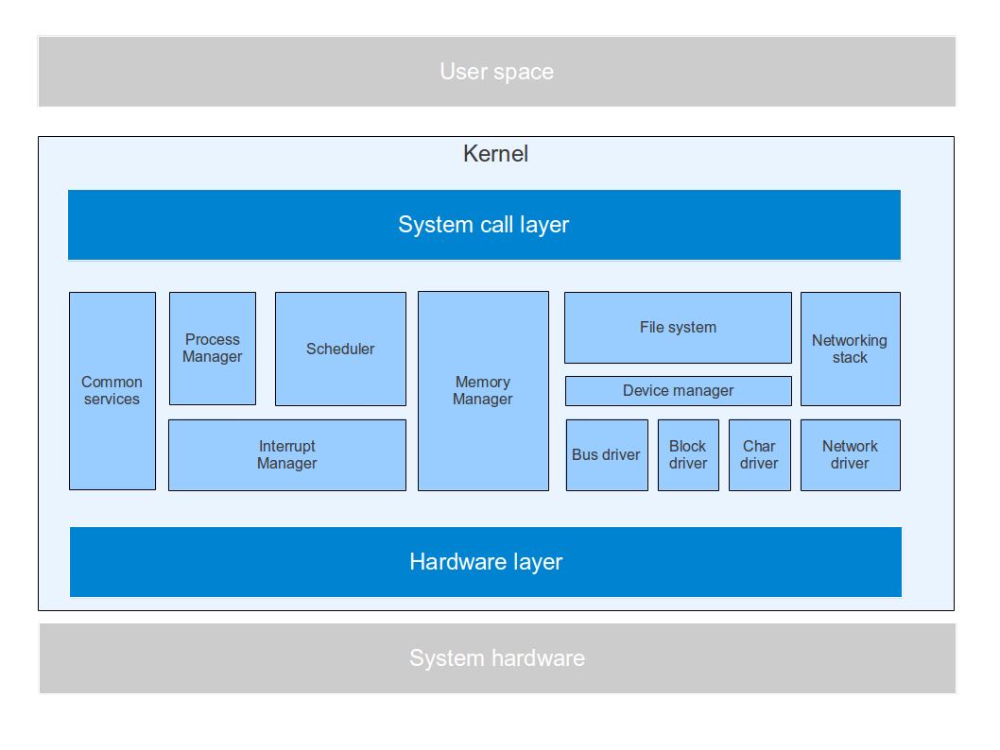

# Introduction

ctOS is a monolithic kernel for the x86 platform which follows closely the basic design which is common to most POSIX/Unix like operating systems, even though ctOS does not aim at being fully POSIX compatible. It is a multitasking operating system using virtual memory and paging to separate processes from each other. As for other Unix like systems, kernel code is executed in a privileged level ("ring 0"), whereas user code runs with a lower privilege level ("ring 3") and uses kernel services to access ressources like memory and devices.

To support symmetric multi processing (SMP), kernel code is usually preemptible and locks and semaphores are     used to protect global data structures and global resources from concurrent access. Currently up to eight CPUs are detected and used on the x86 platform.

Multitasking is realized by switching the interrupt context during execution of an interrupt. If, at the end of an interrupt handler, task switching needs to be done, the registers saved by the interrupt entry point on the stack are overwritten with saved values from another task. This includes the CPU register which holds the pointers to the page tables, so that when the interrupt handler returns, execution continues within the virtual address space of another task. The hardware multitasking features offered by the x86 CPUs are not used.

ctOS differentiates between a task and a process to support user-space thread libraries. A task is the unit of work handled by the scheduler. Each task has a minimum set of private data, including register contents and stack. Associated with each task is an address space, which is the virtual address space used during execution of the task. Several tasks can share the same address space. All tasks which share the same address space form a process.

ctOS uses x86 protected mode and is a 32 bit operating system. Support for 64 bit mode ("long mode") is currently not planned. ISA PnP and ISA DMA are not supported, as essentially all recent PCs use the PCI bus system.

Instead of implementing an own boot loader, ctOS is designed to work with multiboot compatible boot loaders like GRUB2. This allows for an easy installation on existing workstations running any of the standard Linux distributions which use GRUB2 as their boot loader.

Currently drivers for the following devices are supported:

* Programmable interrupt controller (PIC) 8259
* Programmable interval timer (PIT) 8254
* Real-time clock
* Keyboard controller (8042 and compatible)
* Text-mode VGA
* Graphic cards supporting the VBE 2.0 standard
* I/O APIC and local APIC
* PCI bus
* Parallel ATA / IDE hard disks (including bus mastering DMA)
* AHCI SATA controller
* RTL 8139 network controller

## Kernel core components

The following diagram displays the core components of the kernel. Essentially, the kernel is built up in three layers. The upper layer is the interface to user space. It contains the entry points for all implemented system calls and is the only part of the kernel which is directly visible to the user space. The middle layer of the kernel consists of the kernel services. The kernel services are used to implement system calls and to manage the physical ressources like memory, CPU and I/O. Finally, the lower layer consists of utility functions which offer direct access to the systems hardware like special CPU register and ports.

## Common services

This component contains common code which is used throughout the kernel and implements services which are considered basic technical services not located in a functional component. Currently, this encompasses the following services.

* Logging
* Internal debugger
* Spinlocks
* List handling
* Handling of kernel parameters
* System monitoring
* Timing services

ctOS offers several options to log debugging output. Modules can log information, errors and exceptions ("panic") which are enriched by location information and sent directly to the console. In addition, the logging service optionally sends all debugging information in addition to the debugging ports used by the emulators Bochs, VirtualBox and QEMU. Output which goes to this port can be redirected into a file on the host system to reconstruct a session.

To facilitate the diagnosis of exceptions and panic conditions, ctOS offers an internal debugger which is invoked each time the kernel panics but can also be started at any time using the hotkey F1. Using this debugger, it is possible to inspect register contents, memory contents and internal data structures of the kernel like page tables, tasks, runnables and so forth.

An important component of the common services is the module `locks.c`, which contains functions to realize spinlocks. Spinlocks are the most basis way to lock data structures in ctOS. In general, spinlocks are used when a data structure needs to be protected, but the execution of the critical section only takes a few microseconds. In these cases, using a spinlock which does a busy waiting is more efficient than using the semaphores offered by the process manager which puts a process to sleep and thus requires a context switch.

When operating in graphical mode, ctOS displays two additional windows in addition to the console window. These windows display information on the used hardware like the detected CPUs and hard drives as well as performance data like the current CPU load on all CPUs and the I/O throughput rate. This data is collected and presented by the system monitor (sysmon.c) which uses public services of other modules to gather information.

A dedicated module contains all timer related code and offers a unified interface for other parts of the kernel to access timers like the CMOS based real-time clock (RTC), the PIC and the local APIC timer. The timer module is also the owner of the timer interrupt and is responsible for forwarding "ticks" to other parts of the kernel like the process manager and the scheduler.

Finally, the common services library contains code to parse kernel command line parameters which are passed to the kernel at boot time and the code that deals with the multiboot/multiboot2 protocols.

Modules:

* debug.c
* kprintf.c
* locks.c
* params.c
* multiboot.c
* sysmon.c
* timer.c

## Scheduler

The scheduler is one of the main components of the kernel. It is responsible for distributing CPU time amongs the available tasks. The scheduler is invoked at the end of each interrupt handler to locate the next task to run. The actual task switch is done by the program manager.

The scheduler in ctOS uses an algorithm which could be called "round-robin by dynamic priority". For each priority, a separate queue of tasks awaiting execution is maintained. Each task initially is granted a certain number of milliseconds CPU time which is called the **quantum**. When a task has exceeded its quantum, it is preempted and the queues are scanned for another task, starting with the queue for the hightest priority. The old task is added to the end of the queue while at the same time lowering its priority. Thus a task which consumses a lot of CPU is punished by decreasing its priority dynamically.

In addition to the dynamic priority used by the scheduler, each task has a static priority which is inherited when the task is created. Whenever the task enters the state RUNNABLE from any other state, this priority is used as the initial dynamic priority. An exception is made when a sleeping task is woken up - in this case its dynamic priority will be set to the static priority plus one to make sure that the task has a chance to process the input as soon as possible. Thus I/O bound tasks which go to sleep and are woken up often obtain a higher dynamic priority than CPU bound tasks over time.

For each CPU in the system, a separate queue is maintained. At defined points in time, for instance when a task which has been sleeping and waiting for an event, the scheduler decides about the queue to which the task will be added. The task will remain bound to this CPU as long as it is runnable, i.e. preemption will not cause a migration of a task from one CPU to another CPU. This makes it easier for tasks to work with CPU specific data as no unexpected migration is possible while at the same time creating some distribution of the total load across all available CPUs.

The main functions offered by the scheduler are

* add a new task to the queues of executable tasks
* remove a task from the queues of executable tasks
* choose a new task for execution
* process a timer tick, i.e. decrement the quantum of the currently active task

Modules:

* sched.c

## Process manager

The process manager is responsible for the creation and destruction of tasks and processes as well as for controlling the status and life-cycle of a task. All functions which change the status of a task are implemented as part of the process manager. This includes all functions which put a task to sleep or wake-up a sleeping task as well as the entire signal handle code. The process manager offers functions to

* create the initial process at boot time
* clone a process
* create a task
* destroy a process 
* destroy a task
* send a process to sleep and wake up a process
* handle semaphores
* send signals to a process
* handle signals within a process, for instance by invoking a user-defined signal handler
* load an executable in ELF format from disk and run it

The relationship between processes and tasks is modeled to support the later implementation of a POSIX thread library (pthreads) in userspace. Thus

* all tasks within a process share the same virtual memory
* all tasks within a process share the same open file descriptors and the same signal dispositions
* individual tasks within a process can block signals, i.e. the signal mask is managed on task-level
* when a signal is received by a task which results in the termination of a process, all tasks within that process terminate
* if the exec system call is invoked by a task within a process, all other tasks within that process terminate
* if a task within a process forks, only the currently active task within this process is added to the new process
* if a process terminates because a task belonging to the process invokes the exit system call, all tasks within that process are terminated

However, tasks can also be created in kernel space and can be pure kernel threads which never enter user space at all. In fact, in the current release of ctOS, only threads at kernel level are supported.

The program manager also contains the module `wq.c` which offers a generic implementation of queuing. Using so-called **work queues**, kernel modules can schedule a specific function ("handler") for later execution. These handlers are added to a work queue which is then scanned regularly by a high-priority kernel thread per CPU ("worker thread"). The worker thread is woken up by the timer module after a certain number of timer ticks, but can also be woken as needed by other parts of the kernel, for instance by interface handlers. Currently this mechanism is used by the networking stack only.

Modules:

* pm.c
* elf.c
* wq.c

## Memory manager

The memory manager handles access to physical and virtual memory. It is responsible for setting up and managing the page tables and organizing physical memory. At boot time, the memory manager uses the information provided by a multiboot compliant boot loader to reserve RAM pages which cannot be used as they contain memory mapped I/O or important firmware tables.

In ctOS, the entire virtual address space of a process is divided into three areas. A **common system area** contains the entire kernel code, data area and heap and the first 1 MB of physical memory mapped one-to-one. In addition, this area also contains a region in memory which is reserved for memory mapped I/O, i.e. device drivers can map pages of physical memory which contains memory mapped registers into this area of virtual memory. Thus if an interrupt occurs, the entire kernel including all kernel data structures and all memory mapped registers is available to the interrupt handler. The common system area also holds the initial ramdisk created at boot time.

The second area is called **private area** and contains all user space pages, i.e. user space code, data area and the user space stack. Finally, a third area called **private system area** contains those kernel-level pages which are specific to each process, most notably the kernel stack.

Regarding kernel stacks, different designs are feasible. For a single-CPU operating system, it is theoretically possible to have only one common kernel stack, maybe even located within the common area. However, in ctOS, multiple tasks can run within one address space. As kernel level code in ctOS is preemptible in most cases, it can happen that while task A is in kernel mode, it is preempted and task B also starts to execute within kernel mode. If A and B belong to the same process, it needs to be made sure that they use different stack areas. Therefore in ctOS, each task has its own kernel stack area.

The following services are offered by the memory manager.

* allocate virtual memory for the kernel and for user space processes
* allocate physical memory
* manage the kernel heap area
* clone address spaces to support the process manager
* set up and destroy stack areas for tasks
* manage the initial RAMDISK 
*map memory ranges used by devices for memory mapped I/O into the virtual address space of all processes to make them available for device driver

Modules:

* mm.c

## Interrupt manager

The interrupt manager is setting up and controlling the interrupt processing. At boot time, code within the interrupt manager sets up the systems interrupt controller (PIC or APIC). It maintains a table of interrupt handlers which are invoked whenever an interrupt is raised. Other parts of the kernel can register their interrupt handlers with the interrupt manager. If the I/O APIC is used, the interrupt manager will also scan the BIOS tables containing interrupt routing information (MP tables) and the ACPI tables to understand which device is connected to which input pin of the interrupt controller and set up the controller accordingly. If a device supports MSI, this is used instead of using a wired interrupt.

After initialization, ctOS is mostly interrupt driven. In fact, kernel space is only entered if a hardware interrupt or an exception is raised or if a user space program uses the interrupt 0x80 reserved for system calls to access kernel services. Therefore, the interrupt manager can be considered as being the "main loop" of the kernel once it is up and running.

Functions offered by the interrupt manager are

* Initialization of interrupt router and interrupt controller (PIC and APIC)
* locate the interrupt associated with a given PCI or ISA / LPC device
* register interrupt handlers
* dispatch incoming interrupts

Modules:

* irq.c
* mptables.c
* acpi.c

## PCI bus driver

The PCI bus driver contains low-level functions to manage PCI devices. This includes functions to read and write PCI configuration space as well as PCI device enumeration done at boot time. Internally, the PCI bus drivers maintains a list of all detected PCI devices which is used to service requests. Device drivers can use the PCI bus driver to scan the system bus for devices for which they are responsible. Functions offered by the PCI bus driver are

* locate PCI devices by class and subclass
* read and write the PCI configuration space of a device
* query PCI devices by sub class and base class

Modules:

* pci.c

## File system

The file system component is responsible for translating access to the file system into calls to device drivers. It manages open files and inodes as well as disk caches and uses the device manager and the device drivers to perform actual I/O operations. Services offered by the file system component are

* file access functions like read, write, open, close
* handling open files and file descriptors
* handling directories
* mounting and unmounting of devices

As it is common for UNIX like operating systems, the file system layer maintains a list of open files which is shared between all running processes. Within each process, an open file is addressed by an integer number called a **file descriptor**. More than one file descriptor can point to the same open file. When a process forks, all file descriptors of the forking process are cloned and inherited by the child process.

To easily support several different file systems like Ext2, Minix, FAT16 etc., the file system code itself is again split into several layers. The top level layer, called the **generic file system layer**, offers standard interface functions which are sufficient to implement standard system calls like open, close, read and write. This layer communicates with the actual file systems like the Ext2 file systems via a set of standard interface functions. Thus to add support for an additional file system, only this interface needs to be implemented. 

The layer below the actual file system is called the **block cache** and maintains a cache of blocks which have been read from disk, so that the file system code does not need to agressively optimize access to the underlying block devices (currently only implemented as stubs, i.e. invoking the lower layers directly without any actual caching). Finally, the block cache layer uses the device manager to communicate with the actual device drivers.

Modules:

* fs.c
* fs_fat16.c
* fs_ext2.c
* fs_pipe.c
* blockcache.c

## Device driver manager

The device (driver) manager is a (thin) abstraction layer which is used by higher layers and system calls to access block and character devices. During initialization, device drivers register function pointers for common function like open, read and write with the device manager. When file system code needs to access a device, it uses the device manager to obtain pointers to these functions. The device manager is also responsible for initializing and shutting down device drivers. Services offered are

* locate services offered by device drivers
* initialize and shutdown device drivers
* grant major numbers to device drivers

Modules:

* dm.c

## Networking stack

The networking stack offers functionality to send and receive data over a network. Currently it supports TCP as transport level protocol, IP as network protocol, ARP, a limited subset of ICMP and Ethernet on the physical layer. A generic socket layer implements the Berkeley socket API.

The networking stack uses several queues to be able to perform work outside of an interrupt context. Essentially, messages are passed up and down the networking stack and stored in queues when a certain action needs to be delayed.

The file system forwards calls to the socket API to the networking stack and is used to resolve file descriptors to sockets.

Modules:

* net.c
* net_if.c
* icmp.c
* ip.c
* tcp.c
* arp.c

## Device driver

Device drivers are responsible for translating the requests they receive from other parts of the kernel - for instance "read data from device" - into actual requests on hardware level. Most device drivers fit into one of two standard models (character devices, block devices) which are common in most Unix operating system and allow an abstraction of device drivers and their interface visible to the other components of the kernel. However, not all device drivers fit into this scheme. A typical device driver exposes the following services.

* initialize the device
* perform device diagnostics
* read data from the device
* write data from the device

Examples for device drivers are:

* the PATA driver (pata.c)
* the AHCI driver (ahci.c)
* the TTY driver (tty.c)

## Hardware layer

The hardware layer contains function which are used by the upper layers of the kernel to actually access physical hardware. This includes

* access to special registers of the CPU
* low-level assembler code for atomic operations
* low-level interrupt handler
* access to I/O ports
* utility functions to format low-level system tables like GDT, IDT and paging tables
* low-level access to VGA memory, keyboard and timer
* code to coordinate the startup of additional CPUs at boot time (smp.c)

Modules:

* all modules in subdirectory hw of the kernel source tree

# Dynamic views

To illustrate how the different parts of the kernel cooperate, this sections describes some general concepts and selected call chains for a few use cases.

## Execution level and overview of interrupt handling

One of the more subtle points in the design of an operating system is to understand and handle the impact of interrupts on the execution flow of a thread or program. To organize the work which is done inside the interrupt handler, ctOS uses the concept of **execution levels**. An execution level is an integer variable associated with a task which is used to keep track of whether a task is running within an interrupt handler or not. At each point in time, a task executes on one of four different execution levels.

* user space
* kernel thread
* system call
* interrupt

An ordinary task comes into existence as a task either by execution in user space or as a kernel thread. In this state, it executes as "ordinary" program,  even though a kernel thread has direct access to kernel functionality and kernel memory. The execution level of a task changes when either an interrupt is raised (be it a software interrupt, an exception or a hardware interrupt) or when the task executes a system call, which is at the same time the special case of a software interrupt with the reserved interrupt number 0x80.

Whenever an interrupt is raised, the CPU will stop the execution of the current task and execute a specific interrupt handler. In ctOS, all interrupts are handled within the central routine `irq_handle_interrupt` within the interrupt manager. For the time during which the interrupt is handled (which can be very short, as it is typically the case for a hardware interrupt, or longer, as it might happen for a system call which puts the current task to sleep), the execution level of the task is now changed to either "system call" or "interrupt", depending on the type of the interrupt. When the interrupt has been processed, the interrupt manager restores the old execution level and the execution of the thread is resumed. The following diagram displays the possible execution levels and the transitions between them.

Note that, while being at execution level "interrupt", another interrupt might be raised, as even while a hardware interrupt is handled, interrupts are temporarily enabled again at some point within the interrupt handler. Thus it might happen that an interrupt does not change the execution level at all - this is what happens if for instance a timer interrupt occurs while we are execution at interrupt level. However, no interrupt handler should invoke a system call, so the transition interrupt level --> system call level is not permitted. On the other hand, most system calls can be interrupted by a hardware interrupt and are even preemptible, i.e. the execution of a task can be suspended during a system call in favor of another runnable task.

Interrupts are handled by a combination of code in the interrupt manager and in the assembler module `gates.S`. In this module, all the entry points are defined which are stored in the Interrupt Descriptor Table (IDT) and therefore called by the CPU when an interrupt is detected. All these handlers call a common handler also located in gates.S which basically saves the current state of the CPU by pushing it onto the stack. Then this common handler calls `irq_handle_interrupt` in the interrupt manager. When this function returns, the CPU state is popped off the stack and execution resumes. Note that popping the state off the stack might result in a task switch if the process manager has manipulated the contents of the saved CPU state ("Interrupt context") accordingly. If the interrupt manager indicates a task switch by setting its return code to one, the common handler will execute an additional step - it will switch to an alternate kernel stack and call the post-interrupt handler which can do any cleanup activities which could not be done while being on the main kernel stack of the task, for instance cleaning up the kernel stack itself. The following diagram gives a simplified overview of the interrupt processing.

The interrupt processing itself depends on the level to which we return and the type of interrupt. Initially, the CPU has disabled additional interrupts when calling our interrupt handler. When a hardware interrupt or an exception is processed, we leave interrupts disabled for the time being, process the hardware interrupt by calling the handler which has been registered by the device driver if any and acknowledge the interrupt.

When a system call is processed, however, we turn on interrupts again while the system call is being processed. When now an additional interrupt, for instance a timer interrupt, is raised, the interrupt handler will execute again. This time, the return level is level 2 - system call. Therefore no signal processing and no exit processing is done while executing this instance of the interrupt handler, but scheduling is done and might result in a task switch. Thus system calls are fully preemptible, unless of course the system call itself acquires a spinlock which will turn off interrupts temporarily.

For all types of interrupts, the signal handling code located in the process manager is invoked next. Note that this code typically only handles the interrupt if we return to the user space level after completing the interrupt, but this is just a design decision which has been taken for the signal handling within this release of ctOS and is not enforced by the general processing pattern for interrupts. Consequently, code executing on the interrupt level can be interrupt again in case the original interrupt has been raised on kernel thread or user space level.

The next part of the processing checks whether a task or process has requested to be terminated. For that purpose, interrupts are enabled again and a function in the process manager which handles exit requests is called. It is vital that interrups are enabled again here as exiting a process usually involves closing open files and flushing inode buffers, which can result in an I/O operation for which interrupts are required. Finally, the scheduler is called to select a new task to execute - however this is only done if we do not return to interrupt level, i.e. no scheduling takes place for nested hardware interrupts. Therefore code executing on interrupt level can be interrupted by another hardware interrupt, but cannot be preempted, i.e. after processing of the additional hardware interrupt, the currently active thread is resumed.

In some situations, it turns out to be necessary to repeat a system call. Therefore the signal processing code can return 1 to the interrupt manager in order to indicate the need to repeat a system call. In this case, the interrupt manager will revert the interrupt context to re-create the situation at the time when the system call was invoked and repeat the system call invocation.

In the next few sections, we will now look at a few specific cases of this general processing scheme in detail, namely at exiting a task, scheduling another task and switching to it and execution of the system call fork.

## Task switching

Performing  a task switch requires the collaboration of the common interrupt handler in the hardware layer, the interrupt manager, the scheduler and the process manager. When an interrupt occurs, the common interrupt handler written in assembler language saves the state of the CPU on the stack and then calls the interrupt manager. The interrupt manager determines the device driver responsible for handling the interrupt and calls the appropriate handler function. When the device driver returns, pending signals and exit requests are handled and then the scheduler is invoked.

The scheduler now examines all tasks ready for execution and, based upon priorities and scheduling policies, determines the task to run next - which can be identical to the currently active task - and updates the internal ready queues. It then returns the task id of the selected task to the interrupt manager which now calls a function within the process manager which prepares the task switch by patching the stack of the currently active task. The process manager then returns to the interrupt manager.

At this point in time, the actual task switch has not yet been done, only the stack built by the common handler when the interrupt was raised was changed. When now the common handler continues processing, it picks up this stack and thus puts the CPU into the saved state of the selected task, thereby doing the actual task switch.

Often, a task switch is the result of a block operation. A task can decide to suspend execution until a certain event occurs, like the completion of an I/O request. To do this, the task can remove itself from the scheduler queues, update its status in the task manager to BLOCKED and either wait for the next interrupt to happen or raise a software interrupt. In the handler of this interrupt, the scheduler will then select another task to be executed and a task switch will occur.

In the period of time between removing itself from the scheduler queues and completion of the next interrupt handler, the task is in a slightly inconsistent state. It is no longer contained in the schedulers run queue, but still being executed on the CPU on which it was running. In particular, the kernel stack of the task is still being used. A task in this special state is called **floating**. Usually, a task is only floating for a short period of time. However, in an SMP system, a special handling is required to make sure that a task which is floating is not selected to be run on another CPU (for instance because the I/O event it is waiting for is received by this CPU and the task is added again to the run queues and executed right away), as this would imply having two CPUs which execute on the same kernel stack, which would most likely corrupt the stack. Also, interrupt handler which can be invoked while a task is floating should not assume that the task is placed on a scheduler run queue. 

## Fork

As an example for the execution of a system call and to illustrate how the program manager and the memory manager interact, let us look in detail at the execution of the fork system call. This system call is one of the most complicated system calls. Due to the fact that the entire data which makes up a process is split across the four modules process manager (holding the main process data), scheduler (holding the runnables representing the tasks of the process), memory manager (holding the memory map and the page tables) and file system layer (holding the files kept open by the process), the system call requires the close cooperation of all these modules.

As every system call, fork is initially received by the kernel as interrupt 0x80 and thus handled by the interrupt manager. The function `irq_handle_interrupt`, which is responsible for identifying and dispatching interrupts, invokes the main entry point `syscall_dispatch` in the system call layer. Before doing that, however, it will turn on interrupts again which are turned off at this point to make the system call execution preemptible. 

Based on the content of the EAX register, which by convention contains a number identifying the system call to be executed, the dispatcher function `syscall_dispatch` then determines that the implementation `do_fork` of the fork system call which is located within the process manager is to be invoked.

This function first calls the memory manager function `mm_clone` to create a copy of the current virtual address spaces. Next the function `fs_clone` within the file system layer is invoked which is in charge of cloning the open file descriptors of the process. It then performs some additional setup functions, for instance setting up a task within the new process and calling the scheduler to add this new task to the queue of runnables. At this point, the new process is ready to be run. 

Then `do_fork` returns to the system call layer which in turn returns control to the interrupt handler. The interrupt handler turns off interrupts again to make sure that during the complex stack manipulations following a potential task switch, no interrupt occurs. Then control returns to the hardware layer.

## Exit the currently running task

To exit the currently running task, again several kernel components (process manager, scheduler, memory manager, HW layer and interrupt manager) cooperate. The process which is initiated by the function `pm_handle_exit_request` in the process manager is displayed in the following diagram.

First the process manager calls `sched_dequeue`  to remove the currently running task from the list of runnables visible to the scheduler. Next, the process manager updates its internal tables and marks the task as DONE before it finally enables interrupts again and raises a software interrupt to initiate the next task switch to continue execution with a different task.

Note that at this point in time, there is still a part of the kernel stack reserved for the currently active task, as removing the mapping for this kernel stack in the virtual address space of the process already here would result in a page fault when the next interrupt is raised (which will push some stuff on the stack). However, as the call of `sched_dequeue` has removed the currently active task from the run queues, the next interrupt will immediately result in a task switch. As for every task switch, a special handler called the post-interrupt handler which is part of the interrupt manager is called at a late point during the processing of the common interrupt handler. At this point, the interrupt has been fully processed and the stack has been changed to the common kernel stack, while the task switch itself is not yet completed and the CR3 register is still loaded with the page table directory of the current process.

The post-interrupt handler now invokes the function `pm_cleanup_task` which is again part of the process manager. This function checks the internal variable `previous_task` of the process manager to see whether the task we are about to switch away from  has status DONE. If this is the case, the kernel stack of the task can be safely deallocated as we are using the common kernel stack at this point. When the post-interrupt handler returns, the processing of the task switch is completed and a new task is executed.

In practice, the function `pm_handle_exit_requests` is not directly called when a part of the kernel, for instance the system call layer or the signal handling code, wishes to complete a task. Instead, a flag within the task structure is set to mark the task for termination. When the next interrupt is processed, the interrupt manager will invoke the function `pm_handle_exit_request` which will detect this flag and initiate the actions described above.

Also note that the diagram above only displays the simple case that the task being completed is not the last task within its process. If this condition is not met, additional cleanup steps are done to release page tables, close open files and release all other ressources held by the currently running process.

## Writing to a socket

Writing to a socket involves all layers, starting at the file system layer down to the network interface layer, and involves storing pieces of work in a work queue for later processing. For the sake of simplicity, we look at the case of a raw IP socket only as writing to a TCP socket involves additional asynchronous processing due to the ACK driven nature of TCP/IP.

When the send system call is invoked on a file descriptor representing a socket, the file system layer retrieves the reference to the socket structure attached to the open file pointed to by the file descriptor and then calls the function `net_socket_send` in net.c which contains the actual  processing. After doing some checks, this function then retrieves a function pointer stored in the socket structure which contains the socket specific send routine that depends on the type of the socket. For raw IP sockets, this function pointer points to `ip_socket_send`.

This function assembles a network message and then calls `ip_tx_msg` which does the actual message processing. This involves finding a route to the destination, performing fragmentation if necessary, adding the IP header and finally adding the message to a work queue using the work queue manager.

When the corresponding worker thread wakes up, it calls a handler located again in ip.c. This handler first invokes the ARP module to determine the hardware address of the destination ("next hop"). For this scenario, let us assume that the hardware address can be resolved from the ARP cache (otherwise the entry in the work queue will be rescheduled and the ARP module will send an ARP request to all stations in the local network). Then the network interface layer net_if.c is called. This layer needs to wait until the network interface card is ready to accept the packet, i.e. until one of the transmission buffers of the card is free. Therefore the entry is added to another work queue and the work queue manager involves the handler once it is informed by the network interface that it is ready to transmit. 

## System initialization

At boot time, all components of the kernel need to be initialized properly. The exact order in which initializations are performed is driven by the fact that there are dependencies between the various initialization functions. If, for instance, a module establishes dynamic data structures, it will probably need to call kmalloc, so the kernel heap needs to be present at this point in time.

The detailed startup flow is documented in the header comment section of the module main.c. Essentially, the startup code consists of the following steps.

1) The bootstrap CPU (BSP) comes up and the boot loader handles control over to the assembler code contained in start.S
2) The code in start.S sets up a valid global descriptor table (GDT), reloads the segment registers, sets up the interrupt descriptor table (IDT) and loads the respective register of the CPU
3) At this point in time, the function `run` in main.c is invoked. This function then performs a basic initialization of all system components, i.e. it initializes all drivers, sets up the memory manager and the process manager, turns on paging and interrupts. In addition, the stack is migrated away from its initial location to the defined stack area for the root system task 0.
4) Once the initialization of the bootstrap CPU is completed, all additional CPUs in the system (application processors) are started. Each application processors runs a startup sequence which handles the transition to protected mode and turns on paging and interrupt handling. In addition, each CPU creates its own idle task and then enters this task, waiting for the first interrupt
5) Once all CPUs are up and running, the BSP spawns the first process (INIT process) and then enters an idle loop as well
6) Finally the INIT process mounts the root file system, opens STDIN, STDOUT and STDERR and then switches to user space, running the executable /init

