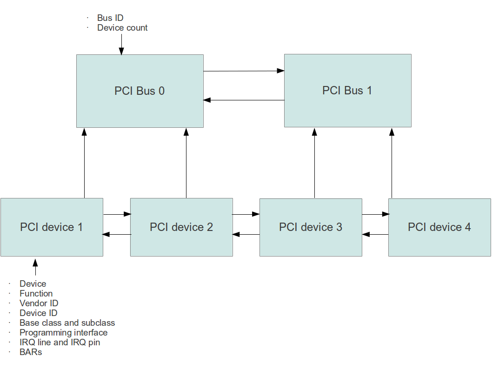

# The PCI bus driver

The PCI bus driver is responsible for collecting information on the PCI devices present in the machine. At startup time, the PCI bus driver performs a PCI bus scan to detect busses and devices available on the PCI bus system. Device drivers can use the PCI bus driver to obtain a list of PCI devices with certain properties. An ATA driver would, for instance, use the PCI driver at initialization time to retrieve a list of all ATA/IDE devices present in the system and set up the list of available minor devices accordingly.

## PCI data structures

To reflect the structure of the PCI bus system, the PCI bus driver maintains two central data structures which correspond to PCI busses and devices on a PCI bus.
The major attributes of a PCI device are:

-   Device and function
-   Vendor ID and device ID
-   Base class and subclass
-   Programming interface
-   IRQ line and IRQ pin
-   BARs

The only major attribute of a PCI bus is its ID which is unique, starting with 0 for the bus which is closest to the CPU. In addition, the bus driver maintains a counter `device_count` for each bus which contains the number of devices attached to the bus.

Each PCI device is located on exactly one bus (the primary bus for a bridge). To model this, each PCI device contains a pointer to the bus structure which describes the bus on which it is located. Thus busses and devices form two linked lists which refer to each other, as visualized in the following diagram.

## Scanning the PCI bus at system boot time

To scan the PCI bus at boot time, the following method is used. Initially, the driver sets up one instance of the PCI bus structure and adds it to a list of PCI busses. It then starts to scan all bus systems in the list. This is done by reading the vendor ID for each device and function which are theoretically possible. If the vendor ID is different from 0xFFFF, a device exists in that slot. In that case, a new PCI device structure is instantiated and added to the list of PCI devices.

When this scan hits upon a device which is a PCI-to-PCI bridge, it reads the configuration space of the device to identify the secondary bus. It when adds the bus behind the bridge to the tail of the bus list. In this way, the bus list grows during the scan so that the scan only ends once all bridges have been crossed and all devices have been identified.

Note that the PCI bus drivers initialization routine is called by the initialization routine of the device driver manager. As other PCI devices rely on the services of the bus driver, the internal order of initialization functions in the device driver manager `dm.c` must guarantee that the bus driver initializes before the initialization routine of any other PCI device driver is invoked.

## Presenting devices to a device driver

Once the PCI bus driver has scanned the PCI bus system and established a list of valid devices, device drivers can use the services of the bus driver to detect devices they are responsible for. To do this, the PCI bus driver offers several queries. The parameters to these queries are

-   a filter
-   a callback function of type `void (*callback)(const pci_dev_t* pci_dev)`

When one of the queries is invoked, the PCI bus driver will scan the list of detected devices. For each device matching the filter, it will invoke the callback function, passing the respective device as parameter. The device driver can then perform further hardware detection and set up its internal data structures. For instance, a PATA hard disk driver would usually probe for master and slave devices on the disk and read the partition tables on all disk to understand what disks are present in the system.

The following query types are supported:

-   query for all PCI devices in the system (`pci_query_all`)
-   query for all PCI devices which match a specific base class - thus a query for base class 0x1 would return all mass storage controller (`pci_query_by_baseclass`)
-   query for all PCI devices which match a specific base class and subclass - a query for base class 0x1 and subclass 0x1 would return all registered IDE controller (`pci_query_by_class`)

Note that the pointers returned by these functions are pointers into the internal data structures of the PCI bus driver. Thus the callback function should never modify the pointers and should not try to free them.

## The public interface of the PCI bus driver

Summarizing the previous section, here is the list of the public interface functions offered by the PCI bus driver.

<table>
<thead>
<tr class="header">
<th>Interface function 
</th>
<th>Description 
</th>
</tr>
</thead>
<tbody>
<tr class="odd">
<td>pci_init 
</td>
<td>Initialize the internal data structures of the bus driver and scan the bus for bridges and ordinary PCI devices 
</td>
</tr>
<tr class="even">
<td>pci_query_all 
</td>
<td>Call a provided callback function once for each registered device 
</td>
</tr>
<tr class="odd">
<td>pci_query_by_baseclass 
</td>
<td>Call a provided callback function for all PCI devices with a given baseclass 
</td>
</tr>
<tr class="even">
<td>pci_query_by_class 
</td>
<td>Call a provided callback function for all PCI devices with a given baseclass and a given subclass 
</td>
</tr>
</tbody>
</table>

