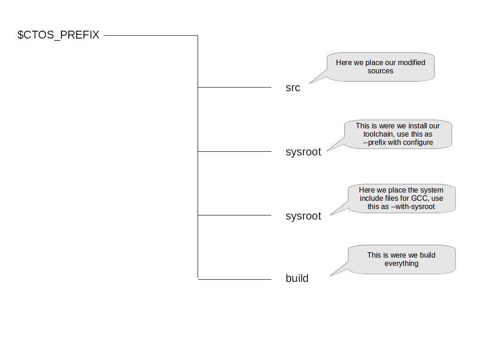

# Building and porting for ctOS

The first part of document describes how to build and install a ctOS specific toolchain, i.e. a version of assembler, loader and C-compiler that will generate code to run on ctOS. Most of the material in this guide comes from the page on the [OSDEV wiki](https://wiki.osdev.org/OS_Specific_Toolchain) and the [GCC internal documentation](https://gcc.gnu.org/onlinedocs/gccint/Configure-Terms.html#Configure-Terms) on the build process.

As examples illustrating the usage of the toolchain and the pitfalls during porting, we also explain how to port a few sample applications in the second part of this guide.

## Building binutils

To prepare for building binutils, we first need to make sure that the packages which we depend upon are installed on our system. On Debian or Ubuntu, use the following commands to install texinfo, flex and bison.

```
sudo apt-get install texinfo
sudo apt-get install flex
sudo apt-get install bison
```

Next, we need to obtain a copy of the binutils source code. I have used version 2.27, which you can download using

```
wget https://ftp.wrz.de/pub/gnu/binutils/binutils-2.27.tar.gz
gzip -d binutils-2.27.tar.gz
tar xvf binutils-2.27.tar  
```
This will create a directory called binutils-2.27 in your current working directory and extract the source code there. Let us call this directory SRC for the remainder of this documentation.

After the binutils package has been extracted to a directory which we will denote by SRC throughout the remainder of this document and looking at the contents of the root directory, it is obvious that - like most GNU packages - binutils uses the autoconf mechanism, i.e. a shell script called configure which is supposed to set variables and create a Makefile adapted to the execution and target environment. At www.gnu.org, a rather comprehensive documentation for the autoconf package is available from which we learn two basic facts relevant for our undertaking.

* we are expected to run configure with the switch --target to define the target architecture for which the resulting binutils should generate code
* all known target architectures are defined in the file config.sub which is essentially the same for all GNU packages

Here, a target architecture is specified by a string like i386-pc-linux-gnu, or more general either CPU-VENDOR-OS or CPU-VENDOR-OS-KERNEL. So the first thing we need to do is to define a target string for the ctOS platform and to make it known to the configure script by adding it to config.sub. We will use the target name i686-pc-ctOS for our purposes.

So open config.sub (located in the SRC directory) and locate he case statement starting with

```
# Decode manufacturer-specific aliases for certain operating systems.

if [ x"$os" != x"" ]
then
case $os in
```

Right above the lines

```
    -none)
        ;;
```

add a line for ctOS:

```
    -ctOS*)
        os=-ctOS
        ;;
```

The next patch we need to make is related to the BFD library. The BFD library is the library used by all binutils to handle object files and executable files. Obviously, we need to declare at some point that our architecture uses the executable file format ELF32. This is done in the file SRC/bfdconfig.bfd.

The header of this file contains a short documentation, explaining which shell variables are set by this script depending on the target name. To add an entry for our target, locate the line starting with

```
  i[3-7]86-*-linux-*)
```

Below this line, we add the description of our new target by simply taking over the value of targ_defvec, i.e.:

```
  i[3-7]86-*-ctOS-*)
    targ_defvec=i386_elf32_vec
    ;;
```

No additional vectors are supported apart from the default vector. Next, we need to tell GAS what object format to use for our target. This mapping is done in the script gas/configure.tgt which parses the target and assigns the appropriate object format. We will have to add a line to the case statement starting with

```
# Assign object format.  Set fmt, em, and bfd_gas.
generic_target=${cpu_type}-$vendor-$os
# Note: This table is alpha-sorted, please try to keep it that way.
case ${generic_target} in
```

Below the line for i386-*-coff, we add the line for our target, again using one of the existing lines as template:

```
  i386-*-ctOS)                fmt=elf ;;
```

The next thing that we need to do is to create an **emulation script** for ld. This script is used during the build process to create a linker script that ld will use later and that therefore determines the layout of our executables. So we create a script called SRC/ld/emulparams/elf_ctOS.sh with the following content.

```
. ${srcdir}/emulparams/plt_unwind.sh
SCRIPT_NAME=elf
OUTPUT_FORMAT="elf32-i386"
NO_RELA_RELOCS=yes
TEXT_START_ADDR=0x40000000
MAXPAGESIZE="CONSTANT (MAXPAGESIZE)"
COMMONPAGESIZE="CONSTANT (COMMONPAGESIZE)"
ARCH=i386
MACHINE=
NOP=0x90909090
TEMPLATE_NAME=elf32
GENERATE_SHLIB_SCRIPT=no
GENERATE_PIE_SCRIPT=no
NO_SMALL_DATA=yes
SEPARATE_GOTPLT=12
IREL_IN_PLT=
```

This script needs to be referred in ld/configure.tgt. Thus we need to add the following line to configure.tgt in the ld subdirectory:

```
i[3-7]86-*-ctOS)    targ_emul=elf_ctOS ;;
```

In order to also run genscripts.sh with the matching parameters, we need an additional line in Makefile.in in the ld subdirectory. Again we can use an existing line as template, for instance the line for eelf_i386.c. Our new line looks as follows:

```
eelf_ctOS.c: $(srcdir)/emulparams/elf_ctOS.sh \
  $(ELF_DEPS) $(srcdir)/scripttempl/elf.sc ${GEN_DEPENDS}
```

The target eelf_ctOS.c also needs to be added to ALL_EMULATION_SOURCES in order to be included in the build process.

We also need to define a location in which we place the resulting toolchain. For this guide, I will assume that you have defined an environment variable CTOS_PREFIX that points to the directory were we will locate the toolchain (for me, this is $HOME/ctOS_sys). Inside that directory, we will use the following structure.




Now we can finally run our build. Assuming that you have defined the environment variable CTOS_PREFIX (and created the respective directory), execute the following commands.

```
cd $CTOS_PREFIX
mkdir src
mkdir sysroot
mkdir install
mkdir src/binutils-2.27
cd binutils-2.27
<<now copy the source code to this directory and make the changes indidicated above>>
cd ..
mkdir build
mkdir build/binutils
cd build/binutils
../../src/binutils-2.27/configure --target=i686-pc-ctOS --prefix=$CTOS_PREFIX/sysroot --with-sysroot=/$CTOS_PREFIX/sysroot
make
```

## Building GCC

Next, we will build GCC. Again, we first download the source. I use GCC 5.4 for this purpose, which is a bit outdated but still used by comparatively recent distributions, like Ubuntu 16.40.

```
wget https://ftpmirror.gnu.org/gcc/gcc-5.4.0/gcc-5.4.0.tar.gz
```

We will also need a few packages on the build platform. These libraries are GMP, MPC and MPFR. Use the package manager of your distribution to get these packages, remember to install the "development" packages as well which contain the header files. On Ubuntu, this is done by

```
sudo apt-get install libgmp-dev libmpc-de
```

After the download of the gcc package has completed, extract the source. We use the same directory layout as above, i.e. we execute the tar command in $CTOS_PREFIX/src and thus create a directory gcc-5.4.0 there.

Now let us start to make the necessary changes. The first thing after extracting the GCC core package which we have to do is to make our platform once more known to the configure scripts. Thus we need to make the changes that we made to the config.sub file for binutils here as well.

The second file that we need to change is the file gcc/config.gcc. This file seems to map the target to some variables used for the configuration process. The first case statement sets the CPU type based on the CPU part of the target string. As we use an existing CPU i386-pc, we do not have to change anything here. However, in the second case statement, which starts with

```
# Common parts for widely ported systems.
case ${target} in
*-*-darwin*)
```

we have to add a line for our OS:

```
*-*-ctOS)
  ;;
```

We will also have to add a branch to the next case statement by adding the line.

```
i[34567]86-*-ctOS*)
    tm_file="${tm_file} i386/unix.h i386/att.h dbxelf.h elfos.h i386/i386elf.h i386/ctOS.h"
    ;;
```

This instructs the GCC build system to include those additional header files during the build process. These files define some precompiler constants that govern the behaviour of the toolchain. The definition of INIT_SECTION_ASM_OP in elfos.h will become important for the initialization procedure, see below. The file ctOS.h is a file that you will have to add to the subdirectory i386 and that we will use to override some of these settings. Here is the content of ctOS.h:

```C
/*
 * Tell GCC which files to add during linking - in this order!
 */
#undef STARTFILE_SPEC
#define STARTFILE_SPEC "crt0.o%s crti.o%s crtbegin.o%s"

#undef ENDFILE_SPEC
#define ENDFILE_SPEC "crtend.o%s crtn.o%s"


/*
 * Tell GCC which libraries we want to add as defaults
 */
#undef LIB_SPEC
#define LIB_SPEC "-lc"

```


Specifically for the GCC library libgcc, there is another configuration file that we need to change. In libgcc/config.host, there are again a couple of case statements that we need to amend. The first case statements starts with.

```
# Common parts for widely ported systems.
case ${host} in
```

Here we add a line for ctOS:

```
*-*-ctOS)
  extra_parts="crtbegin.o crtend.o"
  ;;
```

Note that the extra_parts variable instructs GCC to build the object files crtbegin.o and crtend.o which are not supplied by the ctOS runtime library but expected by  GCC.


The second statement which we need to change is the case statement starting with

```
case ${host} in
aarch64*-*-elf)
	extra_parts="$extra_parts crtbegin.o crtend.o crti.o crtn.o"
	extra_parts="$extra_parts crtfastmath.o"
	tmake_file="${tmake_file} ${cpu_type}/t-aarch64"
	tmake_file="${tmake_file} ${cpu_type}/t-softfp t-softfp t-crtfm"
	;;
```

to which we add the line

```
i[34567]86-*-ctOS)
    tmake_file="$tmake_file i386/t-crtstuff"
    ;;
```

We include the fragment t-crtstuff to avoid the issue described in https://gcc.gnu.org/bugzilla/show_bug.cgi?id=80848.

The next problem which we face is due to the fact the GCC comes with its own include files which have uncommon standard definitions for some integer types. Specifically, in the file stddef.h in gcc/ginclude (which is copied to build/gcc/gcc/include), in line 212, size_t is defined as long unsigned int and not as unsigned int. This needs to be changed to unsigned int.

Now we get to a few points which are related to the way GCC will operate on the target platform, i.e. ctOS. If GCC compiles and links a program, it will add its own low-level runtime library libgcc.a. This library therefore needs to be compiled on the host system but needs to run on the target system and therefore needs to be build against the header files of ctOS. Therefore we have to copy these files from the actual ctOS root to our newly created sysroot. For that purpose, let us assume that we have an environment variable CTOS_ROOT that points to a clone of the ctOS repository in which a succesful build has been done. We can then copy over all the files we need with

```
mkdir -p $CTOS_PREFIX/sysroot/usr/include
cp -v  $CTOS_ROOT/include/lib/*.h $CTOS_PREFIX/sysroot/usr/include/
mkdir -p $CTOS_PREFIX/sysroot/usr/include/os/
mkdir -p $CTOS_PREFIX/sysroot/usr/include/sys/
cp -v $CTOS_ROOT/include/lib/os/*.h $CTOS_PREFIX/sysroot/usr/include/os/
cp -v $CTOS_ROOT/include/lib/sys/*.h $CTOS_PREFIX/sysroot/usr/include/sys/
mkdir -p $CTOS_PREFIX/sysroot/lib/
cp -v $CTOS_ROOT/lib/std/crt0.o ~/ctOS_toolchain/sysroot/lib/
cp -v $CTOS_ROOT/lib/std/crti.o ~/ctOS_toolchain/sysroot/lib/
cp -v $CTOS_ROOT/lib/std/crtn.o ~/ctOS_toolchain/sysroot/lib/
cp -v $CTOS_ROOT/lib/std/libc.a ~/ctOS_toolchain/sysroot/lib/
```

In addition to the header files, we also copy the files crti.o, crtn.o and crt0.a which are needed for the initialization part, see the appendix below for more details on this, and the C library itself.

Another point which we need to observe is that GCC has a built-in mechanism to patch some header files that it thinks are not correct. The patches are placed in $CTOS_PREFIX/sysroot/lib/gcc/i686-pc-ctOS/5.4.0/include-fixed/. The mechanism doing this is controlled by the scripts in $CTOS_PREFIX/src/gcc-5-4-0/fixincludes. If we wanted to prevent GCC from touching our includes, we could add ctOS to the case statement in the file mkfixinc.sh. For the time being, we do not do this and let GCC do its work, but this needs to be kept in mind if header files are changed as then the changes will not automatically make it into the fixincludes directory.

Now we are done with our preparations and can run the actual build. Again, we add a build directory, cd there and start the actual build and install.

```
cd $CTOS_PREFIX/build/gcc
../../src/gcc-5.4.0/configure --target=i686-pc-ctOS --prefix=$CTOS_PREFIX/sysroot --with-sysroot=$CTOS_PREFIX/sysroot --with-gnu-as --with-gnu-ld --enable-languages=c
make -j 4
make install
```

This might take some time, depending on the number of CPUs you have. When the smoke clears, you should see a gcc executable in $CTOS_PREFIX/sysroot. 

## Porting dash

Here is the obvious approach to porting dash using our newly created cross-toolchain (I have used dash 0.5.8. from the Ubuntu distribution):

``
apt-get source dash
cd ../build/
mkdir dash
cd dash
export PATH=$PATH:$CTOS_PREFIX/sysroot/bin/
../../src/dash-0.5.8/configure --host=i686-pc-ctOS
make
```

The only problem that we need to fix is that in config.h, stat64 is defined as stat and open64 is defined as open. Apparently, this is done to make code designed for 64 bits like the code in exec.c which use stat64 work. Unfortunately, this causes a problem in mkinit as here, the included header files from the Linux system directories offer stat64 as well as stat and therefore the symbol stat64 is now defined twice.

To avoid this, we add the following lines at the beginning of mkinit.c before any other includes are done:

#undef stat64
#undef open64


With these modifications, dash compiles without errors. Note that the code in signames.c will, however, generate a large number of warnings, for the following reason. This code is generated by the tool mksignames.c which is compiled and executed on the build platform. It thus uses the constants NSIG as defined on the build platform. As this is more than NSIG on ctOS, we create an array in signames.c which has excess elements. However, this does not seem to be a real issue as the additional elements are simply ignored by the compiler.

## Porting ncurses


For this port, I have used the ncurses sources as provided on git, using the tag  `upstream/6.0+20160213`. Thus to get the sources, run

```
git clone https://anonscm.debian.org/git/collab-maint/ncurses.git --branch upstream/6.0+20160213 --single-branch
mv ncurses ncurses-6.0+20160213
```

in the source directory. Unfortunately, this will not build from scratch, and there is a couple of changes we need to make.

The first step required before being able to configure and build ncurses is to add the ctOS target to the config.sub file of ncurses, as we already did it when building binutils and GCC. 

Next we will have to supply the terminal data required by ncurses. Usually, ncurses uses the terminfo database or the older termcap database on the system where it is running. However, in our case, we cannot assume that we have a valid terminfo database on the host. For this situation, ncurses has the option to pull terminal information from the terminfo database which comes with terminfo and hardcode the information in the library which is accomplished by the script ncurses/tinfo/MKfallback.sh. This is the approach which we will take.

For that purpose, we will have to add an entry for our OS to the terminfo database which is distributed with ncurses. This database can be found in the source directory in ncurses/misc/terminfo.src and is in human readable terminfo format which is then compiled to a temporary database by MKfallback.sh. Open this database and add the following entry:

```
ctos|ctOS console,
    am, xenl,
    colors#8, cols#80, it#8, lines#25, ncv#3, pairs#64,
    bel=^G, blink=\E[5m, bold=\E[1m, clear=\E[H\E[0J, cr=^M,
    cub=\E[%p1%dD, cub1=^H, cud=\E[%p1%dB, cud1=\E[B,
    cuf=\E[%p1%dC, cuf1=\E[C, cup=\E[%i%p1%d;%p2%dH,
    cuu=\E[%p1%dA, cuu1=\E[A, dch=\E[%p1%dP, dch1=\E[P,
    dl=\E[%p1%dM, dl1=\E[M, ed=\E[0J, el=\E[K, el1=\E[2K,
    home=\E[H, ht=^I, ich=\E[%p1%d@, ich1=\E[@, il=\E[%p1%dL,
    il1=\E[L, ind=^J, is2=\E[0m, kbs=^H, kcub1=\E[D, kcud1=\E[B,
    kcuf1=\E[C, kcuu1=\E[A, nel=^J,
    op=\E[39;49m, rev=\E[7m, ri=\EM, rmso=\E[0m, rmul=\E[0m,
    setab=\E[4%p1%dm, setaf=\E[3%p1%dm, sgr0=\E[0m,
    smso=\E[7m, smul=\E[4m,
```

Note the initial tabs in all but the first lines. When this change has been done, change to the build directory and configure ncurses with the following commands:

```
export PATH=$PATH:$CTOS_PREFIX/sysroot/bin/
../../src/ncurses-6.0+20160213/configure --disable-database --with-fallbacks=vt100,ctos --includedir=$CTOS_PREFIX/sysroot/usr/include --without-progs --without-tests --without-cxx-binding --without-ada --prefix=$CTOS_PREFIX/sysroot/ --host=i686-pc-ctOS 
```

This will instruct the configure script to build a version of ncurses which is able to run without a terminfo database on the target. For this purpose, configurations are pulled from the terminfo database of the build machine and placed in ncurses/fallback.c at built time. The TERMINFO variable will make sure that the tools used during that process access our local terminfo database. In addition, the flag --includedir is used to specify the usr/include in our sysroot, as otherwise the header files would go into a directory /include/ncurses which is not where they are expected by the programs using them. 

Do not forget to include the ctOS cross compiler in the path before running configure, as otherwise it will silently be ignored! 

There is one more change that is needed. During install, ncurses does not properly detect that we did not use the terminfo database and tries to invoke the script `run_tic.sh` which, however, is not built as the corresponding build step was skipped due to the flag `--disable-database`. To fix this, we need to patch misc/Makefile.in and change the line

```
install : @MISC_INSTALL_DATA@ install.libs
```

to 

```
install :  install.libs
```

Ncurses can now be built and installed with

``
make
make install
```

## Porting elvis

Having ncurses in place, we can now download, patch and build elvis. We use a repository on Github (alternatively, you could try to get a copy of the source archive from e.g. the Debian archives).

```
git clone https://github.com/mbert/elvis.git --branch v2.2_1-pre2 --single-branch
mv elvis elvis-2.2.1
```

Next there is a couple of patches we need to apply. In the configure script, we need to set the variable SYS manually to ctOS. So find the lines 

```
BINDIR='$(PREFIX)/bin'
DATADIR='$(PREFIX)/share/elvis/'
DOCDIR='$(PREFIX)/share/elvis/doc/'
SYS=""
```

and change the last line to 

```
SYS="ctOS"
```

In the same file further down, there is a long case statement that sets the variable TLIBS. We need to set this to ncurses, otherwise the build will look for libcurses.a instead of libncurses.a. So find the line

```
*osf*)
  	why "OSF is configured to use the bogus 'tinytcap.c' file instead of a real termcap"
  	why "    or terminfo library.  I don't know why.   It also tries to use -ltermcap"
```

and below or above it, add a branch for ctOS:

```
*ctOS*)
   TLIBS="-lncurses"
   ;;
```

Finally, we need to switch of the DISPLAY_MAN capability as this requires atof which is not yet provided by the ctOS C library. So, still in configure, find the line

```
#define	DISPLAY_MAN	/* man		formatted text */
```

and change to

```
#undef	DISPLAY_MAN	/* man		formatted text */
```

Different from the other ports we have done so far, elvis does not expect to be built in a separate directory, but in the source tree. So we can now run the actual build by

```
export PATH=$PATH:$CTOS_PREFIX/sysroot/bin/
cd elvis-2.2.1
CC="i686-pc-ctOS-gcc -g" PROTOCOL_HTTP=undef PROTOCOL_FTP=undef ./configure --without-x
make 
```

## Porting wget

Porting wget is also easy. I have used version 1.13 for this because newer versions (1.17 for instnace) expect a working `flock` which is not yet provided by ctOS. This time, we get the sources from the Debian archives.

```
wget http://ubuntu-master.mirror.tudos.de/ubuntu/pool/main/w/wget/wget_1.13.4.orig.tar.gz
gzip -d wget_1.13.4.orig.tar.gz
tar xvf wget_1.13.4.orig.tar
```

Again, there are a few changes we need to make. First, as always, we have to add ctOS to config.sub which is located in the directory build-aux. Then, wget uses a macro `GL_WARN_ON_USE` to emit a warning if the code uses gets. However, as gets is not even existent on ctOS, this fails. Remove the check by locating and removing the line

```
_GL_WARN_ON_USE (gets, "gets is a security hole - use fgets instead");
```
in lib/stdio.in.h. Finally, utils.c uses `struct timeval` but does not include `<sys/time.h>`, so we need to add a corresponding include directive to this file. After making these changes, wget should now compile using

```
cd $CTOS_PREFIX/build/wget
../../src/wget-1.13.4/configure --host=i686-pc-ctOS --without-ssl
make 
```  

## Porting coreutils

Porting coreutils has some specific challenges in addition to some of the things we have already seen above. The most difficult part is the **gnulib** that comes as part of the coretuils package. The gnulib is a library on the source code level that aims at encapsulating some of the sytem specific behaviour so that the actual programs are easier to port. It does this, however, in a way that increases the complexity significantly, for instance re-defining and replacing existing library functions and even header files that it thinks are buggy. This can easily trick you into believing that code calls your C library whereas in fact, it calls a part of the gnulib with the same name.

It also has some interesting twists. It does, for instance, define a function called `xnanosleep` that is used by the sleep command line utility. If the underlying system does not implement nanosleep, however, it does not simply fall back to an ordinary sleep, but uses a custom `nanosleep` implementation which behind the scenes uses a `select` system call with a timeout on the standard input. Unfortunately, it does not check the return code of select. As ctOS does only support select for sockets at the time of writing, sleep is broken even though we of course have a system call sleep that we could use, and we have to replace the call to `xnanosleep` by a call to `sleep` to make it work...

Another challenging part are the various utility functions for handling file streams. The gnulib knows the internals of the stream implementation for many existing operating systems and uses that to directly manipulate parts of the FILE structure in order to implement shortcuts. To support this without exposing the internal of the ctOS stream handling, I have added some functions `__ctOS_stream_*` to the internal stream library `lib/internal/streams.c`. These functions are then used in the patches instead of adding code that directly deals with the internal ctOS stream data structure.


### Appendix - creating and using patches

For those of you who do not use diff and patch on a regular basis, here is how you can use these tools to automate the changes that we have done. Let me explain this using binutils as an example.

To apply diff, you need a directory which contains the original code and a directory that contains the changed code. In the case of the binutils port, binutils-2.27 contains the original source code and  binutils-2.27_new contains the adapted source code. We can now create patchfile capturing those changes using

```
diff -c -r -N binutils-2.27 binutils-2.27_new > binutils.patch
```

from the directory in which both these directories are located. Then the patches can be replayed by extracting the tar file once more to get a clean copy binutils-2.27 and run

```
patch -p0 < binutils.patch
```

This will apply the patches inside the directory binutils-2.27! Thus it is important that the directory to which we eventually apply the patches has the same name as the directory in which the baseline code was contained when creating the patches. The name of the directory in which the new version is located when the diff is created is also stored in the patch file but not used.


### Appendix - the emulation scripts in binutils

During the compilation of ldmain, the binutils Makefile will define a couple of variables that control the emulation used.

* DEFAULT_EMULATION - this is taken from the variable EMU in `ld/configure.tgt` that we need to adapt for a new system
* TARGET - this is what we have specified with the `--target=` option when calling `configure`

During the final linking step, a couple of project files are linked into ld that correspond to the **default emulations** that will also be displayed by `ld -V`. These files are determined as follows.

During make, the script gensh is invoked several times, as in the following example (originating from a build on an i386 Linux platform):

```
LIB_PATH='' /bin/bash ../../binutils-2.21.53.20110810/ld/genscripts.sh "../../binutils-2.21.53.20110810/ld" "/usr/local/lib" "/usr/local" "/usr/local" i686-pc-linux-gnu i686-pc-linux-gnu i686-pc-linux-gnu "elf_i386 elf32_x86_64" "/usr/local/lib /lib /usr/lib" no yes elf_i386 "i686-pc-linux-gnu"
gcc -DHAVE_CONFIG_H -I. -I../../binutils-2.21.53.20110810/ld  -I. -I../../binutils-2.21.53.20110810/ld -I../bfd -I../../binutils-2.21.53.20110810/ld/../bfd -I../../binutils-2.21.53.20110810/ld/../include  -g -O2 -DENABLE_PLUGINS -DLOCALEDIR="\"/usr/local/share/locale\""  -W -Wall -Wstrict-prototypes -Wmissing-prototypes -Wshadow -Werror -g -O2 -MT eelf_i386.o -MD -MP -MF .deps/eelf_i386.Tpo -c -o eelf_i386.o eelf_i386.c
mv -f .deps/eelf_i386.Tpo .deps/eelf_i386.Po
```

This command is invoked due to the dependencies of eelf_i386.c defined in Makefile.in. Looking at the script genscripts.sh and its documentation reveals some details about the build process used here. In our case, the script is invoked with the following parameters:

```
host = i686-pc-linux-gnu
target = i686-pc-linux-gnu
target_alias = i686-pc-linux-gnu
default_emulation = elf_i386 elf32_x86_64
use_sysroot = no
this_emulation = elf_i386
```
This script will run the script elf_i386.sh in SRC/ld/emulparams/ which sets a number of parameters, among them the following:

```
OUTPUT_FORMAT
TEXT_START_ADDR
SCRIPT_NAME
TEMPLATE_NAME
```

The variable SCRIPT_NAME is again the name of a shell script which is located in in the scripttempl subdirectory and invoked by genscript.sh. The output of this script is then used to generate the default linker script for the emulation. Finally, the script &lt;TEMPLATE_NAME&gt;-generic.em in the subdirectory emultempl is run to create a C source file which is the source for the object file, in our case eelf_i386.o.


The following diagram summarizes the chain of settings and generated files which we have found so far.


Thus in order to instruct the loader to use the ctOS specific start address for the code segment, we will have to provide our emulation parameter script in ld/emulparams and therefore our own emulation, and this is exactly what we have done above.

### Appendix - global constructors and destructors

GCC offers the option to call what is called **global constructors** when a program is started and to call corresponding **global destructors** when the program exits. Normally, this works as follows.

When an ELF executable is invoked, the program loader responsible for this will locate a section called _start and start execution at this point. This function is usually provided by an object file called crt0.c which is part of the used C library. Usually, it performs some setup specific for the library like preparing the heap or setting up other internal data structures) and then calls the entry point main provided by the program. Once main returns, this function also invokes _exit to clean up everything.

To be able to realize global constructors and destructors, GCC now uses the following mechanism. The C library is supposed to

* call _init from _start before invoking main and to
* call _fini from the C library specific _exit function

GCC provides implemenentations of these two functions as part of libgcc (located in libgcc/crtstuff.c). This file will be used to create two object files crtbegin.o and crtend.o that will be placed in the GCC directories (GCC is asked to compile these files by adding them to the extra_parts field in the configuration file libgcc/config.host). The constants STARTFILE_SPEC and ENDFILE_SPEC that we have used in ctOS.h ask GCC to always add these files when invoking ld.

However, this is only a part of the story. In fact, the implementations in crtbegin.o and crtend.o are only partial implementations and can be supplemented by code provided by the C library. For that purpose, the C library creates two files crti.o and crtn.o. These files are using the same sections .init and .fini as crtbegin.o and crtend.o and are added during a link in the following order

crti.o crtbegin.o &lt;actual program&gt; crtend.o crtn.o

Thus the contribution of crti.o to _init and _fini serves as prologue and the contribution of crtn.o serves as epilogue. The actual function bodies will be provided by the object files generated from crtstuff.c.

To avoid that the C library that ctOS uses depends on a full GCC toolchain, ctOS uses the following mechanism.

* There are two version of crt0.o: one called crt0.o which is supposed to be used with a GCC cross compiler (i.e. the toolchain described in this document), and one version crt1.o which is supposed to be used with the ordinary compiler (for instance when ctOS itself is built)
* Both contain versions of _start which are nearly identical, with the only difference that _start as contained in crt0.o will call _init (and thus depends on crtbegin.o, crti.o and crtn.o)
* In the implementation of the _exit function, a call to _fini is done
* If crt1.o is used, it will provide a dummy implementation of _fini that does nothing
* If crt0.o is used, this dummy implementation is not there and the code needs to be linked with crti.o, crtn.o and crtend.o


