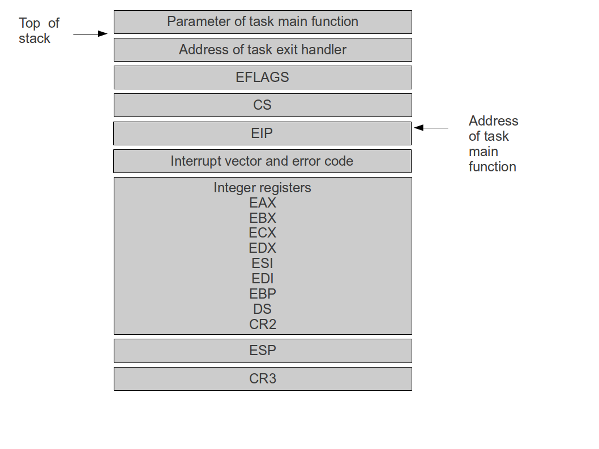
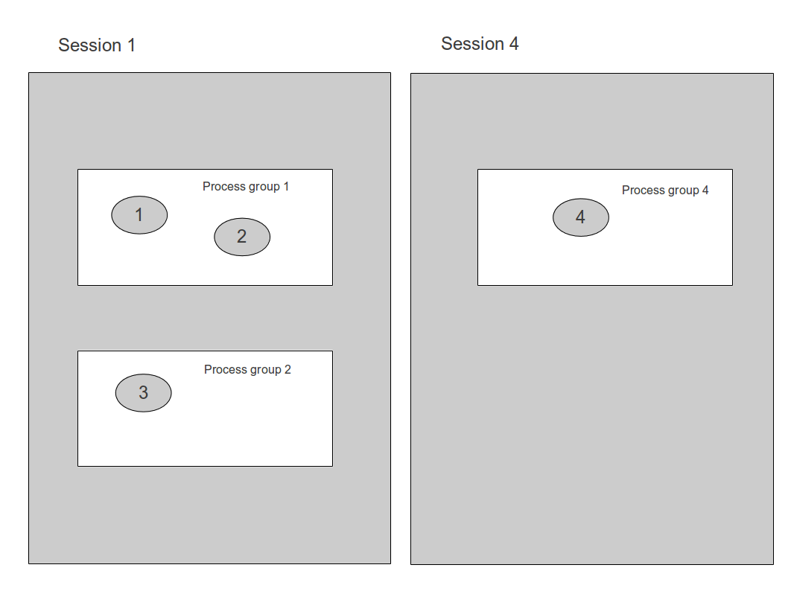
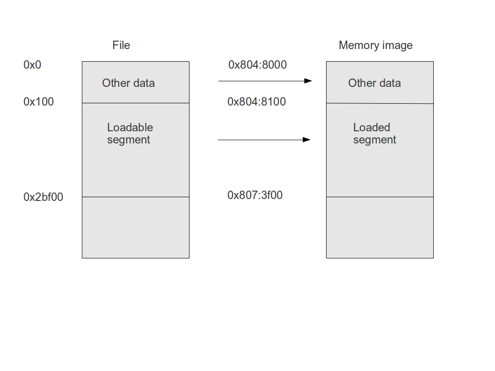
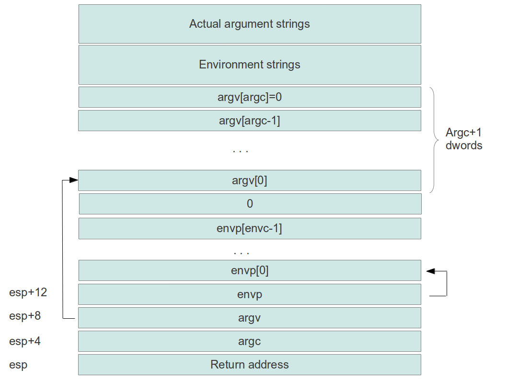
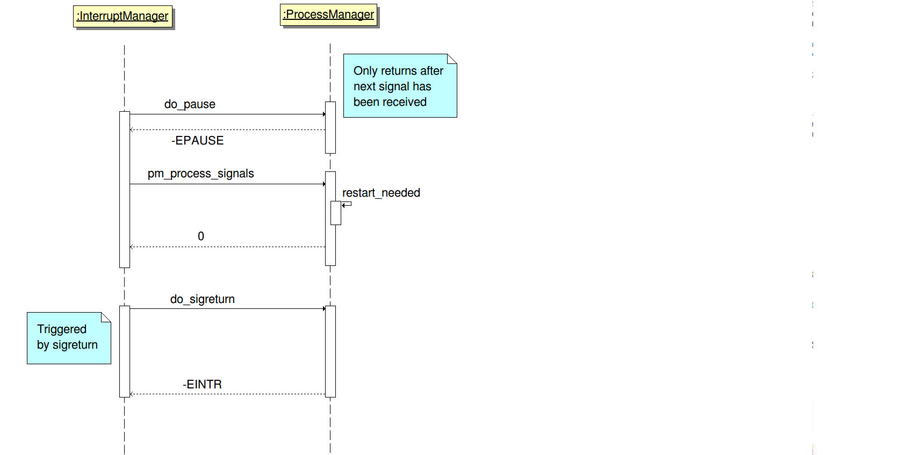
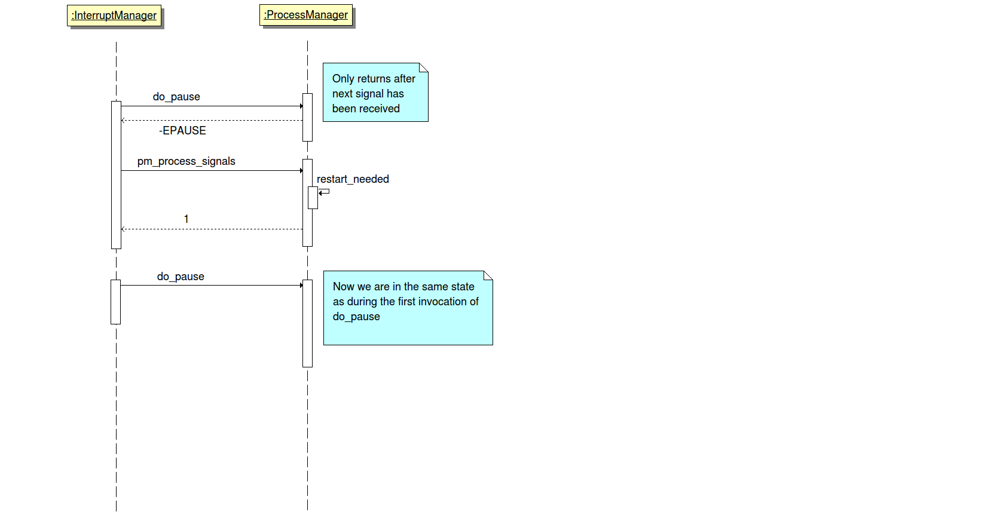
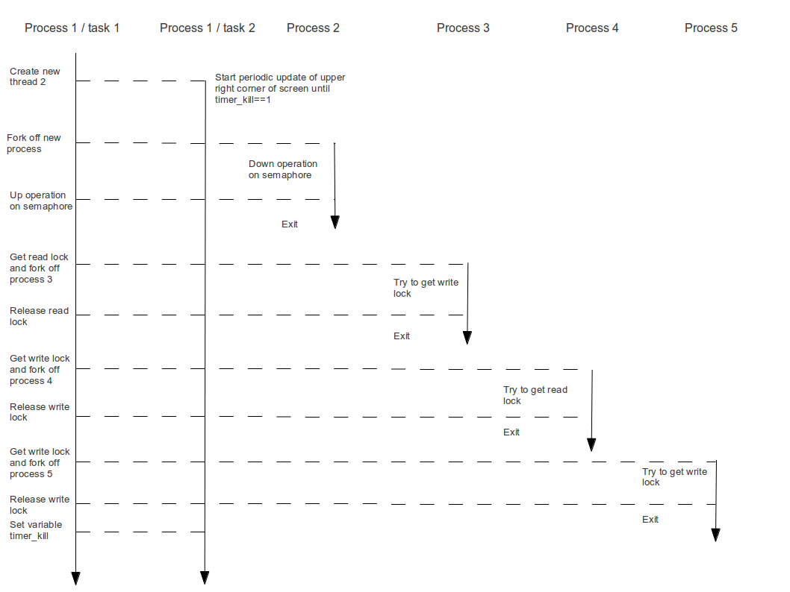

# Task and process management

## Task status concept

Within ctOS, a task is the smallest unit of work which is handled by the scheduler. The process manager is responsible for managing the life cycle of a task, whereas the scheduler allocates CPU time to a task based on its priority and the scheduling policy.

Each task within the system has a status which describes what operations are allowed on the task.  The initial status of a task after creation is READY. If a task's state is READY, it is considered by the scheduler and may be chosen for execution. When the CPU is given to a task, the tasks status switches from READY to ACTIVE. If the execution of a task needs to be suspended, for instance because the task is waiting for an I/O operation to complete, its status is BLOCKED or BLOCKED_INTR. These states differ in that a task in status BLOCKED_INTR will be woken up, i.e. moved to the status READY again, when an unblocked signal is sent to a task, where a task in status BLOCKED is not affected by signals (with the only exception of tasks which are within a sigwait system call, see below). 

When the execution of a task is completed, its status becomes DONE before it is eventually deleted along with all its associated data structures. Finally, a task which is currently running can process a SIGSTOP signal which stops the task until it receives a SIGCONT signal. The following diagram summarizes this state model and the possible state transitions.


The status values READY and ACTIVE are not distinguished inside the process and task manager, instead this status transition is handled entirely by the scheduler. Therefore the process manager uses a status RUNNING which includes all ready tasks and the currently scheduled and executing tasks.

Note that a task can only transition from ACTIVE to STOPPED, BLOCKED, BLOCKED_INTR or DONE. In fact, all status transitions to the status BLOCKED, BLOCKED_INTR or DONE are done by a task itself. The only status transition which a task can perform on another task is the transition from any other state to RUNNING. If the kernel wishes to stop or exit a running task, it will set a corresponding flag within the task structure which is evaluated by the task itself when the next interrupt is processed.

## Task data structures

All data which makes up a task is attached to an instance of the structure `task_t` declared in pm.h. Among other attributes, this structure holds the following data.

* the id of the task
* the status of the task
* a task reference count which can be used to make sure that an entry in the task table is not deleted while another tasks owns a pointer to this entry
* a pointer to the process to which the task belongs
* a field to save the current value of ESP and CR3 in case of a task switch
* a spinlock which is used to protect the task data structure if necessary
* the static priority of the task
* the number of CPU ticks which the task has already consumed - used for accounting purposes
* the signal mask of the task
* a bitmask describing which signals are pending on the task level
* a bitmask describing which signals are currently being waited for by the task
* flags to store exit requests and the information whether a task has been interrupted by a signal

All task structures are stored in an array and indexed by the task id for fast access using the task ID as key. To distinguish free slots from used or reserved slots in this table, the field slot_usage in the task structure is used.

Note that no parent - child hierarchy exists between tasks as it is the case for a process. 

## Basic operations on the task table

To execute basic operations on the task table, the process manager uses a few internal utility functions. To locate an unused slot in the task table, the function `reserve_task` should be used. This function will return a pointer to the first available slot in the task table and update the status of this slot to "reserved". The caller can then work with the task structure and initialize it using either the function `init_task` (which sets up a task with default values) or `clone_task` (which takes over task attributes from an existing task as it is required to implement the fork() system call). Once the task has been initialized, the status of the corresponding task table entry can be updated to "used" by calling the function `activate_task` which makes the task visible to other tasks scanning the task table.

In case an error occurs during initialization of an already reserved task table slot, the function `unreserve_task` should be called to return the task table slot to the pool of unused slots.

To avoid that a function which works with a pointer to a task needs to hold the lock on the task table structure longer as absolutely needed, tasks have a reference count. Initially, the reference count of a task is zero. When the kernel needs to change an entry in the task table, it can call the function `get_task` which locates an entry in the task table slot by task id and returns a pointer to it. This function will also increase the reference count by one. Once the reference is now longer used, it can be dropped using `release_task`.

When release_task realizes that the reference count of a task becomes negative, it will remove the task from the task table and makes the slot in the task table available again. Thus calling `release_task` on a task without first calling `get_task` can be used to remove a task from the task table provided that no other thread currently has a reference to the task. If a reference is still held by another thread, the cleanup operation is postponed until the other thread drops the reference.

Thus using `get_task`, a thread can be sure that the provided pointer remains valid until `release_task` is called.

## Sleep and wakeup

Often, a process or task needs to suspend execution until a certain condition is met. A task could, for instance, wait for the completion of an I/O request, for a system timer or until a locked ressource becomes available. Of course a task could simply "spin around" a marker bit somewhere in memory until the condition is met, but this is obviously a waste of CPU time.

To allow a task to refrain from being selected by the scheduler until a certain condition is met, a task has the option to sleep on a so-called **event control block**. An event control block is an opaque data structure which is used to exchange information between the task waiting for an event and the task generating the event. When a task waits for an event, its needs to allocate a data structure of this type, fill in the data structure with the needed information and remove the current task from the list of runnable tasks by settings its status to BLOCKED. Then the active task needs to raise a software interrupt to start the rescheduling process. Once this happens, a task switch will be done within this interrupt away from the blocked task.

When another task wants to wake up the sleeping task, it is able to identify the task which is waiting for the event using the information stored in the event control block. It will add the respective task to the list of runnable tasks again so that its execution can continue.

Thus to sleep on an event control block, the following steps are necessary:

* allocate an event control block and fill it with the ID of the current task
* lock the status of the currently active task
* call the scheduler function `sched_dequeue` to remove the currently executing task from the list of runnables
* set the status of the currently active task to BLOCKED
* release the lock on the status of the task
* raise a software interrupt - we use the otherwise unused interrupt 0x81 for this purpose - by calling the function `reschedule`. Here, the interrupt 0x81 serves as a simulated hardware interrupt with the only purpose of forcing a rescheduling. While this interrupt is processed, the scheduler will select another task to be run as the call to `sched_dequeue` will have removed the task from the list of runnables. Therefore the function only returns when the task is being woken up again. Alternatively, we could halt the task and wait for the next timer interrupt, however, this would waste up to 20 ms.

Note that while we hold the lock on the status of the current task, we cannot be interrupted. However, after releasing the lock again, several scenarios are possible. In the first scenario, the CPU will raise a software interrupt as planned. In this case, the task switch occurs while processing this interrupt. When control is given back to the sleeping task, the function `sleep_on` will simply return.

In the second scenario, an interrupt occurs right after the spinlock has been released, but before the software interrupt is raised. If this happens, the scheduler will select another task before the int instruction was executed. When now the task is woken up again, it will first execute the int instruction. As the task has not used up any processing time in addition so far, it is likely that the interrupt returns immediately without any rescheduling. However, it might very well happen that another rescheduling operation takes place immediately.

Note that as the status of a task and the status of the run queues maintained by the scheduler need to be in sync at every point in time, it is essential that if the status of a task is changed, the corresponding update on the schedulers queues are made as well. The process manager provides the internal utility functions `block_task`, `block_task_intr` and `run_task` for that purpose which will perform both updates in one step. To avoid that another tasks reads or even updates the status of a task while this two-step process is still in progress, these functions should only be called when the caller owns the lock on the task status and every read of the task status should be synchronized using this lock as well.

To wakeup another task, a task has to

* examine the event block to see which task is waiting for the event 
* reset the ECB so that it can be reused
* acquire the lock on the status of this task
* call the scheduler function sched_enqueue to add this task to the list of runnables
* set the status of the task to RUNNING
* release the spinlock again

Also note that as an additional subtlety, the event control block needs to be available to both involved tasks - the task going to sleep and the task waking it up - and thus needs to be mapped into both address spaces. As waking up a task is often done out of an interrupt handler and thus the context is not always predictable, this implies that event control blocks are usually declared as static variables inside the kernel BSS section which is common to all processes.

As an additional option, an event control blocks contains a field timer which itself is a structure defined as follows.

```
struct __ecb_timer_t {
        u32 timeout_value;                      // value of timeout in ticks
        u32 timeout;                            // timeout occured
        u32 is_active;                          // timer is active
        int cpuid;                              // CPU on which ECB is queued
        struct __ecb_timer_t* next;
        struct __ecb_timer_t* prev;
}
```
The timer module of the kernel (timer.c) maintains a list of timed event control blocks which can be accessed using the functions `timer_time_ecb` and `timer_cancel_ecb`. When a thread wishes to sleep until a predefined number of ticks has passed, it can call `timer_time_ecb` which will add the ECB to a list of event control blocks maintained by the timer. When the defined number of ticks have passed, the timer will wake up the task by posting an event on the ECB and set the flag timeout in the ECB to indicate the reason of the event. The task can evaluate this flag to learn whether it has been woken up by a timer or by another event. Note that a task has to call `timer_cancel_ecb` if the ECB is destroyed to avoid a situation in which the timer interrupt handler tries to access a stale ECB.

## Semaphores

As semaphores change the status of a task and need to perform the basic operations "sleep" and "wakeup" described above, they are implemented within the process manager. A semaphore is a data structure which has an integer value and an associated list of event control blocks. In addition, each semaphore contains a spinlock. The implementation of the *down* operation is as follows.

```
Get spinlock on semaphore
while (semaphore.value==0)  {
    set up event control block and add it to the list of event control blocks within the semaphore
    if requested time event control block by calling timer_time_ecb
    get spinlock on task status
    set status of current task to BLOCKED
    sched_dequeue
    release spinlock on task status
    release spinlock on semaphore
    reschedule by invoking the dummy hardware interrupt 0x81
    get spinlock on semaphore
    remove event control block from the queue
    if event control block was timed call timer_cancel_ecb to remove ECB from the timer queues
    evaluate timeout flag of event control block and return if the flag is set
}
semaphore.value--
release spinlock on semaphore
```

The code for the *up* function utilizes the wakeup procedure explained above.

```
 Get spinlock on semaphore
if (semaphore.value==0)  {
    FOR each task in the queue of waiting tasks DO
     get lock on the status of this task
     IF (task is blocked or blocked interruptible) THEN
      call sched_enqueue for this task
      set the task status to RUNNING
      abort scan of queue
    END IF
    release lock on task status again
}
semaphore.value++
release spinlock on semaphore
```

Note that within *down*, we need to release the spinlock on the semaphore (which protects both the value of the semaphore and the queue of event control blocks) before we call reschedule to make sure that interrupts are enabled and no deadlock with up can occur. By the same reasoning as applied above for the "sleep" operation, it is not a problem if the thread becomes preempted at this point.

A variation of the down operation can be used to place a task in the status "Interruptible sleep" in case it needs to be blocked because the value of the semaphore is already zero. The algorithm here is similar, with the following two exceptions:

* we need to set the status of the task to BLOCKED_INTR instead of BLOCKED
* when the reschedule function returns, we cannot - in contrast to an ordinary semaphore - be sure that the reason is a `sem_up` call, as the task might also have been woken up by a signal. However, by convention, a task which wakes up another task due to a signal needs to set a special flag intr in the task structure. When `reschedule` returns, the `sem_down` function will evaluate this flag. If it is set, it knows that is has been woken up due to a signal and will reset the flag and return a specific return code

This option is the reason why we need to traverse the queue during the up operation until we find an entry which refers to a task still sleeping. In fact, if a task is forcefully woken up by a signal, its status will change to running, but it will remain in the queue until the code within the `sem_down` operation which removes it from the queue is processed. Thus we need to walk all elements from the queue once we hit upon an entry which is still blocked.

Also note that in order to avoid race conditions, the equivalent of `sem_down` for an interruptible sleep will also return immediately if at the time of its invocation, there is a pending signal on task level for the currently active task.

A special type of semaphores are binary semaphores which are often called **mutex**. A mutex is like an ordinary semaphore except that an up-operation will not further increase the value of the semaphore if it is already different from zero. Thus 0 and 1 are the only two possible values for a semaphore (hence the name binary semaphore). The process manager offers the function `mutex_up` to support this. To execute the init and down operations on a mutex, `sem_init` and `sem_down` can be used.

Finally, the function `sem_down_nowait` offers a non-blocking version of the down operation which will not go to sleep if the value of the semaphore is already zero, but return immediately.

## Condition variables

The implementation of condition variables is quite similar to that of semaphores. As a condition variable does not have a value, the structure `cond_t` is even simpler and only consists of a double linked list which implements the wait queue. When a condition variable is initialized, the queue is emptied. To perform the wait operation on a condition variable using the lock L, we will have to add the currently active process to the head of the queue, change its status to BLOCKED or BLOCKED_INTR and release the lock. Then we reschedule and immediately acquire the lock again. We then remove the task again from the queue and return. Here is the pseudo code for the "interruptible" version of wait.

```
Get lock on condition variable
Allocate event control block and add it to queue, calling timer_time_ecb if needed
Release lock on condition variable
Get lock on task
Block task by settings its status to BLOCKED_INTR and removing it from the scheduler queue
Release lock on task
Release lock L
Reschedule
Get lock on condition variable
Remove current task from queue and cancel timer by calling timer_cancel_ecb
Release lock on condition variable
IF (ecb->timer.timeout is set) THEN
  return
END IF
Get lock on task again
IF (intr flag in task is set) THEN
  clear flag in task structure
  release task on task
  return -1
ELSE
  release lock on task status
  Acquire lock L
  return
END IF
```
Thus we only guarantee that we hold the lock L upon returning from wait when we were not interrupted by a signal. The pseudo-code for *signal* and *broadcast* is straightforward. In both cases, we simply wake up the task at the head of the queue respectively all tasks which are currently placed on the queue. However, we do not remove any elements from the queue as this is done by `cond_wait`. The lock L is not involved in these operations.

Similar to semaphores, the "interruptible" version of `cond_wait` will return immediately if a signal was pending at task level at the time when it is invoked.

## Task creation

Creation of a task within an already existing process is done by the function do_pthread_create` within the process manager which may only be invoked within an interrupt context, i.e. while processing an interrupt or system call. The result of executing this function will be a new thread, running within the same process as the calling task. Currently, ctOS only supports creation of new threads in kernel mode, i.e. the initial function executed by a new thread needs to be part of the kernel, and the interrupt context in which the function is called needs to be the context of an interrupt raised in kernel mode.

First, a free task ID is located and a new entry in the task table is created. Then the total available kernel heap is scanned for a contigous area of memory which is large enough to hold the stack of the new task and still respects the rule to leave a few pages unmapped between subsequent stack areas (see documentation of the memory manager for details). As doing this might lead to possible race conditions, this operation is protected by a spinlock on the page tables of the current process.

When the area has been reserved in this way, the stack for the task is put together. In contrast to a process, which is created by a fork system call and continues execution at the same point within the instruction flow as the parent, a new task always begins execution at the start of a designated function, which we call the task main function. When this function exits, the task dies. Therefore the stack has to be prepared so that it appears to this function as if it had been called regularly from within an ordinary C program. In addition, the stack needs to be prepared for the next task switch, i.e. the stack needs to appear as if the task had just been interrupted. This leads to the following layout.



The first two dwords on the stack are the parameter passed to the task main function and the address of the exit handler which serves as return address if the task main function exits. The remaining dwords on the stack are copied from the current interrupt context, with the exception of the value of EIP which is made to contain the address of the task main function.

When execution switches to this new task, the value of CR3 and ESP are still taken from the stack of the task from which we switch to our task, so the value of CR3 and ESP here is not relevant. Then the common interrupt handler in gates.S will pop all other registers from the stack and perform an iret. The iret will consume the saved EFLAGS, the code segment CS and the instruction pointer EIP and will thus continue execution at CS:EIP, i.e. at the address of the task main function. At this point in time, ESP will point to the address of the task exit function, so that this address is used by the task main function as return address. Thus the task will be stopped as soon as the task main function returns.

Once the stack has been set up, the remaining fields in the task data structure are filled with their default values, taking over the values from the currently active task where needed. The status of the new task is set to RUNNING and the function sched_enqueue is called to add the new task to the ready queues.

As `do_pthread_create` expects an interrupt context, a function which needs to start a new kernel thread actually has to invoke the system call __SYSNO_PTHREAD_CREATE via the usual system call interface.

## Process creation

Process creation is done by the fork system call. In contrast to the task creation, a new process is always an exact duplicate of the existing process. The implementation of the fork system call invokes the process manager function `do_fork` to do the actual fork.

To create a new process, the following steps are necessary:

* locate a free process id and a free task id
* create a new entry in the process table
* invoke the function `mm_clone` which will
    * allocate a physical page for a new page table directory
    * clone the page table structure of the existing process
    * return the physical address of the page table directory of the new process
* call the interface function `fs_clone` of the file system to clone all open file descriptors of the current process
* clone the currently active task of the old process, i.e. create a new entry in the task table with a new task id and fill it with the values of the corresponding old task, using the value returned by `mm_clone` as value for the attribute saved_cr3 of the new task
* set the status of the newly created task to RUNNING
* call `sched_enqueue` to add the new task to the ready queues

Note that, to comply with the POSIX pthreads API, a fork system call will only replicate the task in the parent process which called fork, i.e. the currently active task. This is done to avoid conceptual problems - for instance, if a task within a process blocks waiting for I/O and another task within the same process forks, should the new process contain a blocked task and which task should receive the result of the I/O operation when it completes?

## Task and process destruction

Exiting a task or a process can be triggered in different ways:

* the most common case is that a process or a task has used the respective system call to indicate to the kernel that the currently active task or process need to be completed. To terminate a process in this way, a kernel thread or a user space process can use the system call exit. To terminate a thread, the system call quit needs to be used. For both system calls, we require that these calls never return, thus a rescheduling needs to take place at the latest when returning from the interrupt context of the system call to kernel thread or user space level.
* it might also happen that the kernel decides to prevent a task from further execution. An example where this happens is the implementation of the execve system call, where all other threads within the current process need to be terminated, or the delvery of the kill signal to a process

However, a few restrictions apply when a task is to be terminated. First, it is not a good idea to terminate a task at an arbitrary point in time. If, for instance, task A raises the execve system call and task B needs to be terminated, we cannot simply set its task status to DONE which would exclude it from future scheduling operations, as the task might held a ressource like a read/write lock on a file or inode at this point which would then never be released. For this reason, a task is always terminated at a defined point within the execution flow, specifically when an interrupt has been processed and the task returns to either the kernel thread level or the user space level. Thus if a task is to be terminated, the code will only set a corresponding flag in the task structure which is then evaluated and reacted upon when this point is reached.

Second, when a task is completed, we need to check whether this task is the last task within the process. If this is the case, all ressources which are associated with the process, for instance open file descriptors, need to be released as well. In fact, POSIX requires that when the last thread within a process exits, the entire process is destroyed as if the _exit interface call would have been issued.

Third, among the ressources which are occupied by a task there is the kernel stack used by the task. However, we cannot simply unmap these pages from virtual memory while the task is executing, as it still needs access to the stack, unless we do not perform any function calls, do not access any local variables and so forth. Therefore a different approach is used. Whenever a task switch occurs as part of an interrupt processing, the interrupt manager will call a post-interrupt handler (`irq_post` in irq.c) which executes on the common kernel stack, but still within the address space of the previous task. This handler in turn calls the public function `pm_cleanup_task` which will check whether the previous task has the status DONE. If this is the case, it will call `mm_release_task_stack` to unmap the kernel stack of the previous task. Note that this handler is only called once for each completed task as the task will never again be the previous task after a task switch.

Thus, the entire exit processing is distributed over several functions (request a task termination, release ressources and release stack) which we now discuss in further detail before we come back to the use cases described above and explain how the individual pieces work together to implement these use cases.

### Requesting task or process termination

To request termination of a task or process, a task can simply set corresponding flags `force_exit` in the task or process structures. To do this, the process manager offers the public function `pm_schedule_exit` which request termination of a process.

### Terminate a task and release resources except the kernel stack

As already mentioned, this processing is done within the interrupt handler and invoked when the exit flag for the current task or process has been set. The processing necessary depends on whether the task which is currently executed is the last task within the process, as in this case, additional steps need to be taken. To detect this case, the process structure contains a counter `task_count` which keeps track of the number of not terminated tasks within the process.

When the last task within a process is terminated, the following additional steps are necessary:

* make sure that the user space pages used by the process are released - this is done by the function `mm_teardown_user`_area. Note that, in contrast to the kernel memory occupied by the task, it is safe to do this now as this task - which is the last one within the address space - will never return to user space
* close all open file descriptors. Note that this operation, triggered by the public function `fs_close_all` of the file system, might involve writing buffered data to disk and can therefore not be done while we hold a spinlock
* If a process completes, but has still child processes, these processes will reach a state which is commonly know as zombie process. To avoid this, the parent PID of all childs is adapted and set to the PID of the INIT process. The INIT process can then make sure that all children are cleaned up and no zombie processes remain


Here is the pseudocode for the respective function `pm_handle_exit_request`.

```
IF (force_exit flag in process and task not set) THEN
  return
END IF
my_count = process->task_count
if (1==my_count) THEN
  // this task is the last one to execute this section, so we need to clean up after the process as well
 call mm_teardown_user_area to release user space pages
 call fs_close_all to close all open file descriptors
 get spinlock on process table
 if there are still child processes left, set parent process id of all childs to 1
 release spinlock on process table
END IF
Get spinlock on task status
self->status = TASK_STATUS_DONE
sched_dequeue(self)
Release spinlock on task status
```

Note that, after releasing the last spinlock, the currently active task might be preempted and will - as it has already been removed from the run queue - never be scheduled again. However, this it not an issue, as the currently executing interrupt handler has completed all of its functionality up to scheduling anyway.

### Release task stack and wake up sleeping processes waiting for process completion

Once the processing described above has been finished, the task will never be scheduled again. However, the kernel stack used by the task is still mapped into the virtual address space of the process. Unmapping these pages is done as part of the post-interrupt processing in the function `pm_cleanup_task`. This function unmaps the stack space of the previous task if the status of this task is DONE. If the task was the last task within the process, it also cleans up the page tables for the process. Once this point has been reached, another process executing the system call `waitpid` might jump in and invalidate the entry in the process table for the current process, thus removing the process entirely from the kernel table.

 Another step which needs to be taken care of at this point is to inform the parent process that the child has completed. This is done via two different mechanisms:

* the SIGCHLD signal is sent to the parent process
* the waitable flag of the process is set and a broadcast operation on a corresponding condition variable is done

Both activities are described in detail in the sections on signal handling and the wait system call further below.

Here is the pseudo-code for this function.


```
IF (status of task just left is DONE) THEN
  release pages allocated for kernel stack of this task by calling mm_release_task_stack
  get spinlock on process table
  decrement task count by one
  call release_task on the task to invalidate the corresponding entry in the task table
  IF (task_count == 0) THEN
    complete clean up of process address space by calling mm_release_page_tables
    send SIGCHLD to parent process
    IF (task just left has not set waitable flag) THEN
      do a broadcast on the condition variable unwaited of the parent process
      increase counter unwaited_children of parent process 
      set waitable flag
    END IF
  END IF
  release spinlock
END IF
```

## Process flow

After having described the bits and pieces, let us now take another look at the use cases introduced at the beginning of this section and see how each of them is implemented.

To implement the exit system call which terminates a process, we can now simply carry out the following steps.

* set the exit status of the process
* set the force_exit flag in the process structure

Both activies can be combined by calling the function `pm_schedule_exit.

Now let us look at the chain of events in this case. Assume that within a process which has n tasks, task 1 raises the exit system call. Then this task will set the force_exit flag. At this point, the task count is still n. Now all tasks within the process complete their next system call or timer interrupt. When this interrupt takes them back to user space or kernel thread level, they will go through the exit handler and the post-interrupt handler and terminate themselves until all tasks except one - say task 3 -  have completed this part of the processing. As the task count is now one, task 3 will cleanup the entire process. When the post-interrupt handler is called for task 3, it will set the task count to zero and unmap all pages tables of the process.

Next let us look at the case that we need to finish all other tasks within a process in order to be able to load a new process image in execve. The processing here is in fact quite similar. Again, the task executing exevce will set the termination flag in the process. However, this time it will wait until all other tasks have completed the processing. It then sets the flag back to zero to avoid that it is also terminated when the execve system call returns and continues to load the program image.

To kill a process as a result of a received signal, the signal processing code also simply needs to set the force_exit flag on process level. Then all tasks within the process will go through the exit handler `pm_handle_exit_request` and through the cleanup function `pm_cleanup_task` as soon as they are rescheduled.

Yes, ctOs is very much interrupt driven...

## Process groups and sessions

POSIX describes the concept of a process group, which is a group of related processes which can for instance be signaled together. Each process group is identified by a *process group ID* which is at the same time the process ID of a designated process within the process group called the *process group leader* (however, it is possible that a process group has no leader at some point after creation of the group because the leader process has completed).

The process group is inherited from the parent process when a fork operation is done. A process can change the process group it belongs to if using the setpgid system call or use this call to create a new process group with itself as the only member and process group leader.

Process groups themselves are grouped into sessions. Again, each session has a session group leader and is identified by the ID of the session group leader. A process can start a new session of which it becomes the session group leader using the setsid system call (unless it is already a session group leader). The following diagram summarizes the relation of processes, process groups and sessions.



This situation could result from the following sequence of events:

1. initially, there is one process group and one session group with the INIT process (PID 1) as process group lead and session lead
1. the INIT process forks off a new process with PID 2. As session and process group are both inherited, this process is placed  in the same process group and in the same session
1. then, INIT forks off a new process with process ID 3. This process calls setpgid(0,0) to establish a new process group with itself as process group lead within the same session.
1. finally, INIT forks off a new process with PID 4. This process then calls setsid

Note that there is no way for a session leader to change its process group, i.e. for a session leader, the process group ID will always be equal to the session ID.

In ctOS, process groups and sessions are realized by two attributes called pgid and sid in the process structure proc_t. These fields are filled by the fork system call by taking them over from the parent process. The only exception which is made is the case that the new process has PID 1 (i.e. it is the INIT process), in this case process group and session id will both be set to 1. Access to these attributes is protected by the spinlock on the process table.

## The controlling terminal

The POSIX terminal interface has the concept of a controlling terminal. A terminal may be designated as the "controlling terminal" of a process. Not every process has a controlling terminal, but all processes within a session which have a controlling terminal have the same controlling terminal, i.e. no two processes in a session can have different controlling terminals. Consequently, a process which leaves its session by executing the setsid system call is disassociated from the controlling terminal.

Note that a terminal may be the controlling terminal for at most one session. Thus if a request is made to attach a terminal to a process as controlling terminal, the process manager needs to check that no other process in a different session is already associated with this terminal. If a terminal is attached to a process as a controlling terminal, the foreground process group of the terminal is set to the process group of the session leader.

If a session leader exits, all processes in the session lose their controlling terminal.
The controlling terminal is relevant for the following functions in the process manager.

| Function|	Role of controlling terminal
|:---|:---|
do_setsid|	Detach from the controlling terminal if the process had a controlling terminal before
|pm_attach_tty|	Attach a terminal to a process, i.e. define this terminal to be the controlling terminal of the process. Checks are made to ensure that the terminal is not yet the controlling terminal of another session leader and that the calling process is a session leader. This function is invoked by the file system layer fs.c if a process executes the open system call on a terminal and the O_NOTTY option is not set.This function also needs to set the foreground process group of the terminal to the process group of the calling process.
| do_fork|	The controlling terminal is inherited by a child during a fork system call
|pm_handle_exit_requests| 	If a process is a session leader and has a controlling terminal, disassociate all processes in the session from the controlling terminal

The controlling terminal is stored in the attribute cterm of the process table entry. Due to the relations between sessions, process groups and the controlling terminal, the cterm attribute of a process is protected by the spinlock on the process table as well.

POSIX does explicitly not specify whether closing the last file descriptor in the system referring to a terminal shall disassociate the controlling process - if any - from the terminal, ctOS does not do this.

## Task priorities

Each task has a static priority which is stored in the task structure. When a task is generated, its static priority is set to the static priority of the parent task. Unlike the dynamic priority used within the scheduler, the static priority remains the same over the life time of the process.

When a process is added to the queue of runnable processes, the task manager calls the respective public function of the scheduler. It passes the static priority of the task as argument to the scheduler so that the initial dynamic priority of the task will be equal to its static priority. If needed, for instance after waking up a task, the task manager can also determine a higher priority for the task to give I/O bound tasks a higher scheduling priority than CPU bound tasks. The scheduler can, however, decrease the dynamic priority over time.

Note that a task is added to the queue of runnable tasks upon the following occasions:

* when it is created
* when it is woken up after being blocked
* when it is continued after being stopped

## Parsing and loading ELF files

To be able to load an ELF executable into memory, the process manager needs to be able to parse the metadata information contained in an ELF file. For that purpose, some utility functions to work with ELF files are collected in the module elf.c which is described in this section.

Let us recall a few facts about the structure of the various ELF headers. Depending on the context, an ELF file can be thought of as either being split into sections or into segment. A *section* is the object manipulated by the linker, i.e. an object file consists of sections which are recombined by the linker when the executable is built. In contrast to this, an executable is made up of *segments* (which have nothing to do with the segments present in the x86 architecture) which are the pieces of the program which are loaded into memory. However, the division of a file into sections and the division into segment are just two different views on the same physical file.

Each ELF file starts with an ELF header which contains the information where the other parts of the metadata are contained in the file. Some important fields which are contained in the ELF header are

* a magic cookie used to identify ELF files
* the offset into the file at which the section header starts which holds information on the sections contained within the file
* the number of section headers in the file
* the offset into the file at which the program header starts, which holds information on the segments within the file
* the number of entries in the program header table
* the program entry point
* the index at which the so-called string table (which contains human readable section names) can be found within the section table

Within the file elf.h, the structure `elf32_ehdr_t` describes the structure of the ELF header. The first step when reading an ELF file is to read that information into memory. Then the most important header data is extracted and put into an instance of the structure `elf_metadata_t`. Finally, the program header table is loaded into memory and linked into the metadata structure. The metadata structure then allows for easy access to the most important data within the file without having to read the corresponding headers again and again from disk.

A program header itself is described by the structure `elf_phdr_t`. Again we only list the most important fields in this structure

* the type of the segment (i.e. a loadable segment or any other type of segment)
* the offset of the segment within the file
* the virtual address at which the segment is to be loaded
* the size of the segment in the file
* the size of the segment in memory (which can be larger than the one in the file, for instance for the BSS section)
* requested aligment p_align

The ELF specification requires that for each program header, the offset of the segment within the file and the offset of the segment in memory area congruent modulo p_align. This makes it possible for the program loader to read data from the file in pages and simply load these pages as a whole into memory. Only program headers with the type PT_LOAD = 1 are relevant for the program loader as long as no dynamic linked libraries are used (which are not yet supported by ctOS). Thus the program loader can use the following pseudo-code to load a program from an ELF file.

```
FOREACH program_header DO
  IF program_header.p_type == PT_LOAD THEN
    (verify that program_header.p_align % PAGE_SIZE) == 0
    segment_base = (program_header.p_vaddr / program_header.p_align)*program_header.p_align      // base of first page occupied by this segment
    segment_end = program_header.p_vaddr + program_header.p_memsz-1                              // last byte of segment after loading
    segment_top = (segment_end / p_align)*program_header.p_align + (program_header.p_align-1)    // top of last page occupied by this segment   
    mem_base = mm_map_user_segment(segment_base, segment_top)                                    // call memory manager to get a page in user space
    if (0==mem_base) THEN
      raise error
    END IF
    page_offset = (program_header.p_vaddr % program_header.p_align)
    read program_header.p_filesize +  page_offset bytes from file to mem_base, starting at offset (program_header.p_offset - page_offset)
    add (program_header.p_memsz - program_header.p_filesz) zeros
  END IF
DONE
```

To validate this algorithm, let us consider the example layout described in the ELF specification. This example is an ELF file with a loadable segment of size 0x2be00, starting at offset 0x100 into the file. For this program header we have the following values in the header structure

p_filesz = p_memsz = 0x2be00
p_offset = 0x100
p_vaddr = 0x8048100
p_align = 0x1000

When we apply the algorithm above, we first compute the base address of the lowest page in memory occupied by this segment which is

segment_base = 0x804:8000

The end of the segment in memory, i.e. the last byte occupied by this segment, is then

segment_end = 0x804:8100 + 0x2:be00 -1 = 0x807:3eff

Consequently, the last page occupied by the segment has base address

segment_top = 0x807:3000

The variable page_offset, which at the same time is the offset of the segment within the file and the offset of the segment to its first page, is computed as 0x100. Hence we read 0x2be00 + 0x100 = 0x2bf00 bytes of data from the file, starting at offset 0, and copy the contents into memory starting at address 0x804:800. Thus the first byte of the segment, located at offset 0x100, will be placed at the memory location 0x804:8100, as desired.



## Program execution

The function `do_exec` of the process manager is responsible for executing a new program. It is usually invoked in an interrupt context as a system call, but can also be used during system initialization to load a shell or the init executable and transfer control to userspace.

To execute a program, the function will first validate the executable and stop all other threads within the process. It then invokes the function  `mm_init_user_area` to reset the memory layout of the user area and re-allocate a user space stack. Using the utility function `setup_user_stack`, this stack will then be prepared for the called program, see below. After setting up the stack, all signals which had their associated action changed to a value other than "Ignore" or "Default" are reset to the default action. Next `elf_load_executable` is invoked to load the specified executable into memory. Then the control is transfered to the new executable. The implementation of this last step depends on whether the function is invoked within an IR context or not.

### Case 1: the function is called outside of an IR context, i.e. the parameter ir_context is NULL

In this case, the switch to user space, i.e. to ring 3, is realized by setting up a stack which looks like the stack after an interrupt from user space has been processed and executing an IRET instruction. This stack manipulation is realized by the function `goto_ring3` in utils.S in the hardware dependent layer. Note that the code selector which is put on the stack needs to have the RPL field (bits 0 and 1) filled with 3.

### Case 2: the function is called within an interrupt context

If there is already an interrupt context in which the function is executed, there is no need to set up a new stack. Instead, the stack area accessible via the interrupt context is manipulated by overwriting code selector, data selector, EIP the user space ESP and the user space stack area with the required values.

Note that `do_exec` must never be called from within an interrupt context which has been created by an interrupt in kernel mode.

To pass arguments and the environment to the called programm, `do_exec` will set up the user space stack in such a way that the called program can follow the standard C conventions for passing parameters (i.e. implementing an entry point with a function declaration int main(int argc, char** argv, char** envp)) to retrieve the arguments and the environment from the stack. Specifically, this involves placing the number of arguments and an array of pointers on the stack. Each of these pointers hold the address of one argument string. The argument strings themselves are also placed on the stack above the argument pointers. Similarly, the environment is added to the stack. The following picture displays the stack layout realized by `do_exec`.



This stack layout is realized by the utility function `setup_user_stack` which will adapt the stack pointer accordingly after placing the relevant information on the stack. Note that this function will copy over the arguments from the address space of the currently executing process. It is therefore vital that at this point, all user pages of this process are still present in unmodified form, otherwise this data would potentially be overwritten or we would access unmapped memory.

## Signal handling

### Signal processing overview

Even though the general principles of signal handling in UNIX like kernels is rather simple, the POSIX standard defines a number of special cases which add additional complexity. Therefore this section explains the basic algorithms and data structure required to handle signals whereas the next section will describe how those algorithms need to be modified in order to capture the special cases as well.

A signal can be processed in two different ways by a task - it can be *delivered* or *accepted*. First, a signal can be delivered to the task by the kernel by executing a standard action associated with the signal. This action can either be a default action, like suspending or terminating the task, or the execution of a signal handler which can be specified using the sigaction system call. Delivering signals to a task by executing a signal handler involves manipulating the interrupt context and is described in further detail in the section *Signal handling* in the documentation of the interrupt manager. A task can block certain signals from delivery. Blocked signals remain pending until they are unblocked or accepted (unless the defined action for the signal was to ignore it).

Second, a task can actively wait for the signal using the sigwait system call. In this case, we will say that the task has accepted the signal. The sigwait call will simply set the status of the task to "blocked" until the signal is delivered and continue execution after acceptance of the signal. POSIX specifies (see the definition of the sigwait system call) that a task may only actively accept a signal which is blocked.

A signal which has been generated but not yet accepted or delivered is said to be *pending*. Some signals like SIGKILL cannot be blocked and no signal handlers can be defined for these signals, as they will always result in a default action.

Signals can be send to a process or to a thread. If a signal is sent to a process, the kernel first tries to determine a thread within the process which is waiting for that signal using a sigwait call or has not blocked the signal. If such a thread is found, the signal is forwarded to this thread. Otherwise, the signal remains pending on the process level until a thread calls sigwait on the signal or unblocks the signal.

Currently, ctOS does not support real-time signals, i.e. the flag SA_SIGINFO in the sigaction structure. This has the following implications


* signals are not queued. Instead, signals which are sent while the same signal is already pending for the target are discarded
* signal handlers have only one argument 

When executing a signal handler, the current signal is added to the bitmask of blocked signals for this task. While executing a signal handler, this particular signal is therefore blocked. However, other signals may be raised and interrupt the signal handler as well. When execution of a handler has been completed, the original bitmask is restored.

To support the processing described above, the following data structures are needed which are protected by the spinlock in the task structure.

* Each process has an array of 32 __ksig_action structures
* The __ksig_action structure contains 
    * a pointer to a signal handler
    * a flags field
    * a bitmask which describes the signals which are to be blocked while a signal handler is being processed
* Each task has a bitmask sig_waiting which indicates for which signals the tasks is waiting via sigwait
* In addition, each task has a bitmask sig_blocked describing which of the 32 signals are blocked and a bitmask sig_pending indicating which signals are pending
* Each process has a bitmask sig_pending which is used to keep track of signals which are pending on process level because they could not yet be delivered to a task

To send a signal *signo* to a task, the kernel will simply set the status of the signal to PENDING in the bitmask of the task. The target task can accept that signal using the system call sigwait which will wait until a specified signal has been received and reset the status in the bitmask. If that  operation completes, the signal is no longer pending and will not cause any further action.

When a signal is sent to a process, the kernel will walk through all tasks which belong to that process. For each of these tasks, it will verify whether the signal could be successfully generated for this task - this is the case if the signal is not blocked for the task or if the task is waiting for it. If yes, no further tasks will be attempted. If the signal could not be generated for any of the tasks, it will be set in the pending signal bitmask of the process.

Whenever a task uses sigwait to wait for a signal, the kernel needs to check whether this signal is pending on process level first. If it is, it will return immediately and clear the bit on process level.

A special handling is required for the signals SIGCONT and SIGKILL. These signals are the only signals which can be delivered to a stopped process. Therefore, the signal SIGCONT is processed already upon sending it to a process by waking up all stopped tasks within this process. Similarly, if SIGKILL is sent to a process, all blocked tasks of the process will be woken up again. In addition, POSIX requires that all pending instances of the signals SIGSTOP, SIGTSTP, SIGTTIN and SIGTTOU are cleared when a SIGCONT is sent to a process.

Conversely, when any of the stop signals listed above is generated for a process, all pending SIGCONT signals are discarded on the process level as well as on the task level.

### Basic signal processing operations

The first basic operation is sending a signal to a task. As mentioned above, a task is ready to accept a signal if this signal is not blocked on task level and the task is still running. To actually accept a signal, the signal has been marked as pending in the corresponding bitmask on task level. In addition, the task status needs to be updated if one of the following cases occurs.

* if the task was in an interruptible sleep and the signal is not blocked, the task is run again and the intr flag in the task structure is set
* if the task was in an non-interruptible sleep, but the bitmask of signals the task is waiting for indicates that the task is performing a sigwait for the signal just received, the task is woken up as well

Within pm.c, the function `signal_task` is used to send a signal to a task. This function returns 1 if the signal was accepted and 0 otherwise. The pseudo-code for this function is as follows.


__Send a signal to a task__

```
Get spinlock on task structure for target task
IF ((task status is DONE)  || (bit sig_no in sig_blocked is set AND bit sig_no in sig_waiting is not set)) THEN
  Release spinlock on task structure for target task
  return 0
END IF
IF (bit sig_no in pending signal bitmask of target task is not set) THEN
  set bit sig_no in pending signal bitmask of target task
  IF (signal is not blocked AND task is in interruptible sleep) OR (signal is being waited for and task is in a non-interruptible sleep) THEN
    set intr flag in task if the task was in an interruptible sleep
    add task to queue of runnables tasks again and set its status to READY
  END IF
END IF
Release spinlock on task structure for target task
return 1
```

The next basic operation which is required is resuming a task upon receiving a SIGCONT. This does not only involve updating the task status and adding it to the run queues again, but also needs to remove any stop signals which are still pending from the pending signal bitmask of the task. The function which implements this behaviour is continue_task in pm.c and is also used to continue a task which has received a SIGKILL to make sure that the exit request is processed.

__Continue a stopped task__

```
Get spinlock on task structure for target task
IF (received signal is SIGCONT) THEN
  remove all pending stop signals from bitmask of pending signals on task level
END IF
IF (task is stopped) THEN
  set status of task to RUNNING
  add task to scheduler queues again
END IF
Release spinlock on task structure for target task

```

To handle signals on process levels, signal delivery is done in several steps. As a first step, a signal which is received for a process is marked as pending on the level of the process. Then all tasks within this process are visited and is is tried to promote pending signals from process level to task level. This is done by the three functions `promote_signal`s (promote all signals from process level to task level for a particular task), `distribute_signals_threads` (promote all signals on process levels to all threads of a process) and `signal_proc` (send a a signal to a process) which have the following functionality.

__ Promote pending signals on process level to pending signals on task level (promote_signals)__
```
Get spinlock on pending signal bitmask of process
FOREACH (bit sig_no which is set in pending signal bitmask of process) DO
  IF (1==send signal sig_no to task) THEN
    clear bit in pending signal bitmask of process
  END IF
DONE
IF (there are still signals pending on process level) THEN
  return code = 1
ELSE
  return code = 0
END IF
Release spinlock on pending signal bitmask of process
return return_code
```

__Distributing all pending signals on process level to all threads of a process (distribute_signals_threads)__

```
Get spinlock on task table
FOREACH (task in task table which has its process ID set to this process) DO
  IF (0==Promote pending signals on process level to this task) THEN
    BREAK
  END IF
DONE
Release spinlock on task table
```

__Generating a signal for a process__

```
Get spinlock on pending signal bitmask of process
set bit sig_no in the bitmask
Release spinlock on pending signal bitmask of process
IF (sig_no == SIGCONT) THEN
  clear all pending stop signals (SIGSTOP, SIGTSTP, SIGTTIN, SIGTTOU) in the pending signal bitmask of the process
END IF
IF (sig_no is one of the stop signals) THEN
  clear all pending SIGCONT signals in the pending signal bitmask of the process and all its threads
END IF
Call function to distribute pending signals on process level
if ((sig_no == SIGCONT) OR (sig_no == SIGKILL)) THEN
  in case of the kill signal, set exit flag
  continue all threads in process
END IF
```

Finally, a task is able to sleep until a specific signal is received using the sigwait system call. The implementation `do_sigwait` of this system call within the process manager is rather simple. The task enters a loop and checks within each iteration, if there is a signal pending on task level on which the task is waiting. If this is not true, it enters an uninterruptible sleep. Whenever a signal is received for this task, the code described above is executed which will detect this situation and wake up the task again. The task will then exit the loop and continue execution.

___Execute sigwait for a bitmask sig_set of signals (do_sigwait)__

```
Get spinlock on task structure
set self->sig_waiting = sig_set
WHILE (there is no bit in sig_waiting AND sig_pending) DO
  release spinlock on task structure
  promote signals from process level to task level
  get spinlock on task structure
  IF (there is no bit in sig_waiting AND sig_pending) THEN
    block task
    release spinlock and reschedule
    get spinlock again
  END IF
END WHILE
find bit sig_no which is set in both sig_waiting and sig_pending
clear that bit in self->sig_pending
clear self->sig_waiting
release spinlock on task structure
```

Pending signals are handled whenever a task returns to user space after an interrupt has been processed. Within the main interrupt handler `irq_handle_interrupt`, the function `pm_process_signals` is invoked which contains the necessary code for this processing. This invocation is done after executing any other interrupt handler, but before calling the scheduler so that the result of the processing has a chance to change the task status if needed. No signal processing is done if the code segment in the interrupt context indicates that the currently processed interrupt was raised in kernel mode. Here is the pseudocode for the function `pm_process_signals`.  Note that the signal SIGKILL is handled with highest priority.

```
 Check code segment stored on stack and return if this is not a user space code segment
Return immediately if the task is marked for exit processing (to avoid stopping such a task)
Get spinlock on task structure
Take the logical AND of the pending signal bitmask and the complement of the blocked signal bitmask
IF (result of that operation is not zero) THEN
  Determine first bit sig_no in the result which is set - if SIGKILL bit is set choose it
  Reset this bit in pending signal bitmask
  Lock sig_action on process level, get signal handler and flags from it and release lock again
  IF ((signal handler == SIG_DFL) || (sig_no==SIGKILL) || (sig_no==SIGSTOP))
      determine default action
      IF (default action is to kill the process) THEN
        mark task for exit processing
      ELSE IF (default action is to stop the process) THEN
        stop process
      END IF
  ELSE IF (signal_handler == SIG_IGN)
      // do nothing, ignore signal
  ELSE
      add sig_no to bitmask of blocked signals for the current task
      mark signal as being currently processed in the bitmask sig_proc of the currently active task
      deliver signal
  END IF
END IF
Release spinlock on task structure
```


### Special cases

When a signal is delivered to a task which has been placed in an interruptible sleep, i.e. which has the status BLOCKED_INTR, a special processing is invoked by `send_signal_to_task`. In this case, the task is woken up by setting its task status to running and adding it to the queue of runnables maintained by the scheduler again. In addition, the intr flag of the task will be set so that the *sem_down* operation or the *sleep_on* operation which is interrupted in this way can detect this special case.

The default actions "kill" and "stop" really refer to the entire process, not just to the task which has received the signal. This is in accordance with the POSIX standard, see section 2.4.3, last sentence. Thus to stop a process, we need to make sure that all tasks within the process are stopped. The idea is to accomplish this in a function `pm_stop_process` by

* stopping the currently executing task immediately by settings its task status to STOPPED and removing it from the scheduler queue, and
* sending all other threads in the process the SIGSTOP signal as well so that these threads will be stopped upon their next return to user space
* do a broadcast on the condition variable unwaited in the process structure of the parent process to inform the parent about the stop event, see the section on the waitpid system call further below.

However, this simple idea is not working, for the following reason. Suppose that a process has two tasks A and B and is sent a SIGSTOP. As usual, the function `do_kill` will locate a task within the process which is supposed to handle this signal, say task A, and set the bit representing SIGSTOP in its pending signal bitmask. When task A now executes `pm_process_signals`, it will send the SIGSTOP signal to task B as well and stop itself. At same later point, task B will reach its signal handling code. Now task B will perform the same processing, i.e. it will again locate task A and send task A the STOP signal again. As a consequence, the parent process will receive two SIGCHLD signals instead of only one as desired.

In order to avoid this, a special, kernel internal signal SIGTASK is used. This signal triggers the same processing as the signal SIGSTOP, with the only difference that within `pm_stop_process`, only the current task will be handled and stopped, but no other tasks will be signaled and no SIGCHLD is sent to the parent. This signal is sent to all other tasks when processing a stop signal instead of SIGSTOP.

To resume a stopped process, the processing needs to be driven by the thread sending the signal and is therefore an exception to the general algorithms described above. In fact, if the function `signal_proc` which is used to send a signal to a process is called for SIGCONT, it will not only execute the standard delivery algorithm but, in addition, will execute the following steps:

* remove any pending SIGSTOP signals from the pending signal bitmask on process level
* remove any pending SIGSTOP signals from the pending signal bitmask for each thread of the process
* for those threads of the process which are STOPPED, set their status to RUNNING and add them to the scheduler run queues again

A similar processing is done if a SIGKILL is sent to a process. Again, we will wake up all tasks in the process which are stopped in this case and set the exit flag on process level so that all tasks exit when they return to user space level the next time.

Another special handling is in place for signals for which the disposition has been set to "Ignore" via the sigaction system call. If a task executes its signal handling code `pm_process_signals`, all pending signals which are blocked and ignored are removed from the bitmask of pending signals for this task. Thus if a task has a pending signal which is blocked, but ignored, this signal will be discarded when it returns to user space the next time. When a signal disposition is set to "Ignore" in the sigwait system call, the implementing function `do_sigwait` will also remove this signal from the bitmask of pending signals on process level. Both actions are also performed when the disposition is set to "Default", but the default is to ignore the signal.

When a process is stopped because it receives a signal for which the defined action is to stop the process, POSIX requires that the parent receives a SIGCHLD signal, unless it has set the flag SA_NOCLDSTOP in the sigaction structure for the SIGCHLD signal. To support this requirement, the function `pm_stop_process` will use signal_proc to send a SIGCHLD to the parent if this flag is not set.

Finally, a special mechanism which deserves some attention is the restart mechanism. In some situations, it is desirable to restart the currently executed system call as a result of processing a signal. As an example, let us consider the implementation of the pause system call. This system call is supposed to suspend execution of a task until this task receives a signal upon which it reacts with the execution of a signal handler and to return AFTER this handler has been called. To implement this behaviour, do_pause is waiting on an event control block in the task structure until the currently active task receives a signal. However, at this point in time, it is not known whether this signal will lead to the execution of a signal handler upon returning to user space because another signal might be received between exiting do_pause and reaching the signal processing code which has higher priority or another task might concurrently change the disposition for this signal. To solve this, the idea is to "try it out", i.e. to execute the signal processing code in `pm_signal_process` and to restart the system call if the conditions for returning to user space are NOT fulfilled.

In fact, the interrupt manager which is the main entry point for all system calls has a mechanism for that. To use it, a task which wants to be restarted needs to return 1 as result of `pm_process_signals` when this function is invoked by the interrupt handler. If this happens, the interrupt manager will restore the interrupt context with which the system call has originally been invoked and repeat the processing of the system call.

To use this feature, the function `do_pause` will return the special return code -EPAUSE which is then placed in the EAX register of the current interrupt context. Within the function `pm_process_signals`, the utility function `restart_needed` is called which checks the current interrupt context for this error code. If this code is detected and the interrupt number proves that the currently executed interrupt is a system call, this function will verify whether the conditions to restart do_pause (i.e. a signal handler has been invoked) is met. If yes, it returns 1 to indicate a restart.

If,  however, no restart is done, this function needs to make sure that the value of EAX which is currently -EPAUSE is overwritten with an error code which is known to the user space program which has invoked the system call. As a copy of the context has been created on the user space stack as part of the sig_frame structure for use with the sigreturn call, this copy needs to be updated as well.

To illustrate this, let us quickly walk through the entire processing for the two different cases. Assume first that the pause system call is invoked and, while the task is suspended, a signal which leads to the processing of a signal handler is received. Then the sequence of events is as follows.




1. A task, say task A, issues the system call pause
1. The interrupt handling routine `irq_handle_interrupt` is invoked with an interrupt context (let us denote this context by C1)
1. The interrupt manager calls `do_pause`
1. `do_pause` blocks task A and reschedules
1. Task A is blocked and another task is scheduled
1. At some point in time, another task sends a signal to task A, i.e. the signal is marked as pending in the bitmask of task A, and task A is set to status running again and added to the scheduler run queue
1. When task A gains control of the CPU again, it resumes execution at the point in `do_pause` where reschedule was called. Thus `do_pause` returns with -EPAUSE
1. The interrupt manager receives the return code -EPAUSE and stores it in the EAX register of the current interrupt context C1
1. The interrupt manager then invokes `pm_process_signals`
1. Within `pm_process_signals`, the pending signal is detected and handled. The current interrupt context C1 is patched so that when returning to user space, the signal handler is invoked and sigreturn is called.  The original context C1 is saved on the user space stack
1. Then `pm_process_signals` calls `restart_needed`
1. The function `restart_needed` detects that a signal handler has been scheduled for execution and thus no restart is required. It therefore overwrites -EPAUSE with -EINTR in the saved instance of C1 within the task structure and returns 0
1. We return to user space, thereby entering the signal handler
1. When the signal handler has completed, it raises the system call sigreturn
1. sigreturn restores the original interrupt context C1 from the stack - as we have overwritten EAX in this copy as well, this interrupt context is now a copy of the CPU state at the point in time when pause was called, but with EAX overwritten with -EINTR
1. sigreturn returns to user space and the user space application retrieves the return code -EINTR from EAX.

In the case that a signal is received which does not lead to the invocation of a signal handler, for instance because its disposition is to ignore the signal, the processing is different.



1. A task, say task A, issues the system call pause
1. The interrupt handling routine `irq_handle_interrupt` is invoked with an interrupt context (let us denote this context by C1) and places a copy of this context as a local variable on the kernel stack
1. The interrupt manager calls `do_pause`
1. `do_pause `blocks task A and reschedules
1. Task A is blocked and another task is scheduled
1. At some point in time, another task sends a signal to task A, i.e. the signal is marked as pending in the bitmask of task A, and task A is set to status running again and added to the scheduler run queue
1. When task A gains control of the CPU again, it resumes execution at the point in `do_pause` where reschedule was called. Thus do_pause returns with -EPAUSE
1. The interrupt manager receives the return code -EPAUSE and stores it in the EAX register of the current interrupt context C1
1. The interrupt manager then invokes `pm_process_signals`
1. Within `pm_process_signals`, the pending signal is detected and ignored.
1. Then `pm_process_signals` calls `restart_needed`. 
1. The function `restart_needed` detects that no signal handler has been scheduled for execution and thus a restart is required. It therefore returns 1 which is also the return value of `pm_process_signals`
1. The interrupt manager restores C1 from the stack and places it again in the working copy of the interrupt context. Then it calls `do_pause` again.
1. `do_pause` puts the task again to sleep and we are in the same state as after reaching step 4. If now any other signal is received which leads to an invocation of a signal handler, the processing as described above applies for this iteration of do_pause


The implementation of the sigsuspend system call is very similar to that of pause. Recall that the purpose of sigsuspend is to replace the combination of unblocking a signal and calling pause - which is prone to race conditions if a signal is received between these two steps - by an atomic operation. Here atomic means that the thread does not return to user space between these two steps, i.e. that no signals are being actively processed between the change of the signal mask and the execution of the wait. To realize this, the following steps are executed in the corresponding function `do_sigsuspend` in pm.c:

* get a lock on the task status take over the signal mask from the argument 
* call block_task_intr to enter an interruptible sleep
* release lock and reschedule
* return -EPAUSE

To see why this guarantees that the processing is atomic in the sense described above, let us consider the case in which a combination of sigprocmask and pause would lead to a race condition. Suppose that a signal A is currently blocked and a call to sigsuspend is made to unblock signal A and then wait for it. Suppose further that signal A is delivered to the task after step 1 has been executed, but before step 2 has started. Then signal A would be added to the pending signal bitmask of the task. When `block_task_intr` is now executed, it detects that there is a pending signal on task level and returns immediately. Thus the task is rescheduled and the return code -EPAUSE is passed back to the interrupt manager so that - assuming that a signal handler is attached to signal A - makes the system call return with -EINTR. This is different from the behaviour of the combination sigprocmask - pause where the signal handler would be executed before pause runs, thus consuming the pending signal so that pause would wait indefinitely. The same happens if the signal arrives after step 2, as the signal delivery will then wake up the task again.

Also note that restoring the previous signal handler is done in the user space part of the sigsuspend implementation as this would otherwise be done for every iteration of the -EPAUSE induced restart loop. 

### Waiting for process completion

POSIX offers several system call to wait for the completion of one or more processes and retrieve the status information which they have set with their _exit system call. A process can get that status information for a specific child process, all child processes or all child processes within a process group using the waitpid system call. When status information for more than one process is requested, the call returns when the first process has made status information available. After the information has been retrieved for a process, a second call will not succeed, i.e. the status information is only retrieved once. An additional source of status information are processes which have been stopped, they inform the parent process about this even using the same mechanism. Status information for the parent is also provided if a process is stopped by the SIGSTOP signal.

When a terminated process has been waited for, the kernel can safely invalidate the corresponding slot in the process table and make the PID available again for reuse. No access to any of the attributes of a process is available after this point int time.

This mechanism is quite similar to a producer-consumer pattern. At certain occasion, namely stopping a process and terminating a process, wait events are produced. One or more tasks in the parent process can then act as a consumer and read the status information provided for each of those events.

The following data structures are used to support this mechanism.

* within each process, there is a condition variable unwaited which is used to inform a process if there is status information for any child available
* in addition, the is a counter unwaited_children which counts the number of children which have unretrieved status information
* a flag waitable within each process is used to indicate that this process has status information available which has not been read yet by its parent
* this flag is protected by the process table spinlock

Producers of wait events now use the following code to submit status information for a process:

```
Get spinlock on process table
IF (0==self->waitable) THEN
  cond_broadcast(parent->unwaited)
  parent->unwaited_children++
  self->waitable = 1
END IF
Release spinlock on process table
```

Note that it can happen that an exit event occurs for a process after a stop event. If the parent has not waited for the stop event yet, the waitable flag will already be set when the producer enters the critical section. In this case we must not increment the number of unwaited children - this is the reason why we need the IF statement in the pseudo-code above.

Now let us look at the actual wait operation which consumes events.  The idea for the implementation is straightforward. We first need to scan the process table to find all child processes which match the provided filter, i.e. the set of child processes from which status information is to be retrieved. For each child, we read the variable waitable to find out whether there is any status information which has not yet been retrieved. If there is status information, we read it, set waitable to zero for this child, decrement the counter unwaited_children and exit the loop. If no child could be found, we perform a wait operation on the condition variable unwaited to be woken up when a child exits or is stopped.

When we exit the loop, status information for a child has been retrieved. As required by the POSIX standard,  we now need to remove SIGCHLD from the pending signal bitmask of the process, unless there are still waitable children, i.e. unless the counter unwaited_children has reached zero. In addition, we can clean up the process table entry for the process, but we only do this is the process has been terminated, i.e. if there are no more active tasks within the process.

Another special case to be considered is the case that we are woken up a signal while waiting for a process to complete. As this signal might in fact be a SIGCHLD, we want to loop through all processes at least once  more in this case to see if there is any status available. For this purpose, we maintain a flag intr which we set if we return from a cond_wait due to being interrupted. This flag is evaluated at the end of the loop and triggers a premature exit in this case.

Putting all these steps together, we now have the following pseudo-code for the implementation of the system call waitpid.

```
child_pid = -1
intr = 0
Get lock on process table
WHILE (-1==child_pid)
  FOREACH child in the specified set DO
    IF (1==child->waitable) THEN
      read status information from child
      self->unwaited_children--
      child->waitable = 0
      set child_pid to pid of child
      abort FOR loop
    END IF
  DONE
  IF (-1 != child_pid) AND (0==self->unwaited_children) AND (SIGCHLD is blocked) THEN
    remove SIGCHLD from pending signal bitmask of process
  END IF
  IF (-1==child_pid) THEN
    IF (1==intr) THEN
      leave monitor, i.e. release lock on process table
      return -EPAUSE
    END IF
    rc = cond_wait(self->unwaited, process_table_lock)
    if (-1==rc) THEN
      intr = 1
      enter monitor again (left by cond_wait due to signal)
    END IF
  END IF
END WHILE
IF (child process has terminated) THEN
  Invalidate process table entry
END IF
Release lock on task table

```

## User IDs

In a Unix-like system, there are several concepts of a "user ID" as a process attributes. First, there is the "ordinary" or real user ID of a process. Each process has a user ID associated with it which identifies the owner of the process. When a process is created using the fork system call, the real user ID of the child process is set to the real user ID of the parent process. When a process is owned by the superuser, it can use the setuid system call to set its user id to any other user ID.

However, file access and file ownership at the time of creation is not determined by the owner of the process, but by what is called the effective user ID. This concept allows a process to run with different privileges than those determined by the privileges of its owner. The effective user ID of a process can be changed in two different ways.

* a process can change its effective user ID using the system call seteuid - however, it is only possible for a process to set its effective user ID to a value different from the real user ID if it has appropriate privileges (in ctOS, this is only possible if the process runs with effective user ID 0). There is one exception to this rule which is related to a concept called saved set-user-id which we will look at below
* when a new process image is run using one of the execv-family of system calls, and the image has the set-user-ID bit set in its file mode, the effective user ID of the process will be changed to be the user ID of the owner of the executable image

However, there is a problem coming with the idea of the set-user-id flag. Suppose that an ordinary user X executes a program image owned by the super user which has the set-user-ID bit set. Then the effective user ID of the process will be changed to the user ID of the super user. If the process now wishes to create a file, it first needs to change back its effective user ID to the real user ID, otherwise the file would be owned by the super user which is usually not the desired behaviour. However, once this has been done, it is not possible for the process anymore to regain the super user privileges as another call of seteuid would fail due to the effective user ID no longer being 0.

To solve this issue, POSIX offers a way for a process to remember that is was started with a different effective user ID. For this purpose, a process has - apart from the effective user ID and the real user ID - a third user ID attribute which is called saved set-user-id. This is initially equal to the real user ID. When a program image is executed with the set-user-id flag set, however, the user ID of owner of the process image is saved in this field. When this saved set-user-id is the user id of the superuser, the process will be allowed to change its effective user ID at will using the seteuid system call.

Note that a call of setuid will overwrite all three user IDs, i.e. the real user id, the effective user id and the saved set-user-id.

## Assembly tests

To properly test the functions of the process manager and in particular its interface to the scheduler and the memory manager, the kernel executes a number of tests at startup time which are described in this section. Note that these tests are only executed when the precompiler switch DO_THREAD_TEST is defined and in addition the kernel parameter do_test is set to 1. The code for these tests is contained in the module tests.c which also contains most other assembly test cases.

This test spawns off several other processes and tasks which communicate with each other via event control blocks, semaphores and read/write locks. Essentially, process 1 serves as a controller thread and first creates a task which periodically updates the upper right corner of the screen and then other processes which try to acquire specific locks in a given order as summarized in the following diagram.




