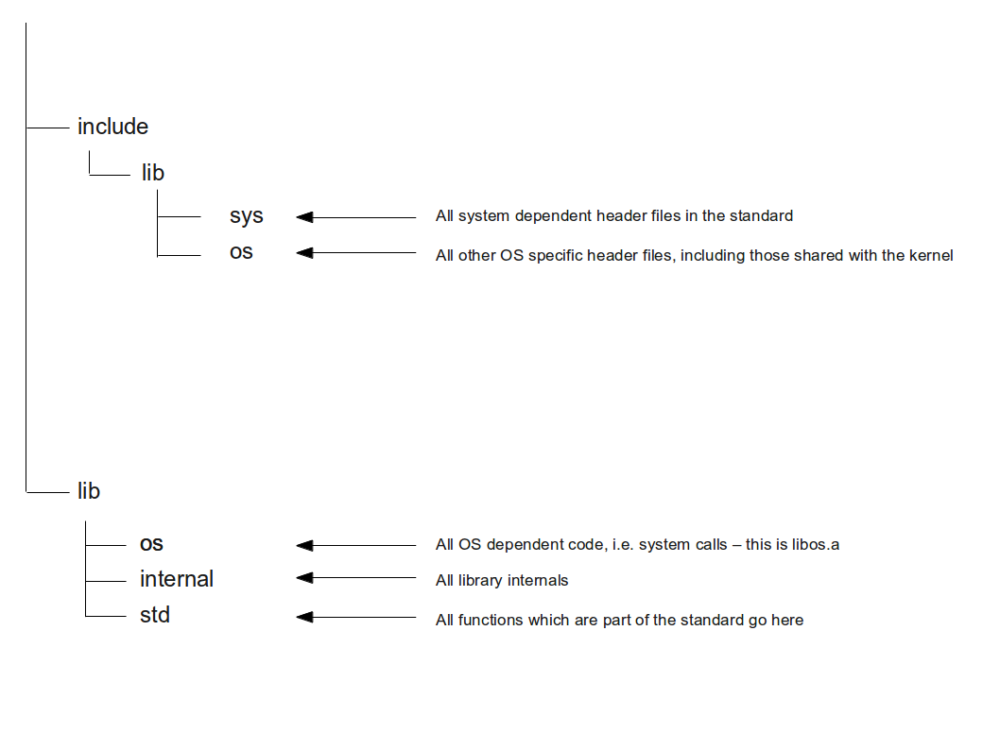
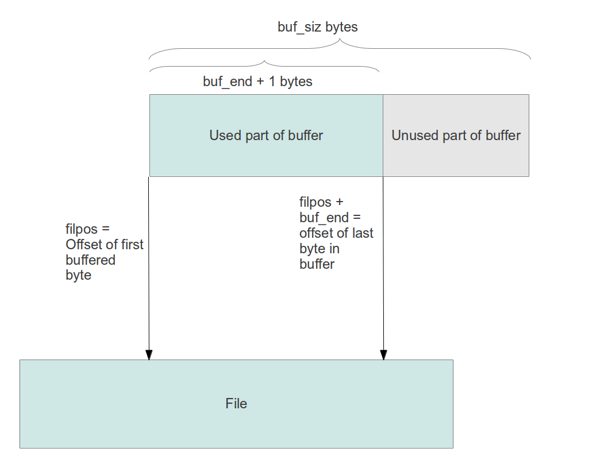
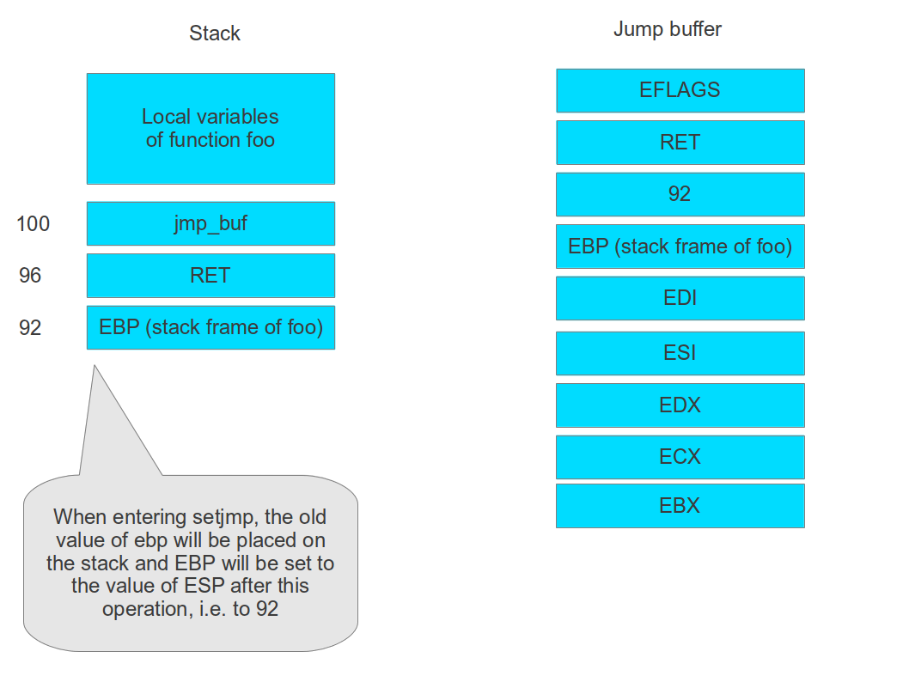

# The ctOS runtime library


## Purpose and scope of the library


The goal of the ctOS runtime library is explicitly not to provide a fully POSIX compliant C library - doing this would be a multi-year project in its own right.  However, in order to write and execute proper tests in user space and to port and run a few simple applications, a minimum C library for ctOS is needed. Thus the goal of the ctOS library is to be a simple C library which does not fully implement any of the known standards like C99 or POSIX, but deliberately restricts itself to the most commonly needed and most relevant library functions.

However, those functions which are implemented are supposed to at least be close to their respective counterparts from the standard in order to ease porting of applications and to allow testing of programs using it, like the ctOS shell, in a Linux host environment.

## High level design considerations

### The OS library

As already mentioned above, one of the goals of the library is to be easily testable in an ordinary Linux host environment so that testing library functions does not require the usage of an emulator or even the restart of the development machine to boot into ctOS. To achieve this, all operating system dependent parts, i.e. those parts of the library which require system calls, are moved into a separate library called **libos**. This library exists twice. One version of the library is meant to be executed under ctOS and uses the ctOS system calls. The second instance of the library uses Linux kernel calls and is designed to be linked against the OS-independent parts of the library to obtain executables which can be run in a Linux host environment.

### Directory structure and cross compiling

The following diagram shows how the source tree of the library is organized. Essentially, all source files are stored in the directory lib within the ctOS source tree. All header files go into include/lib and its subdirectories. Thus, the library headers can be included as `lib/<header file>` from the kernel tree as well.



In particular, include/lib/os contains the header files for the functions offered by libos.a which form the interface between the kernels system call layer and the OS-independent parts of the library. It also contains header files which are shared between kernel and C library.

### Rules for including header files

When including header files, the following rules need to be observed.

<table>
<thead>
<tr class="header">
<th>Rule<br />
</th>
<th>Rationale and example<br />
</th>
</tr>
</thead>
<tbody>
<tr class="odd">
<td>Header files located in other directories should be included within quotes and relative to the directory in which the header file containing the include statement is located<br />
</td>
<td>This makes sure that header files can be included when compiling user space programs and the kernel. Consider for instance the file include/lib/os/types.h. This file is included from include/lib/types.h as<br />
#include &quot;os/types.h&quot;<br />
and from include/lib/os/heap.h as<br />
#include &quot;types.h&quot;<br />
Thus the correct file is found regardless of the current include path, as the compiler will search the current directory first when header file names are included in quotes<br />
</td>
</tr>
<tr class="even">
<td>In a header file, no other header files which are located upwards in the directory tree must be included<br />
</td>
<td>Suppose for instance a file in include/lib/ would include another header file in include. Then the header file tree under include/lib would depend on the entire kernel header file tree and thus a user space application would require all kernel headers to compile - this is not a good design<br />
</td>
</tr>
</tbody>
</table>

### Naming conventions

Following ISO C and POSIX standard and best practises, the implementation of the ctOS library assumes that certain names are reserved for use by the library and are not used by user space applications. The following identifiers are reserved in this way:

-   all external identifiers starting with an underscore
-   all identifiers (regardless of scope) starting with two underscores
-   all identifiers (regardless of scope) starting with an underscore followed by a capital letter

Consequently, the library will use the following conventions:

-   all external functions and variables which are used by the library, but are not part of the ISO C or POSIX standard, start with the string \_\_ctOS\_
-   all preprocessor constants which are defined by some of the libraries header files start with two underscores, followed by a capital letter

The second convention applies in particular to inclusion guards. So to prevent, for instance, the file stdio.h from being included twice, the header files contents are surrounded by

```
#ifndef __STDIO_H
#define __STDIO_H
#endif
```

Note the double underscore in front of the file name.

### Error handling

Most POSIX system call use the errno convention to return an error code to the callee. This convention requires that the function itself only returns -1 to signal that an error occured, but the actual error code is stored in a global variable <span style="font-style: italic;">errno</span> defined in <span style="font-style: italic;">errno.h. </span>Behind the scenes, <span style="font-style: italic;">errno</span> is implemented as a deferenced pointer which is returned by the function <span style="font-style: italic;">\_\_errno\_locatio</span>n. This will allow it to replace this function by a version which returns the location of a thread-local variable in a future release to be thread-safe at this point.
Recall the following rule for the return value of a system call:

-   return a non-negative number upon success
-   return a negative error code which is -1 times an error code defined in <span style="font-style: italic;">os/errors.h</span> upon failure

The functions in libos will simply return the exact same value to the function in lib/std. This function then needs to check the error code. If the error code is non-negative, it is usually returned unchanged to the caller. If the error code is negative, it is replaced by -1 and the variable <span style="font-style: italic;">errno</span> is set to -1 times the error code.

### Test approach and example

To be able to build and test user space programs written for ctOS easily on a Linux platform, the library libos.a exists in a version which is designed to run on a Linux host. This version is located in the directory lib/linux. Similar to the version located in lib/os, it implements all low-level calls declared in include/lib/os/oscalls.h, but uses Linux system calls for the implementation. 

To write a test version of a program which can be executed in a Linux environment, we can simply link our executable to linux/libos.a instead of os/libos.a


To see how this works and to illustrate the directory structure and naming conventions set forth above, let us look at a simple case, namely the implementation of the write library function. The library function itself is implemented in the file write.c located in lib/std. As writing to a file descriptor requires access to low-level functionality and is OS-dependent, this function calls `__ctOS_write` which is implemented in a file also called write.c, but located in lib/os. This implementation invokes the write system call of the ctOS kernel. 

The object file write.o is included in the library libos.a placed in lib/os and therefore available to all functions linked against that library.

A second implementation of `__ctOS_write`, however, is contained in lib/linux/write.c. This function also invokes a system call, but this time this is the system call of the Linux kernel. Thus when linking a file invoking the write library function against lib/std/crt.a and lib/linux/libos.a, the result will be an executable which can actually run in a Linux host environment. Linking the same object file against lib/std/crt.a and lib/os/libos.a will result in an executable suitable for the ctOS environment.

Apart from that, ordinary unit tests can be written by stubbing the functions in libos.a which are required by the unit under test.

### Building userspace application

To build a userspace application, say hello.c, follow these steps.

1. compile the application to an object file hello.o with the following GCC options
    -   -I is set to include/lib so that only the header files in the lib subdirectory are visible (assuming that library header files are included with brackets instead of quotes)
    -   -fno-builtin so that no built-in functions are used by the compiler
    -   -mpush-args to make sure that arguments are pushed on the stack
    -   -nostdinc to avoid including the host (Linux) header files
1. link the resulting object file hello.o against lib/std/crt.a and lib/os/libos.a (note that the order is important because the linker ld will be default only pull those symbols from an archive which are needed at this point) using the following options:
    -   -Ttext 0x40000000 to place the text segment at the address expected by ctOS
    -   -e \_init to make sure that the entry point \_init in crt0.c is used

## Implementation of streams and stdio.h


To implement the notion of a stream as required by stdio.h, the ctOS runtime library defines streams as object with the following attributes and methods:

-   a stream has a buffer which is an area in memory with a defined length
-   a stream can be associated with a file descriptor
-   a stream supports methods open and close which prepare the stream and close the stream
-   a stream supports a method putc which will write a byte to the stream
-   a stream supports a method getc which will get a byte from the stream
-   If a write operation fills up the buffer, the entire content of the buffer is written to the file designated by the associated file descriptor (if any)
-   If a read operation occurs and the requested data is not yet in the buffer, the buffer is filled by reading a defined number of blocks from the associated file descriptor
-   a stream supports an operation flush which will write the contents of the buffer to the associated file

While reading from and writing to a stream, some bookeeping is required to keep track of the part of the actual file which is represented by the content of the buffer. To do this, a stream maintains the following three attributes.

-   filpos - this is the position of the first buffered byte within the file, i.e. the byte at position 0 in the buffer is the byte at offset filpos into the file
-   buf\_end - this is the index of the last byte within the buffer which is valid and is always less than the size of the buffer. If, for instance, the size of the buffer is 256, but we create a buffer for a file which only contains 10 bytes, buf\_end will be 9 if the entire file is present in the buffer. Thus, the number of buffered bytes is buf\_end + 1.
-   buf\_index - this is a pointer into the buffer indicating the next byte from the buffer which will be retrieved by a "get" operation. If buf\_index &gt; buf\_end, the entire buffer has been processed and the next read operation needs to refill the buffer from the actual file. 

The following diagram illustrate the relation between the positioning within the buffer and the offsets in the file for which the buffer has been set up.



When reading a byte from the stream, the following algorithm needs to be carried out in order to be prepared for the case that the end of the buffer has been reached.

```
IF (buf_index > buf_end) THEN
  Read next buf_size bytes from file and store result in buffer starting at offset 0
  IF (eof) THEN
    return EOF
  END
  buf_end = number of bytes read - 1
  buf_index = 0
  filpos = filpos + number of bytes read
END
result = buffer[buf_index];
buf_index++;
return result;
```

When an application writes to the stream, the existing buffer is used as a write-back cache, i.e. the data is first written to the buffer and only written into the file if the buffer is flushed. The variable `buf_index` is not used for writing, instead the entire bookkeeping is done via the attribute `buf_end` which contains the index of the last byte which has been written to the stream.

Note that the ISO C standard requires that a stream is flushed when the application changes the access mode from read to write or vice versa. We can therefore assume that at the first write operation, the buffer is in a known state and does not contain any data which needs to be preserved. More precisely, we assume that before the first write operation occurs, `buf_end = -1` - this is guaranteed by the functions flush and seek which are described further below. Taking this into account, the algorithm for writing a character c to a stream is as follows.

```
buf_end++
IF (buf_end >= buf_size) THEN
  IF (-1==fd) THEN
    errno = EBADF
    return EOF
  ENDIF
  Write content of buffer (i.e. buf_end bytes starting at offset 0 into the buffer) into the file
  filpos = filpos + buf_end
  buf_end = 0
ENDIF
buffer[buf_end] = c
```


##Non-local jumps


Non-local jumps (setjmp and longjmp) are implemented by saving the current state of the CPU in a user-provided buffer from which the data is retrieved if a setjmp is done. A jump buffer is nothing but an array of 28 bytes. To illustrate how setjmp and longjmp work, let us walk through an example step by step.

Suppose that a function foo invokes setjmp. When the call to setjmp is prepared, the argument to setjmp (i.e. the address of the jump buffer) is stored on the stack first, then the return address is stored below that on the stack. For the sake of illustration, let us assume that the address at which the address of the jump buffer is stored is 100. Then the return address, i.e. the address of the next statement after the call to setjmp, will then be located at address 96.

Looking at the code of setjmp in setjmp.S, we see that when entering setjmp, the current value of ebp is stored on the stack, i.e. at address 94. Then the integer registers are moved to the provided save area, followed by the old value of ebp, esp and the return address as stored on the stack. The following picture illustrates how the stack and the jump buffer look like after having executed the setjmp function.



Now let us look at the implementation of longjmp. Suppose longjmp is called using the jump buffer as pictured above as argument. First, longjmp will set up a stack frame as any other function, i.e. it pushes EBP on the stack and saves the current value of ESP in EBP to be able to access its parameters.
Next, it retrieves the address of the jump buffer from the argument stack and reads ESP from the buffer. When this operation completes, EBP will still point to the current stack, but ESP will be 92 again and point to the address where the stack frame of foo is saved.

We then increment the stack pointer by 4. Now ESP is 96 and thus points to the return address RET of the setjmp call which created the buffer. However, this return address on the stack might have been overwritten after calling setjmp, we therefore restore its value from the saved jump buffer.
Then the saved integer registers are retrieved from the jump buffer. Here EAX is used as base register which points to the saved EBX value. When this has been done, EAX is loaded with the value provided as parameter to the longjmp call and this value is placed on the stack, i.e. at address 92. This is only done to be able to reuse the EAX register once more to also get the old value of EBP from the jump buffer. Then the saved value of EAX is restored from the stack. At this point, the CPU state is as follows.

-   EAX contains the value of the second parameter to the longjmp call
-   ESP is 96, i.e. it points to the saved return address
-   all other integer registers have the same value as at the point in time when setjmp was invoked

Now the ret instruction is executed which will remove the return value from the stack and jump to this address where execution resumes. Note that ESP is now 100 again and has the same value as one would expect after returning from setjmp normally. Also note that the stack content starting at address 100 and above has not been modified by either setjmp or longjmp.

## Environment variables

In ctOS, similar to other UNIX like systems, each process has access to environment variables. More specifically, when a new program is executed, the kernel will place a collection of environment strings on the stack of the newly created process. Each string is of the form "name=value" and thus defines the value of exactly one environment variable. When the program is invoked, the startup routine `_start` defined in crt0.c will allocate a heap area in which the environment is copied and will define the global variable `char** environ`` to point to this area.

When a new process is created via fork, the environment is duplicated simply because the entire memory image of the process is duplicated. Thus in the new process, ``environ`` will point to the same location in virtual memory and the content of the environment will be the same.

When an existing process uses a function like execve to run a new program image, two alternatives exists. Some of the library calls in the group of exec-functions, like evecve, can be used to define the environment for the new program image from scratch by passing an array of strings, terminated by a null pointer. These strings, which again need to be of the form "name=value", then define the environment of the process from this point on. Other variants of the exec-call like execl, simply copy the environment of the process, thus the environment remains unchanged.

An application has two different ways to access the environment:

-   it call directly follow the `environ` pointer
-   it can use the POSIX functions `setenv` and `getenv` to get the value of an environment variable and to set it

Note however that getenv, which adds additional environment strings, is free to reallocate the area containing environment strings and might therefore change the value of `environ`. Therefore an application should not assume that the value of environ remains unchanged.

The shell - at least this is the way dash handles that - does itself not directly manipulate the content of the environment area. Instead, it imports the existing environment into an own list of variables. When a variable is set within the shell, it is added to the list. When a new program is executed, all variables which are marked for export are added to a list, and this list is used as argument to execve to run the new program image. Thus the environment which the new image will see is the union of all environment entries defined when the shell was started and all variables declared for export in the shell.


