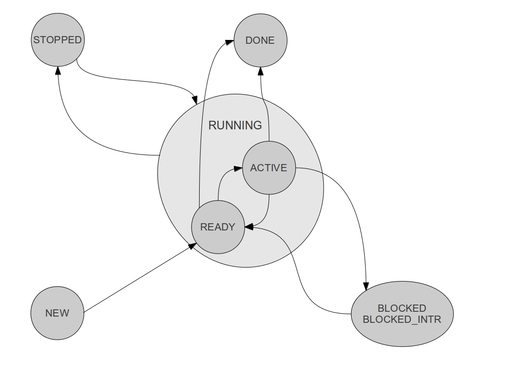
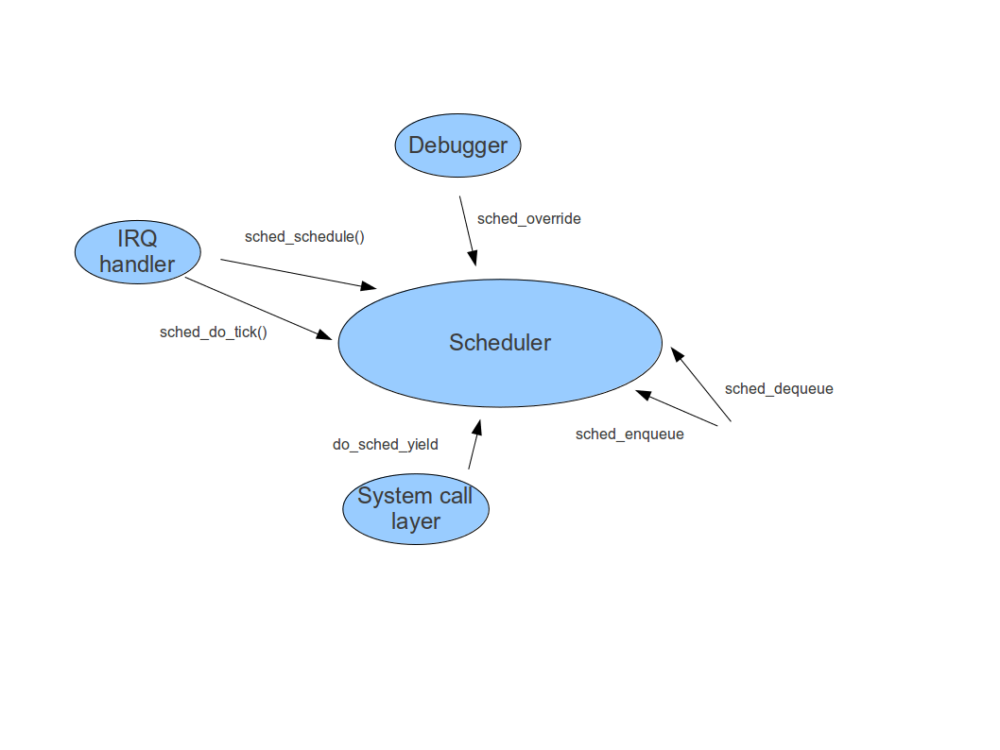

## The ctOS scheduler

## Internal data structures of the scheduler

The main data structures within the scheduler are the runnables and the ready queues. A runnable is an abstraction used within the scheduler to represent a unit of work available for scheduling, i.e. a task in the status RUNNING. Runnables are stored within an array of fixed size which contains PM_MAX_TASKS slots, where each slot represents a task. A runnable has the following attributes which we will explain further below in greater detail

* quantum - an integer value which represents the number of time units during which are available to the runnable before it is preempted
* priority - the priority of the runnable
* reschedule - a flag which indicates whether the currently active runnable should be preempted

The scheduler uses the task status concept that has already been described in the documentation of the process manager and which is displayed below for reference.

Only one runnable can be active at any given point in time for one CPU. This runnable is referred to by a pointer active within the scheduler. All other runnables are in the state ready. For each priority, a queue of runnables is maintained called the ready queue. This queues contain all runnables which might be chosen for execution.

The quantum measures how much CPU time the runnable has already used. When the task is initially yielded access to the CPU, its quantum is set to a fixed value. At each timer tick, i.e. each time when the timer interrupt fires, the quantum of the currently active runnable is decremented by one until it reaches zero. When the quantum has reached zero, it is time to take the CPU away from this runnable and chose another runnable for execution.

To support scheduling on SMP system, the main data structures of the scheduler, namely the table of runnables, the pointer to the currently active runnables and the queues, are per-CPU data structure, i.e. they are stored in an array indexed by CPU.

## The scheduling algorithm

Similar to earlier versions of Linux, FreeBSD and newer versions of Windows, ctOS uses round-robin scheduling with dynamic priorities. The priority of a runnable can range from 0 to 15, where 15 is the highest priority and 0 is the lowest priority. For each priority, a queue of runnables ready to run is maintained. When the scheduling algorithm is invoked, it performs the following steps.

* It first checks the quantum of the currently active runnable to see whether the scheduling flag was set because the task quantum has reached zero or because the task needs to be rescheduled for a different reason, for instance because the task called sched_yield
* If the quantum has reached zero, the priority of the runnable is decreased by one given that it is not yet 0. In this way, runnables which have fully exceeded their CPU time are punished
* Then the currently active runnable is added to the tail of the ready queue for its new priority. If its quantum was zero, it is set back to the initial value.
* In the next step, the scheduler determines the next runnable which is supposed to be executed. To this end, it scans the queues, starting at the highest priority, until it finds a queue which is not empty.
* The head of this queue then becomes the new active runnable. The runnable is removed from the ready queue and the pointer to the currently active runnable is updated.
* Finally the task ID of the selected runnable is returned.

Note that it might happen that when the scheduler is invoked, the pointer to the currently active runnable is null because the runnable has changed its status, for instance because the active task has called exit or sleep. If this happens, the scheduling routine jumps directly to the second part of the algorithm which determines the next runnable to be executed.

Scheduling is done per CPU, i.e. if a new runnable is selected, the scheduling algorithm first determines the CPU on which it is running. It then uses the list of runnables and the ready queues for this CPU only. Thus in an SMP environment, the scheduler can be run on different CPUs in parallel without any interaction between the individual scheduler threads.

## Services offered by the scheduler

The services offered by the scheduler interact closely with the programm manager and the interrupt manager. The following diagram summarizes the public interface of the scheduler and its usage.

The most important function within the scheduler is `sched_schedule`. This function will essentially carry out the algorithm described above, i.e. it will determine a new task to be executed and return the ID of that task. This is done for the CPU on which the scheduling code itself executes. This function will, however, not initiate the actual task switch, this is done by the process manager which is using the task ID provided by the scheduler.

Note that scheduling is a function which is non-trivial, but at the same time called very often, namely each time an interrupt handler completes, including the timer interrupt. Therefore efficiency is an issue within the scheduler. To avoid that the core part of the scheduling algorithm is executed too often, the scheduler maintains a flag for each runnable which indicates whether this task should be pre-empted, for instance because a higher priority task has been added to the ready queue. If this flag is is not set, the function `sched_schedule` will return immediately.

The scheduling algorithm above depends on the current quantum of a task. This quantum is set by the function `sched_do_tick`. This function reduces the quantum of the currently active runnable by one. If the quantum reaches zero, it will set the rescheduling flag for the currently active runnable.

The function `sched_override` is only used by the internal debugger of ctOS. When it is called with a task ID as argument, it sets an internal flag within the scheduler. When the scheduling routine is invoked the next time, it will always select this task, regardless of the current status of the run queue. This is used by the debugger to enforce execution of a specific task.

As the scheduler needs to maintain the ready queues and a pointer to the currently active runnable, it needs to be informed by the process manager whenever a new task enters the status RUNNING or a task leaves the status RUNNING. This is done by calling the functions `sched_enqueue` and `sched_dequeue`.

The function `sched_enqueue` is called with a task ID and a priority as argument. Based on the priority, it will add a runnable referring to the task designated by the task ID to the ready queue. It will then verify whether the priority of the runnable just added exceeds the current priority of the active runnable. If this is the case, it will set the rescheduling flag on the currently active runnable. To add a runnable to the queues for a specific CPU, the function `sched_enqueue_cpu` can be used which has the target CPU as an additional parameter.

The function `sched_dequeue` is called by the process manager when a task which is currently in status RUNNING and therefore represented by a runnable within the scheduler changes status to a value different from RUNNING. This function will remove the currently active runnable from the ready queue by setting the internal pointer to the active runnable to null. Note that this will force the scheduler to select a different runnable for execution when it is called next.

Finally, `do_sched_yield` implements the system call `sched_yield`. It simply sets the reschedule flag on the currently active runnable which is then moved to the end of the queue for its current priority.

## Potential improvements

The scheduling algorithm of ctOS is quite simple, but a few potential improvements are candidates for changes in a next release.

* When a task blocks, it is entirely removed from the queues and added again later when it is woken up again. Thus, the task will be added again with its full quantum, but at the end of the ready queue. Thus it might take a comparatively long time until the task can process the data of an I/O request which has completed. To avoid this, an alternative would be to add such a task at the front of the ready queue, but only with the quantum that it had left when it blocked. To implement this, `sched_dequeue` could return the left-over quantum to the caller. When removing a task from the queues, the process manager could store that return value in a field `saved_quantum` in the task structure. This field could then be passed as a new parameter quantum to `sched_enqueue`. If quantum is zero, the default initial quantum is given to the new runnable and the runnable is added at the end of the queue, otherwise the passed value is used and the runnable is added at the head of the queue.
* When moving a process which has used up its quantum to a lower priority, we could also increase the initial quantum for this process
* Currently the scheduler does not take into account that switching from a task A to a task B is consuming less overhead if A and B belong to the same process. One might adapt the scheduler so that it prefers a runnable if it is in the same process as the currently active runnable. To achieve this, the runnable could be used to model a process instead of a task. Within each runnable, a queue would then exist which is processed round-robin until the entire process has exceeded its quantum.

