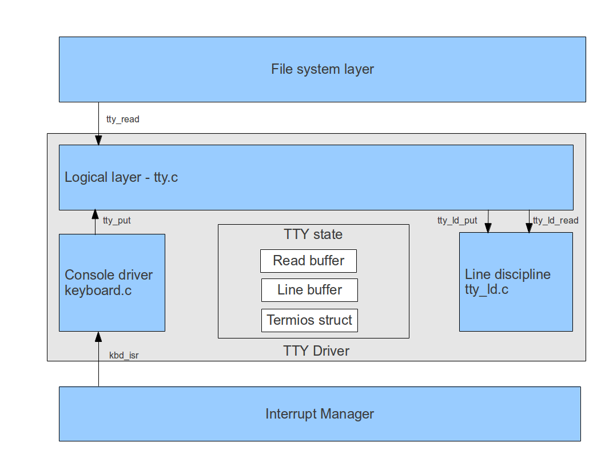
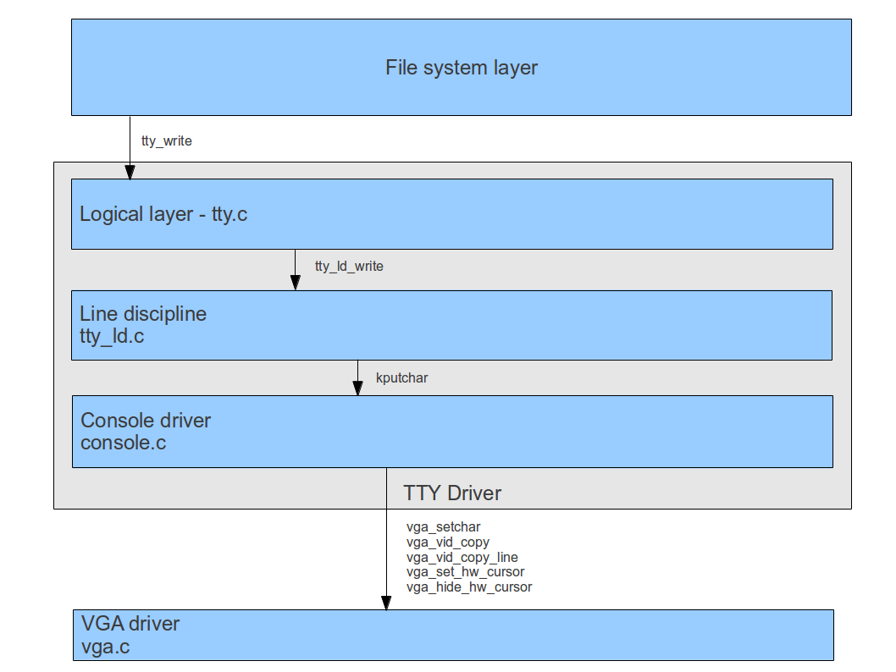
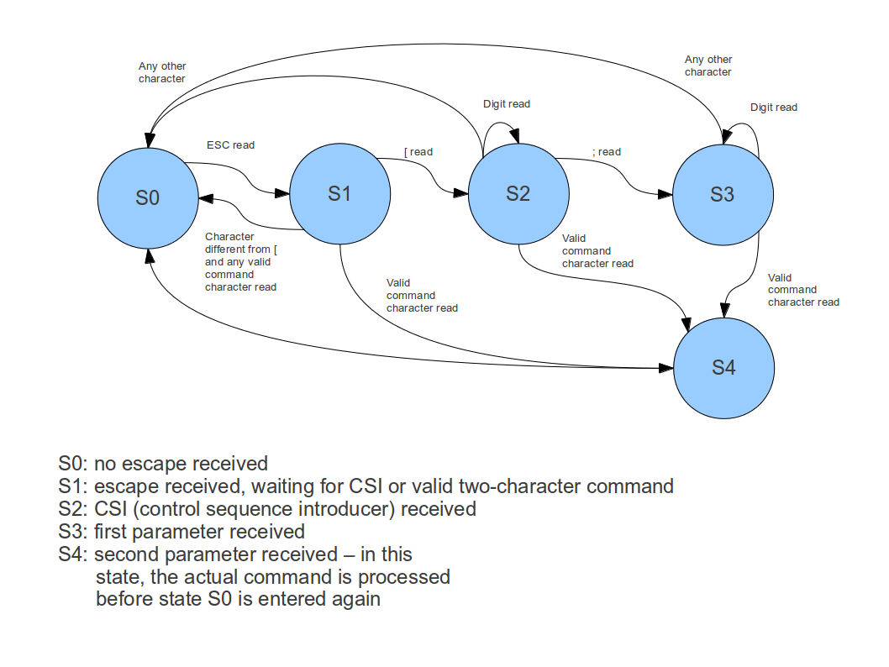

# TTY Driver

## Canonical mode and non-canonical mode input processing


In this section, we collect a few facts from the POSIX specification on the processing of terminal input (see "General Terminal Interface" in the POSIX specification). 

First of all note that regardless of the mode, POSIX foresees a buffering of input which has not yet been read by a process. It also allows a terminal to impose a limit MAX\_INPUT on the size of that buffer and leaves it to the implementation to decide what happens when that limit is exceeded.

In **canonical mode**, terminal input is processed in units of lines. By definition, a line ends with any of the characters NL (new-line), EOF (end-of-file) and EOL (end-of-line). Thus a read call will not return until any of these characters (or a signal) has been received. 

Note that the end-of-line marker will be included in the string returned to the read system call. Also note that at most one line will be returned, i.e. even if for instance the read call specified to read 100 bytes and a line only contains 60 characters, the read call will return after reading those 60 characters. The remainder of the line will remain buffered and will be returned upon the next call to read (even if it only consists of a newline character).

So suppose that a program first reads two bytes from the terminal. This read request will block until a user hits RETURN. Suppose the user types the string "erf" and then hits RETURN. Then "er" will be returned by the call to read as only two bytes were requested. If another read request is done, however, "f" and the newline character will be returned immediately as this data is still in the buffer.

If two subsequent lines are entered while no read is being done and are being buffered, a first read operation will return the first line, whereas the second one will remain buffered and will be returned when the second read is done.

The data which has not yet been made available to the process by hitting RETURN is called the current line. The special characters ERASE (erase a character) and KILL (erase the entire line) operate on that line only.

The constant MAX\_CANON contains the maximum length of the current line. The behaviour if the current line reaches that limit is implementation specific.

In **non-canonical** ("raw") mode, the ERASE and KILL characters do not imply any special processing. Instead of returning lines, the read system call returns depending on a specified time-out (VTIME) and a specified number of characters to be read (VMIN). Both parameters are contained in the field cc\_t of the termios data structure of the terminal.

The standard setting in Linux when non-canonical mode is enabled is VTIME=0 and VMIN=1. This implies that no time-out occurs and that read will return  after the first character has been typed, regardless of the number of characters actually requested. If VMIN is set to 10, the read will block until 10 characters have been typed and then return those 10 characters.

When VTIME is set to a positive value, the read request will return after VTIME\*0,1 seconds or if VMIN characters have been received. This allows for a time-out to prevent a read request from waiting indefinitely for input.

The keyboard driver
-------------------

The keyboard driver is a classical example of an interrupt driven driver. In general, the flow of events if a thread tries to read one key from the keyboard is as follows (ignoring buffers for a moment)

-   the thread calls some file system function to read from /dev/tty
-   the file system calls the function `tty_read` defined in tty.c
-   this function calls the low level keyboard driver
-   the lowlevel keyboard driver puts the current task to sleep until a key is pressed
-   when a key is pressed, the interrupt handler `kbd_isr` defined in keyboard.c is called. This handler reads the scancode from the keyboard, translates it into an ASCII character and places the character in the buffer provided by the thread which has called read on /dev/tty. Then this thread is woken up
-   when the thread continues execution, it finds the typed character in the provided read buffer and the read system call completes

This simple scheme of events, however, is far from complete. There are some additional requirements which increase the complexity of the driver.

-   a thread might wish to read more than byte at a time, thus the interrupt handlers needs to do some bookkeeping to only wake up the thread once the requested number of bytes is available
-   while the driver is collecting data for one read request, another thread might issue a second read request and the driver needs to find a way to handle that
-   to make sure that no keyboard input is lost, we need to maintain a buffer into which keystrokes are placed when the user presses a key while no read request is active
-   apart from the so called raw mode, in which a thread can use read to access data at the moment when it has been typed, there is also the so called canonical mode in which data only becomes visible once the user hits the return key
-   we need to handle special keys like SHIFT, CTRL, EOD and DEL as well as signal processing keys like Ctr-C
-   we need to echo keyboard input on the screen
-   in the future, we might need to add support for virtual terminals and other types of input devices like serial lines

To fulfill these additional requirements, the TTY driver is split into three layers respectively components, following the design approach in traditional UNIX systems. The lowest layer is the actual **device driver**, currently the console is the only supported device for handling terminal input. The console device driver is responsible for translating the keystrokes, i.e. scancodes, into ASCII characters, and transmit them to the upper layers. The keyboard driver is entirely interrupt driven. It does not know anything about the current settings of the TTY driver (for instance canonical versus non-canonical mode) and only transfers individual characters to the other layers.

The second component of the TTY driver is the so-called **line discipline**. The line discipline  is responsible for translating the character oriented view delivered by the console driver to the view expected by application programs using the read system call. This includes

-   in canonical mode, building up a line until a character which completes the line is received, and supporting line editing (DEL etc.)
-   in non-canonical mode, building up a line until the conditions specified by VMIN and VTIME are fulfilled
-   Handling special characters like Ctrl-C and Ctrl-Z and generating signals if required
-   echoing characters if needed

Finally, the third component is the main TTY driver contained in tty.c. This layer provides the interface used and expected by the file system layer. Its main responsibilities are the handling of the different TTY data structures and the management of locks.

Both the main TTY driver and the line discipline operate on a shared data structure called the **TTY state**. Several copies of this state can exist which are associated with the same console device and line discipline which is required to support virtual terminals. The TTY state contains the currently effective terminal settings, i.e. a copy of the POSIX termios structure. In addition, a TTY state is made up of two buffers:

-   the "line buffer" contains characters which have been received from the console driver. Characters are added to this buffer by the line discipline as they are typed, and line editing operates on this buffer as well
-   the "read buffer" contains complete lines which can no longer be accessed using line editing, but are ready to be transferred to user space upon the next read system call. Whenever the line discipline is ready to hand over data to a user space, it copies the data to the read buffer by calling `tty_notify` to inform the main TTY driver about the fact that new data is available

When the read function `tty_read` in tty.c is invoked, it first checks whether the read contains sufficient characters to fulfill the request. If yes, the function takes over these characters into the buffer provided with the read system call and returns. If no, the thread goes to sleep. It is only woken up  when the buffer contains any characters again. To avoid lost wakeups, a semaphore buffer is used to send a thread to sleep respectively to wake up a task.

Note that reading from the buffer requires a special handling of some characters depending on the terminal settings. An example is the handling of end-of-line characters where a read operation stops in canonical mode. Another example is the EOF character which is treated as a line delimiter but not passed to the user space buffer. As the goal of the design is to place all terminal specific behaviour in the line discipline, the functionality of `tty_read` is split accross two functions. The function 'tty_read' itself which is located in tty.c determines the tty structure to use based on the minor device and handles locks and semaphores. To actually transfer the characters, it uses the function `tty_ld_read` located in the line discipline tty_ld.c.

While a read request is being processed, all other threads need to block to avoid a situation in which a unit of input is split between several threads. To realize that, the tty data structure contains a semaphore `tty_available` which initially has the value one. When a function enters `tty_read`, it calls *down* on that semaphore. Thus any other thread that wishes to read from the keyboard needs to wait until the current request has been processed.



This design leads to the following pseudo-code for the functions `tty_put` and `tty_read`. Note that we also use a binary semaphore `data_available` to send a task to sleep if the buffer is empty and to wake it up if the buffer is full. In addition, a spinlock is used to protect the logical buffer in tty.c from concurrent access from within the interrupt handler and `tty_read`.


_tty_read_:

```
sem_down(tty_available)
sem_down(data_available)
get spinlock on TTY structure
Call tty_ld_read
IF (buffer is not empty) THEN
  mutex_up(data_available)
END IF
release spinlock on TTY structure
sem_up(tty_available)
```
 
 __tty_ld_read__:
 
``` 
copy content of read buffer to buffer provided with read system call until either the requested number of bytes has been transfered, the buffer is empty
or a line separator has been transfered
remove copied characters from read buffer
```

__tty_put__:

```
get spinlock on TTY structure
call tty_ld_put
if (return value is one)
  mutex_up(data_available)
release spinlock on TTY structure
```

__tty_ld_put__:

```
IF (number of free slots in line buffer < input characters) THEN
  return
END IF
FOREACH character in input DO
  echo character using tty_write if echo flag in tty settings is set
  add character to line buffer
  IF (line complete) THEN
    IF (free slots in read buffer < length of line) THEN
      remove characters again from line
      return
    ELSE
      append line to read buffer
      clear line
    END IF
  END IF
DONE
return 1 if data has been copied
```


Note that the semaphore `data_available` really needs to be a binary semaphore, as two subsequent interrupts might occur while a task is sleeping in `tty_read` - in this case `data_available` still should only be one.

Also note that `tty_read` can be interrupted by a signal, either while waiting for the semaphore `tty_available` or while waiting for the semaphore `data_available`. In the first case, it just returns. In the second case, it returns but first releases the mutex `tty_available` again.


## Handling special characters and the foreground process group


Handling special characters is entirely done in the line discipline tty_ld.c, as these characters are specific to the terminal characteristics. The handling of these characters is complicated by the fact that sometimes, they are supposed to be added to the input buffer as usual, whereas other characters are supposed to be discarded. To handle these characters, the function `handle_character` is used. It returns an integer which is the combination of one or several flags indicating how the character needs to be handled (echo yes/no, add to buffer or discard, complete current line...) and handles the following special characters:

-   line editing commands like DEL
-   Signal generating commands like  Ctrl-C and Ctrl-Z

In handling these characters, the terminals **foreground process group** might come into play. This process group is an attribute of a terminal which is initially set to 1, corresponding to the process group of the INIT process. A process group which is the process group of a terminal is called a **foreground process group**. All other process groups are called **background process groups**. 

Signals emitted due to a special character, like Ctrl-C, being pressed, usually only affects processes which are in the foreground process group of the respective terminal. Also, read or write operations may block if the process is not in the foreground group of a terminal.

Closely related to the notion of the foreground process group, there is the notion of a **controlling terminal** which - in contrast to the foreground process group which is an attribute of the terminal - is an attribute of a process. A process does not necessarily have a controlling terminal, but for all processes within a session which have a controlling terminal, this controlling terminal is the same. 

A process can use the **tcsetpgrp** system call to set the foreground process group of its controlling terminal to any own process group within the same session.

When a new session is created (using the setsid system call), it does not have a controlling terminal. A process within this session can then open a terminal which will then automatically become the controlling terminal for this process (unless the flag `O_NOTTY` is provided). A subsequent call to tcsetprgrp can then be used to set the foreground process group of this terminal.

To get and set the foreground process group, the high-level TTY driver offers the public function`tty_getpgrp` and `tty_setpgrp`.

## The termios structure

In POSIX, terminal parameters are encoded in an instance of the termios structure. Applications need to read the termios structure first using the function tcsetattr, modify the values that ought be changed and then write the termios structure again using tcgetattr.

The termios structure consists essentially of the following parts:

-   definitions of special characters in the array `c_cc`
-   output flags in `c_oflag`
-   input flags in `c_iflag'
-   control flags in 'c_cflag'
-   local flags in `c_lflag`

Currently, ctOS does not support any output or control flags because most of those are not relevant for the only terminal type (a physical console consisting of keyboard and video card / monitor) implemented so far. However, most of the input flags, special characters and local flags are supported. 

As the line discipline layer is the only layer which is supposed to know about the meaning of these flags, their processing is handled in tty_ld.c. The flags relevant to terminal input are checked in the utility function `handle_character` which in turn sets some control flags which are evaluated by `tty_put`. These flags control whether a character is added to the input queue or discarded (CHAR_DISCARD), whether the character is considered to be a line delimiter (CHAR_EOL), whether the character is echoed (CHAR_ECHO) or whether the character is supposed to delete the entire line (CHAR_KILL).

To read and change the termios structure, the public functions
```
int tty_tcgetattr(minor_dev_t minor, struct termios* termios_p);
int tty_tcsetattr(minor_dev_t minor, int action, struct termios* termios_p);
```

are offered by the TTY driver. These functions are in turn used by the file system when a tcsetattr or tcgetattr system call is processed.

# Output processing


Currently, ctOS supports VGA text mode and a limited VGA graphics mode using a VESA frame buffer. In graphics mode, the kernel has exclusive address to the frame buffer and currently only uses it to display a window in which a text console is emulated and two additional status windows with a fixed layout.

To process TTY output, four different modules cooperate. As for the input processing, a write to the TTY is triggered by the logical TTY driver in tty.c which then forwards the request to the TTY line discipline. The line discipline then simply invokes the function kputchar defined in the console driver console.c. This module contains the entire logic needed for output processing, most notably cursor control and the parsing and processing of escape sequences.  The console driver then finally invokes functions in the low-level VGA driver vga.c to print characters, copy characters or entire lines or set/hide the cursor.

The interface to the VGA driver which the console driver uses is agnostic to the used VGA mode, i.e. it is the same for text and for graphics mode. In fact, this interface is defined by a collection of function pointers which are initially pointing to their text mode implementation. If, at boot time, the VGA driver detects an available and supported VESA mode, it switches to graphics mode and updates these function pointers to point to their graphics mode implementation.
The following picture summarizes the relation of TTY driver, console driver and VGA driver.



Currently, the VGA driver and the console driver both have access to a common data structure called a **window**. This data structure contains typical attributes of a window like width, height and position on the screen as well as console attributes like the state of the escape sequence parser, the cursor position or color and attributes used for characters. Thus each window can be used as a console. In fact, the console driver offers a function `win_putchar` which can be used to print to an arbitrary window, using the same logic as for the main console window.

To detect the available graphics modes and switch to the preferred mode at boot time, the VBE BIOS extensions (VBE 2.0) are used. To be able to use these extensions, the VGA driver will bring the CPU on which it is running back into real mode temporarily. This is handled by the module rm.S which offers a generic interface to call BIOS functions and return their results. Note that this function uses memory below the 1 MB boundary which might also be used by the boot loader and therefore should only be called after boot loader data like the multiboot information structure has been parsed and processed.

Currently, ctOS does not come with its own console font. Instead, the 8x16 font stored in the VGA BIOS is extracted at boot time and used. For future releases, it is planned to offer the option to use built-in fonts as well to improve the font quality on some video cards.

### Handling escape sequences

An ANSI escape sequence (as defined by ECMA-48) is a sequence of special characters starting with the ESC character (ASCII 27) which are recognized by the console driver and initiate some action, for instance moving the cursor. Some of these sequences only consist of two characters, namely ESC followed by a character in the range ASCII 64 to 95. Most sequences, however, have more characters and are distinguished from a two-character sequence by the character \[.

These sequences can take one or two parameters, if the parameters are ommited, the default 1 is usually 1 or 0. Note that parameters are actually passed as digit, so if you want to write the ESC sequence ESC \[nJ which takes the numerical parameter n to the screen, you have to write the characters 27, '\[', '2' and finally 'J'.

The following escape sequences are supported by the ctOS terminal driver (here n and m denote the parameters).

<table>
<thead>
<tr class="header">
<th>Sequence<br />
</th>
<th>Associated action<br />
</th>
</tr>
</thead>
<tbody>
<tr class="odd">
<td>ESC [nJ<br />
</td>
<td>If n=2, clear entire screen. If n=0 or not present, clear from cursor to end of screen. If n=1, clear from cursor to beginning of screen (in both cases including the cursor position)<br />
</td>
</tr>
<tr class="even">
<td>ESC [n;mH<br />
</td>
<td>Move cursor to row n (n=1 means first row) and column m (m=1 means first column)<br />
</td>
</tr>
<tr class="odd">
<td>ESC [nA<br />
</td>
<td>Move cursor up n lines (do not scroll)<br />
</td>
</tr>
<tr class="even">
<td>ESC [nB<br />
</td>
<td>Move cursor down n lines (do not scroll)<br />
</td>
</tr>
<tr class="odd">
<td>ESC [nC</td>
<td>Move the cursor n characters to the right</td>
</tr>
<tr class="even">
<td>ESC [nD<br />
</td>
<td>Moves cursor n characters to the left<br />
</td>
</tr>
<tr class="odd">
<td>ESC [nK<br />
</td>
<td>Erase current line from cursor position (inclusive) to end-of-line if n=0 or not specified, erase entire line if n=2, erase from start of line to cursor position if n=1<br />
</td>
</tr>
<tr class="even">
<td>ESC [nP<br />
</td>
<td>Delete n characters at cursor position (including cursor position) and scroll remainder of line to the left<br />
</td>
</tr>
<tr class="odd">
<td>ESC [n@<br />
</td>
<td>Insert n characters at the cursor position and move remainder of line to the right, thereby discarding any characters which are moved beyond the right margin<br />
</td>
</tr>
<tr class="even">
<td>ESC [nL<br />
</td>
<td>Insert n blank lines at cursor position and move lines below cursor down<br />
</td>
</tr>
<tr class="odd">
<td>ESC [nM<br />
</td>
<td>Delete n lines at cursor position<br />
</td>
</tr>
<tr class="even">
<td>ESC M<br />
</td>
<td>Scroll down if cursor is in the topmost line, lines which are scrolled beyond the bottom of the screen are lost (there seem to be terminals which recover these lines, if that happens it is indicated via the db termcap capability)<br />
</td>
</tr>
</tbody>
</table>

 To parse these escape sequences, a state machine is used. Initially, this machine is in state S0. When ESC has been read from the keyboard, the machine advances to state S1. If the CSI character \[ is read, the machine proceeds to state S2. Otherwise, it is checked whether the character read is a valid command which is part of a two-character escape sequence like ESC M and processed. If this is not the case, the state S0 is entered again.
 
From the state S1, the machine is moved into the states S2 and S3 when parameters are received. In any of these states, the first respectively second parameter is built up from the incoming characters as long as those are recognized as digits. Otherwise, if the character is a valid command, it is executed in state S4, if it is not a valid command, the machine is reset to state S0. Finally, the actual processing takes place in state S4.




